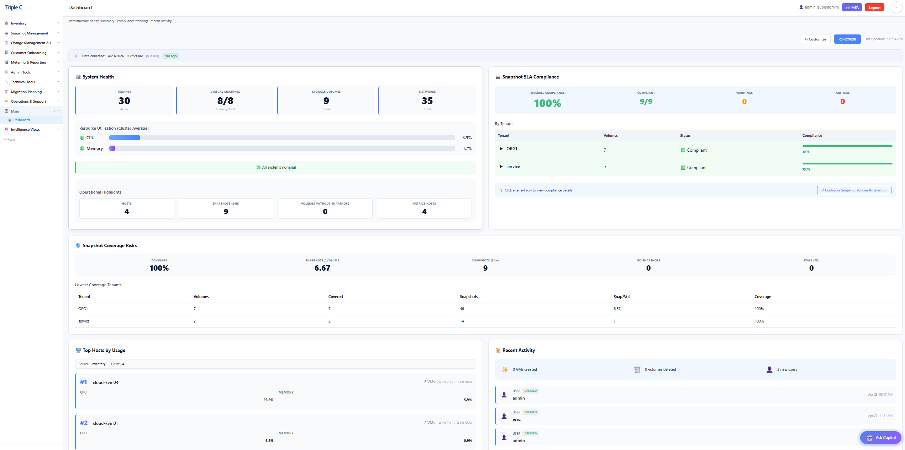
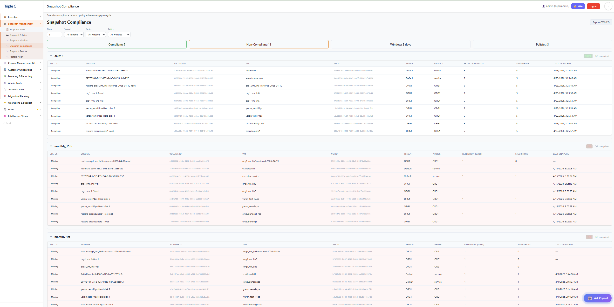
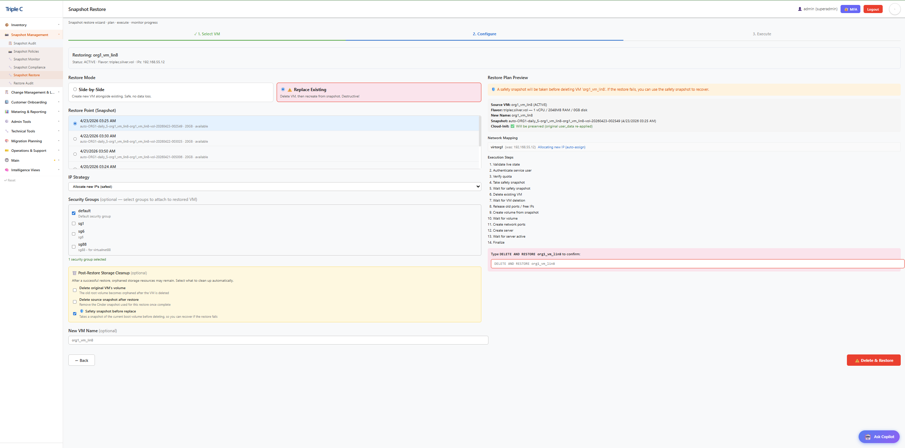

# Platform9 Management System

**Engineering Teams Add-On Platform: Enhanced Inventory, Monitoring & Daily Operations for Platform9**

An added-value management system designed for engineering teams to assist with daily tasks when managing Platform9 environments. This is **not** a replacement for the official Platform9 UI, but rather an engineering-focused complement that provides enhanced inventory visibility, operational tooling, and maintenance capabilities.

## 🎯 Overview

### What is Platform9?

Platform9 is a cloud infrastructure management platform that simplifies operating private and hybrid clouds. It brings together compute, storage, and networking management behind a unified, secure control plane and makes it easier for teams to manage virtualization and container environments.

### What runs under the hood

Platform9 environments are commonly backed by **OpenStack** services. That means this tool must translate OpenStack's distributed resources (Nova, Cinder, Neutron, Keystone) into a cohesive, operator-friendly view while keeping identity, tenancy, and RBAC boundaries intact.

### Why this project exists

This project does **not** replace the official Platform9 UI. It provides an engineering-focused, role-aware inventory and maintenance UI that complements Platform9 by improving day-to-day operational visibility. The goal is faster navigation, clearer context, and human-friendly naming (project/tenant/host names) instead of only UUID-based views.

It also delivers a wider view of the overall system and adds functionality such as snapshot management, volume management, and other operational tools that extend the current Platform9 UI. This creates an added-value engineering console to assist teams in managing Platform9 environments.

### Metadata and day‑to‑day operations challenges

OpenStack resources are highly dynamic and spread across multiple services. Capturing, storing, and presenting metadata at scale is challenging because:

- **Identifiers are fragmented**: Projects, domains, and resources use different IDs across services.
- **State changes are frequent**: VMs, volumes, and networks change status quickly and asynchronously.
- **Auditability matters**: Operators need a reliable history of changes and ownership.
- **Tasks are cross‑cutting**: Daily workflows (provision, attach, snapshot, resize, troubleshoot) touch multiple services.

This system focuses on day-to-day tasks by normalizing metadata into a single inventory view, then layering on role-aware actions and audit trails.

### Inventory + monitoring system logic

The enhanced inventory and monitoring experience is built on a few principles:

- **Unify resource models**: Normalize OpenStack objects into consistent entities (servers, volumes, networks, projects) with stable identifiers.
- **Join metadata with live metrics**: Merge configuration data with monitoring snapshots to show health and utilization in context.
- **Cache for speed, refresh for accuracy**: Use cached snapshots for fast UI rendering, then refresh incrementally for near real-time status.
- **Role-aware visibility**: Filter and display resources based on RBAC and tenant boundaries.
- **Operational signals first**: Highlight state, alerts, and recent changes so operators can act quickly.

### Key benefits

- **Unified operations**: Manage infrastructure, platform resources, and users from a single console.
- **Human-friendly visibility**: Project names, tenant names, host names instead of UUID-only views.
- **Built-in governance**: Role-based access control and audit history help enforce policies.
- **Operational speed**: Real-time monitoring and quick filtering reduce time-to-diagnosis.
- **Enhanced functionality**: Snapshot management, volume management, and other tools not available in standard Platform9 UI.
- **Lower complexity**: Consistent workflows reduce manual steps and errors.

## � Screenshots

### Landing Dashboard


### Snapshot Compliance Report


### VM Inventory


### History & Monitoring


### API Performance


### Snapshot Restore Process


### Snapshot Restore Audit


## 📚 Documentation

- **[Deployment Guide](docs/DEPLOYMENT_GUIDE.md)** — Step-by-step deployment instructions
- **[Admin Guide](docs/ADMIN_GUIDE.md)** — Day-to-day administration reference
- **[Architecture](docs/ARCHITECTURE.md)** — System design and component interaction
- **[API Reference](docs/API_REFERENCE.md)** — Complete API endpoint documentation
- **[Security Guide](docs/SECURITY.md)** — Security model, authentication, encryption
- **[Security Checklist](docs/SECURITY_CHECKLIST.md)** — Pre-production security audit checklist
- **[Restore Guide](docs/RESTORE_GUIDE.md)** — Snapshot restore feature documentation
- **[Snapshot Automation](docs/SNAPSHOT_AUTOMATION.md)** — Snapshot system design and configuration
- **[Snapshot Service User](docs/SNAPSHOT_SERVICE_USER.md)** — Service user setup and troubleshooting
- **[Quick Reference](docs/QUICK_REFERENCE.md)** — Common commands and URLs cheat sheet
- **[Kubernetes Migration](docs/KUBERNETES_MIGRATION_GUIDE.md)** — Future K8s migration planning
- **[Contributing](CONTRIBUTING.md)** — Contribution guidelines
- **[LICENSE](LICENSE)** — MIT License

## 🚀 System Architecture

**Enterprise microservices-based platform** with 11 containerized services plus host-based automation:
- **Frontend UI** (React 19.2+/TypeScript/Vite) - Port 5173 - 24 management tabs (grouped navigation) + admin panel
- **Backend API** (FastAPI/Gunicorn/Python) - Port 8000 - 140+ REST endpoints with RBAC middleware, 4 worker processes, connection pooling
- **LDAP Server** (OpenLDAP) - Port 389 - Enterprise authentication directory
- **LDAP Admin** (phpLDAPadmin) - Port 8081 - Web-based LDAP management
- **Monitoring Service** (FastAPI/Python) - Port 8001 - Real-time metrics collection via Prometheus
- **Database** (PostgreSQL 16) - Port 5432 - 44+ tables with history tracking + auth audit + metering + provisioning + departments/navigation
- **Database Admin** (pgAdmin4) - Port 8080 - Web-based PostgreSQL management
- **Snapshot Worker** (Python) - Background service for automated snapshot management
- **Notification Worker** (Python) - Background service for email alerts (drift, snapshots, compliance, health)
- **Backup Worker** (Python/PostgreSQL 16) - Background service for scheduled/manual database backups and restores
- **Metering Worker** (Python/PostgreSQL) - Background service for operational resource metering (resources, snapshots, restores, API usage, efficiency)
- **Host Scripts** (Python) - Scheduled automation via Windows Task Scheduler

## 🌟 Key Features

### Enterprise Authentication & Authorization
- **LDAP Integration**: Production-ready OpenLDAP authentication with configurable directory structure
- **Role-Based Access Control**: 4-tier permission system (Viewer, Operator, Admin, Superadmin)
- **JWT Token Management**: Secure 480-minute sessions with Bearer token authentication
- **RBAC Middleware**: Automatic permission enforcement on all resource endpoints
- **Audit Logging**: Complete authentication event tracking (login, logout, failed attempts, user management)
- **User Management**: LDAP user creation, role assignment, and permission management
- **Role-Based UI**: Dynamic tab visibility based on user permissions
- **System Audit**: 90-day retention with filtering by user, action, date range, and IP address

### Complete Infrastructure Management
- **19+ Resource Types**: Domains, Projects, VMs, Volumes, Snapshots, Networks, Subnets, Ports, Floating IPs, Routers, Security Groups & Rules, Hypervisors, Flavors, Images, Volume Types
- **Advanced User Management**: Multi-domain user collection (100+ users across 28 domains), role assignments, activity tracking, and comprehensive identity management
- **Multi-Tenant Support**: Full domain and project-level resource organization with complete user visibility across all tenants
- **Comprehensive Audit System**: Complete change tracking, deletion history, compliance reporting, and resource timeline analysis
- **RVTools Parity**: Excel/CSV exports with enhanced data masking and delta reporting
- **Real-time Synchronization**: Automated cleanup with historical preservation and change attribution

### Advanced Real-Time Monitoring
- **Host Metrics**: Live CPU, memory, storage from PF9 compute nodes via Prometheus node_exporter (port 9388)
- **VM Metrics**: Individual VM resource tracking via libvirt_exporter (port 9177) *[Currently requires PF9 engineering support]*
- **Automated Collection**: Background collection every 30 minutes via Windows Task Scheduler
- **Cache-Based Storage**: Persistent metrics survive service restarts
- **Integrated Dashboard**: Real-time monitoring tab with auto-refresh in management UI

### Enterprise-Grade Snapshot Management
- **Metadata-Driven Policies**: Volume-level configuration via OpenStack metadata
- **Multi-Policy Support**: daily_5, monthly_1st, monthly_15th with independent retention
- **SLA Compliance**: Configurable thresholds with detailed reporting
- **Policy Assignment Rules**: JSON-driven automatic policy assignment based on volume properties
- **Comprehensive Reporting**: Detailed compliance reports with tenant/domain aggregation

### Snapshot Restore (NEW - v1.2)
- **VM Restore from Snapshot**: Restore boot-from-volume VMs from Cinder volume snapshots
- **Two Restore Modes**: NEW (side-by-side, non-destructive) and REPLACE (destructive, superadmin-only)
- **IP Strategies**: NEW_IPS (DHCP), TRY_SAME_IPS (best-effort), SAME_IPS_OR_FAIL (strict)
- **3-Screen UI Wizard**: Guided restore flow with real-time progress tracking
- **Cross-Tenant Support**: Uses same service user mechanism as snapshot system
- **Safety First**: Disabled by default, dry-run mode, destructive confirmation, volume cleanup option
- **Full RBAC**: Viewer/Operator=read, Admin=write (NEW mode), Superadmin=admin (REPLACE mode)

### Email Notifications (NEW - v1.11)
- **Event-Driven Alerts**: Automatic email notifications for drift events, snapshot failures, compliance violations, and health score drops
- **Per-User Preferences**: Subscribe to specific event types with severity-level filtering (info/warning/critical)
- **Daily Digest**: Configurable daily summary email aggregating all events from the past 24 hours
- **SMTP Flexibility**: Supports both authenticated and unauthenticated SMTP relay servers, optional TLS
- **HTML Templates**: Professional Jinja2 email templates for each event type
- **Notification History**: Full delivery log with status tracking and retry information
- **Admin Dashboard**: SMTP status, delivery statistics, and test email functionality
- **Full RBAC**: Viewer/Operator=read+write, Admin/Superadmin=admin

### Operational Metering (NEW - v1.15 + v1.15.1 Pricing)
- **Resource Metering**: Per-VM tracking of vCPU, RAM, disk allocation + actual usage, network I/O (deduplicated to latest per VM)
- **Snapshot Metering**: Count, size, policy compliance tracking per collection cycle
- **Restore Metering**: Operation tracking (status, duration, mode, data transferred)
- **API Usage Metering**: Endpoint-level call counts, error rates, latency percentiles (avg/p95/p99)
- **Efficiency Scoring**: Per-VM scores with classification (excellent/good/fair/poor/idle)
- **Multi-Category Pricing**: Flavor (auto-synced from OpenStack), storage/GB, snapshot/GB, restore, volume, network pricing with hourly + monthly rates
- **Chargeback Export**: Per-tenant cost breakdown across all categories (compute, storage, snapshot, restore, volume, network, TOTAL)
- **Filter Dropdowns**: Project/domain selectors populated from actual tenant data
- **Metering Worker**: Background container collecting metrics every 15 minutes (configurable)
- **8 Sub-Tab UI**: Overview, Resources, Snapshots, Restores, API Usage, Efficiency, Pricing, Export
- **6 CSV Exports**: Resources, snapshots, restores, API usage, efficiency, chargeback report
- **Full RBAC**: Admin=read, Superadmin=read+write (config + pricing)

### Customer Provisioning & Domain Management (NEW - v1.16)

### Reports & Resource Management (NEW - v1.17)
- **15 Report Types**: Tenant Quota Usage, Domain Overview, Snapshot Compliance, Flavor Usage, Metering Summary, Resource Inventory, User/Role Audit, Idle Resources, Security Group Audit, Capacity Planning, Backup Status, Activity Log, Network Topology, Cost Allocation, Drift Summary
- **CSV Export**: All reports support JSON preview and one-click CSV download
- **Resource Provisioning Tool**: Full CRUD for Users, Flavors, Networks, Routers, Floating IPs, Volumes, Security Groups across all tenants with domain/project context filters
- **Quota Management**: View and live-edit compute, network, and storage quotas per tenant
- **Image Browser**: Read-only image catalog with status, visibility, size, format metadata
- **Safety Protections**: Last-user guard, in-use flavor check, attached-volume block, default SG protection
- **Three-Tier RBAC**: Viewer (read), Operator (read+write), Admin (read+write+delete)

### Customer Provisioning & Domain Management (v1.16)
- **5-Step Provisioning Wizard**: Guided tenant onboarding — Domain → Project → User/Role → Quotas → Network/Security Group
- **Domain & Project Handling**: Create new or reuse existing domains/projects with naming convention enforcement and existence checks
- **Dynamic Keystone Roles**: Role dropdown fetches available roles from PF9 Keystone (filters internal roles like `load-balancer_*`, `heat_stack_*`)
- **Tabbed Quota Editor**: Compute, Block Storage, and Network quota tabs matching OpenStack Horizon layout with "Set Unlimited" toggles per field
- **Network Auto-Discovery**: Physical network dropdown populated from Neutron; VLAN/flat/VXLAN type selector, CIDR/gateway/DNS configuration
- **Security Group with Custom Ports**: Create security group with custom ingress/egress rules during provisioning
- **Customer Welcome Email**: HTML email template with opt-in toggle and editable recipient list
- **Domain Management Tab**: Full domain lifecycle — enable/disable toggle, typed "approve delete" confirmation, resource inspection
- **Resource Inspection Panel**: Side-by-side flex layout showing all OpenStack resources per domain (projects, users, servers, volumes, networks, routers, floating IPs, security groups)
- **Resource Deletion**: 8 DELETE endpoints for individual resources (servers, volumes, networks, routers, floating IPs, security groups, users, subnets)
- **Central Activity Log**: Audit trail for all provisioning, domain, and resource operations with filtering, pagination, and actor tracking
- **Granular RBAC**: Separate permissions for `tenant_disable`, `tenant_delete`, `resource_delete`
- **Full Dark Mode**: 25+ CSS variables for light/dark themes; ~110 hardcoded hex colors replaced across provisioning and domain management components

### Modern Web Management Interface
- **React 19.2+ Dashboard**: 26+ comprehensive management tabs including **Landing Dashboard** with real-time operational intelligence
- **Landing Dashboard Features** (All Users):
  - **Health Summary Card**: System-wide metrics (VMs, volumes, networks, resource utilization)
  - **Snapshot SLA Compliance**: Tenant-level compliance tracking with warning/critical alerting
  - **Top Host Utilization**: Real-time CPU/memory usage across compute nodes
  - **Recent Activity Widget**: Last 24 hours of infrastructure changes
  - **Coverage Risk Analysis**: Volumes without snapshot protection
  - **Capacity Pressure Indicators**: Storage and compute capacity warnings
  - **VM Hotspots**: Top resource consumers (CPU/memory/storage)
  - **Tenant Risk Scores**: Multi-factor risk assessments per tenant
  - **Compliance Drift Tracking**: Policy adherence trending
  - **Capacity Trends**: 7-day resource utilization forecasting
  - **Trendlines**: Infrastructure growth patterns and velocity metrics
- **Management Tabs**: Servers, Volumes, Snapshots, Networks, Security Groups, Subnets, Ports, Floating IPs, Domains, Projects, Flavors, Images, Hypervisors, Users, Roles, Snapshot Policies, History, Audit, Monitoring, Restore, Restore Audit, Notifications, Metering, Customer Provisioning, Domain Management, Activity Log
- **History Tab Features**:
  - Filter by resource type (server, volume, snapshot, deletion, etc.), project, domain, and free-text search
  - Sortable column headers (Time, Type, Resource, Project, Domain, Description) with ascending/descending indicators
  - Deletion record viewing — shows deletion timeline, original resource type, reason, and last-known state
  - Most frequently changed resources section with direct history navigation
  - Configurable timeframe (1 hour to 1 week)
- **Admin Observability Tabs**: API Metrics + System Logs (Admin/Superadmin only)
- **Role-Based UI**: Dashboard and admin tabs with permission-based visibility
- **Secure Login**: LDAP authentication with JWT token management and session tracking
- **Real-Time Data**: Auto-refresh every 30 seconds on dashboard, efficient pagination across all endpoints
- **Advanced Filtering**: Multi-field filtering, sorting, and search across all 19+ resource types
- **Administrative Operations**: Create/delete flavors, networks, and security groups, user management, role assignments (admin+ only)
- **Historical Analysis**: Resource timeline tracking, change velocity metrics, compliance dashboards
- **Theme Support**: Light/dark mode toggle with persistent preferences and responsive design

### Enterprise Automation & Integration
- **Single-Command Deployment**: Complete stack setup via `startup.ps1` with LDAP initialization
- **Hybrid Architecture**: Scripts work standalone or with full web services
- **Database Flexibility**: Excel/CSV generation works with or without PostgreSQL
- **Windows Integration**: Full Task Scheduler automation support
- **Docker Native**: Complete containerized deployment with docker-compose

### API Observability
- **Public Metrics**: `GET http://localhost:8000/metrics`
- **Authenticated Metrics (UI)**: `GET http://localhost:8000/api/metrics`
- **Authenticated Logs (UI)**: `GET http://localhost:8000/api/logs`
   - Query params: `limit`, `level`, `source`, `log_file`
   - Log sources: `pf9_api`, `pf9_monitoring` (use `log_file=all` to aggregate)

## 🚀 Quick Start

### Prerequisites
- **Python 3.11+** with packages: `requests`, `openpyxl`, `psycopg2-binary`, `aiohttp`, `aiofiles`
- **Docker & Docker Compose** (for complete platform)
- **Valid Platform9 credentials** (service account recommended)
- **Network access** to Platform9 cluster and compute nodes (for monitoring)
- **Windows environment** (for automated scheduling via Task Scheduler)

### 1. Complete Automated Setup (Recommended)
```powershell
# Clone and navigate to repository
git clone <repository-url>
cd pf9-mngt

# Configure environment (CRITICAL: No quotes around values)
cp .env.template .env
# Edit .env with your Platform9 credentials

# One-command complete deployment (includes Docker install check)
.\deployment.ps1

# What deployment.ps1 does:
# ✓ Checks/installs Docker Desktop for Windows
# ✓ Creates and validates .env configuration
# ✓ Creates all required directories (logs, secrets, cache)
# ✓ Installs Python dependencies
# ✓ Builds and starts all Docker containers
# ✓ Initializes PostgreSQL database schema
# ✓ Configures LDAP directory structure
# ✓ Creates automated scheduled tasks:
#   - Metrics collection (every 30 minutes)
#   - RVTools export (daily at 2:00 AM)
# ✓ Runs comprehensive health checks

# Alternative quick startup (assumes Docker installed)
.\startup.ps1

# Access services:
# - UI: http://localhost:5173
# - API: http://localhost:8000
# - API Docs: http://localhost:8000/docs
# - Monitoring: http://localhost:8001
# - Database Admin: http://localhost:8080
```

### 2. Environment Configuration
Create `.env` file with your credentials (**CRITICAL: No quotes around values**):
```bash
# Platform9 Authentication
PF9_USERNAME=your-service-account@company.com
PF9_PASSWORD=your-secure-password
PF9_AUTH_URL=https://your-cluster.platform9.com/keystone/v3
PF9_USER_DOMAIN=Default
PF9_PROJECT_NAME=service
PF9_PROJECT_DOMAIN=Default
PF9_REGION_NAME=region-one

# Database Configuration (for Docker services)
POSTGRES_USER=pf9
POSTGRES_PASSWORD=generate-secure-password-here
POSTGRES_DB=pf9_mgmt
```

### 3. Manual Docker Setup
```bash
# Start all services
docker-compose up -d

# Check service status
docker-compose ps

# View service logs
docker-compose logs pf9_api
docker-compose logs pf9_ui
```

### 4. Standalone Script Usage
```bash
# Install Python dependencies
pip install requests openpyxl psycopg2-binary

# Run RVTools export (standalone)
python pf9_rvtools.py

# Generate compliance report
python snapshots/p9_snapshot_compliance_report.py

# Assign snapshot policies
python snapshots/p9_snapshot_policy_assign.py

# Run automated snapshots
python snapshots/p9_auto_snapshots.py
```

## 📊 Core Components

### 1. Infrastructure Discovery (`pf9_rvtools.py`)
Comprehensive OpenStack inventory with RVTools-compatible exports:
- **19+ Resource Types**: Complete infrastructure coverage including user management
- **Excel/CSV Export**: Customer-data-safe with masking options
- **Database Integration**: Optional PostgreSQL storage for historical tracking
- **Delta Reporting**: Change detection and trend analysis

### 2. User Management System
**Multi-Domain User Collection**:
- **Cross-domain visibility**: Collects users from all 28 OpenStack domains (20 with active users)
- **Role assignment tracking**: Monitors 100+ role assignments across the infrastructure
- **Activity monitoring**: Tracks user last seen timestamps and account status
- **Role inference system**: Intelligent role assignment when API access is limited
- **Domain-scoped authentication**: Ensures complete user enumeration across tenants

**User Data Collected**:
- User identity and contact information
- Domain associations and project memberships  
- Role assignments (admin, member, service roles)
- Account status (enabled/disabled)
- Activity timestamps (last seen, creation dates when available)
- User descriptions and metadata

### 3. Snapshot Management
✅ **FULLY FUNCTIONAL** — Cross-tenant snapshots enabled via service user

**Automated Creation** (`snapshots/p9_auto_snapshots.py`):
- Policy-driven volume snapshots with retention management
- Multi-policy support per volume (daily, weekly, monthly patterns)
- **Cross-tenant snapshot creation** via dedicated service user (configurable via `SNAPSHOT_SERVICE_USER_EMAIL`)
- Dual-session architecture: admin for listing, service user for creating in correct tenant
- SLA compliance enforcement with automatic cleanup
- Audit trail for all snapshot operations

**Service User Management** (`snapshots/snapshot_service_user.py`):
- Automatic admin role assignment per tenant project
- Fernet-encrypted or plaintext password support
- Graceful fallback to admin session if service user unavailable
- Per-run caching of role checks for performance

**Policy Assignment** (`snapshots/p9_snapshot_policy_assign.py`):
- Opt-out rule engine (all volumes tagged unless excluded)
- Volume property matching (tenant, domain, size, bootable, metadata)
- Bulk metadata assignment across thousands of volumes
- **Status**: ✅ Fully functional; policies sync automatically every 60 minutes

**Compliance Reporting** (`snapshots/p9_snapshot_compliance_report.py`):
- Real-time SLA analysis and compliance dashboard
- Tenant/Domain aggregation views
- Policy adherence tracking with detailed records
- **Status**: ✅ Fully functional; accessible via UI and REST API

### 3. Real-Time Monitoring
**Host Metrics** (`host_metrics_collector.py`):
- Prometheus node_exporter integration (port 9388)
- Windows Task Scheduler automation
- Persistent cache storage
- CPU, Memory, Storage tracking

**Monitoring Service** ([monitoring/main.py](monitoring/main.py)):
- FastAPI-based metrics API
- Cache-based data delivery
- Auto-refresh endpoints
- Integration with main UI

### 4. Web Management Platform
**Backend API** ([api/main.py](api/main.py)):
- 20+ REST endpoints
- PostgreSQL integration
- Administrative operations
- OpenAPI documentation

**Frontend UI** ([pf9-ui/src/App.tsx](pf9-ui/src/App.tsx)):
- React 19.2 with TypeScript
- Vite build system
- Real-time data refresh
- Advanced filtering and pagination

## 🛠️ Administration

### Database Management
```bash
# Connect to database
psql -h localhost -U pf9 -d pf9_mgmt

# Automated backups: use the 💾 Backup tab in the UI
# The backup_worker container runs pg_dump on a schedule (daily/weekly)
# and writes compressed .sql.gz files to the NFS backup volume.
# Manual trigger: click "Run Backup Now" in 💾 Backup > Status tab.

# Manual backup (without the backup worker)
docker exec pf9_db pg_dump -U pf9 pf9_mgmt > backup.sql

# Restore database (manual)
docker exec -i pf9_db psql -U pf9 pf9_mgmt < backup.sql
```

### Service Management
```bash
# Restart specific service
docker-compose restart pf9_api

# Scale services
docker-compose up -d --scale pf9_api=2

# View resource usage
docker stats
```

### Monitoring Setup
1. **Automatic**: Run `startup.ps1` (sets up Task Scheduler)
2. **Manual**: 
   ```powershell
   # Create scheduled task for metrics collection
   schtasks /create /tn "PF9 Metrics" /tr "python C:\pf9-mngt\host_metrics_collector.py" /sc minute /mo 30
   ```

## 🔧 Configuration Files

- **[docker-compose.yml](docker-compose.yml)**: Service orchestration
- **[.env.template](.env.template)**: Environment configuration template
- **[db/init.sql](db/init.sql)**: Database schema with 19+ tables
- **[snapshot_policy_rules.json](snapshots/snapshot_policy_rules.json)**: Automatic policy assignment rules
- **[startup.ps1](startup.ps1)**: Complete automation script

## 📚 Documentation

- **[DEPLOYMENT_GUIDE.md](docs/DEPLOYMENT_GUIDE.md)**: Step-by-step deployment instructions
- **[ADMIN_GUIDE.md](docs/ADMIN_GUIDE.md)**: Comprehensive administration guide
- **[QUICK_REFERENCE.md](docs/QUICK_REFERENCE.md)**: Quick commands and examples
- **[SECURITY_CHECKLIST.md](docs/SECURITY_CHECKLIST.md)**: Security assessment and hardening
- **[SNAPSHOT_AUTOMATION.md](docs/SNAPSHOT_AUTOMATION.md)**: Complete snapshot automation system guide
- **[SNAPSHOT_SERVICE_USER.md](docs/SNAPSHOT_SERVICE_USER.md)**: Cross-tenant snapshot service user setup

## 🆘 Troubleshooting

### Common Issues
1. **"Failed to fetch" in UI**:
   - Check API service: `docker-compose logs pf9_api`
   - Verify .env credentials
   - Test connection: `curl http://localhost:8000/health`

2. **Empty monitoring data**:
   - Run metrics collection: `python host_metrics_collector.py`
   - Check task scheduler: `schtasks /query /tn "PF9 Metrics"`
   - Verify node_exporter on PF9 hosts (port 9388)

3. **Database connection errors**:
   - Verify PostgreSQL: `docker-compose logs db`
   - Check credentials in .env
   - Reset database: `docker-compose down -v && docker-compose up -d`

### Support Resources
- **Logs**: `docker-compose logs <service-name>`
- **Health checks**: `curl http://localhost:8000/health`
- **API documentation**: `http://localhost:8000/docs`
- **Database admin**: `http://localhost:8080` (credentials configured via `PGADMIN_EMAIL` / `PGADMIN_PASSWORD` in `.env`)
# Run inventory collection (standalone)
python pf9_rvtools.py

# Check generated reports
dir "C:\Reports\Platform9\*.xlsx"  # Windows
ls ~/Reports/Platform9/*.xlsx       # Linux/Mac
```

## 🖥️ Usage Modes

### Standalone Scripts (No Docker Required)
Scripts automatically load `.env` file and work independently:

```bash
# Data collection and RVTools export
python pf9_rvtools.py

# Automated snapshot management  
python snapshots/p9_auto_snapshots.py --policy daily_5 --dry-run
python snapshots/p9_auto_snapshots.py --policy daily_5

# Compliance reporting
python snapshots/p9_snapshot_compliance_report.py --input latest_export.xlsx --output compliance.xlsx

# Policy assignment
python snapshots/p9_snapshot_policy_assign.py --config snapshots/snapshot_policy_rules.json --dry-run
```

### Full Stack with Web UI (Docker Required)
```bash
# Start all services (database, API, web UI)
docker-compose up -d

# IMPORTANT: After manual docker-compose up, run this to enable monitoring:
.\fix_monitoring.ps1

# Access web interface
# http://localhost:5173 - Management UI (with Monitoring tab)
# http://localhost:8000/docs - API Documentation  
# http://localhost:8080 - Database Admin (pgAdmin)
```

## 📊 Features

### Core Capabilities
- **Real-time Inventory**: VMs, volumes, snapshots, networks, hypervisors, flavors
- **Volume Metadata Management**: Auto-snapshot policies and retention settings with visual indicators
- **Automated Snapshots**: Policy-driven with configurable retention periods
- **Compliance Reporting**: Detailed policy adherence tracking and SLA monitoring
- **RVTools-Compatible Exports**: XLSX/CSV with delta tracking and data masking
- **Multi-tenant Support**: Domain and project-level filtering and management
- **Administrative Functions**: Create/delete flavors and networks via API/UI

### Volume Management Features
- **Snapshot Policy Visualization**: Color-coded badges showing auto-snapshot status (Enabled/Disabled)
- **Policy Details Display**: View snapshot policies (daily_5, monthly_15th, etc.) directly in volume list
- **Metadata Inspection**: Complete volume metadata viewer with raw JSON display
- **Retention Settings**: Detailed retention policy configuration per volume
- **Volume Type Support**: Full volume type identification and filtering

### Automation Features  
- **Scheduled Data Collection**: Windows Task Scheduler / Linux cron compatible
- **Multiple Snapshot Policies**: daily, weekly, monthly with flexible retention
- **Volume Metadata-Driven**: Policies applied via OpenStack volume metadata
- **Compliance Tracking**: SLA monitoring and policy violation reporting

### Security Features
- **Environment-based Configuration**: No hardcoded credentials
- **Git-safe Setup**: Credentials never committed to repository  
- **Optional Database**: Scripts work with or without database services
- **Customer Data Masking**: Privacy-compliant exports for third parties

## 🔧 Configuration

### Complete Automation with startup.ps1
For zero-intervention deployment (recommended):
```powershell
# One-command setup - starts everything needed
.\startup.ps1

# This automatically:
# - Stops existing services for clean startup
# - Collects initial metrics from PF9 hosts  
# - Sets up scheduled metrics collection task (every 30 minutes)
# - Starts all Docker services (DB, API, UI, Monitoring)
# - Verifies all services are operational
# - Creates "PF9 Metrics Collection" Windows scheduled task

# To stop everything
.\startup.ps1 -StopOnly
```

**⚠️ Important**: startup.ps1 only sets up **metrics collection**. For complete automation, also create the **RVTools inventory collection** scheduled task manually (see below).

### Environment Configuration (Update .env)
```bash
# Platform9 Authentication
PF9_USERNAME=your-service-account@company.com
PF9_PASSWORD=your-secure-password
PF9_AUTH_URL=https://your-cluster.platform9.com/keystone/v3
PF9_USER_DOMAIN=Default
PF9_PROJECT_NAME=service
PF9_PROJECT_DOMAIN=Default
PF9_REGION_NAME=region-one

# Database Configuration (for Docker)
POSTGRES_USER=pf9
POSTGRES_PASSWORD=change-this-secure-password
POSTGRES_DB=pf9_mgmt

# Monitoring Configuration (NEW)
PF9_HOSTS=<HOST_IP_1>,<HOST_IP_2>,<HOST_IP_3>,<HOST_IP_4>
METRICS_CACHE_TTL=60
```

### Windows Task Scheduler Setup
For complete automation, set up scheduled tasks for both metrics and inventory collection:

#### 1. **PF9 Metrics Collection** (Automated by startup.ps1)
- **Task Name**: "PF9 Metrics Collection" 
- **Schedule**: Every 30 minutes
- **Action**: `python host_metrics_collector.py --once`
- **Auto-created by**: `.\startup.ps1` command

#### 2. **RVTools Inventory Collection** (Manual Setup Required)
Create additional scheduled task for inventory data collection:
```
Action: Start a program
Program/script: C:\Python313\python.exe
Add arguments: C:\pf9-mngt\pf9_rvtools.py  
Start in: C:\pf9-mngt
Schedule: Daily at 2:00 AM (recommended)
```

**Manual Task Creation**:
```powershell
# Create RVTools daily collection task
schtasks /create /tn "PF9 RVTools Collection" /tr "python C:\pf9-mngt\pf9_rvtools.py" /sc daily /st 02:00 /sd 01/01/2026
```

### Snapshot Policies
Configure volume metadata for automated snapshots:
```bash
# Daily snapshots with 5-day retention
openstack volume set --property auto_snapshot=true \
                    --property snapshot_policies=daily_5 \
                    --property retention_daily_5=5 \
                    <volume-id>

# Multiple policies
openstack volume set --property auto_snapshot=true \
                    --property snapshot_policies=daily_5,monthly_1st \
                    --property retention_daily_5=5 \
                    --property retention_monthly_1st=12 \
                    <volume-id>
```

## 🖥️ Web Interface Features

### Volume Management Dashboard
The web interface provides comprehensive volume metadata visualization:

- **📊 Enhanced Volume Table**: 
  - Auto Snapshot status with color-coded badges (🟢 Enabled / ⚪ Disabled)
  - Snapshot Policy display showing active policies (e.g., daily_5,monthly_15th)
  - Volume Type identification (infinidat-pool2, etc.)
  - Server attachment details

- **📋 Volume Details Panel**:
  - Complete metadata inspection with expandable JSON viewer
  - Snapshot policy configuration display
  - Retention settings breakdown
  - Server and device attachment information

- **🎨 Visual Indicators**:
  - Green badges for enabled auto-snapshot volumes
  - Gray badges for volumes without auto-snapshot
  - Clear policy names (daily_5, monthly_15th, monthly_1st)

### Navigation
- Access via: `http://localhost:5173`
- Switch to **Volumes** tab to view enhanced metadata features
- Click any volume row to see detailed metadata in the right panel

## 📁 Project Structure
```
pf9-mngt/
├── docs/                    # Documentation
│   ├── ADMIN_GUIDE.md      # Comprehensive administration guide
│   ├── QUICK_REFERENCE.md  # Command quick reference
│   └── SECURITY_CHECKLIST.md # Security considerations
├── api/                     # FastAPI backend
├── pf9-ui/                 # React frontend  
├── monitoring/             # Real-time monitoring service
│   ├── main.py            # FastAPI monitoring API
│   ├── models.py          # Pydantic data models
│   ├── prometheus_client.py # Prometheus integration
│   └── Dockerfile         # Container configuration
├── db/                     # Database initialization
├── .env.template           # Environment configuration template
├── startup.ps1             # Complete automation script (NEW)
├── host_metrics_collector.py # Real-time metrics collection (NEW)
├── cleanup_snapshots.py    # Database cleanup utilities (NEW)  
├── metrics_cache.json     # Persistent metrics storage (NEW)
├── pf9_rvtools.py          # Main inventory collection script
├── snapshots/              # Snapshot tooling
│   ├── p9_auto_snapshots.py            # Snapshot automation (cross-tenant)
│   ├── snapshot_service_user.py         # Service user management
│   ├── p9_snapshot_compliance_report.py # Compliance reporting
│   ├── p9_snapshot_policy_assign.py     # Policy management
│   └── snapshot_policy_rules.json       # Policy assignment rules
├── p9_common.py            # Shared utilities
└── docker-compose.yml      # Container orchestration with monitoring
```

## 🚨 Important Notes

### Environment File Format
**CRITICAL**: Do not use quotes around values in `.env` file:
```bash
# ✅ CORRECT
PF9_USERNAME=user@company.com

# ❌ WRONG  
PF9_USERNAME="user@company.com"
```

### Database Dependency
- Scripts work **with or without** database services running
- Database stores historical data and enables web UI
- Excel/CSV exports generated regardless of database availability

### First-Time Setup Security
1. **NEVER commit `.env` file** to version control
2. **Rotate credentials** if accidentally exposed  
3. **Use service accounts** not personal credentials
4. **Test with `--dry-run`** before production use

## 📖 Documentation
- **[System Overview](docs/SYSTEM_OVERVIEW.md)** - Complete feature matrix and current capabilities
- **[Architecture Guide](docs/ARCHITECTURE.md)** - Technical architecture and component details- **[Administrator Guide](docs/ADMIN_GUIDE.md)** - Comprehensive setup and management
- **[Quick Reference](docs/QUICK_REFERENCE.md)** - Common commands and troubleshooting  
- **[Security Checklist](docs/SECURITY_CHECKLIST.md)** - Security considerations and hardening

## 🐛 Troubleshooting

### Common Issues

**Script fails with authentication error**:
- Verify `.env` file exists and has correct credentials
- Check Platform9 cluster URL and service account permissions
- Test credentials: `curl -k https://your-cluster.com/keystone/v3`

**Database connection failed**:
- Normal when running scripts standalone
- Start Docker services if database functionality needed: `docker-compose up -d`

**Environment variables not loading**:  
- Ensure `.env` file is in same directory as script
- Check file format (no quotes around values)
- Verify file encoding is UTF-8

**Monitoring service not working**:
- Check if monitoring service is running: `docker ps | grep pf9_monitoring`
- Verify PF9 hosts are accessible: `curl http://<PF9_HOST_IP>:9388/metrics`
- Check scheduled task: `schtasks /query /tn "PF9 Metrics Collection"`
- Manual metrics collection: `python host_metrics_collector.py --once`

**Data synchronization issues**:  
- Run cleanup script: `python cleanup_snapshots.py`
- Force data sync: `python pf9_rvtools.py`
- Check database record counts via pgAdmin or CLI

## 📄 License

This project is licensed under the MIT License - see [LICENSE](LICENSE) file for details.

**Copyright © 2026 Erez Rozenbaum and Contributors**

## 👤 About the Creator

**Erez Rozenbaum** - Original Developer & Maintainer

This project was developed as a comprehensive solution for Platform9/OpenStack infrastructure management and real-time monitoring, bringing enterprise-grade automation and visibility to OpenStack environments.

## 🤝 Contributing

We welcome contributions! Please see [CONTRIBUTING.md](CONTRIBUTING.md) for guidelines on:
- How to report bugs
- How to suggest features
- How to submit code changes
- Development setup
- Coding standards

## 💝 Support the Project

If you find this project useful, please consider:
- ⭐ Starring the repository
- 🐛 Reporting bugs and issues
- 💻 Contributing code improvements
- 📝 Improving documentation
- 💬 Sharing feedback and suggestions

## 📚 Resources

- [Quick Reference Guide](docs/QUICK_REFERENCE.md)
- [Admin Guide](docs/ADMIN_GUIDE.md)
- [Architecture Overview](docs/ARCHITECTURE.md)
- [Security Guide](docs/SECURITY.md)
- [Development Notes](docs/DEVELOPMENT_NOTES.md)
- [Contributing Guidelines](CONTRIBUTING.md)

---

**Project Status**: Active Development  
**Last Updated**: February 2026  
**Version**: 1.17.1

## 🎯 Recent Updates

### Reports & Resource Management Enhancements (v1.17.1)
- ✅ **16 Report Types** — Added VM Report with full VM details (flavor, host, IPs, volumes, power state)
- ✅ **Enhanced Domain Overview** — Full quota aggregation with utilization percentages across all projects per domain
- ✅ **Flavor Name Resolution** — Flavor Usage report now shows actual names, vCPUs, RAM, disk from flavor catalog
- ✅ **Light Mode Fix** — All CSS fallbacks corrected for Reports and Resource Management tabs
- ✅ **Resource Notifications** — All resource CRUD operations fire notification events for subscribers
- ✅ **Audit Log Tab** — Resource Management now includes filterable activity log (24h–90d)

### Reports & Resource Management (v1.17.0)
- ✅ **15 Report Types** — Tenant Quota Usage, Domain Overview, Snapshot Compliance, Flavor Usage, Metering Summary, Resource Inventory, User & Role Audit, Idle Resources, Security Group Audit, Capacity Planning, Backup Status, Activity Log Export, Network Topology, Cost Allocation, Drift Summary
- ✅ **CSV Export** — All reports support one-click CSV download via `?format=csv`
- ✅ **Report Catalog & Filters** — Category chips (Capacity, Inventory, Compliance, Billing, Security, Audit), search, domain/project parameter panels
- ✅ **Resource Provisioning Tool** — Create, list, and delete Users, Flavors, Networks, Routers, Floating IPs, Volumes, Security Groups across tenants
- ✅ **Image Browser** — Read-only image catalog with status, visibility, size, and format metadata
- ✅ **Quota Management** — View and live-edit compute/network/storage quotas per tenant with inline grid editor
- ✅ **Safety Checks** — Last-user protection, in-use flavor protection, attached-volume guard, default SG protection
- ✅ **Activity Logging** — All resource create/delete operations logged to the central activity audit trail
- ✅ **Three-Tier RBAC** — Viewer (read), Operator (read+write), Admin (read+write+delete) across resource management

### Bug Fixes & Enhancements (v1.16.1)
- ✅ **PF9-Compatible Role Assignment** — Role dropdown shows "Self-service User", "Administrator", "Read Only User" (removed non-PF9 `service` role, added `reader`)
- ✅ **Welcome Email Auto-Send** — User email auto-enables recipient opt-in (no longer silently skipped)
- ✅ **Default SG Delete Protection** — Clear error when attempting to delete OpenStack's protected default security group
- ✅ **Enriched Deletion Notifications** — Emails now include Domain, Tenant, and Performed By context
- ✅ **Domain Search / Filter** — Filter domains by name, description, or ID in Domain Management tab
- ✅ **Domain Audit Log Tab** — Activity trail with action/type/result filters and pagination within Domain Management
- ✅ **DHCP & Allocation Pool** — Network step includes DHCP toggle and allocation pool IP range for subnet provisioning

### Customer Provisioning & Domain Management (v1.16.0)
- ✅ **5-Step Provisioning Wizard** — Domain → Project → User/Role → Quotas → Network/SG with full OpenStack API integration
- ✅ **Domain & Project Handling** — Create new or reuse existing, naming convention enforcement, existence checks
- ✅ **Dynamic Keystone Role Dropdown** — Fetches roles from PF9 Keystone, filters internal roles (`load-balancer_*`, `heat_stack_*`)
- ✅ **Tabbed Quota Editor** — Compute, Block Storage, Network tabs with "Set Unlimited" toggles matching OpenStack Horizon
- ✅ **Network Auto-Discovery** — Physical networks from Neutron with VLAN/flat/VXLAN type selection
- ✅ **Domain Management Tab** — Enable/disable/delete with typed "approve delete" confirmation, resource inspection panel
- ✅ **Resource Inspection** — Side-by-side flex layout showing all OpenStack resources per domain
- ✅ **8 Resource Deletion Endpoints** — Servers, volumes, networks, routers, floating IPs, security groups, users, subnets
- ✅ **Central Activity Log** — Full audit trail for provisioning, domain, and resource operations
- ✅ **4 New Notification Events** — resource_deleted, domain_deleted, domain_toggled, tenant_provisioned
- ✅ **Customer Welcome Email** — HTML template with opt-in toggle and editable recipients
- ✅ **Dark Mode Fix** — 25+ CSS variables declared, ~110 hardcoded hex colors replaced across provisioning/domain components
- ✅ **Role Name Bug Fix** — Fixed legacy `_member_` mapping, case-insensitive matching, dynamic role fetching
- ✅ **Granular RBAC** — Separate permissions for tenant_disable, tenant_delete, resource_delete

---

## ❓ FAQ

### General

**Q: What is PF9 Management?**
A: PF9 Management is a self-hosted operations dashboard for Private Cloud Directors powered by Platform9. It provides a unified UI and API layer for VM management, automated snapshots, compliance reporting, restore orchestration, monitoring, and RBAC — all running as Docker containers alongside your existing Platform9 deployment.

**Q: Does this replace the Platform9 UI?**
A: No. PF9 Management is a complementary tool that adds operational capabilities not present in the native Platform9 console — automated snapshot scheduling, SLA compliance tracking, restore workflows, LDAP-backed RBAC, and an operational landing dashboard. You continue using the Platform9 UI for day-to-day cloud management.

**Q: Is this an official Platform9 product?**
A: No. This is an independent project built to work with Platform9 OpenStack APIs. It is not endorsed by or affiliated with Platform9 Systems, Inc.

### Deployment & Setup

**Q: What are the minimum requirements to run PF9 Management?**
A: A Docker host (Linux or Windows with Docker Desktop) with at least 4 GB RAM, 2 CPU cores, and network access to your Platform9 region's Keystone and Nova/Cinder/Neutron/Glance endpoints. You need a Platform9 admin account to configure the environment variables.

**Q: How do I deploy for the first time?**
A: Run `deployment.ps1` (Windows) which validates your `.env`, builds all containers, runs database migrations, and starts the stack via `docker-compose up -d`. See [docs/DEPLOYMENT_GUIDE.md](docs/DEPLOYMENT_GUIDE.md) for full instructions.

**Q: How do I upgrade to a new version?**
A: Pull the latest code, then run `deployment.ps1` again. It will rebuild changed containers and apply any new database migrations. Your data is preserved in the PostgreSQL volume.

**Q: Can I run this in Kubernetes instead of Docker Compose?**
A: A Kubernetes migration guide is available at [docs/KUBERNETES_MIGRATION_GUIDE.md](docs/KUBERNETES_MIGRATION_GUIDE.md). The application is designed with container-first architecture and can be adapted to Helm charts or raw manifests.

### Authentication & RBAC

**Q: How does authentication work?**
A: PF9 Management authenticates users against an LDAP directory (bundled OpenLDAP or your corporate LDAP/AD). Users are assigned one of four roles: `viewer`, `operator`, `admin`, or `superadmin`. JWT tokens are issued on login and validated on every API call.

**Q: What can each role do?**
A: `viewer` — read-only access to all tabs. `operator` — viewer permissions plus snapshot trigger and policy assignment. `admin` — operator permissions plus user management, restore, and system configuration. `superadmin` — full access including RBAC rule management and dangerous operations like restore-execute.

**Q: How do I create the first admin user?**
A: The deployment script seeds a default admin via `admin_user.ldif`. After first login, use the Users tab to promote additional LDAP users to `admin` or `superadmin`. See [docs/ADMIN_GUIDE.md](docs/ADMIN_GUIDE.md).

**Q: Can I use Active Directory instead of OpenLDAP?**
A: Yes. Set the `LDAP_URL`, `LDAP_BASE_DN`, `LDAP_BIND_DN`, and `LDAP_BIND_PASSWORD` environment variables to point at your AD server. The LDAP integration uses standard `ldap3` bind operations compatible with AD.

### Snapshots

**Q: How does automated snapshot scheduling work?**
A: The snapshot scheduler container runs on a configurable cron interval (default every 4 hours). It evaluates policy rules from `snapshot_policy_rules.json`, matches volumes by tenant/naming pattern/metadata, and creates snapshots via the Cinder API using the snapshot service user.

**Q: What is the Snapshot Service User?**
A: A dedicated Platform9 user (configured via `SNAPSHOT_SERVICE_USER_EMAIL`) that is automatically granted admin roles in each tenant project. This allows cross-tenant snapshot creation without using your personal admin credentials. See [docs/SNAPSHOT_SERVICE_USER.md](docs/SNAPSHOT_SERVICE_USER.md).

**Q: How do I protect a volume that isn't currently getting snapshots?**
A: Assign a snapshot policy to the volume via the Snapshot Policies tab or the `POST /api/snapshots/policy/assign` endpoint. The coverage risk card on the Dashboard highlights unprotected volumes.

### Restore

**Q: What does the Restore feature support?**
A: Restore supports boot-from-volume VMs. Given a snapshot, it creates a new volume from the snapshot, then boots a new VM attached to that volume with the original flavor, network, and security group configuration. Boot-from-image VMs are on the roadmap but not yet supported.

**Q: Is restore destructive? Will it overwrite my existing VM?**
A: No. Restore always creates a **new** VM and a **new** volume. The original VM and snapshot are untouched. The restored VM name is suffixed with `-restored-<timestamp>` to avoid confusion.

**Q: What is dry-run mode?**
A: When `RESTORE_DRY_RUN=true` (the default), the restore planner generates and validates the full restoration plan but does not execute it against OpenStack. This lets you review what would happen before committing. Set `RESTORE_DRY_RUN=false` to enable actual execution.

**Q: Can I cancel a restore in progress?**
A: Yes. Use the Cancel button in the Snapshot Restore wizard or call `POST /api/restore/{job_id}/cancel`. The executor will stop at the next step boundary and attempt to clean up any partially created resources.

### Monitoring & Troubleshooting

**Q: What does the Monitoring tab show?**
A: Real-time host-level metrics (CPU, memory, disk, network) collected from Platform9 hypervisors. Metrics are cached in Redis and displayed with configurable refresh intervals.

**Q: Where are the logs?**
A: Application logs are written to `logs/` and also available via the System Logs tab (admin-only). Each container also logs to stdout, viewable with `docker logs <container>`. Structured JSON logging is enabled by default for the API container.

**Q: The dashboard shows stale data — how do I force a refresh?**
A: The dashboard auto-refreshes every 30 seconds. You can force a refresh by switching away from the Dashboard tab and back. If data is persistently stale, check that the monitoring and API containers are healthy with `docker ps` and inspect their logs.

**Q: How do I apply database migrations without losing data?**
A: Use the idempotent migration scripts in `db/`. For example: `docker cp db/migrate_restore_tables.sql pf9-db:/tmp/ && docker exec pf9-db psql -U pf9admin -d pf9db -f /tmp/migrate_restore_tables.sql`. These scripts use `IF NOT EXISTS` guards so they are safe to run multiple times.

### UI

**Q: What do the 🔧 tabs mean?**
A: Tabs with the 🔧 icon and amber/orange accent are **write-capable** — they can create, modify, or delete resources. Read-only tabs (VMs, Snapshots, Volumes, etc.) use the default blue styling. This visual distinction helps operators quickly identify which tabs perform mutations.

**Q: Does the UI support dark mode?**
A: Yes. Click the theme toggle button (top-right moon/sun icon) to switch between light and dark themes. Your preference is saved in local storage.

**Q: How do I access the API documentation?**
A: The FastAPI backend exposes interactive Swagger docs at `http://<host>:8000/docs` and ReDoc at `http://<host>:8000/redoc`. All endpoints are grouped by feature tag.