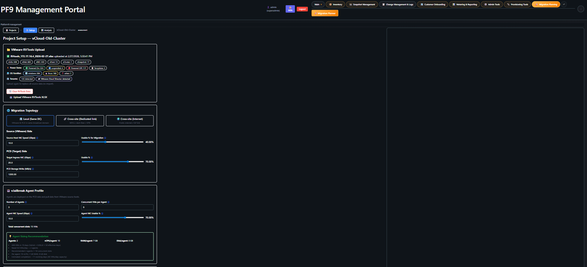
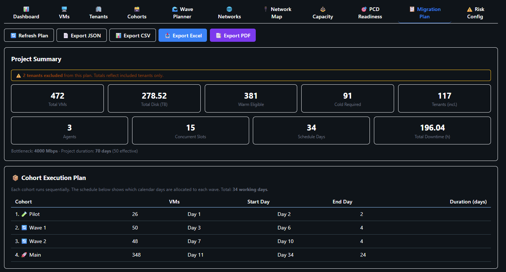

# Platform9 Management System

**Engineering Teams Add-On Platform: Enhanced Inventory, Monitoring & Daily Operations for Platform9**

> This is **not** a replacement for the official Platform9 UI. It is an engineering-focused operational layer that complements Platform9 — adding the automation, visibility, and MSP-grade workflows that engineering teams need day to day.

[](LICENSE)
[](CHANGELOG.md)
[](#-deployment-flexibility--you-decide-how-to-run-this)
[](https://www.buymeacoffee.com/erezrozenbaum)

pf9-mngt is an open-source operational add-on for Platform9 / OpenStack — it gives engineering and MSP teams automated snapshots, VM restore, full inventory persistence, and day-to-day monitoring in a single self-hosted stack.

---

## 🧭 Why This Exists — An Engineering Evaluation Story

The conversation around VMware alternatives is real and growing. For MSPs and enterprise teams evaluating their options, Platform9 on OpenStack is genuinely worth looking at. Solid technology, strong business model, and a credible path for organizations managing private and hybrid cloud at scale.

We are currently in the evaluation phase — testing Platform9 as a potential direction for our infrastructure. During that process, like any serious evaluation, you go beyond the demo and start stress-testing real operational workflows. That is where engineering gaps become visible — not because the platform is lacking, but because MSP and enterprise operations have very specific day-to-day requirements that take time for any platform to fully mature into.

Rather than pause the evaluation, we chose to solve the gaps ourselves and reach a better, more informed decision point. The result is pf9-mngt. Building it has given us far deeper insight into the platform than any standard assessment would have. Whatever direction we ultimately choose, this process has been worth it.

This entire project was built using AI as a genuine engineering partner — what some call vibe coding, but applied to a real production problem with real architectural decisions. One person, clear intent, and the right AI workflow can ship something with genuine depth. That is worth demonstrating.

---

### 🔐 Engineering Gap 1 — Metadata Ownership & Operational Resilience

OpenStack identifies everything by UUID. Resource names, relationships, network topology, and tenant context all live in the metadata layer on the management cluster. When you run Platform9 in SaaS mode, that metadata lives on their platform — not yours.

From an engineering perspective this creates a real operational resilience challenge. Without that metadata layer your resources become very difficult to identify and manage independently at scale. For MSPs managing multiple tenants and hundreds of resources, this is a genuine business continuity risk.

**The engineering answer:** pf9-mngt continuously pulls and persists all infrastructure metadata into a local PostgreSQL database that you own and control — independently of the platform. Resource names, relationships, tenant context, change history, and full inventory are always available locally, regardless of platform availability. This is exactly what RVTools does for VMware environments. We built the equivalent for Platform9 and OpenStack.

---

### ⚡ Engineering Gap 2 — VM Restore

In VMware, restoring a VM is a right-click. In OpenStack, there is no equivalent native workflow. To recover a VM from a snapshot you must manually reconstruct everything — remember the original flavor, network topology, IP configuration, re-attach the snapshot volume, and preserve user credentials. All of this under SLA pressure, without making a mistake.

For an MSP, that manual process is not sustainable at scale. It is exactly the kind of procedure that goes wrong at the worst possible moment.

**The engineering answer:** pf9-mngt automates the entire restore procedure. The restore engine handles flavor, network topology, IP addresses, user credentials, and volume attachment automatically. Two restore modes are supported:

- **Side-by-side restore** — a new VM with a new name and new IP spins up alongside the original, completely non-destructively. Validate before cutover. Nothing is touched until you are ready.
- **Replace restore** — full automated recovery with the original configuration restored. Superadmin-only for safety.

Every restore operation is fully audited — who triggered it, what was restored, what mode, duration, and outcome. For MSP accountability and compliance this is not optional.

---

### 🔄 Engineering Gap 3 — Snapshot Automation & Compliance

There is no native automated snapshot scheduler in Platform9 or OpenStack. No configurable per-volume policies. No retention management. No SLA compliance tracking. For an MSP, snapshot automation is table stakes — you cannot deliver a managed service without it.

**The engineering answer:** pf9-mngt includes a complete snapshot automation engine built from scratch. Configurable policies per volume — daily, monthly, custom retention — with automatic cleanup and full SLA compliance reporting aggregated by tenant and domain. v1.26.0 adds **quota-aware batching** with Cinder quota pre-checks, tenant-grouped batching with configurable rate limits, live progress tracking, and the `snapshot_quota_forecast` proactive runbook.

---

### 📦 Engineering Gap 4 — VMware Migration Assessment & Capacity Planning

Migrating hundreds of VMs from VMware to PCD is not just "move the disks." You need full source inventory analysis, OS compatibility classification, warm-vs-cold mode determination, per-VM time estimation, cohort planning, and target capacity validation — before a single VM moves. No native tooling ties RVTools data to PCD readiness in one end-to-end workflow.

**The engineering answer:** pf9-mngt includes a full **Migration Planner** — a multi-stage workflow that takes you from raw RVTools data all the way to an approved, wave-sequenced migration plan ready for execution.

**📥 Source Inventory & Assessment**
- RVTools XLSX ingestion — parses vInfo, vPartition, vDisk, vNetwork sheets into a structured per-VM inventory
- Per-VM risk scoring (GREEN / YELLOW / RED) with configurable weighted rules (OS, disk size, NIC count, snapshots)
- Warm-eligible vs cold-required classification — based on risk score and operator overrides
- OS family and version detection; actual used-disk data from vPartition (not provisioned size)
- Per-VM time estimation — warm phase-1 copy, incremental sync, cutover window, and cold total downtime
- Excel + PDF export — Project Summary, Per-Tenant Assessment, Daily Schedule, All VMs

**🗺️ Target Mapping & Capacity Planning**
- Per-tenant scoping — mark tenants in or out of plan with bulk-select toolbar and exclusion reasons
- Source → PCD target mapping — map each tenant to a target PCD domain and project; auto-seeded with confirmed-flag review workflow
- Source → PCD network mapping — auto-seeded from VM inventory; VLAN ID, confirmed status, Find & Replace, Confirm All
- VM dependency annotation — mark app-stack ordering constraints (web → DB) with circular-dependency validation
- Per-tenant readiness checks — 5 auto-derived: target mapped, network mapped, quota sufficient, no critical gaps, VMs classified
- Overcommit profile modeling — Aggressive / Balanced / Conservative presets with configurable ratios
- Quota requirements engine — recommended per-tenant vCPU, RAM, and storage on the PCD side
- **Performance-based node sizing** — uses actual `cpu_usage_percent` / `memory_usage_percent` from RVTools data (not vCPU allocation ÷ overcommit) for accurate physical node demand; falls back to allocation or quota if performance data is unavailable
- Auto-detect PCD node profile from live hypervisor inventory with one click
- PCD readiness gap analysis — missing flavors, networks, images, unmapped tenants — with severity scoring and downloadable action report (Excel + PDF)

**🗃️ Cohort Planning**
- **Migration Cohorts** — split large projects into ordered workstreams, each with its own schedule, owner, and dependency gate
- **Tenant ease scoring** — composite 0–100 score per tenant based on VM count, disk size, risk score, OS support rate, network complexity, and cross-tenant dependencies; configurable dimension weights
- **Auto-assign strategies** — six algorithms: easiest-first, riskiest-last, pilot + bulk, balanced load, OS-first, by-priority; with guardrails (max VMs, max disk, max avg risk per cohort)
- **What-if estimator** — two side-by-side models per cohort (bandwidth/transfer model + VM-slots scheduler model); live recalculation as you adjust agent slots or bandwidth; project deadline banner turns red if either model exceeds the target duration
- Expandable cohort cards — avg ease, risk distribution, OS mix, readiness counts, and cross-cohort dependency warnings
- Gantt-style date bars and dependency lock indicators

**🌊 Wave Planning**
- Cohort-scoped auto-builder — builds independent wave sets per cohort in execution order; five strategies: bandwidth-paced, risk-tiered, even-spread, dependency-ordered, pilot-first
- Pilot wave support — auto-creates a low-risk pilot wave per cohort to validate toolchain before committing the bulk
- Full wave lifecycle — planned → confirmed → in-progress → complete, with timestamps and transition guards
- Per-wave pre-flight checklists — network mapped, target project set, VMs assessed, no critical gaps, agent reachable, snapshot baseline
- Wave Planner UI — VM migration funnel, per-cohort wave cards, VM assignment tables, preflight status panel, dry-run preview before committing

---

### �🐳 Deployment Flexibility — You Decide How to Run This

pf9-mngt is currently developed on Windows using Docker containers. That is the development environment — but the architecture is deliberately not prescriptive about how you run it in production.

Every service is containerized. That means **you decide**:

| Option | When to use |
|--------|-------------|
| 🐳 **Docker Compose** | Simple, fast, perfectly viable for many teams |
| ☸️ **Kubernetes** | Production-grade HA and horizontal scaling — containers are ready, effort is minimal |
| 🔧 **Your own orchestration** | Adapt to whatever infrastructure decisions you have already made |

> See [docs/KUBERNETES_MIGRATION_GUIDE.md](docs/KUBERNETES_MIGRATION_GUIDE.md) for migration planning.  
> See [docs/LINUX_DEPLOYMENT_GUIDE.md](docs/LINUX_DEPLOYMENT_GUIDE.md) for running on Linux.

---

## 📸 Screenshots

### Landing Dashboard


### Snapshot Compliance Report


### VM Inventory


### History & Monitoring


### API Performance


### Snapshot Restore Process


### Snapshot Restore Audit


### Migration Planner — Project Setup & Cohort Configuration


### Migration Planner — Wave Plan Creation


---

## 🎬 Video Walkthrough

A 15-minute explainer video walking through the UI and key features:

[](https://www.youtube.com/watch?v=68-LQ9ugU_E)

▶️ [**PF9 Management System — Full UI Walkthrough (15 min)**](https://www.youtube.com/watch?v=68-LQ9ugU_E)

---

## 🚀 System Architecture

**Enterprise microservices-based platform** with 12 containerized services plus host-based automation:

| Service | Stack | Port | Purpose |
|---------|-------|------|---------|
| **Frontend UI** | React 19.2+ / TypeScript / Vite | 5173 | 28+ management tabs + admin panel |
| **Backend API** | FastAPI / Gunicorn / Python | 8000 | 150+ REST endpoints, RBAC middleware, 4 workers |
| **LDAP Server** | OpenLDAP | 389 | Enterprise authentication directory |
| **LDAP Admin** | phpLDAPadmin | 8081 | Web-based LDAP management |
| **Monitoring Service** | FastAPI / Python | 8001 | Real-time metrics via Prometheus |
| **Database** | PostgreSQL 16 | 5432 | 65+ tables, history tracking, audit, metering, runbooks, migration planner |
| **Database Admin** | pgAdmin4 | 8080 | Web-based PostgreSQL management |
| **Snapshot Worker** | Python | — | Automated snapshot management |
| **Notification Worker** | Python / SMTP | — | Email alerts for drift, snapshots, compliance |
| **Backup Worker** | Python / PostgreSQL | — | Scheduled database backups and restores |
| **Metering Worker** | Python / PostgreSQL | — | Resource metering every 15 minutes |
| **Search Worker** | Python / PostgreSQL | — | Incremental full-text indexing for Ops Assistant |

> Host scripts (`pf9_rvtools.py`, `host_metrics_collector.py`) run via Windows Task Scheduler for infrastructure discovery and metrics collection.

---

## 🌟 Key Features

### 🔐 Enterprise Authentication & Authorization
- **LDAP Integration**: Production-ready OpenLDAP authentication — also compatible with Active Directory
- **Role-Based Access Control**: 5-tier permission system (Viewer, Operator, Admin, Superadmin, Technical)
- **MFA Support**: TOTP-based two-factor authentication (Google Authenticator compatible) with backup recovery codes
- **JWT Token Management**: Secure 480-minute sessions with Bearer token authentication
- **RBAC Middleware**: Automatic permission enforcement on all resource endpoints
- **Audit Logging**: Complete authentication event tracking — login, logout, failed attempts, user management
- **System Audit**: 90-day retention with filtering by user, action, date range, and IP address

### 📊 RVTools-Style Unified Inventory
- **29 Resource Types**: Domains, Projects, Users, VMs, Volumes, Snapshots, Networks, Subnets, Ports, Floating IPs, Routers, Security Groups, Hypervisors, Flavors, Images, Roles, Role Assignments, Groups, Snapshot Policies, and operational event types
- **Human-Friendly Names**: UUID-to-name resolution across all resource types
- **Local Persistent Store**: All metadata stored in your own PostgreSQL — independent of platform availability
- **Excel/CSV Export**: Customer-data-safe with masking options and delta reporting
- **Multi-Tenant Support**: Full domain and project-level filtering and management
- **Comprehensive Audit System**: Change tracking, deletion history, compliance reporting, resource timeline

<details>
<summary><strong>User Management Details</strong></summary>

- **Multi-Domain User Collection**: 100+ users across 28 OpenStack domains
- **Role Assignment Tracking**: Monitors role assignments across the infrastructure
- **Activity Monitoring**: User last-seen timestamps and account status
- **Role Inference System**: Intelligent role assignment when API access is limited
- **Domain-Scoped Authentication**: Complete user enumeration across tenants

</details>

### 🔄 Automated Snapshot Management
- **Built From Scratch**: No native scheduler exists in Platform9 or OpenStack — we built one
- **Metadata-Driven Policies**: Volume-level configuration via OpenStack metadata
- **Multi-Policy Support**: daily_5, monthly_1st, monthly_15th with independent retention per volume
- **Cross-Tenant Snapshots**: Dedicated service user architecture for correct tenant context
- **SLA Compliance Reporting**: Configurable thresholds with detailed tenant/domain aggregation
- **Policy Assignment Rules**: JSON-driven automatic policy assignment based on volume properties

<details>
<summary><strong>Snapshot System Components</strong></summary>

- **Automated Creation** (`snapshots/p9_auto_snapshots.py`): Policy-driven volume snapshots with retention management, dual-session architecture (admin for listing, service user for creating)
- **Service User Management** (`snapshots/snapshot_service_user.py`): Automatic admin role assignment per tenant project, Fernet-encrypted or plaintext password support
- **Policy Assignment** (`snapshots/p9_snapshot_policy_assign.py`): Opt-out rule engine, volume property matching, bulk metadata assignment
- **Compliance Reporting** (`snapshots/p9_snapshot_compliance_report.py`): Real-time SLA analysis, tenant/domain aggregation

</details>

### ⚡ Automated VM Restore *(No native equivalent exists in OpenStack)*
- **Full Restore Automation**: Flavor, network, IPs, user credentials, volume attachment — all handled
- **Side-by-Side Restore**: New VM with new name and IP alongside the original — non-destructive
- **Replace Restore**: Full recovery with original configuration — Superadmin-only with typed confirmation
- **IP Strategies**: NEW_IPS (DHCP), TRY_SAME_IPS (best-effort), SAME_IPS_OR_FAIL (strict)
- **3-Screen UI Wizard**: Guided restore flow with real-time progress tracking
- **Dry-Run Mode**: Validate the full restore plan before executing against OpenStack
- **Safety First**: Disabled by default, concurrent restore prevention, quota double-check, rollback on failure
- **Full Restore Audit**: Every operation logged — who, what mode, duration, outcome

### 👁️ Real-Time Monitoring
- **Host Metrics**: Live CPU, memory, storage from PF9 compute nodes via Prometheus node_exporter (port 9388)
- **VM Metrics**: Individual VM resource tracking via libvirt_exporter (port 9177)
- **Automated Collection**: Background collection every 30 minutes
- **Persistent Cache**: Metrics survive service restarts
- **Integrated Dashboard**: Real-time monitoring tab with auto-refresh

### 🔔 Smart Notifications
- **Event-Driven Alerts**: Snapshot failures, compliance violations, drift events, health score drops
- **Per-User Preferences**: Subscribe to specific event types with severity filtering (info/warning/critical)
- **Daily Digest**: Configurable daily summary aggregating all events from past 24 hours
- **SMTP Flexibility**: Authenticated and unauthenticated relay support, optional TLS
- **HTML Templates**: Professional Jinja2 email templates for each event type
- **Notification History**: Full delivery log with status tracking and retry information

### 💰 Metering & Chargeback
- **Per-VM Resource Tracking**: vCPU, RAM, disk allocation + actual usage, network I/O
- **Snapshot & Restore Metering**: Count, size, compliance, operation tracking
- **API Usage Metering**: Endpoint-level call counts, error rates, latency percentiles (avg/p95/p99)
- **Efficiency Scoring**: Per-VM classification (excellent/good/fair/poor/idle)
- **Multi-Category Pricing**: Compute, storage, snapshot, restore, volume, network — hourly + monthly rates
- **Chargeback Export**: Per-tenant cost breakdown with one-click CSV export
- **8 Sub-Tab UI**: Overview, Resources, Snapshots, Restores, API Usage, Efficiency, Pricing, Export

### 🏢 Customer Provisioning & Domain Management *(v1.16)*
- **5-Step Provisioning Wizard**: Domain → Project → User/Role → Quotas → Network/Security Group
- **Dynamic Keystone Roles**: Fetches roles from PF9 Keystone, filters internal system roles
- **Tabbed Quota Editor**: Compute, Block Storage, Network tabs with "Set Unlimited" toggles
- **Network Auto-Discovery**: Physical networks from Neutron with VLAN/flat/VXLAN support
- **Customer Welcome Email**: HTML template with opt-in toggle and editable recipients
- **Domain Management**: Full lifecycle — enable/disable, typed confirmation delete, resource inspection
- **Resource Deletion**: 8 DELETE endpoints for individual resources across all types
- **Central Activity Log**: Full audit trail for all provisioning and domain operations

### 📋 Reports & Resource Management *(v1.17)*
- **16 Report Types**: VM Report, Tenant Quota Usage, Domain Overview, Snapshot Compliance, Flavor Usage, Metering Summary, Resource Inventory, User/Role Audit, Idle Resources, Security Group Audit, Capacity Planning, Backup Status, Activity Log, Network Topology, Cost Allocation, Drift Summary
- **CSV Export**: All reports support one-click CSV download
- **Resource Provisioning Tool**: Full CRUD for Users, Flavors, Networks, Routers, Floating IPs, Volumes, Security Groups across tenants
- **Quota Management**: View and live-edit compute, network, and storage quotas per tenant
- **Safety Protections**: Last-user guard, in-use flavor check, attached-volume block, default SG protection
- **Three-Tier RBAC**: Viewer (read), Operator (read+write), Admin (read+write+delete)

### 🔍 Ops Assistant — Search & Similarity *(v1.20)*
- **Full-Text Search**: PostgreSQL tsvector + websearch across all 29 resource types, events, and audit logs
- **Trigram Similarity**: "Show Similar" per result — finds related resources, errors, or configurations via pg_trgm
- **Intent Detection**: Natural-language queries like *"quota for projectX"* or *"capacity"* auto-suggest the matching report endpoint
- **Smart Query Templates (v3)**: 26 question templates turn the search bar into an Ops Assistant — ask *"how many VMs are powered off?"*, *"quota for service"*, or *"show platform overview"* and get live answer cards inline
- **Scope Filters**: Domain and Tenant dropdowns filter smart query results to a specific project or domain — 20 of 26 query templates are scope-aware
- **Discoverability UI**: 🤖 button opens a categorised help panel with clickable example chips across 6 categories (Infrastructure, Projects & Quotas, Storage, Networking, Security & Access, Operations) — template chips auto-fill with the scoped tenant, instant chips run immediately. "New Question" button resets the search.
- **Quota & Usage Metering**: Background collector computes per-project resource consumption (VMs, vCPUs, RAM, volumes, storage, snapshots, floating IPs, networks, ports, security groups) from live inventory tables with flavor-based vCPU/RAM resolution
- **29 Indexed Document Types**: VMs, volumes, snapshots, hypervisors, networks, subnets, floating IPs, ports, security groups, domains, projects, users, flavors, images, routers, roles, role assignments, groups, snapshot policies, activity log, auth audit, drift events, snapshot runs/records, restore jobs, backups, notifications, provisioning, deletions
- **Incremental Indexing**: Background worker with per-doc-type watermarks — only re-indexes changed rows
- **Stale Cleanup**: Automatically removes search documents for deleted infrastructure resources
- **Paginated Results**: Relevance-ranked results with highlighted keyword snippets and metadata pill cards
- **Indexer Dashboard**: Real-time stats on document counts, last run time, and per-type health

### 📋 Policy-as-Code Runbooks *(v1.21 → v1.25)*
- **Runbook Catalogue**: Browse 14 built-in operational runbooks with schema-driven parameter forms:
  - **VM**: Stuck VM Remediation, VM Health Quick Fix, Snapshot Before Escalation, Password Reset + Console Access
  - **Security**: Security Group Audit, Security & Compliance Audit, User Last Login Report, Snapshot Quota Forecast
  - **Quota**: Quota Threshold Check, Upgrade Opportunity Detector
  - **General**: Orphan Resource Cleanup, Diagnostics Bundle, Monthly Executive Snapshot, Cost Leakage Report
- **Result Export**: Every runbook result can be exported as CSV, JSON, or printed to PDF directly from the detail panel
- **ILS Pricing from Metering**: Cost-related runbooks (Upgrade Detector, Executive Snapshot, Cost Leakage) pull real pricing from the `metering_pricing` table — per-flavor, per-resource, with automatic currency detection (ILS/USD)
- **Operator-Facing Trigger**: Tier 1 operators can browse and trigger runbooks with dry-run support — no admin access needed
- **Flexible Approval Workflows**: Configurable `trigger_role → approver_role` mapping per runbook with three modes: auto-approve, single approval, multi-approval
- **Admin Governance**: Execution History, Approvals queue, and Approval Policies managed via 3 dedicated sub-tabs in the Admin panel
- **Full Audit Trail**: Every execution records trigger user, approver, timestamps, parameters, results, items found/actioned
- **Pluggable Engine Architecture**: `@register_engine` decorator pattern — add new runbooks with zero framework changes

### 🤖 Ops Copilot — AI Infrastructure Assistant *(v1.24)*
- **Three-Tier Architecture**: Built-in intent engine (zero setup) → Ollama (local LLM) → OpenAI/Anthropic (external LLM)
- **40+ Built-in Intents**: Inventory counts, VM power states, capacity metrics, error VMs, down hosts, networking (networks, subnets, routers, floating IPs), snapshot/drift/compliance summaries, user lists, role assignments, activity logs, runbook status, and full infrastructure overview — all powered by live SQL queries
- **Tenant / Project / Host Scoping**: Add "on tenant X", "for project X", or "on host Y" to any question for filtered results. Synonym expansion ensures natural phrasing always matches.
- **LLM Integration**: Free-form questions answered via Ollama (local, no data leaves your network) or OpenAI/Anthropic (with automatic sensitive data redaction)
- **Labeled FAB + Welcome Screen**: Prominent pill-shaped "🤖 Ask Copilot" button with pulse animation on first visit, welcome screen with examples, and a dedicated help view with 8 categorized question groups and usage tips
- **Admin Settings Panel**: Switch backends, configure URLs/keys/models, edit system prompts, test connectivity — all from the UI, no `.env` edits needed
- **Feedback & History**: Per-answer thumbs up/down, conversation history persisted per user with automatic trimming
- **Automatic Fallback**: If the LLM backend fails, seamlessly falls back to the built-in intent engine

### 📈 28-Tab Management Dashboard
A single engineering console covering every operational surface:

> Servers · Volumes · Snapshots · Networks · Security Groups · Subnets · Ports · Floating IPs · Domains · Projects · Flavors · Images · Hypervisors · Users · Roles · Snapshot Policies · History · Audit · Monitoring · Restore · Restore Audit · Notifications · Metering · Customer Provisioning · Domain Management · Activity Log · Reports · Resource Management · **Ops Search** · **Runbooks** · **Ops Copilot**

<details>
<summary><strong>Landing Dashboard Widgets</strong></summary>

- **Health Summary Card**: System-wide metrics (VMs, volumes, networks, resource utilization)
- **Snapshot SLA Compliance**: Tenant-level compliance tracking with warning/critical alerting
- **Top Host Utilization**: Real-time CPU/memory usage across compute nodes
- **Recent Activity Widget**: Last 24 hours of infrastructure changes
- **Coverage Risk Analysis**: Volumes without snapshot protection
- **Capacity Pressure Indicators**: Storage and compute capacity warnings
- **VM Hotspots**: Top resource consumers (CPU/memory/storage)
- **Tenant Risk Scores**: Multi-factor risk assessments per tenant
- **Compliance Drift Tracking**: Policy adherence trending
- **Capacity Trends**: 7-day resource utilization forecasting
- **Trendlines**: Infrastructure growth patterns and velocity metrics

</details>

<details>
<summary><strong>History Tab Features</strong></summary>

- Filter by resource type (server, volume, snapshot, deletion, etc.), project, domain, and free-text search
- Sortable column headers with ascending/descending indicators
- Deletion record viewing — shows deletion timeline, original resource type, reason, and last-known state
- Most frequently changed resources section with direct history navigation
- Configurable timeframe (1 hour to 1 week)

</details>

- **Dark/Light Mode**: Full theme support with persistent preferences
- **Role-Based UI**: Tabs and actions shown based on user permission level
- **Write-Capable Indicators**: 🔧 icon marks tabs that can create, modify, or delete resources
- **Auto-Refresh**: 30-second refresh on dashboard, efficient pagination across all endpoints

### API Observability
- **Public Metrics**: `GET /metrics`
- **Authenticated Metrics (UI)**: `GET /api/metrics` — Admin/Superadmin only
- **Authenticated Logs (UI)**: `GET /api/logs` — with `limit`, `level`, `source`, `log_file` params
- **Swagger Docs**: `GET /docs` — interactive API documentation

---

## 🚀 Quick Start

### Prerequisites
- **Docker & Docker Compose** (for complete platform)
- **Python 3.11+** with packages: `requests`, `openpyxl`, `psycopg2-binary`, `aiohttp`, `aiofiles`
- **Valid Platform9 credentials** (service account recommended) — *not required in Demo Mode*
- **Network access** to Platform9 cluster and compute nodes — *not required in Demo Mode*

### 1. Complete Automated Setup (Recommended)
```powershell
# Clone repository
git clone https://github.com/erezrozenbaum/pf9-mngt.git
cd pf9-mngt

# Configure environment (CRITICAL: No quotes around values)
cp .env.template .env
# Edit .env with your Platform9 credentials

# One-command complete deployment
.\deployment.ps1

# What deployment.ps1 does:
# ✓ Checks/installs Docker Desktop
# ✓ Creates and validates .env configuration
# ✓ Creates required directories (logs, secrets, cache)
# ✓ Installs Python dependencies
# ✓ Builds and starts all Docker containers
# ✓ Initializes PostgreSQL database schema
# ✓ Configures LDAP directory structure
# ✓ Creates automated scheduled tasks
# ✓ Runs comprehensive health checks

# Alternative quick startup (assumes Docker installed)
.\startup.ps1

# Access services after deployment:
# UI:            http://localhost:5173
# API:           http://localhost:8000
# API Docs:      http://localhost:8000/docs
# Monitoring:    http://localhost:8001
# Database:      http://localhost:8080
```

### 1b. Demo Mode (No Platform9 Required)

Want to try the portal without a Platform9 environment? Demo mode populates the
database with realistic sample data (3 tenants, 35 VMs, 50+ volumes, snapshots,
drift events, compliance reports, etc.) and generates a static metrics cache.

```powershell
git clone https://github.com/erezrozenbaum/pf9-mngt.git
cd pf9-mngt

# The deployment wizard will ask "Production or Demo?" — choose 2 for Demo
.\deployment.ps1

# Or enable demo mode manually on an existing install:
#   1. Set DEMO_MODE=true in .env
#   2. python seed_demo_data.py          # populates DB + generates metrics cache
#   3. docker-compose restart pf9_api    # API picks up DEMO_MODE env var
```

> In demo mode the UI shows an amber **DEMO** banner, the background metrics
> collector is skipped, and Platform9 credentials are not required.

### 2. Environment Configuration
```bash
# Platform9 Authentication
PF9_USERNAME=your-service-account@company.com
PF9_PASSWORD=your-secure-password
PF9_AUTH_URL=https://your-cluster.platform9.com/keystone/v3
PF9_USER_DOMAIN=Default
PF9_PROJECT_NAME=service
PF9_PROJECT_DOMAIN=Default
PF9_REGION_NAME=region-one

# Database
POSTGRES_USER=pf9
POSTGRES_PASSWORD=generate-secure-password-here
POSTGRES_DB=pf9_mgmt

# Monitoring
PF9_HOSTS=<HOST_IP_1>,<HOST_IP_2>,<HOST_IP_3>
METRICS_CACHE_TTL=60
```

### 3. Manual Docker Setup
```bash
docker-compose up -d
docker-compose ps
docker-compose logs pf9_api
```

### 4. Standalone Script Usage (No Docker Required)
```bash
# Inventory export
python pf9_rvtools.py

# Snapshot automation
python snapshots/p9_auto_snapshots.py --policy daily_5 --dry-run
python snapshots/p9_auto_snapshots.py --policy daily_5

# Compliance reporting
python snapshots/p9_snapshot_compliance_report.py --input latest_export.xlsx --output compliance.xlsx

# Policy assignment
python snapshots/p9_snapshot_policy_assign.py --config snapshots/snapshot_policy_rules.json --dry-run
```

---

## 🔧 Configuration

### Snapshot Policies
```bash
# Daily snapshots with 5-day retention
openstack volume set --property auto_snapshot=true \
                    --property snapshot_policies=daily_5 \
                    --property retention_daily_5=5 \
                    <volume-id>

# Multiple policies on one volume
openstack volume set --property auto_snapshot=true \
                    --property snapshot_policies=daily_5,monthly_1st \
                    --property retention_daily_5=5 \
                    --property retention_monthly_1st=12 \
                    <volume-id>
```

### Windows Task Scheduler
```powershell
# Metrics collection (auto-created by startup.ps1)
# Every 30 minutes — "PF9 Metrics Collection"

# Inventory collection (create manually)
schtasks /create /tn "PF9 RVTools Collection" /tr "python C:\pf9-mngt\pf9_rvtools.py" /sc daily /st 02:00
```

---

## 🛠️ Administration

### Database
```bash
# Connect
psql -h localhost -U pf9 -d pf9_mgmt

# Manual backup
docker exec pf9_db pg_dump -U pf9 pf9_mgmt > backup.sql

# Restore
docker exec -i pf9_db psql -U pf9 pf9_mgmt < backup.sql
```

> For scheduled backups, use the 💾 Backup tab in the UI — the backup_worker runs pg_dump on a configurable schedule and writes compressed `.sql.gz` files.

### Service Management
```bash
docker-compose restart pf9_api
docker-compose up -d --scale pf9_api=2
docker stats
```

---

## 📁 Project Structure

```
pf9-mngt/
├── api/                          # FastAPI backend (155+ endpoints)
├── pf9-ui/                       # React 19 + TypeScript frontend
├── monitoring/                   # Prometheus metrics service
├── snapshots/                    # Snapshot automation engine
│   ├── p9_auto_snapshots.py      # Cross-tenant snapshot automation
│   ├── snapshot_service_user.py  # Service user management
│   ├── p9_snapshot_compliance_report.py
│   ├── p9_snapshot_policy_assign.py
│   └── snapshot_policy_rules.json
├── db/                           # PostgreSQL schema + migrations
├── backup_worker/                # Scheduled backup service
├── metering_worker/              # Resource metering service
├── search_worker/                # Full-text search indexer (Ops Assistant)
├── notifications/                # Email notification service
├── ldap/                         # OpenLDAP configuration
├── docs/                         # Full documentation suite
├── pf9_rvtools.py                # RVTools-style inventory export
├── host_metrics_collector.py     # Prometheus metrics collection
├── seed_demo_data.py             # Demo mode: populate DB + metrics cache
├── p9_common.py                  # Shared utilities
├── docker-compose.yml            # Full stack orchestration
├── deployment.ps1                # One-command deployment
├── startup.ps1                   # Quick start script
└── .env.template                 # Environment configuration template
```

---

## 📚 Documentation

| Document | Purpose |
|----------|---------|
| [Deployment Guide](docs/DEPLOYMENT_GUIDE.md) | Step-by-step deployment instructions |
| [Admin Guide](docs/ADMIN_GUIDE.md) | Day-to-day administration reference |
| [Architecture](docs/ARCHITECTURE.md) | System design, trust boundaries, data model, auth flow |
| [API Reference](docs/API_REFERENCE.md) | Complete API endpoint documentation |
| [Security Guide](docs/SECURITY.md) | Security model, authentication, encryption |
| [Security Checklist](docs/SECURITY_CHECKLIST.md) | Pre-production security audit checklist |
| [Restore Guide](docs/RESTORE_GUIDE.md) | Snapshot restore feature documentation |
| [Snapshot Automation](docs/SNAPSHOT_AUTOMATION.md) | Snapshot system design and configuration |
| [Snapshot Service User](docs/SNAPSHOT_SERVICE_USER.md) | Service user setup and troubleshooting |
| [Quick Reference](docs/QUICK_REFERENCE.md) | Common commands and URLs cheat sheet |
| [Kubernetes Migration](docs/KUBERNETES_MIGRATION_GUIDE.md) | K8s migration planning guide |
| [Linux Deployment](docs/LINUX_DEPLOYMENT_GUIDE.md) | Running pf9-mngt on Linux instead of Windows |
| [Migration Planner Guide](docs/MIGRATION_PLANNER_GUIDE.md) | Comprehensive operator guide for all Migration Planner phases |
| [Contributing](CONTRIBUTING.md) | Contribution guidelines |

---

## 🆘 Troubleshooting

**"Failed to fetch" in UI**
- Check API: `docker-compose logs pf9_api`
- Verify credentials in `.env`
- Test: `curl http://localhost:8000/health`

**Empty monitoring data**
- Run: `python host_metrics_collector.py --once`
- Check task: `schtasks /query /tn "PF9 Metrics Collection"`
- Verify node_exporter on PF9 hosts (port 9388)

**Database connection errors**
- Check: `docker-compose logs db`
- Reset: `docker-compose down -v && docker-compose up -d`

**Authentication errors**
- Verify `.env` credentials and Platform9 URL
- Test: `curl -k https://your-cluster.com/keystone/v3`

**Monitoring not working after manual startup**
- Run: `.\fix_monitoring.ps1`

**Data synchronization issues**
- Force sync: `python pf9_rvtools.py`
- Check database via pgAdmin or CLI

---

## 🚨 Important Notes

**Environment file format — CRITICAL:**
```bash
# ✅ CORRECT
PF9_USERNAME=user@company.com

# ❌ WRONG
PF9_USERNAME="user@company.com"
```

**Security checklist for first-time setup:**
1. **NEVER commit `.env`** to version control
2. **Rotate credentials** if accidentally exposed
3. **Use service accounts**, not personal credentials
4. **Test with `--dry-run`** before production use

---

## ❓ FAQ

<details>
<summary><strong>General</strong></summary>

**Q: Does this replace the Platform9 UI?**
A: No. It is a complementary engineering console that adds operational capabilities not present in the native Platform9 UI — automated snapshot scheduling, SLA compliance, restore workflows, chargeback, and more.

**Q: Is this an official Platform9 product?**
A: No. This is an independent project built to work with Platform9 OpenStack APIs. It is not endorsed by or affiliated with Platform9 Systems, Inc.

**Q: Can I run this on Kubernetes?**
A: Yes. Every service is containerized. See [docs/KUBERNETES_MIGRATION_GUIDE.md](docs/KUBERNETES_MIGRATION_GUIDE.md).

**Q: What are the minimum hardware requirements?**
A: A Docker host with at least 4 GB RAM, 2 CPU cores, and network access to your Platform9 region endpoints.

**Q: Can I try this without a Platform9 environment?**
A: Yes! Set `DEMO_MODE=true` in your `.env` (or choose **Demo** during `deployment.ps1`) and run `python seed_demo_data.py`. The database will be populated with realistic sample data and a static metrics cache so every dashboard, report, and workflow is fully functional without a live cluster.

</details>

<details>
<summary><strong>Authentication & RBAC</strong></summary>

**Q: How does authentication work?**
A: Users authenticate against an LDAP directory (bundled OpenLDAP or your corporate LDAP/AD). JWT tokens are issued on login and validated on every API call. Optional TOTP-based MFA is supported.

**Q: What can each role do?**
A: `viewer` — read-only. `operator` — read + limited write. `admin` — full admin except user management. `superadmin` — full access including destructive operations. `technical` — read + write, no delete.

**Q: Can I use Active Directory instead of OpenLDAP?**
A: Yes. Set `LDAP_URL`, `LDAP_BASE_DN`, `LDAP_BIND_DN`, and `LDAP_BIND_PASSWORD` to point at your AD server.

**Q: How do I create the first admin user?**
A: The deployment script seeds a default admin via `admin_user.ldif`. After first login, use the Users tab to promote additional LDAP users. See [docs/ADMIN_GUIDE.md](docs/ADMIN_GUIDE.md).

</details>

<details>
<summary><strong>Snapshots & Restore</strong></summary>

**Q: How does automated snapshot scheduling work?**
A: The snapshot scheduler evaluates policy rules, matches volumes by tenant/naming pattern/metadata, and creates snapshots via the Cinder API using a dedicated service user.

**Q: What is the Snapshot Service User?**
A: A dedicated Platform9 user automatically granted admin roles in each tenant project for cross-tenant snapshot creation. See [docs/SNAPSHOT_SERVICE_USER.md](docs/SNAPSHOT_SERVICE_USER.md).

**Q: Is restore destructive?**
A: No. Side-by-side restore creates a new VM and a new volume. The original is untouched. Replace mode (superadmin-only) does delete the original and requires typed confirmation.

**Q: What is dry-run mode?**
A: When `RESTORE_DRY_RUN=true` (the default), the restore planner validates the full plan but does not execute it. Set to `false` to enable actual execution.

**Q: Can I cancel a restore in progress?**
A: Yes. Use the Cancel button or call `POST /api/restore/{job_id}/cancel`. The executor stops at the next step boundary and cleans up partial resources.

</details>

<details>
<summary><strong>Monitoring & UI</strong></summary>

**Q: What does the Monitoring tab show?**
A: Real-time host-level metrics (CPU, memory, disk) collected from Platform9 hypervisors via Prometheus node_exporter.

**Q: What do the 🔧 tab icons mean?**
A: Write-capable tabs — they can create, modify, or delete resources. Read-only tabs use default styling.

**Q: Does the UI support dark mode?**
A: Yes. Click the theme toggle (top-right moon/sun icon). Your preference is saved in local storage.

**Q: Where are the logs?**
A: Application logs are in `logs/` and available via the System Logs tab (admin-only). Container logs via `docker logs <container>`.

**Q: How do I access the API documentation?**
A: Swagger docs at `http://<host>:8000/docs`, ReDoc at `http://<host>:8000/redoc`.

</details>

---

## 🎯 Recent Updates

### v1.34.1 — Wave Planner Bug Fixes
- ✅ **Cohort-scoped iteration** — `auto_build_waves` now calls `build_wave_plan()` per cohort in `cohort_order` sequence; each cohort builds its own independent wave set
- ✅ **`cohort_order` column** — SQL query fixed from `"order"` to `cohort_order`
- ✅ **Wave naming** — Waves use cohort name as prefix; pilot wave `🧪 <Cohort>`, regular waves numbered from 1 per cohort
- ✅ **`risk_category` column** — Fixed all SQL queries referencing the wrong column name `risk_classification`
- ✅ **`vm_name` NOT NULL** — Wave VM INSERT now resolves vm_name from `vm_name_map` lookup before inserting
- ✅ **`RealDictCursor` scalar fetch** — Plain cursor used for scalar queries; no more `fetchone()[0]` TypeError on dicts
- ✅ **Pydantic v2 compatibility** — All `user.get()` calls replaced with `getattr(user, "username", "?")`
- ✅ **Double emoji badge** — Removed hardcoded `📦` prefix; cohort badge now uses `wave.cohort_name` directly

### v1.34.0 — Phase 3: Wave Planning (Complete)
- ✅ **Cohort-scoped wave building** — VMs assigned to waves per cohort independently, respecting cohort ordering
- ✅ **5 scheduling strategies** — bandwidth-paced, risk-tiered, even-spread, dependency-ordered, pilot-first
- ✅ **Wave lifecycle** — Full draft → confirmed → in-progress → complete state machine with timestamps
- ✅ **Pre-flight checklists** — Per-wave operator checklist items with completion tracking and sign-off
- ✅ **Wave Planner UI** — Per-cohort wave cards, VM assignment tables, preflight status panel, cohort summary badges
- ✅ **Daily capacity controls** — Configurable VMs/day per wave with pilot-wave support and bandwidth-aware scheduling
- ✅ **11 new API routes** — Full wave CRUD, preflight management, auto-build, strategy configuration

### v1.33.0 — Cohort Scheduling & What-If Modeling
- ✅ **Cohort-aligned scheduling** — Per-cohort start date, working hours, and capacity independent from project defaults
- ✅ **Two-model What-If** — Side-by-side comparison of bandwidth/schedule scenarios per cohort
- ✅ **Execution plan view** — Calendar-style wave schedule with per-day VM count and cumulative progress
- ✅ **Cohort dependency gates** — Block cohort start until predecessor cohort reaches defined completion threshold

### v1.32.0–v1.32.1 — Smart Cohort Planning
- ✅ **Auto-assign VMs to cohorts** — Intelligent assignment based on tenant priority, risk score, and VM size
- ✅ **Ease scores** — Per-VM migration ease scoring combining risk, disk size, OS family, and dependency count
- ✅ **Ramp profile mode** — Conservative/standard/aggressive ramp controls for wave capacity curve
- ✅ **Cohort health dashboard** — Per-cohort readiness summary with blocking issue count and completion estimate

### v1.31.0–v1.31.1 — Migration Cohorts & Network Mapping (Phase 2.10)
- ✅ **Migration Cohorts** — Split large projects into ordered workstreams with independent schedules, owners, and dependency gates
- ✅ **Source → PCD Network Mapping** — Auto-seeded from VM inventory with best-guess target name and amber ⚠️ confirmed-flag review pattern
- ✅ **VM Dependency Annotation** — Mark app-stack ordering constraints with circular-dependency validation
- ✅ **Per-VM Migration Status & Mode Override** — Operator-controlled status tracking and warm/cold force-override
- ✅ **Tenant Migration Priority** — Integer ordering for cohort auto-assign
- ✅ **Per-Tenant Readiness Checks** — 5 auto-derived checks: target mapped, network mapped, quota sufficient, no critical gaps, VMs classified
- ✅ **Target name pre-seeding fix** (v1.31.1) — Both `migration_network_mappings` and `migration_tenants` auto-seed target fields with `confirmed` flag; readiness checks return `pending` until reviewed

### v1.28.3 — Migration Plan Excel/PDF Export + Parser Fixes
- ✅ **Excel Export** — `Export Excel` button downloads a 4-sheet openpyxl workbook: Project Summary, Per-Tenant Assessment (colour-coded), Daily Schedule, All VMs with full timing columns
- ✅ **PDF Export** — `Export PDF` button downloads a landscape A4 PDF (reportlab) with all three sections and a page footer
- ✅ **vCPU usage % fixed** — RVTools vCPU sheet uses `overall` (MHz) + `cpus`; parser now computes `cpu_usage_percent = min(demand / (cpus × 2400 MHz) × 100, 100)`
- ✅ **vMemory usage % fixed** — RVTools vMemory sheet uses `consumed` + `size mib`; parser now computes correct memory %; all 448 VMs have valid values
- ✅ **Phase1 times fixed** — `estimate_vm_time()` was multiplying data by 3–8% instead of applying 45–65% bandwidth utilization; fixed to show realistic 3 min–1.5 h range
- ✅ **Clear RVTools fix** — `migration_networks` was missing from the reset loop; now included

### v1.28.2 — Migration Plan UI, VM Expand, Per-Tenant Schedule
- ✅ **Migration Plan tab** — Per-tenant assessment, phase-1/cutover/cold times, daily wave schedule, JSON + CSV export
- ✅ **Expandable VM rows** — Click any VM to see per-disk and per-NIC detail inline
- ✅ **Additional VM filters** — OS Family, Power State, Cluster dropdowns
- ✅ **Per-VM time engine** — `estimate_vm_time()` computes warm phase-1, incremental, cutover, and cold times from disk/in-use data and bottleneck bandwidth

### v1.30.1 — Performance-Based Node Sizing
- ✅ **Actual VM utilisation for sizing** — Node sizing now uses `cpu_usage_percent`/`memory_usage_percent` per VM (from RVtools data) instead of configured vCPU ÷ overcommit. For the PoC cluster: 125 vCPU actually running vs 1,371 allocated — result is +2 new nodes needed, not +9
- ✅ **Three-tier basis** — Prefers actual performance data (when ≥50% coverage), falls back to allocation ÷ overcommit, then tenant quota
- ✅ **Sizing basis badge** — Capacity tab shows green/amber pill identifying whether sizing was based on real utilisation or allocation estimate, with coverage %, actual vCPU/RAM, and allocated vCPU/RAM

### v1.30.0 — Pre-Phase 3 Polish (Phase 2.8)
- ✅ **Auto-Detect PCD node profile** — "🔍 Auto-Detect from PCD" button pre-fills node spec from dominant hypervisor type in inventory; no manual spec entry needed
- ✅ **Gap Analysis Action Report** — Excel (3 sheets: Executive Summary, Action Items, All Gaps) + PDF export from PCD Readiness tab
- ✅ **Plan export auth fix** — Excel/PDF plan export was failing without auth token; replaced `<a>` navigation with `downloadAuthBlob()` helper
- ✅ **Risk breakdown per VM** — Expanded VM detail row shows each risk rule that fired with its score contribution

### v1.29.7 — Node Sizing CPU+RAM Only (v1.29.1–v1.29.7)
- ✅ **Node sizing driven by CPU+RAM only** — Cinder storage is independent infrastructure; compute node count now driven by vCPU and RAM exclusively
- ✅ **Live PCD cluster panel** — Capacity tab shows real node count, vCPU/RAM totals and in-use from `hypervisors` table; "📥 Sync to Inventory" pre-fills all fields
- ✅ **PCD Readiness capacity section** — Shows node recommendation, existing vs additional needed, post-migration util, binding dimension
- ✅ **Numerous bug fixes** — Tenant checkbox, Capacity tab blank page, cold downtime, export excluded tenants, route ordering 422, overcommit object crash, and more

### v1.28.1 — Live Bandwidth Preview & Schedule-Aware Agent Sizing
- ✅ **Live bandwidth cards** — Update instantly on field change with `(live preview — save to persist)` indicator
- ✅ **Migration Schedule section** — Duration, working hours/day, working days/week, target VMs/day
- ✅ **Schedule-aware agent sizing** — Recommends agent count based on project timeline + throughput need
- ✅ **Cluster-based tenant detection** — New `cluster` method as fallback for non-vCD environments
- ✅ **Inline tenant editing** — Edit tenant name and OrgVDC inline; cascade to all VMs

### v1.28.0 — Migration Intelligence & Execution Cockpit (Phase 1)
- ✅ **Migration Planner tab** — 15 new DB tables, full lifecycle (draft → archived), RVTools XLSX import with 6-sheet parsing
- ✅ **Risk scoring engine** — Configurable 0–100 score (GREEN/YELLOW/RED) with weighted OS, disk, snapshot, NIC factors
- ✅ **Bandwidth model** — 4-constraint model (source NIC → link → agent → PCD storage) with latency penalties and bottleneck detection
- ✅ **3 topology types** — Local, Cross-site dedicated, Cross-site internet with custom NIC/speed sliders
- ✅ **vJailbreak agent sizing** — Recommendations for count, vCPU, RAM, and disk based on workload profile
- ✅ **Full RBAC** — `migration` resource: viewer=read, technical=read+write, admin=all

### v1.27.0 — Environment Data Reset (Admin)
- ✅ **Data Reset tab** — Superadmin-only panel to purge operational data without dropping tables; 7 selectable categories with row-count preview and typed `RESET` confirmation

### v1.26.0 — Snapshot Quota-Aware Batching & Forecast Runbook
- ✅ **Quota Pre-Check** — Cinder quota checked before snapshotting; volumes that would exceed GB/snapshot limits are flagged `quota_blocked` instead of failing with 413 errors
- ✅ **Tenant-Grouped Batching** — Volumes batched by tenant with configurable `--batch-size` (default 20) and `--batch-delay` (default 5s) to avoid API rate limiting at scale (500+ tenants)
- ✅ **Live Progress Tracking** — Real-time progress bar in Snapshot Monitor with batch indicators, estimated completion, and active polling (`GET /snapshot/runs/active/progress`)
- ✅ **Quota Blocked in Compliance** — Compliance report distinguishes `quota_blocked` volumes from `missing`, with distinct orange styling and summary count
- ✅ **14 Runbooks** — Added Snapshot Quota Forecast: proactive daily scan of all projects forecasting Cinder quota shortfalls before the next snapshot run
- ✅ **Run Completion Notifications** — Snapshot runs send notifications with full summary (created/deleted/skipped/quota-blocked/errors, batches, duration)

### v1.25.1 — ILS Currency, User Last Login Runbook, Export Buttons
- ✅ **13 Runbooks** — Added User Last Login Report: lists every user with last login time, session activity, IP, login count, inactive flags
- ✅ **Result Export** — CSV, JSON, and Print-to-PDF export buttons on every runbook execution result
- ✅ **ILS Currency** — Cost runbooks now pull real pricing from `metering_pricing` table (ILS) instead of hardcoded USD defaults
- ✅ **Approval Fixes** — Security Compliance Audit and Upgrade Opportunity Detector now require approval for operator/admin triggers

### v1.25.0 — 7 New Operational Runbooks
- ✅ **12 Runbooks** — VM Health Quick Fix, Snapshot Before Escalation, Upgrade Opportunity Detector, Monthly Executive Snapshot, Cost Leakage Report, Password Reset + Console, Security & Compliance Audit
- ✅ **Approval Policies** — Role-based approval for all 12 runbooks with security-sensitive engines requiring admin sign-off
- ✅ **Friendly Result Renderers** — Dedicated UI panels for each runbook with tables, KPI grids, and severity badges

### v1.17.1 — Reports & Resource Management Enhancements
- ✅ **16 Report Types** — Added VM Report with full VM details (flavor, host, IPs, volumes, power state)
- ✅ **Enhanced Domain Overview** — Full quota aggregation with utilization percentages
- ✅ **Flavor Name Resolution** — Flavor Usage report shows actual names, vCPUs, RAM, disk
- ✅ **Resource Notifications** — All resource CRUD operations fire notification events
- ✅ **Audit Log Tab** — Resource Management now includes filterable activity log (24h–90d)

### v1.17.0 — Reports & Resource Management
- ✅ **15 Report Types** — Tenant Quota, Domain Overview, Snapshot Compliance, Flavor Usage, Metering Summary, and more
- ✅ **Resource Provisioning Tool** — Full CRUD for Users, Flavors, Networks, Routers, Floating IPs, Volumes, Security Groups
- ✅ **Quota Management** — Live-edit compute/network/storage quotas per tenant
- ✅ **Safety Checks** — Last-user protection, in-use flavor protection, attached-volume guard

### v1.16.0 — Customer Provisioning & Domain Management
- ✅ **5-Step Provisioning Wizard** — Full OpenStack API integration
- ✅ **Domain Management Tab** — Enable/disable/delete with resource inspection panel
- ✅ **8 Resource Deletion Endpoints** — Servers, volumes, networks, routers, floating IPs, security groups, users, subnets
- ✅ **Full Dark Mode** — 25+ CSS variables, ~110 hardcoded colors replaced

> See [CHANGELOG.md](CHANGELOG.md) for full version history.

---

## 🤝 Contributing

Contributions are welcome — code, documentation, bug reports, feature suggestions, or feedback.

See [CONTRIBUTING.md](CONTRIBUTING.md) for guidelines on:
- How to report bugs
- How to suggest features
- How to submit pull requests
- Development setup and coding standards

---

## 💝 Support the Project

If pf9-mngt saves your team time, consider:

- ⭐ **Star the repository** — helps others discover the project
- 🐛 **Report bugs** — open an issue
- 💻 **Contribute code** — PRs are welcome
- 💬 **Share feedback** — what would you add?

### ☕ Buy Me a Coffee

If this project saves you time or makes your Platform9 operations easier, you can support its continued development:

<a href="https://buymeacoffee.com/erezrozenbaum" target="_blank"></a>

---

## 👤 About the Creator

**Erez Rozenbaum** — Cloud Engineering Manager & Original Developer

Built as part of a serious Platform9 evaluation to solve real operational gaps for MSP and enterprise teams. 130+ commits, 25 releases, 12 containerized services, 150+ API endpoints — built alongside regular responsibilities.

---

## 📄 License

MIT License — see [LICENSE](LICENSE) for details.

**Copyright © 2026 Erez Rozenbaum and Contributors**

---

**Project Status**: Active Development | **Version**: 1.34.1 | **Last Updated**: February 2026
