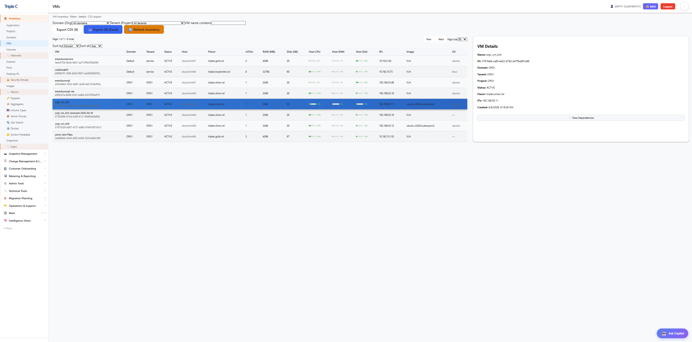
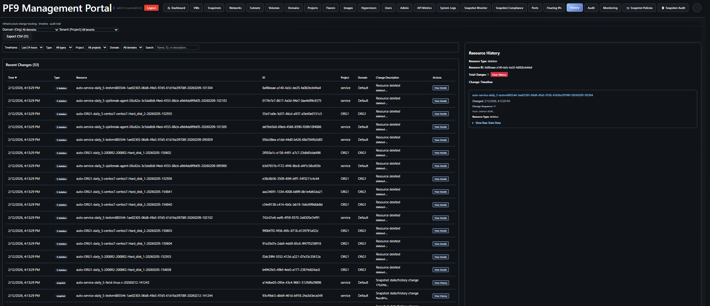
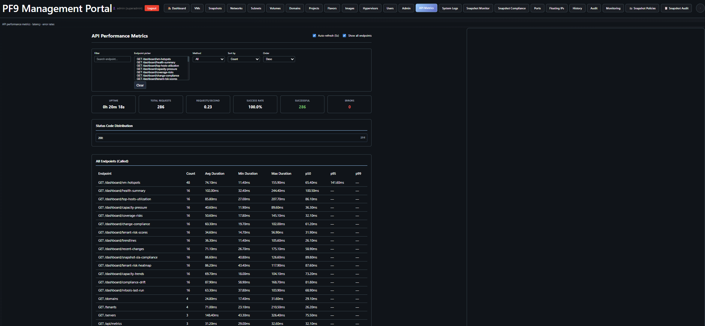
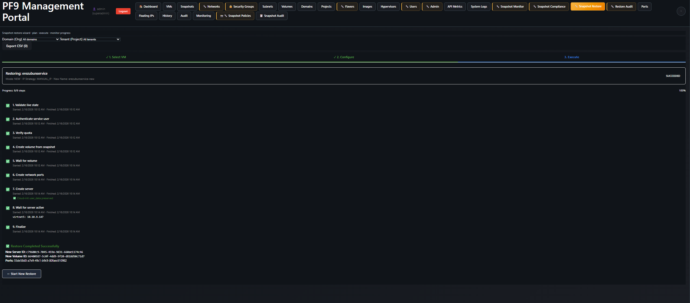

# Platform9 Management System

**Engineering Teams Add-On Platform: Enhanced Inventory, Monitoring & Daily Operations for Platform9**

> This is **not** a replacement for the official Platform9 UI. It is an engineering-focused operational layer that complements Platform9 — adding the automation, visibility, and MSP-grade workflows that engineering teams need day to day.

[](LICENSE)
[](CHANGELOG.md)
[](#-deployment-flexibility--you-decide-how-to-run-this)
[](https://www.buymeacoffee.com/erezrozenbaum)

pf9-mngt is an open-source operational add-on for Platform9 / OpenStack — it gives engineering and MSP teams automated snapshots, VM restore, full inventory persistence, and day-to-day monitoring in a single self-hosted stack.

---

## 🧭 Why This Exists — An Engineering Evaluation Story

The conversation around VMware alternatives is real and growing. For MSPs and enterprise teams evaluating their options, Platform9 on OpenStack is genuinely worth looking at. Solid technology, strong business model, and a credible path for organizations managing private and hybrid cloud at scale.

We are currently in the evaluation phase — testing Platform9 as a potential direction for our infrastructure. During that process, like any serious evaluation, you go beyond the demo and start stress-testing real operational workflows. That is where engineering gaps become visible — not because the platform is lacking, but because MSP and enterprise operations have very specific day-to-day requirements that take time for any platform to fully mature into.

Rather than pause the evaluation, we chose to solve the gaps ourselves and reach a better, more informed decision point. The result is pf9-mngt. Building it has given us far deeper insight into the platform than any standard assessment would have. Whatever direction we ultimately choose, this process has been worth it.

This entire project was built using AI as a genuine engineering partner — what some call vibe coding, but applied to a real production problem with real architectural decisions. One person, clear intent, and the right AI workflow can ship something with genuine depth. That is worth demonstrating.

---

### 🔐 Engineering Gap 1 — Metadata Ownership & Operational Resilience

OpenStack identifies everything by UUID. Resource names, relationships, network topology, and tenant context all live in the metadata layer on the management cluster. When you run Platform9 in SaaS mode, that metadata lives on their platform — not yours.

From an engineering perspective this creates a real operational resilience challenge. Without that metadata layer your resources become very difficult to identify and manage independently at scale. For MSPs managing multiple tenants and hundreds of resources, this is a genuine business continuity risk.

**The engineering answer:** pf9-mngt continuously pulls and persists all infrastructure metadata into a local PostgreSQL database that you own and control — independently of the platform. Resource names, relationships, tenant context, change history, and full inventory are always available locally, regardless of platform availability. This is exactly what RVTools does for VMware environments. We built the equivalent for Platform9 and OpenStack.

---

### ⚡ Engineering Gap 2 — VM Restore

In VMware, restoring a VM is a right-click. In OpenStack, there is no equivalent native workflow. To recover a VM from a snapshot you must manually reconstruct everything — remember the original flavor, network topology, IP configuration, re-attach the snapshot volume, and preserve user credentials. All of this under SLA pressure, without making a mistake.

For an MSP, that manual process is not sustainable at scale. It is exactly the kind of procedure that goes wrong at the worst possible moment.

**The engineering answer:** pf9-mngt automates the entire restore procedure. The restore engine handles flavor, network topology, IP addresses, user credentials, and volume attachment automatically. Two restore modes are supported:

- **Side-by-side restore** — a new VM with a new name and new IP spins up alongside the original, completely non-destructively. Validate before cutover. Nothing is touched until you are ready.
- **Replace restore** — full automated recovery with the original configuration restored. Superadmin-only for safety.

Every restore operation is fully audited — who triggered it, what was restored, what mode, duration, and outcome. For MSP accountability and compliance this is not optional.

---

### 🔄 Engineering Gap 3 — Snapshot Automation & Compliance

There is no native automated snapshot scheduler in Platform9 or OpenStack. No configurable per-volume policies. No retention management. No SLA compliance tracking. For an MSP, snapshot automation is table stakes — you cannot deliver a managed service without it.

**The engineering answer:** pf9-mngt includes a complete snapshot automation engine built from scratch. Configurable policies per volume — daily, monthly, custom retention — with automatic cleanup and full SLA compliance reporting aggregated by tenant and domain.

---

### 🐳 Deployment Flexibility — You Decide How to Run This

pf9-mngt is currently developed on Windows using Docker containers. That is the development environment — but the architecture is deliberately not prescriptive about how you run it in production.

Every service is containerized. That means **you decide**:

| Option | When to use |
|--------|-------------|
| 🐳 **Docker Compose** | Simple, fast, perfectly viable for many teams |
| ☸️ **Kubernetes** | Production-grade HA and horizontal scaling — containers are ready, effort is minimal |
| 🔧 **Your own orchestration** | Adapt to whatever infrastructure decisions you have already made |

> See [docs/KUBERNETES_MIGRATION_GUIDE.md](docs/KUBERNETES_MIGRATION_GUIDE.md) for migration planning.  
> See [docs/LINUX_DEPLOYMENT_GUIDE.md](docs/LINUX_DEPLOYMENT_GUIDE.md) for running on Linux.

---

## 📸 Screenshots

### Landing Dashboard


### Snapshot Compliance Report


### VM Inventory


### History & Monitoring


### API Performance


### Snapshot Restore Process


### Snapshot Restore Audit


---

## 🚀 System Architecture

**Enterprise microservices-based platform** with 12 containerized services plus host-based automation:

| Service | Stack | Port | Purpose |
|---------|-------|------|---------|
| **Frontend UI** | React 19.2+ / TypeScript / Vite | 5173 | 27 management tabs + admin panel |
| **Backend API** | FastAPI / Gunicorn / Python | 8000 | 140+ REST endpoints, RBAC middleware, 4 workers |
| **LDAP Server** | OpenLDAP | 389 | Enterprise authentication directory |
| **LDAP Admin** | phpLDAPadmin | 8081 | Web-based LDAP management |
| **Monitoring Service** | FastAPI / Python | 8001 | Real-time metrics via Prometheus |
| **Database** | PostgreSQL 16 | 5432 | 44+ tables, history tracking, audit, metering |
| **Database Admin** | pgAdmin4 | 8080 | Web-based PostgreSQL management |
| **Snapshot Worker** | Python | — | Automated snapshot management |
| **Notification Worker** | Python / SMTP | — | Email alerts for drift, snapshots, compliance |
| **Backup Worker** | Python / PostgreSQL | — | Scheduled database backups and restores |
| **Metering Worker** | Python / PostgreSQL | — | Resource metering every 15 minutes |
| **Search Worker** | Python / PostgreSQL | — | Incremental full-text indexing for Ops Assistant |

> Host scripts (`pf9_rvtools.py`, `host_metrics_collector.py`) run via Windows Task Scheduler for infrastructure discovery and metrics collection.

---

## 🌟 Key Features

### 🔐 Enterprise Authentication & Authorization
- **LDAP Integration**: Production-ready OpenLDAP authentication — also compatible with Active Directory
- **Role-Based Access Control**: 5-tier permission system (Viewer, Operator, Admin, Superadmin, Technical)
- **MFA Support**: TOTP-based two-factor authentication (Google Authenticator compatible) with backup recovery codes
- **JWT Token Management**: Secure 480-minute sessions with Bearer token authentication
- **RBAC Middleware**: Automatic permission enforcement on all resource endpoints
- **Audit Logging**: Complete authentication event tracking — login, logout, failed attempts, user management
- **System Audit**: 90-day retention with filtering by user, action, date range, and IP address

### 📊 RVTools-Style Unified Inventory
- **29 Resource Types**: Domains, Projects, Users, VMs, Volumes, Snapshots, Networks, Subnets, Ports, Floating IPs, Routers, Security Groups, Hypervisors, Flavors, Images, Roles, Role Assignments, Groups, Snapshot Policies, and operational event types
- **Human-Friendly Names**: UUID-to-name resolution across all resource types
- **Local Persistent Store**: All metadata stored in your own PostgreSQL — independent of platform availability
- **Excel/CSV Export**: Customer-data-safe with masking options and delta reporting
- **Multi-Tenant Support**: Full domain and project-level filtering and management
- **Comprehensive Audit System**: Change tracking, deletion history, compliance reporting, resource timeline

<details>
<summary><strong>User Management Details</strong></summary>

- **Multi-Domain User Collection**: 100+ users across 28 OpenStack domains
- **Role Assignment Tracking**: Monitors role assignments across the infrastructure
- **Activity Monitoring**: User last-seen timestamps and account status
- **Role Inference System**: Intelligent role assignment when API access is limited
- **Domain-Scoped Authentication**: Complete user enumeration across tenants

</details>

### 🔄 Automated Snapshot Management
- **Built From Scratch**: No native scheduler exists in Platform9 or OpenStack — we built one
- **Metadata-Driven Policies**: Volume-level configuration via OpenStack metadata
- **Multi-Policy Support**: daily_5, monthly_1st, monthly_15th with independent retention per volume
- **Cross-Tenant Snapshots**: Dedicated service user architecture for correct tenant context
- **SLA Compliance Reporting**: Configurable thresholds with detailed tenant/domain aggregation
- **Policy Assignment Rules**: JSON-driven automatic policy assignment based on volume properties

<details>
<summary><strong>Snapshot System Components</strong></summary>

- **Automated Creation** (`snapshots/p9_auto_snapshots.py`): Policy-driven volume snapshots with retention management, dual-session architecture (admin for listing, service user for creating)
- **Service User Management** (`snapshots/snapshot_service_user.py`): Automatic admin role assignment per tenant project, Fernet-encrypted or plaintext password support
- **Policy Assignment** (`snapshots/p9_snapshot_policy_assign.py`): Opt-out rule engine, volume property matching, bulk metadata assignment
- **Compliance Reporting** (`snapshots/p9_snapshot_compliance_report.py`): Real-time SLA analysis, tenant/domain aggregation

</details>

### ⚡ Automated VM Restore *(No native equivalent exists in OpenStack)*
- **Full Restore Automation**: Flavor, network, IPs, user credentials, volume attachment — all handled
- **Side-by-Side Restore**: New VM with new name and IP alongside the original — non-destructive
- **Replace Restore**: Full recovery with original configuration — Superadmin-only with typed confirmation
- **IP Strategies**: NEW_IPS (DHCP), TRY_SAME_IPS (best-effort), SAME_IPS_OR_FAIL (strict)
- **3-Screen UI Wizard**: Guided restore flow with real-time progress tracking
- **Dry-Run Mode**: Validate the full restore plan before executing against OpenStack
- **Safety First**: Disabled by default, concurrent restore prevention, quota double-check, rollback on failure
- **Full Restore Audit**: Every operation logged — who, what mode, duration, outcome

### 👁️ Real-Time Monitoring
- **Host Metrics**: Live CPU, memory, storage from PF9 compute nodes via Prometheus node_exporter (port 9388)
- **VM Metrics**: Individual VM resource tracking via libvirt_exporter (port 9177)
- **Automated Collection**: Background collection every 30 minutes
- **Persistent Cache**: Metrics survive service restarts
- **Integrated Dashboard**: Real-time monitoring tab with auto-refresh

### 🔔 Smart Notifications
- **Event-Driven Alerts**: Snapshot failures, compliance violations, drift events, health score drops
- **Per-User Preferences**: Subscribe to specific event types with severity filtering (info/warning/critical)
- **Daily Digest**: Configurable daily summary aggregating all events from past 24 hours
- **SMTP Flexibility**: Authenticated and unauthenticated relay support, optional TLS
- **HTML Templates**: Professional Jinja2 email templates for each event type
- **Notification History**: Full delivery log with status tracking and retry information

### 💰 Metering & Chargeback
- **Per-VM Resource Tracking**: vCPU, RAM, disk allocation + actual usage, network I/O
- **Snapshot & Restore Metering**: Count, size, compliance, operation tracking
- **API Usage Metering**: Endpoint-level call counts, error rates, latency percentiles (avg/p95/p99)
- **Efficiency Scoring**: Per-VM classification (excellent/good/fair/poor/idle)
- **Multi-Category Pricing**: Compute, storage, snapshot, restore, volume, network — hourly + monthly rates
- **Chargeback Export**: Per-tenant cost breakdown with one-click CSV export
- **8 Sub-Tab UI**: Overview, Resources, Snapshots, Restores, API Usage, Efficiency, Pricing, Export

### 🏢 Customer Provisioning & Domain Management *(v1.16)*
- **5-Step Provisioning Wizard**: Domain → Project → User/Role → Quotas → Network/Security Group
- **Dynamic Keystone Roles**: Fetches roles from PF9 Keystone, filters internal system roles
- **Tabbed Quota Editor**: Compute, Block Storage, Network tabs with "Set Unlimited" toggles
- **Network Auto-Discovery**: Physical networks from Neutron with VLAN/flat/VXLAN support
- **Customer Welcome Email**: HTML template with opt-in toggle and editable recipients
- **Domain Management**: Full lifecycle — enable/disable, typed confirmation delete, resource inspection
- **Resource Deletion**: 8 DELETE endpoints for individual resources across all types
- **Central Activity Log**: Full audit trail for all provisioning and domain operations

### 📋 Reports & Resource Management *(v1.17)*
- **16 Report Types**: VM Report, Tenant Quota Usage, Domain Overview, Snapshot Compliance, Flavor Usage, Metering Summary, Resource Inventory, User/Role Audit, Idle Resources, Security Group Audit, Capacity Planning, Backup Status, Activity Log, Network Topology, Cost Allocation, Drift Summary
- **CSV Export**: All reports support one-click CSV download
- **Resource Provisioning Tool**: Full CRUD for Users, Flavors, Networks, Routers, Floating IPs, Volumes, Security Groups across tenants
- **Quota Management**: View and live-edit compute, network, and storage quotas per tenant
- **Safety Protections**: Last-user guard, in-use flavor check, attached-volume block, default SG protection
- **Three-Tier RBAC**: Viewer (read), Operator (read+write), Admin (read+write+delete)

### 🔍 Ops Assistant — Search & Similarity *(v1.20)*
- **Full-Text Search**: PostgreSQL tsvector + websearch across all 29 resource types, events, and audit logs
- **Trigram Similarity**: "Show Similar" per result — finds related resources, errors, or configurations via pg_trgm
- **Intent Detection**: Natural-language queries like *"quota for projectX"* or *"capacity"* auto-suggest the matching report endpoint
- **Smart Query Templates (v3)**: 26 question templates turn the search bar into an Ops Assistant — ask *"how many VMs are powered off?"*, *"quota for Org1"*, or *"show platform overview"* and get live answer cards inline
- **29 Indexed Document Types**: VMs, volumes, snapshots, hypervisors, networks, subnets, floating IPs, ports, security groups, domains, projects, users, flavors, images, routers, roles, role assignments, groups, snapshot policies, activity log, auth audit, drift events, snapshot runs/records, restore jobs, backups, notifications, provisioning, deletions
- **Incremental Indexing**: Background worker with per-doc-type watermarks — only re-indexes changed rows
- **Paginated Results**: Relevance-ranked results with highlighted keyword snippets
- **Indexer Dashboard**: Real-time stats on document counts, last run time, and per-type health

### 📈 27-Tab Management Dashboard
A single engineering console covering every operational surface:

> Servers · Volumes · Snapshots · Networks · Security Groups · Subnets · Ports · Floating IPs · Domains · Projects · Flavors · Images · Hypervisors · Users · Roles · Snapshot Policies · History · Audit · Monitoring · Restore · Restore Audit · Notifications · Metering · Customer Provisioning · Domain Management · Activity Log · Reports · Resource Management · **Ops Search**

<details>
<summary><strong>Landing Dashboard Widgets</strong></summary>

- **Health Summary Card**: System-wide metrics (VMs, volumes, networks, resource utilization)
- **Snapshot SLA Compliance**: Tenant-level compliance tracking with warning/critical alerting
- **Top Host Utilization**: Real-time CPU/memory usage across compute nodes
- **Recent Activity Widget**: Last 24 hours of infrastructure changes
- **Coverage Risk Analysis**: Volumes without snapshot protection
- **Capacity Pressure Indicators**: Storage and compute capacity warnings
- **VM Hotspots**: Top resource consumers (CPU/memory/storage)
- **Tenant Risk Scores**: Multi-factor risk assessments per tenant
- **Compliance Drift Tracking**: Policy adherence trending
- **Capacity Trends**: 7-day resource utilization forecasting
- **Trendlines**: Infrastructure growth patterns and velocity metrics

</details>

<details>
<summary><strong>History Tab Features</strong></summary>

- Filter by resource type (server, volume, snapshot, deletion, etc.), project, domain, and free-text search
- Sortable column headers with ascending/descending indicators
- Deletion record viewing — shows deletion timeline, original resource type, reason, and last-known state
- Most frequently changed resources section with direct history navigation
- Configurable timeframe (1 hour to 1 week)

</details>

- **Dark/Light Mode**: Full theme support with persistent preferences
- **Role-Based UI**: Tabs and actions shown based on user permission level
- **Write-Capable Indicators**: 🔧 icon marks tabs that can create, modify, or delete resources
- **Auto-Refresh**: 30-second refresh on dashboard, efficient pagination across all endpoints

### API Observability
- **Public Metrics**: `GET /metrics`
- **Authenticated Metrics (UI)**: `GET /api/metrics` — Admin/Superadmin only
- **Authenticated Logs (UI)**: `GET /api/logs` — with `limit`, `level`, `source`, `log_file` params
- **Swagger Docs**: `GET /docs` — interactive API documentation

---

## 🚀 Quick Start

### Prerequisites
- **Docker & Docker Compose** (for complete platform)
- **Python 3.11+** with packages: `requests`, `openpyxl`, `psycopg2-binary`, `aiohttp`, `aiofiles`
- **Valid Platform9 credentials** (service account recommended)
- **Network access** to Platform9 cluster and compute nodes

### 1. Complete Automated Setup (Recommended)
```powershell
# Clone repository
git clone https://github.com/erezrozenbaum/pf9-mngt.git
cd pf9-mngt

# Configure environment (CRITICAL: No quotes around values)
cp .env.template .env
# Edit .env with your Platform9 credentials

# One-command complete deployment
.\deployment.ps1

# What deployment.ps1 does:
# ✓ Checks/installs Docker Desktop
# ✓ Creates and validates .env configuration
# ✓ Creates required directories (logs, secrets, cache)
# ✓ Installs Python dependencies
# ✓ Builds and starts all Docker containers
# ✓ Initializes PostgreSQL database schema
# ✓ Configures LDAP directory structure
# ✓ Creates automated scheduled tasks
# ✓ Runs comprehensive health checks

# Alternative quick startup (assumes Docker installed)
.\startup.ps1

# Access services after deployment:
# UI:            http://localhost:5173
# API:           http://localhost:8000
# API Docs:      http://localhost:8000/docs
# Monitoring:    http://localhost:8001
# Database:      http://localhost:8080
```

### 2. Environment Configuration
```bash
# Platform9 Authentication
PF9_USERNAME=your-service-account@company.com
PF9_PASSWORD=your-secure-password
PF9_AUTH_URL=https://your-cluster.platform9.com/keystone/v3
PF9_USER_DOMAIN=Default
PF9_PROJECT_NAME=service
PF9_PROJECT_DOMAIN=Default
PF9_REGION_NAME=region-one

# Database
POSTGRES_USER=pf9
POSTGRES_PASSWORD=generate-secure-password-here
POSTGRES_DB=pf9_mgmt

# Monitoring
PF9_HOSTS=<HOST_IP_1>,<HOST_IP_2>,<HOST_IP_3>
METRICS_CACHE_TTL=60
```

### 3. Manual Docker Setup
```bash
docker-compose up -d
docker-compose ps
docker-compose logs pf9_api
```

### 4. Standalone Script Usage (No Docker Required)
```bash
# Inventory export
python pf9_rvtools.py

# Snapshot automation
python snapshots/p9_auto_snapshots.py --policy daily_5 --dry-run
python snapshots/p9_auto_snapshots.py --policy daily_5

# Compliance reporting
python snapshots/p9_snapshot_compliance_report.py --input latest_export.xlsx --output compliance.xlsx

# Policy assignment
python snapshots/p9_snapshot_policy_assign.py --config snapshots/snapshot_policy_rules.json --dry-run
```

---

## 🔧 Configuration

### Snapshot Policies
```bash
# Daily snapshots with 5-day retention
openstack volume set --property auto_snapshot=true \
                    --property snapshot_policies=daily_5 \
                    --property retention_daily_5=5 \
                    <volume-id>

# Multiple policies on one volume
openstack volume set --property auto_snapshot=true \
                    --property snapshot_policies=daily_5,monthly_1st \
                    --property retention_daily_5=5 \
                    --property retention_monthly_1st=12 \
                    <volume-id>
```

### Windows Task Scheduler
```powershell
# Metrics collection (auto-created by startup.ps1)
# Every 30 minutes — "PF9 Metrics Collection"

# Inventory collection (create manually)
schtasks /create /tn "PF9 RVTools Collection" /tr "python C:\pf9-mngt\pf9_rvtools.py" /sc daily /st 02:00
```

---

## 🛠️ Administration

### Database
```bash
# Connect
psql -h localhost -U pf9 -d pf9_mgmt

# Manual backup
docker exec pf9_db pg_dump -U pf9 pf9_mgmt > backup.sql

# Restore
docker exec -i pf9_db psql -U pf9 pf9_mgmt < backup.sql
```

> For scheduled backups, use the 💾 Backup tab in the UI — the backup_worker runs pg_dump on a configurable schedule and writes compressed `.sql.gz` files.

### Service Management
```bash
docker-compose restart pf9_api
docker-compose up -d --scale pf9_api=2
docker stats
```

---

## 📁 Project Structure

```
pf9-mngt/
├── api/                          # FastAPI backend (140+ endpoints)
├── pf9-ui/                       # React 19 + TypeScript frontend
├── monitoring/                   # Prometheus metrics service
├── snapshots/                    # Snapshot automation engine
│   ├── p9_auto_snapshots.py      # Cross-tenant snapshot automation
│   ├── snapshot_service_user.py  # Service user management
│   ├── p9_snapshot_compliance_report.py
│   ├── p9_snapshot_policy_assign.py
│   └── snapshot_policy_rules.json
├── db/                           # PostgreSQL schema + migrations
├── backup_worker/                # Scheduled backup service
├── metering_worker/              # Resource metering service
├── search_worker/                # Full-text search indexer (Ops Assistant)
├── notifications/                # Email notification service
├── ldap/                         # OpenLDAP configuration
├── docs/                         # Full documentation suite
├── pf9_rvtools.py                # RVTools-style inventory export
├── host_metrics_collector.py     # Prometheus metrics collection
├── p9_common.py                  # Shared utilities
├── docker-compose.yml            # Full stack orchestration
├── deployment.ps1                # One-command deployment
├── startup.ps1                   # Quick start script
└── .env.template                 # Environment configuration template
```

---

## 📚 Documentation

| Document | Purpose |
|----------|---------|
| [Deployment Guide](docs/DEPLOYMENT_GUIDE.md) | Step-by-step deployment instructions |
| [Admin Guide](docs/ADMIN_GUIDE.md) | Day-to-day administration reference |
| [Architecture](docs/ARCHITECTURE.md) | System design, trust boundaries, data model, auth flow |
| [API Reference](docs/API_REFERENCE.md) | Complete API endpoint documentation |
| [Security Guide](docs/SECURITY.md) | Security model, authentication, encryption |
| [Security Checklist](docs/SECURITY_CHECKLIST.md) | Pre-production security audit checklist |
| [Restore Guide](docs/RESTORE_GUIDE.md) | Snapshot restore feature documentation |
| [Snapshot Automation](docs/SNAPSHOT_AUTOMATION.md) | Snapshot system design and configuration |
| [Snapshot Service User](docs/SNAPSHOT_SERVICE_USER.md) | Service user setup and troubleshooting |
| [Quick Reference](docs/QUICK_REFERENCE.md) | Common commands and URLs cheat sheet |
| [Kubernetes Migration](docs/KUBERNETES_MIGRATION_GUIDE.md) | K8s migration planning guide |
| [Linux Deployment](docs/LINUX_DEPLOYMENT_GUIDE.md) | Running pf9-mngt on Linux instead of Windows |
| [Contributing](CONTRIBUTING.md) | Contribution guidelines |

---

## 🆘 Troubleshooting

**"Failed to fetch" in UI**
- Check API: `docker-compose logs pf9_api`
- Verify credentials in `.env`
- Test: `curl http://localhost:8000/health`

**Empty monitoring data**
- Run: `python host_metrics_collector.py --once`
- Check task: `schtasks /query /tn "PF9 Metrics Collection"`
- Verify node_exporter on PF9 hosts (port 9388)

**Database connection errors**
- Check: `docker-compose logs db`
- Reset: `docker-compose down -v && docker-compose up -d`

**Authentication errors**
- Verify `.env` credentials and Platform9 URL
- Test: `curl -k https://your-cluster.com/keystone/v3`

**Monitoring not working after manual startup**
- Run: `.\fix_monitoring.ps1`

**Data synchronization issues**
- Force sync: `python pf9_rvtools.py`
- Check database via pgAdmin or CLI

---

## 🚨 Important Notes

**Environment file format — CRITICAL:**
```bash
# ✅ CORRECT
PF9_USERNAME=user@company.com

# ❌ WRONG
PF9_USERNAME="user@company.com"
```

**Security checklist for first-time setup:**
1. **NEVER commit `.env`** to version control
2. **Rotate credentials** if accidentally exposed
3. **Use service accounts**, not personal credentials
4. **Test with `--dry-run`** before production use

---

## ❓ FAQ

<details>
<summary><strong>General</strong></summary>

**Q: Does this replace the Platform9 UI?**
A: No. It is a complementary engineering console that adds operational capabilities not present in the native Platform9 UI — automated snapshot scheduling, SLA compliance, restore workflows, chargeback, and more.

**Q: Is this an official Platform9 product?**
A: No. This is an independent project built to work with Platform9 OpenStack APIs. It is not endorsed by or affiliated with Platform9 Systems, Inc.

**Q: Can I run this on Kubernetes?**
A: Yes. Every service is containerized. See [docs/KUBERNETES_MIGRATION_GUIDE.md](docs/KUBERNETES_MIGRATION_GUIDE.md).

**Q: What are the minimum hardware requirements?**
A: A Docker host with at least 4 GB RAM, 2 CPU cores, and network access to your Platform9 region endpoints.

</details>

<details>
<summary><strong>Authentication & RBAC</strong></summary>

**Q: How does authentication work?**
A: Users authenticate against an LDAP directory (bundled OpenLDAP or your corporate LDAP/AD). JWT tokens are issued on login and validated on every API call. Optional TOTP-based MFA is supported.

**Q: What can each role do?**
A: `viewer` — read-only. `operator` — read + limited write. `admin` — full admin except user management. `superadmin` — full access including destructive operations. `technical` — read + write, no delete.

**Q: Can I use Active Directory instead of OpenLDAP?**
A: Yes. Set `LDAP_URL`, `LDAP_BASE_DN`, `LDAP_BIND_DN`, and `LDAP_BIND_PASSWORD` to point at your AD server.

**Q: How do I create the first admin user?**
A: The deployment script seeds a default admin via `admin_user.ldif`. After first login, use the Users tab to promote additional LDAP users. See [docs/ADMIN_GUIDE.md](docs/ADMIN_GUIDE.md).

</details>

<details>
<summary><strong>Snapshots & Restore</strong></summary>

**Q: How does automated snapshot scheduling work?**
A: The snapshot scheduler evaluates policy rules, matches volumes by tenant/naming pattern/metadata, and creates snapshots via the Cinder API using a dedicated service user.

**Q: What is the Snapshot Service User?**
A: A dedicated Platform9 user automatically granted admin roles in each tenant project for cross-tenant snapshot creation. See [docs/SNAPSHOT_SERVICE_USER.md](docs/SNAPSHOT_SERVICE_USER.md).

**Q: Is restore destructive?**
A: No. Side-by-side restore creates a new VM and a new volume. The original is untouched. Replace mode (superadmin-only) does delete the original and requires typed confirmation.

**Q: What is dry-run mode?**
A: When `RESTORE_DRY_RUN=true` (the default), the restore planner validates the full plan but does not execute it. Set to `false` to enable actual execution.

**Q: Can I cancel a restore in progress?**
A: Yes. Use the Cancel button or call `POST /api/restore/{job_id}/cancel`. The executor stops at the next step boundary and cleans up partial resources.

</details>

<details>
<summary><strong>Monitoring & UI</strong></summary>

**Q: What does the Monitoring tab show?**
A: Real-time host-level metrics (CPU, memory, disk) collected from Platform9 hypervisors via Prometheus node_exporter.

**Q: What do the 🔧 tab icons mean?**
A: Write-capable tabs — they can create, modify, or delete resources. Read-only tabs use default styling.

**Q: Does the UI support dark mode?**
A: Yes. Click the theme toggle (top-right moon/sun icon). Your preference is saved in local storage.

**Q: Where are the logs?**
A: Application logs are in `logs/` and available via the System Logs tab (admin-only). Container logs via `docker logs <container>`.

**Q: How do I access the API documentation?**
A: Swagger docs at `http://<host>:8000/docs`, ReDoc at `http://<host>:8000/redoc`.

</details>

---

## 🎯 Recent Updates

### v1.17.1 — Reports & Resource Management Enhancements
- ✅ **16 Report Types** — Added VM Report with full VM details (flavor, host, IPs, volumes, power state)
- ✅ **Enhanced Domain Overview** — Full quota aggregation with utilization percentages
- ✅ **Flavor Name Resolution** — Flavor Usage report shows actual names, vCPUs, RAM, disk
- ✅ **Resource Notifications** — All resource CRUD operations fire notification events
- ✅ **Audit Log Tab** — Resource Management now includes filterable activity log (24h–90d)

### v1.17.0 — Reports & Resource Management
- ✅ **15 Report Types** — Tenant Quota, Domain Overview, Snapshot Compliance, Flavor Usage, Metering Summary, and more
- ✅ **Resource Provisioning Tool** — Full CRUD for Users, Flavors, Networks, Routers, Floating IPs, Volumes, Security Groups
- ✅ **Quota Management** — Live-edit compute/network/storage quotas per tenant
- ✅ **Safety Checks** — Last-user protection, in-use flavor protection, attached-volume guard

### v1.16.0 — Customer Provisioning & Domain Management
- ✅ **5-Step Provisioning Wizard** — Full OpenStack API integration
- ✅ **Domain Management Tab** — Enable/disable/delete with resource inspection panel
- ✅ **8 Resource Deletion Endpoints** — Servers, volumes, networks, routers, floating IPs, security groups, users, subnets
- ✅ **Full Dark Mode** — 25+ CSS variables, ~110 hardcoded colors replaced

> See [CHANGELOG.md](CHANGELOG.md) for full version history.

---

## 🤝 Contributing

Contributions are welcome — code, documentation, bug reports, feature suggestions, or feedback.

See [CONTRIBUTING.md](CONTRIBUTING.md) for guidelines on:
- How to report bugs
- How to suggest features
- How to submit pull requests
- Development setup and coding standards

---

## 💝 Support the Project

If pf9-mngt saves your team time, consider:

- ⭐ **Star the repository** — helps others discover the project
- 🐛 **Report bugs** — open an issue
- 💻 **Contribute code** — PRs are welcome
- 💬 **Share feedback** — what would you add?

### ☕ Buy Me a Coffee

If this project saves you time or makes your Platform9 operations easier, you can support its continued development:

<a href="https://buymeacoffee.com/erezrozenbaum" target="_blank"></a>

---

## 👤 About the Creator

**Erez Rozenbaum** — Cloud Engineering Manager & Original Developer

Built as part of a serious Platform9 evaluation to solve real operational gaps for MSP and enterprise teams. 120+ commits, 21 releases, 12 containerized services, 145+ API endpoints — built alongside regular responsibilities.

---

## 📄 License

MIT License — see [LICENSE](LICENSE) for details.

**Copyright © 2026 Erez Rozenbaum and Contributors**

---

**Project Status**: Active Development | **Version**: 1.20.0 | **Last Updated**: February 2026
