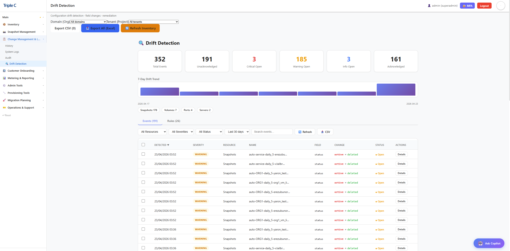
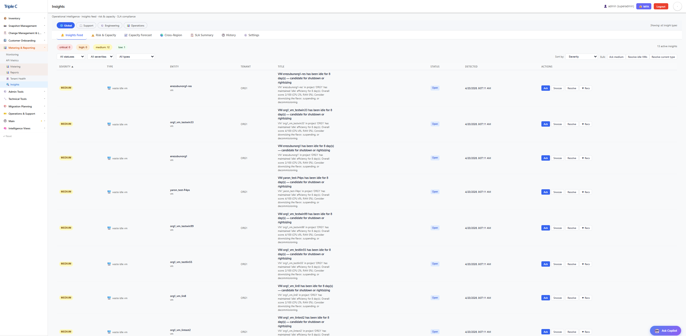
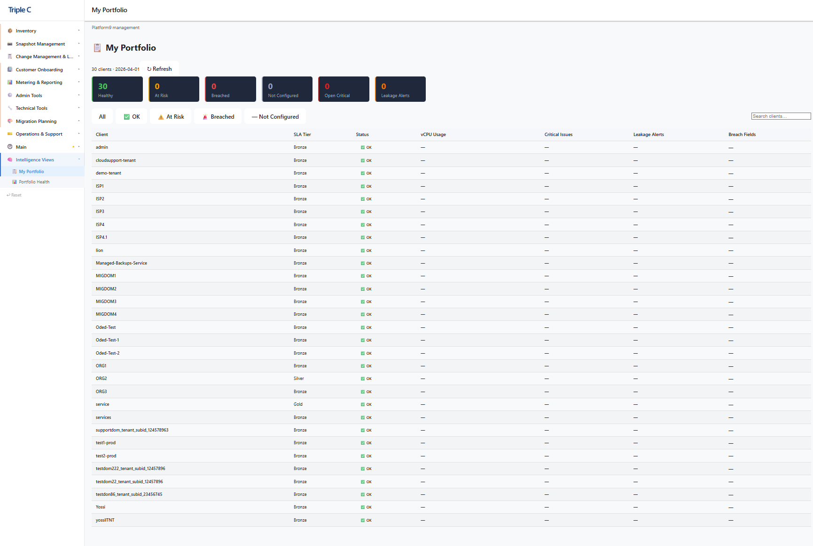
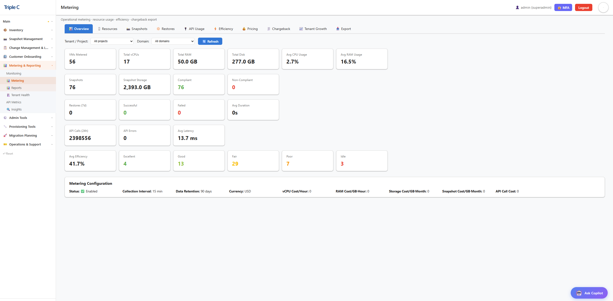
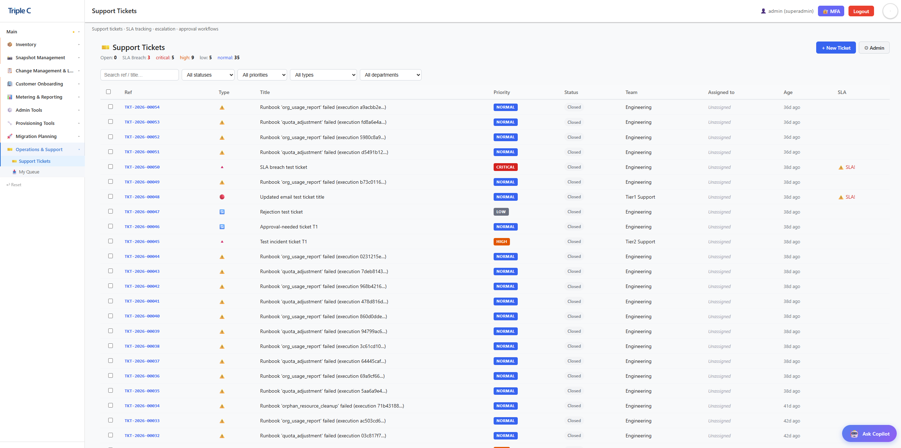
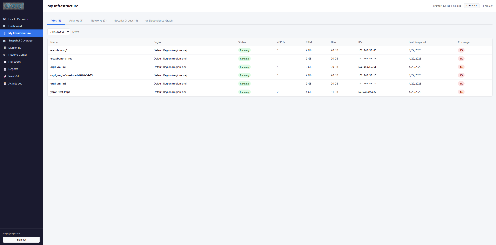
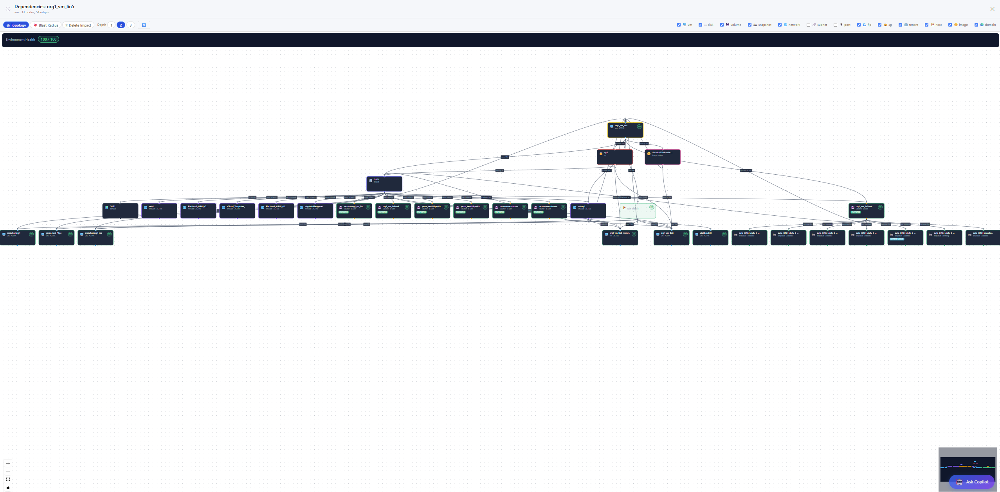

# pf9-mngt

> Provisioning infrastructure is solved.  
> Operating it at scale is not.

**pf9-mngt** is a self-hosted operational control plane for Platform9 / OpenStack. It adds the persistent inventory, automated recovery workflows, and governance layer that Platform9 itself does not provide — built for the teams responsible for what happens *after* Day-0.

<p align="center">
  <strong>Operational Control Plane for Platform9 / OpenStack</strong><br>
  Visibility &nbsp;·&nbsp; Recovery &nbsp;·&nbsp; Operations &nbsp;·&nbsp; Intelligence
</p>

<p align="center">

[](LICENSE)
[](CHANGELOG.md)
[](https://github.com/erezrozenbaum/pf9-mngt/actions/workflows/ci.yml)
[](docs/KUBERNETES_GUIDE.md)
[](#-try-it-now--demo-mode-no-platform9-required)
[](https://www.buymeacoffee.com/erezrozenbaum)

</p>

> ⭐ If pf9-mngt saves your team time, [**star the repo**](https://github.com/erezrozenbaum/pf9-mngt) — it helps others find it.

---

## 🔄 What This Actually Replaces

| Without pf9-mngt | With pf9-mngt |
|-----------------|--------------|
| Scripts that dump inventory to CSV, manually maintained | Persistent PostgreSQL inventory, 29 resource types, always current |
| VM restore = manual reconstruction at 3am under SLA pressure | Fully automated restore — flavor, network, IPs, volumes, credentials |
| No snapshot scheduler → custom cron per tenant, no SLA tracking | Policy-driven snapshot automation, cross-tenant, quota-aware, SLA-compliant |
| Migration planning in spreadsheets → guesswork | End-to-end planner: RVTools → risk scoring → wave planning → PCD provisioning |
| Separate ticketing tool + separate runbook wiki + separate billing exports | Built-in: tickets, 25 runbooks, metering, chargeback — one system |
| Tenants call you for every status check → your team is the bottleneck | Tenant self-service portal: customers view their own VMs, snapshots, and restores — scoped, isolated, MFA-protected |

One system. No duct tape.

---

## 🧭 What It Gives You

pf9-mngt adds a persistent operational layer on top of Platform9 / OpenStack, combining inventory, automation, recovery workflows, and governance into a single self-hosted system:

- **Full infrastructure visibility** — all metadata in your own PostgreSQL, independent of platform uptime, 29 resource types, cross-tenant
- **Automated snapshot & restore workflows** — no native equivalent exists in Platform9 or OpenStack; fully automated, SLA-tracked, audited
- **VMware → OpenStack migration planning** — end-to-end from RVTools ingestion to PCD auto-provisioning
- **Governance, audit, and Day-2 tooling** — runbooks, tickets, metering, chargeback, tenant self-service
- **MSP business value reporting** — SLA compliance tracking per tier (Gold/Silver/Bronze), QBR PDF generation per customer, Account Manager Portfolio dashboard (per-tenant SLA status, vCPU usage, leakage alerts), Executive Health dashboard (fleet SLA gauge, MTTR, revenue leakage)

Works alongside Platform9 via its APIs. Not a replacement — an operational layer on top.

---

## 🚨 The Day-2 Operations Reality

Provisioning is not the hard part anymore.

Running infrastructure at scale is.

What actually breaks in real Platform9 / OpenStack environments:

- **Snapshot SLAs** across tenants — no native scheduler exists
- **VM restore under pressure** — no native workflow; everything is manual reconstruction
- **Metadata ownership** — resource names, relationships, and topology live on the platform, not with you
- **Cross-tenant visibility** at scale — the native UI is per-tenant, not operational-aggregate
- **Multi-region complexity** — managing multiple clusters with no unified console
- **Coordination gaps** — between support, engineering, and management teams
- **Customer self-service** — tenants need to see their own infrastructure status without you being a human API; the native Platform9 UI is admin-only

These are **Day-2 operations problems**. pf9-mngt solves them.

---

## 💡 What pf9-mngt Is

A self-hosted operational platform that **extends** Platform9 / OpenStack — not replaces it.

- A **persistent inventory engine** — all Platform9 / OpenStack metadata in your own PostgreSQL, always available, independent of platform uptime (the RVTools equivalent for OpenStack)
- A **snapshot automation engine** — no native scheduler exists in Platform9 or OpenStack; this one is quota-aware, cross-tenant, policy-driven, with SLA compliance reporting
- A **VM restore system** — full automation of flavor, network, IPs, credentials, and volumes; two modes (side-by-side and replace); no native equivalent exists in OpenStack
- A **migration planning workbench** — from RVTools ingestion through cohort design, wave planning, and PCD auto-provisioning
- A **unified engineering console** — 30+ management tabs, RBAC, metering, chargeback, runbooks, tickets, and AI Ops Copilot
- A **tenant self-service portal** — a completely isolated, MFA-protected web interface that gives customers read + restore access to their own infrastructure without touching your admin panel; access is opt-in per Keystone user, controlled by you

✔ Works alongside Platform9 via its APIs &nbsp;·&nbsp; ❌ Not a UI replacement &nbsp;·&nbsp; ❌ Not an official Platform9 product

---

## 🔑 Four Pillars

Everything in pf9-mngt is built around four operational concerns:

| Pillar | What it covers |
|--------|---------------|
| 🔭 **Visibility** | Cross-tenant, multi-region inventory with drift detection, dependency graph, and historical tracking — metadata owned by you, not the platform |
| ♻️ **Recovery** | Snapshot automation and full VM restore orchestration — two modes, dry-run validation, SLA compliance, no native equivalent in OpenStack |
| 🎫 **Operations** | Ticketing, 25 built-in runbooks, metering, chargeback, standardized governance workflows, and tenant self-service portal |
| 🤖 **Intelligence** | AI Ops Copilot (plain-language queries against live infrastructure), Operational Intelligence Feed (capacity, waste, risk and anomaly engines), SLA compliance tracking and breach detection, QBR PDF generator, Account Manager Portfolio and Executive Health dashboards, revenue leakage detection, VMware migration planning end-to-end |

> Everything else in the system — LDAP, multi-region, Kubernetes, export reports — supports one of these four pillars.

---

## 🧠 Why This Matters

| Challenge | Native Platform9 | pf9-mngt |
|-----------|-----------------|----------|
| Cross-tenant visibility | Per-tenant only | Centralized persistent inventory |
| Snapshot SLA enforcement | None built-in | Policy-driven, multi-tenant, audited |
| VM restore workflow | Manual reconstruct | Full automation, two modes, dry-run |
| Metadata ownership | Lives on the platform | Your PostgreSQL, always available |
| Multi-region ops | Operationally complex | Unified console, one-click context switch |
| Day-2 workflows | External tools | Built-in tickets, runbooks, metering |
| VMware migration | No native tooling | End-to-end planner: RVTools → PCD |
| Tenant visibility | You are the human API | Self-service portal: MFA-protected, RLS-isolated, scoped to their projects |

---

## 🔥 What Makes It Different

Most platforms solve provisioning.

pf9-mngt solves **what happens after deployment** — the snapshot SLAs that must hold, the 3am restore that must succeed, the compliance report due tomorrow, the capacity forecast before the cluster fills up, the VMware migration that has to go right.

Built from real-world operations. 670+ commits, 270+ releases, 18 containerized services.

Not theory — from what actually breaks in production.

---

## 🤔 Why Not Just Use Platform9, Scripts, or Grafana?

Because pf9-mngt combines in one system what would otherwise take 5+ separate tools:

| Problem | Typical approach | pf9-mngt |
|---------|-----------------|----------|
| Infrastructure inventory | Scripts → CSV dumps | Persistent PostgreSQL, 29 resource types, always yours |
| Snapshot scheduling | No native scheduler | Policy-driven, cross-tenant, quota-aware, SLA-compliant |
| VM restore | Manual reconstruction under pressure | Fully automated, two modes, dry-run, audited |
| VMware migration planning | Spreadsheets + guesswork | End-to-end: RVTools → risk scoring → wave planning → PCD provisioning |
| Operations governance | Separate ticketing + runbook tool | Built-in: 25 runbooks, full ticket lifecycle, approval gates, metering |
| MSP reporting | Manual QBRs + spreadsheet SLA tracking | QBR PDF generator, SLA tier compliance, Account Manager Portfolio dashboard |

A custom script solves one problem once. pf9-mngt enforces operational discipline at scale.

> Full technical feature reference: [docs/FEATURES_REFERENCE.md](docs/FEATURES_REFERENCE.md)

---

## ⚡ Try It Now — Demo Mode (No Platform9 Required)

Explore the full dashboard without a Platform9 environment:

```powershell
git clone https://github.com/erezrozenbaum/pf9-mngt.git
cd pf9-mngt
.\deployment.ps1   # select option 2 — Demo
```

Populates the database with 3 tenants, 35 VMs, 50+ volumes, snapshots, drift events, compliance reports, and a metrics cache. Every dashboard, report, and workflow is fully functional — no live cluster needed.

> **UI:** http://localhost:5173 &nbsp;·&nbsp; **API Docs:** http://localhost:8000/docs

---


## ⚡ What You Get in 30 Seconds

After running Demo Mode you'll find:

- **3 tenants** preloaded with realistic VM topology and metadata
- **35 VMs** with volumes, snapshot policies, and compliance reports
- **Migration plan example** — risk-scored VMs, cohort design, wave planning
- **Ticketing + runbook system** — full lifecycle, SLA tracking, 25 built-in procedures
- **Dashboard KPIs, drift events, and audit trail** — every workflow wired up

> No Platform9 cluster required. Full product experience in under 5 minutes.

---

## 🏗️ Architecture

**18-container microservices platform:**

| Service | Stack | Port | Purpose |
|---------|-------|------|---------|
| **nginx (TLS proxy)** | nginx:1.27-alpine | 80/443 | HTTPS termination, HTTP→HTTPS redirect, reverse proxy to API and UI |
| **Frontend UI** | React 19.2+ / TypeScript / Vite | 5173 | 30+ management tabs + admin panel |
| **Backend API** | FastAPI / Gunicorn / Python | 8000 | 170+ REST endpoints, RBAC middleware, 4 workers + --max-requests 1000 |
| **Redis** | redis:7-alpine | internal | OpenStack inventory/quota cache (60–300 s TTL, allkeys-lru, 128 MiB cap) |
| **LDAP Server** | OpenLDAP | internal | Enterprise authentication directory (not exposed to host) |
| **LDAP Admin** | phpLDAPadmin | 8081 *(dev profile)* | Web-based LDAP management (`--profile dev`) |
| **Monitoring Service** | FastAPI / Python | 8001 | Real-time metrics via Prometheus |
| **Database** | PostgreSQL 16 | internal | 160+ tables, audit, metering, migration planner, tenant portal RLS (not exposed to host) |
| **Database Admin** | pgAdmin4 | 8080 *(dev profile)* | Web-based PostgreSQL management (`--profile dev`) |
| **Snapshot Worker** | Python | — | Automated snapshot management |
| **Notification Worker** | Python / SMTP | — | Email alerts for drift, snapshots, compliance |
| **Backup Worker** | Python / PostgreSQL | — | Scheduled DB + LDAP backups to NFS, restore *(backup profile)* |
| **Scheduler Worker** | Python | — | Host metrics collection + RVTools inventory (runs inside Docker) |
| **Metering Worker** | Python / PostgreSQL | — | Resource metering every 15 minutes |
| **Search Worker** | Python / PostgreSQL | — | Incremental full-text indexing for Ops Assistant |
| **LDAP Sync Worker** | Python / PostgreSQL / OpenLDAP | — | Bi-directional DB ↔ LDAP sync, polls every 30 s |
| **Tenant Portal API** | FastAPI / Gunicorn / Python | 8010 | Tenant self-service portal — JWT + RLS, MFA, per-user access allowlist |
| **Tenant Portal UI** | React 19.2+ / TypeScript / nginx | 8083 *(dev: 8082)* | Tenant self-service web interface — 10 screens, MFA login, per-customer branding, VM provisioning, SG rule editing, dependency graph |


> `pf9_scheduler_worker` (Docker container) runs `host_metrics_collector.py` (every 60 s) and `pf9_rvtools.py` (configurable interval or daily schedule) for infrastructure discovery and metrics collection. No Windows Task Scheduler dependency.

---

## 📊 Feature Status

| Feature | Status |
|---------|--------|
| Inventory Engine (RVTools-style, 29 resource types) | ✅ Production |
| Snapshot Automation | ✅ Production |
| VM Restore (side-by-side + replace modes) | ✅ Production |
| Reports (20 types + CSV export) | ✅ Production |
| Customer Provisioning & Domain Management | ✅ Production |
| Metering & Chargeback | ✅ Production |
| Notifications (SMTP + Slack + Teams) | ✅ Production |
| Drift Detection | ✅ Production |
| Ops Assistant — Full-Text Search & Smart Queries | ✅ Production |
| Runbooks (25 built-in, dept visibility, approval workflows, **tenant execution**) | ✅ Production |
| External Integrations Framework (billing gate, CRM, webhooks) | ✅ Production |
| Dependency Graph: Health Scores, Blast Radius, Delete Impact | ✅ Production |
| Backup & Restore (DB) with Integrity Validation | ✅ Production |
| Inventory Versioning & Diff | ✅ Production |
| AI Ops Copilot | ✅ Production |
| Migration Planner (end-to-end) | ✅ Production |
| Support Ticket System (SLA, auto-tickets, approvals) | ✅ Production |
| Container Restart Alerting | ✅ Production |
| Multi-Region & Multi-Cluster Support | ✅ Production |
| External LDAP / AD Identity Federation | ✅ Production |
| Kubernetes Deployment (Helm + ArgoCD + Sealed Secrets) | ✅ Production |
| Tenant Self-Service Portal | ✅ Production |
| Tenant VM Provisioning (self-service) | ✅ Production |
| Tenant Network & Security Group Management | ✅ Production |
| SLA Compliance Tracking | ✅ Production |
| Operational Intelligence Feed | ✅ Production |
| Client Health Scoring (Efficiency · Stability · Capacity Runway) | ✅ Production |
| Tenant Observer Role (read-only portal access, invite flow) | ✅ Production |
| Role-Based Dashboard Views (Account Manager Portfolio + Executive Health) | ✅ Production |

---


## 🧭 Why This Was Built

Built during a serious Platform9 evaluation — stress-testing real operational workflows revealed four gaps no native tooling covered: **metadata ownership** (no RVTools-equivalent for OpenStack), **VM restore** (no native workflow exists), **snapshot automation** (no native scheduler), and **VMware migration planning** (no native RVTools → PCD workflow).

Rather than pause the evaluation, we solved them. The result is pf9-mngt — 670+ commits, 270+ releases, built using AI as a genuine engineering partner alongside regular responsibilities.

> Full engineering story and gap analysis: [docs/ENGINEERING_STORY.md](docs/ENGINEERING_STORY.md)

---

## 📸 Screenshots

### Landing Dashboard


### Snapshot Compliance Report


### VM Inventory


### Drift Detection


### Operational Intelligence — Insights Feed, SLA & Capacity


### Intelligence Management Views


### Metering & Chargeback


### Support Ticket System


### Tenant Portal — Self-Service Infrastructure


### Dependency Graph


### Snapshot Restore Process


---

## 🎬 Video Walkthrough

A 15-minute explainer video walking through the UI and key features:

[](https://www.youtube.com/watch?v=68-LQ9ugU_E)

▶️ [**PF9 Management System — Full UI Walkthrough (15 min)**](https://www.youtube.com/watch?v=68-LQ9ugU_E)

---

## ⚙️ Core Capabilities

### 🔍 Inventory & Drift Detection
Persistent inventory outside Platform9 — 29 resource types, historical tracking, drift detection across tenants, domain/project mapping, CSV / Excel export.

### 📸 Snapshot Automation & Compliance
Policy-based snapshots (daily / monthly / custom), cross-tenant execution, quota-aware batching, retention enforcement, SLA compliance tracking, full audit visibility.

### ♻️ Restore Workflows
Side-by-side and replace modes, dry-run validation, full flavor / network / IP / credentials / volume automation, concurrent-restore prevention, complete audit logging.

### 🗺️ Migration Planner
RVTools ingestion → VM risk scoring → tenant scoping → network + flavor mapping → cohort design with ease scoring → wave planning with approval gates → PCD auto-provisioning → migration summary with throughput modeling.

### 🌍 Multi-Region / Multi-Cluster
Register multiple Platform9 control planes and regions. All inventory, reporting, and workers are region-aware. Unified console with one-click context switch. No restart required to add a new cluster.

### 🎫 Ticketing System
Full incident / change / request lifecycle, SLA tracking, auto-ticketing from health events (health score < 40, drift, graph deletes, runbook failures), department workflows, approval gates.

### 📋 Runbooks
25 built-in operational procedures covering VM recovery, security audits, quota management, capacity forecasting, and tenant offboarding. Parameterized, dry-run support, approval flows, export to CSV / JSON / PDF — integrated with the ticket system.

### 📊 Metering & Chargeback
Per-VM resource tracking, snapshot / restore metering, API usage metrics, efficiency scoring (excellent / good / fair / poor / idle), multi-category pricing, one-click CSV chargeback export.

### 📈 SLA Compliance & Business Intelligence
SLA tier templates (Gold/Silver/Bronze/Custom), per-tenant KPI measurement (uptime %, RTO, RPO, MTTA, MTTR, backup success), monthly compliance scoring with breach and at-risk detection.

**QBR PDF Generator** — one-click Quarterly Business Review reports with configurable sections: executive summary, ROI interventions, health trend, open items, and methodology. Generated on demand per customer via the tenant detail pane (`POST /api/intelligence/qbr/generate/{tenant_id}`).

**Account Manager Portfolio Dashboard** — per-tenant portfolio grid with SLA status badge, vCPU usage bar, critical/leakage insight counts, and KPI strip (healthy/at-risk/breached). Gives account managers a single-screen view of all their customers without switching tenants.

**Executive Health Dashboard** — fleet-level stacked SLA bar, 6 KPI cards (fleet health %, breached clients, at-risk clients, open critical insights, estimated revenue leakage/month, average MTTR), and narrative sections for leakage and MTTR compliance.

### 🤖 AI Ops Copilot — Query Layer for the Entire Platform
Not just an LLM integration — a purpose-built operator assistant that queries your live infrastructure in plain language. Ask *"which tenants are over quota?"*, *"show drift events from last week"*, or *"how many VMs are powered off on host X?"* and get live SQL-backed answers instantly. 40+ built-in intents with tenant / project / host scoping. Ollama backend keeps all data on your network; OpenAI / Anthropic available with automatic sensitive-data redaction.

### 🏢 Tenant Self-Service Portal *(v1.84.0+, latest v1.93.12)*
A completely isolated, MFA-protected web portal that gives your customers read and restore access to their own infrastructure — without exposing your admin panel.

- **Security by design**: data isolated at the PostgreSQL Row-Level Security layer (not just application code); separate JWT namespace; IP-bound Redis sessions; per-user rate limiting.
- **Observer role** *(v1.91.0)*: grant read-only access (`portal_role=observer`) to stakeholders (account managers, auditors). Observers see all dashboards but are blocked at the API layer from any state-mutating action — runbooks, restore, VM provisioning, security group changes.
- **10 self-service screens**: Health Overview (default), Dashboard, Infrastructure (VMs + disk + IPs + dependency graph), Snapshot Coverage (30-day calendar), Monitoring, Restore Center (side-by-side restore wizard — non-destructive), Runbooks (execute tenant-visible runbooks, dry-run, execution history), Reports, New VM (🚀 Provision), Activity Log.
- **Controlled access**: opt-in per Keystone user; you define which OpenStack projects are visible; set MFA policy, role (`manager` or `observer`), and runbook visibility per customer.
- **Admin controls**: grant/revoke access, toggle observer/manager role, view active sessions, force-revoke, reset MFA, configure per-customer branding (logo, accent colour, portal title), review full audit log — all from the Admin → 🏢 Tenant Portal UI or REST API.
- **Kubernetes-native**: dedicated `nginx-ingress-tenant` Helm controller on its own MetalLB IP — TLS, WAF rules, and rate limits are isolated from the admin ingress.

> 📖 See the dedicated **[Tenant Portal Operator Guide](docs/TENANT_PORTAL_GUIDE.md)** for step-by-step setup, branding, MFA, and Kubernetes configuration.

---

## 🧪 Real Scenario — What a Day-2 Operator Actually Does

> *A tenant reports a critical VM is down. Here's what happens next with pf9-mngt:*

1. **Alert fires** — health score drops below 40 → auto-ticket created, team notified via Slack/email
2. **Diagnose** — Dependency Graph shows the VM's blast radius: which volumes, ports, and downstream services are affected
3. **Restore** — launch side-by-side restore: system reconstructs flavor, network, IPs, and credentials automatically; dry-run validates the plan first
4. **Verify** — new VM boots alongside the original; operator confirms, original deleted only after sign-off
5. **Audit** — full restore log: who triggered it, what mode, duration, outcome — auto-attached to the ticket
6. **Report** — SLA compliance report updated; metering records the restore operation for chargeback

*Total operator effort: decisions and approvals. The system handles the rest.*

> This same workflow applies to snapshot SLA breaches, drift events, capacity warnings, and tenant offboarding — all integrated, all audited.

---

## 🚀 Quick Start

### Prerequisites
- **Docker & Docker Compose** (for complete platform)
- **Python 3.11+** with packages: `requests`, `openpyxl`, `psycopg2-binary`, `aiofiles`
- **Valid Platform9 credentials** (service account recommended) — *not required in Demo Mode*
- **Network access** to Platform9 cluster and compute nodes — *not required in Demo Mode*

### 1. Complete Automated Setup (Recommended)
```powershell
# Clone repository
git clone https://github.com/erezrozenbaum/pf9-mngt.git
cd pf9-mngt

# Configure environment (CRITICAL: No quotes around values)
cp .env.template .env
# Edit .env with your Platform9 credentials

# One-command complete deployment
.\deployment.ps1

# What deployment.ps1 does:
# ✓ Checks/installs Docker Desktop
# ✓ Creates and validates .env configuration
# ✓ Creates required directories (logs, secrets, cache)
# ✓ Installs Python dependencies
# ✓ Builds and starts all Docker containers
# ✓ Initializes PostgreSQL database schema
# ✓ Configures LDAP directory structure
# ✓ Creates automated scheduled tasks
# ✓ Runs comprehensive health checks

# Alternative quick startup (assumes Docker installed)
.\startup.ps1

# Access services after deployment:
# UI:            http://localhost:5173
# API:           http://localhost:8000
# API Docs:      http://localhost:8000/docs
# Monitoring:    http://localhost:8001
# Database:      http://localhost:8080
```

### 1b. Kubernetes Deployment

For production environments, pf9-mngt ships a full Helm chart with ArgoCD GitOps support:

```powershell
# Add the Helm chart
helm repo add pf9-mngt https://erezrozenbaum.github.io/pf9-mngt
helm repo update

# Install with your values
helm install pf9-mngt pf9-mngt/pf9-mngt \
  --namespace pf9-mngt --create-namespace \
  -f k8s/helm/pf9-mngt/values.yaml \
  -f k8s/helm/pf9-mngt/values.prod.yaml

# Or use the supplied kustomize entrypoint
kubectl apply -k k8s/
```

> Full Kubernetes guide including Sealed Secrets, ArgoCD GitOps pipeline, MetalLB IP pools, and day-2 operations: **[docs/KUBERNETES_GUIDE.md](docs/KUBERNETES_GUIDE.md)**

### 1c. Demo Mode (No Platform9 Required)

Want to try the full system without a Platform9 environment? Demo mode populates the
database with realistic sample data (3 tenants, 35 VMs, 50+ volumes, snapshots,
drift events, compliance reports, etc.) and generates a static metrics cache.

```powershell
git clone https://github.com/erezrozenbaum/pf9-mngt.git
cd pf9-mngt

# The deployment wizard will ask "Production or Demo?" — choose 2 for Demo
.\deployment.ps1

# Or enable demo mode manually on an existing install:
#   1. Set DEMO_MODE=true in .env
#   2. python seed_demo_data.py          # populates DB + generates metrics cache
#   3. docker compose restart pf9_api    # API picks up DEMO_MODE env var
```

> In demo mode the UI shows an amber **DEMO** banner, the background metrics
> collector is skipped, and Platform9 credentials are not required.

### 2. Environment Configuration
```bash
# Platform9 Authentication
PF9_USERNAME=your-service-account@example.com
PF9_PASSWORD=your-secure-password
PF9_AUTH_URL=https://your-cluster.platform9.com/keystone/v3
PF9_USER_DOMAIN=Default
PF9_PROJECT_NAME=service
PF9_PROJECT_DOMAIN=Default
PF9_REGION_NAME=region-one

# Database
POSTGRES_USER=pf9
POSTGRES_PASSWORD=generate-secure-password-here
POSTGRES_DB=pf9_mgmt

# Monitoring
PF9_HOSTS=<HOST_IP_1>,<HOST_IP_2>,<HOST_IP_3>
METRICS_CACHE_TTL=60

# Production image version (docker-compose.prod.yml)
PF9_IMAGE_TAG=latest    # Pin to a release tag (e.g. v1.70.0) to lock images from ghcr.io
```

### 3. Manual Docker Setup
```bash
docker compose up -d
docker compose ps
docker compose logs pf9_api
```

### 4. Standalone Script Usage (No Docker Required)
```bash
# Inventory export
python pf9_rvtools.py

# Snapshot automation
python snapshots/p9_auto_snapshots.py --policy daily_5 --dry-run
python snapshots/p9_auto_snapshots.py --policy daily_5

# Compliance reporting
python snapshots/p9_snapshot_compliance_report.py --input latest_export.xlsx --output compliance.xlsx

# Policy assignment
python snapshots/p9_snapshot_policy_assign.py --config snapshots/snapshot_policy_rules.json --dry-run
```

---

## 🔧 Configuration

### Snapshot Policies
```bash
# Daily snapshots with 5-day retention
openstack volume set --property auto_snapshot=true \
                    --property snapshot_policies=daily_5 \
                    --property retention_daily_5=5 \
                    <volume-id>

# Multiple policies on one volume
openstack volume set --property auto_snapshot=true \
                    --property snapshot_policies=daily_5,monthly_1st \
                    --property retention_daily_5=5 \
                    --property retention_monthly_1st=12 \
                    <volume-id>
```

### Scheduler Worker (v1.62.0+)
```powershell
# Check scheduler status
docker logs pf9_scheduler_worker --tail 30

# Trigger metrics collection manually
docker exec pf9_scheduler_worker python host_metrics_collector.py --once

# Trigger RVTools collection manually
docker exec pf9_scheduler_worker python pf9_rvtools.py
```
> Metrics collection and RVTools inventory now run inside the `pf9_scheduler_worker` container automatically.
> No Windows Task Scheduler setup is required.

---

## 📁 Project Structure

```
pf9-mngt/
├── api/                          # FastAPI backend (170+ endpoints)
├── tenant_portal/                # Tenant self-service portal service (port 8010)
├── pf9-ui/                       # React 19 + TypeScript frontend
├── monitoring/                   # Prometheus metrics service
├── snapshots/                    # Snapshot automation engine
│   ├── p9_auto_snapshots.py      # Cross-tenant snapshot automation
│   ├── snapshot_service_user.py  # Service user management
│   ├── p9_snapshot_compliance_report.py
│   ├── p9_snapshot_policy_assign.py
│   └── snapshot_policy_rules.json
├── db/                           # PostgreSQL schema + migrations
├── backup_worker/                # Scheduled backup service
├── metering_worker/              # Resource metering service
├── search_worker/                # Full-text search indexer (Ops Assistant)
├── notifications/                # Email notification service
├── ldap/                         # OpenLDAP configuration
├── docs/                         # Full documentation suite
├── pf9_rvtools.py                # RVTools-style inventory export
├── host_metrics_collector.py     # Prometheus metrics collection
├── seed_demo_data.py             # Demo mode: populate DB + metrics cache
├── p9_common.py                  # Shared utilities
├── docker-compose.yml            # Full stack orchestration
├── deployment.ps1                # One-command deployment
├── startup.ps1                   # Quick start script
└── .env.template                 # Environment configuration template
```

---

## 📚 Documentation

| Document | Purpose |
|----------|---------|
| [Deployment Guide](docs/DEPLOYMENT_GUIDE.md) | Step-by-step deployment instructions |
| [Admin Guide](docs/ADMIN_GUIDE.md) | Day-to-day administration reference |
| [Architecture](docs/ARCHITECTURE.md) | System design, trust boundaries, data model, auth flow |
| [API Reference](docs/API_REFERENCE.md) | Complete API endpoint documentation |
| [Security Guide](docs/SECURITY.md) | Security model, authentication, encryption |
| [Security Checklist](docs/SECURITY_CHECKLIST.md) | Pre-production security audit checklist |
| [Restore Guide](docs/RESTORE_GUIDE.md) | Snapshot restore feature documentation |
| [Snapshot Automation](docs/SNAPSHOT_AUTOMATION.md) | Snapshot system design and configuration |
| [Snapshot Service User](docs/SNAPSHOT_SERVICE_USER.md) | Service user setup and troubleshooting |
| [VM Provisioning Setup](docs/DEPLOYMENT_GUIDE.md) | Includes `provisionsrv` service user setup (Runbook 2) |
| [Quick Reference](docs/QUICK_REFERENCE.md) | Common commands and URLs cheat sheet |
| [Kubernetes Deployment](docs/KUBERNETES_GUIDE.md) | Helm chart, ArgoCD GitOps, Sealed Secrets, day-2 ops |
| [Linux Deployment](docs/LINUX_DEPLOYMENT_GUIDE.md) | Running pf9-mngt on Linux instead of Windows |
| [Multi-Region & Multi-Cluster Guide](docs/MULTICLUSTER_GUIDE.md) | MSP operator guide: onboarding clusters, Region Selector UI, per-region filtering, workers, migration planning |
| [Support Ticket System Guide](docs/TICKET_GUIDE.md) | Full reference for the ticket lifecycle, API, SLA, email templates, and auto-tickets |
| [Tenant Portal Guide](docs/TENANT_PORTAL_GUIDE.md) | Tenant self-service portal: setup, branding, MFA, access management, Kubernetes deployment |
| [CI/CD Guide](docs/CI_CD_GUIDE.md) | CI pipeline, release process, and Docker image publishing |
| [Engineering Story](docs/ENGINEERING_STORY.md) | Platform9 evaluation background and the four operational gaps pf9-mngt solves |
| [Features Reference](docs/FEATURES_REFERENCE.md) | Complete technical deep-dive: auth, inventory, snapshots, restore, runbooks, tickets, copilot, migration planner |
| [Contributing](CONTRIBUTING.md) | Contribution guidelines |

---


## 🆘 Troubleshooting

Common issues and solutions are covered in [docs/ADMIN_GUIDE.md](docs/ADMIN_GUIDE.md).

Quick commands:
- Container logs: `docker logs <container> --tail 50`
- Monitoring issues: `.\fix_monitoring.ps1`
- Force inventory sync: `docker exec pf9_scheduler_worker python pf9_rvtools.py`
- Database reset: `docker compose down -v && docker compose up -d`

---


## ❓ FAQ

**Q: Does this replace the Platform9 UI?** No — it is a complementary engineering console adding operational workflows not present in the native UI.

**Q: Is this an official Platform9 product?** No. Independent project, not endorsed by or affiliated with Platform9 Systems, Inc.

**Q: Can I try this without a Platform9 environment?** Yes — choose Demo Mode in `deployment.ps1` or set `DEMO_MODE=true` in `.env`.

**Q: Can I run this on Kubernetes?** Yes — fully supported since v1.82.0. See [docs/KUBERNETES_GUIDE.md](docs/KUBERNETES_GUIDE.md).

**Q: What are the minimum hardware requirements?** A Docker host with at least 4 GB RAM, 2 CPU cores, and network access to your Platform9 region endpoints.

For questions on authentication, RBAC, LDAP/AD, snapshots, and restore see [docs/ADMIN_GUIDE.md](docs/ADMIN_GUIDE.md).

---


## 🕐 Recent Major Releases

### Live VM metrics, restore job cleanup, metering VM count, docs highlighting — v1.93.43

**[v1.93.43](CHANGELOG.md)** — (1) Fixed live VM metrics (storage/memory/network all `None`): enabled `hostNetwork: true` on the monitoring pod so it uses the K8s node IP instead of the blocked pod CIDR, allowing it to reach the libvirt-exporter on hypervisors. (2) Added SSH+virsh fallback so VM metrics can be collected directly via SSH when the exporter is unreachable. (3) Added restore job deletion: `DELETE /restore/jobs/{job_id}` endpoint + Clear button in the Restore Audit table for PLANNED/FAILED/INTERRUPTED/CANCELED/SUCCEEDED jobs. (4) Added auto-timeout for stale restore jobs (PLANNED>2h, RUNNING>6h → FAILED). (5) Fixed metering overview VM count: now uses the live `servers` table instead of historical metering records. (6) Added syntax highlighting (highlight.js + github-dark theme) to the in-app Docs viewer.

### Hypervisor graph crash, volume assignments, storage display — v1.93.42

**[v1.93.42](CHANGELOG.md)** — (1) Fixed "Error: Graph query failed" when opening a hypervisor dependency graph: `_fetch_host()` was referencing columns that don’t exist on the `hypervisors` table (fields live in `raw_json`). (2) Fixed Volume Assignments tab showing empty even when volumes are assigned via Cinder metadata: the assignments endpoint now merges DB-table rows with Cinder-metadata-enrolled volumes. (3) Improved storage cell display from ambiguous `—` to `N/A / no live data / X GB provisioned` and fixed the Storage Used column header tooltip to render on all browsers.

### UX fixes: pagination, graph depth, hypervisors panel, metering filters — v1.93.41

**[v1.93.41](CHANGELOG.md)** — (1) Fixed Snapshot Audit Trail pagination stuck on page 1 when navigating pages. (2) Domain Dependency Graph now opens at depth 3 (showing domain → tenants → VMs/volumes) instead of stopping at depth 2. (3) Added Hypervisors detail panel with full host info and a dependency graph shortcut. (4) Metering tab domain/project filters now reset when switching sub-tabs, preventing filter carry-over. (5) Snapshot PolicyForm `apiFetch` migration completed — the create/edit form was missed in the earlier refactor. (6) Improved empty-state messages on Volume Assignments and Monitoring storage column.

### Auth fixes, SLA 503, VM metrics, capacity forecast — v1.93.40

**[v1.93.40](CHANGELOG.md)** — (1) Fixed HTTP 401 on System Log and API Metrics tabs: cookie-first auth added to both backend handlers and the frontend now uses `apiFetch` with proper credential passing. (2) Fixed Snapshot Policy Assignments showing no data: raw `fetch` calls with a fake Bearer token replaced by `apiFetch` throughout `SnapshotPolicyManager`. (3) Fixed SLA Compliance Summary returning HTTP 503: unhandled DB exception now caught and returns a graceful 200 with empty summary. (4) Fixed VM Resource Metrics showing a misleading hypervisor-level CPU ratio instead of per-VM usage: DB fallback now returns `null` with a warning banner. (5) Fixed Capacity Forecast showing no data on new installs: minimum data-point threshold lowered to 2 days and the metering worker seeds an initial quota snapshot on startup. (6) Improved empty-state messages on all Insights tabs to explain data requirements.

### volumes:read 403 fix, monitoring Unknown fields, dashboard storage — v1.93.39

**[v1.93.39](CHANGELOG.md)** — (1) Fixed HTTP 403 on Change Management, Drift Detection, and Hypervisors tabs for admin/superadmin users: root cause was a corrupt `idx_role_permissions_unique` index in PostgreSQL; resolved with `REINDEX TABLE role_permissions`. (2) Admin Monitoring no longer shows "Unknown" for VM IP, Domain, and Tenant — the monitoring service bootstrap cache was discarding identity metadata; now preserved. (3) Dashboard VM Hotspots storage column no longer shows only "N/A" — shows "Provisioned: X GB" when live usage is unavailable.

### Release pipeline fix — v1.93.38

**[v1.93.38](CHANGELOG.md)** — Release pipeline fix: v1.93.37 git tag was pushed manually before the GitHub Actions Release workflow ran, causing all build/publish jobs (Docker images, Helm chart, deploy repo update) to be skipped. Version bumped to re-run the full pipeline correctly.

### Admin UI fixes — v1.93.37

**[v1.93.37](CHANGELOG.md)** — Fixes five admin UI regressions: (1) Flavors "VMs Using" now counts all VMs via a server-side SQL subquery instead of filtering the paginated page. (2) Change Management browser hang fixed by removing large inventory arrays from the `loadRecentChanges` effect dependency list. (3) Metering tab now enriches stale `vm_ip`/`domain`/`project_name` fields from live DB JOIN. (4) Tenant portal chargeback no longer shows "unknown" project/flavor by joining `servers → flavors → projects`. (5) `technical` role can now access Insights and SLA tabs (`sla:read` and `intelligence:read` grants added via migration). Also includes VM-level Prometheus metrics in the inventory table.

### Monitoring live metrics now working (NetworkPolicy fix) — v1.93.36

**[v1.93.36](CHANGELOG.md)** — The `pf9-monitoring` Kubernetes NetworkPolicy was missing egress rules for ports 9177 (libvirt-exporter) and 9388 (node-exporter), so every Prometheus scrape against the PF9 compute nodes (172.17.95.x) silently timed out. The monitoring service was permanently stuck serving DB allocation estimates. Added egress rules for TCP 9177 and 9388 so the monitoring pod can now collect real CPU/memory/storage metrics from the hypervisor exporters. Also fixed the tenant portal bypassing Gnocchi (Platform9 native telemetry) when the monitoring cache contained allocation data.

### Monitoring storage 100% and wrong banner fix — v1.93.35

**[v1.93.35](CHANGELOG.md)** — Storage bar no longer shows 100% when running on DB-fallback metrics (set `storage_used_gb=null`). Monitoring banner now correctly shows "allocation-based" instead of "live metrics" when hypervisor exporters are unreachable.

### Capacity Runway false notice fix — v1.93.34

**[v1.93.34](CHANGELOG.md)** — Capacity Runway "no quotas configured" notice no longer fires for tenants that have quotas. `quota_configured` is now sourced from `project_quotas` (actual OpenStack quota ceilings) rather than `metering_quotas` (whose quota columns are NULL in practice).

### Monitoring 401 fix, capacity runway notice, test resilience — v1.93.33

**[v1.93.33](CHANGELOG.md)** — Monitoring worker bootstrap no longer gets 401 (added `/internal/monitoring/vm-metrics` endpoint); capacity runway "no quotas" notice no longer fires when quotas are configured but usage is flat; live integration tests now skip gracefully when the local stack is not running.

### Tenant portal live metrics, health dial guidance — v1.93.32

**[v1.93.32](CHANGELOG.md)** — Current Usage tab now shows real Prometheus/libvirt metrics instead of allocation estimates (libvirt domain-name → OpenStack UUID resolution fixed); Efficiency and Capacity Runway health dials gain explanatory tooltips and contextual advisory text when scores are low.

### rvtools runs always success, history table schema fixed — v1.93.31

**[v1.93.31](CHANGELOG.md)** — rvtools no longer recorded as failure on every run; duplicate-key race in project-quota upsert isolated with a savepoint; missing columns added to five `*_history` tables to restore drift/history tracking.

### API error hardening, SVG upload restriction, docs validation — v1.93.30

**[v1.93.30](CHANGELOG.md)** — Raw exception strings removed from all HTTP 500 responses; SVG removed from accepted branding upload types to prevent stored XSS; docs filename regex tightened to alphanumeric-only.

### Security hardening, image pinning, alerting & log aggregation — v1.93.29

**[v1.93.29](CHANGELOG.md)** — Branding URLs restricted to safe schemes; autocomplete attributes on all password fields; all Docker base images pinned to exact patch versions; optional pre-migration database backup; migration rollback guidance; Prometheus alerting rules for pods, API, DB pool and workers; Loki+Promtail log aggregation.

### Code hardening: timeouts, chmod, SHA256, template validation, token cleanup, nginx rate limit — v1.93.28

**[v1.93.28](CHANGELOG.md)** — Worker timeouts configurable via env vars; backup files chmod 0600; SHA256 in cache keys; Jinja2 template dir validated at startup; expired password reset tokens purged nightly; dev nginx rate-limited.

### K8s hardening: ResourceQuota, PDB, HPA, imagePullPolicy — v1.93.27

**[v1.93.27](CHANGELOG.md)** — Namespace ResourceQuota caps CPU/memory/pods; PodDisruptionBudgets protect API/portal/monitoring during node drains; HPA scaffolding for auto-scaling (disabled until metrics-server confirmed); `imagePullPolicy: Always` ensures security patches are always fetched.

### 🔒 K8s image pinning: Postgres + Redis — v1.93.26

**[v1.93.26](CHANGELOG.md)** — Completes M4 for Kubernetes: `values.yaml` Postgres and Redis tags pinned to `postgres:16.8-alpine` and `redis:7.4.3-alpine`. No data loss — Postgres data persists in a PVC; Redis is in-memory only.

### 🔒 Security fixes: console leaks, image pinning, CSP, CSRF — v1.93.25

**[v1.93.25](CHANGELOG.md)** — Five medium-severity security fixes. M1: all `console.*` calls stripped from `pf9-ui` production builds via Vite esbuild drop. M4: third-party Docker images pinned to exact versions (`postgres:16.8-alpine`, `redis:7.4.3-alpine`, `osixia/phpldapadmin:0.9.0`). M5: `Content-Security-Policy` and `Permissions-Policy` headers added to dev nginx config, matching prod. M6: `X-Requested-With: XMLHttpRequest` added to all mutating API requests in both frontends, defeating simple form-based CSRF. M8: `unsafe-inline` removed from `style-src` in prod nginx CSP.

### 🔒 Security fixes: login enumeration, TOTP rate limit, HTML escape — v1.93.24

**[v1.93.24](CHANGELOG.md)** — Three medium-severity security fixes. M2: tenant-ui login form now returns the same generic message for HTTP 401 and 403, preventing username enumeration. M3: all MFA endpoints (`/verify`, `/verify-setup`, `/disable`) limited to `3/minute`; `/verify` adds Redis-based account lockout after 10 consecutive failures for 15 minutes. M7: `db_writer.py` alert email builders apply `html.escape()` defensively to all interpolated values.

### 🩹 Hotfix: tenant-ui CMD reads from wrong template path — v1.93.23

**[v1.93.23](CHANGELOG.md)** — Hotfix for v1.93.22 regression. The `COPY` destination was fixed to `/etc/nginx/templates/` but the `CMD` still read from `/etc/nginx/conf.d/tenant-ui.conf.template`, causing `no such file` at startup. Fix: `CMD` now reads from `/etc/nginx/templates/tenant-ui.conf.template` and writes the rendered config to `/etc/nginx/conf.d/tenant-ui.conf` (the writable `emptyDir`).

### 🩹 Hotfix: tenant-ui CrashLoopBackOff with readOnlyRootFilesystem — v1.93.22

**[v1.93.22](CHANGELOG.md)** — Hotfix for v1.93.21 regression. The nginx entrypoint `envsubst` script writes a processed config to `/etc/nginx/conf.d/` at startup; with `readOnlyRootFilesystem: true` this caused an immediate crash. Fix: template moved from `conf.d/` to `nginx/templates/` in the `tenant-ui` Dockerfile, and a new `nginx-conf` `emptyDir` volume added at `/etc/nginx/conf.d` in the K8s Deployment.

### 🔒 Security hardening: TLS warnings, backup checksums, readOnlyRootFilesystem, LDAP conn leaks, circuit breakers — v1.93.21

**[v1.93.21](CHANGELOG.md)** — Security hardening release. **H4 TLS bypass warnings:** `ldap_sync_worker` and `api/auth.py` now log a `WARNING` whenever `verify_tls_cert=False`, making insecure LDAP connections visible without blocking operation. **H7 Backup integrity checksums:** The backup worker computes a SHA-256 checksum of every `.sql.gz` file immediately after writing it and stores the hex digest in `backup_history.integrity_hash`; the restore endpoint verifies the on-disk file before queuing a restore (HTTP 409 on mismatch). New migration: `db/migrate_v1_93_21.sql`. **H8 readOnlyRootFilesystem:** All 15 Kubernetes Deployment templates now set `readOnlyRootFilesystem: true`; each service has `/tmp` (and nginx cache paths) mounted as `emptyDir`. **H10 LDAP connection leaks:** `api/auth.py` authentication and external LDAP bind paths now guarantee `unbind_s()` via `try/finally`. **H15 Database circuit breaker:** All 9 background workers have a circuit-breaker wrapper that opens after 3 consecutive DB failures and backs off 60 s. 582+ unit tests pass, 0 HIGH Bandit findings.

### 🩹 Hotfix: K8s JWT TTL + metrics key — v1.93.19

**[v1.93.19](CHANGELOG.md)** — Kubernetes config hotfix. **JWT TTL corrected:** `values.yaml` had `accessTokenExpireMinutes: 480`; reduced to `60` to match the Docker Compose default from v1.93.18. **Metrics endpoint protection wired into K8s:** `METRICS_API_KEY` is now injected from `pf9-metrics-secret` K8s Secret into the API pod; sealed secret committed to the private deploy repo. **Cluster check bug fixed:** `check_cluster.py` was false-PASSing the `METRICS_API_KEY` check when the key was absent (`"CONFIGURED" in "NOT_CONFIGURED"` matched). 568 unit tests pass, 0 HIGH Bandit findings.

### �🔒 Auth hardening — v1.93.18

**[v1.93.18](CHANGELOG.md)** — Security hardening release. **JWT jti revocation:** Tokens now include a unique `jti` claim; logout stores the jti in Redis for immediate invalidation with DB session as defence-in-depth. **Shorter token lifetimes:** JWT default TTL reduced 90 → 15 min, MFA challenge TTL 5 → 2 min. **Tighter rate limits:** Login endpoint 10 → 5/min, password reset 5/min → 3/hour. **Metrics endpoint protection:** `/metrics` and `/worker-metrics` require `X-Metrics-Key` header when `METRICS_API_KEY` is configured (constant-time comparison). **Log hygiene:** Password reset token no longer logged in plaintext (gate behind `DEBUG_SHOW_RESET_TOKEN=true`). **Secret file permissions:** Write bits on secret files now raise `PermissionError` instead of a warning. **Structured logging:** `config_validator.py` outputs via `logging` module. 581 unit tests pass, 0 HIGH Bandit findings.

### 🩹 Hotfix: migration job unblocked — v1.93.17

**[v1.93.17](CHANGELOG.md)** — Fixed `pf9-db` NetworkPolicy missing `db-migrate` in allowed ingress sources. Helm post-upgrade migration job was stuck in `Init:0/1` because the new NetworkPolicy blocked the init container's DB connectivity check.

### �🔒 NetworkPolicies enabled — v1.93.16

**[v1.93.16](CHANGELOG.md)** — NetworkPolicies activated in production. All 16 service-level NetworkPolicies are now enforced in the `pf9-mngt` namespace following successful `--dry-run=server` validation against the live cluster. Default-deny between all services except explicitly permitted traffic paths.

### 🔒 Security hardening — v1.93.15

**[v1.93.15](CHANGELOG.md)** — Security hardening release. **Kubernetes NetworkPolicies:** Each service now has a dedicated NetworkPolicy with default-deny semantics (disabled by default — enable with `networkPolicy.enabled=true` after dry-run verification). **Container security contexts:** `allowPrivilegeEscalation: false` and `capabilities.drop: [ALL]` added to all application containers; pod-level `seccompProfile: RuntimeDefault` added to all 15 workloads. **Ingress TLS enforcement and rate limiting:** Both admin and tenant-UI ingresses now enforce HTTPS redirect and carry rate-limit annotations. 570 unit tests pass (32 new K8s Helm security tests), 0 HIGH Bandit findings.

### 🔒 Security hardening — v1.93.14

**[v1.93.14](CHANGELOG.md)** — Security fix release. **Internal route authentication:** The RBAC middleware now validates `X-Internal-Secret` for all `/internal` paths instead of passing them through without any check. **Upload size limit:** `POST /onboarding/upload` now caps reads at 10 MB and returns HTTP 413 for oversized payloads. **Notification digest cap:** The per-user notification digest bucket is now capped at 1000 events in a single SQL statement — oldest events are trimmed when the cap is reached. **Redis authentication:** All services (API, workers, tenant portal) now support `REDIS_PASSWORD`; when set, Redis starts with `--requirepass`. Kubernetes deployments read the password from a K8s secret. 538 unit tests pass, 0 HIGH Bandit findings.

### 🔒 Security hardening — v1.93.13

**[v1.93.13](CHANGELOG.md)** — Security fix release. **Cache invalidation bug:** The cache `invalidate()` helper was building a different key than `wrapper()` (missing `region_id` segment), making every invalidation call a silent no-op. Fixed to use the exact same key structure. **HTML injection in welcome email:** The inline fallback provisioning email template interpolated user-supplied values (`username`, `domain_name`, `project_name`, etc.) directly into HTML without escaping. All values now use `html.escape()`. **Backup path traversal protection:** Backup file deletion now validates the resolved absolute path is within `NFS_BACKUP_PATH` before calling `os.remove()`. **SSRF prevention in PSA webhooks:** Webhook URLs targeting private, loopback, link-local, or reserved IP ranges are now rejected at input validation time. 538 unit tests pass, 0 HIGH Bandit findings.

### 🩹 Storage % + Efficiency + Capacity Runway display fixes — v1.93.12

**[v1.93.12](CHANGELOG.md)** — Bug-fix release. **Storage bar 100% for all VMs:** The DB allocation fallback set `storage_used_gb = flavor_disk_gb` and `storage_total_gb = flavor_disk_gb`, making the percentage always 100%. Fixed by setting `storage_used_gb = None` so no misleading bar is drawn — the allocated disk size in GB is still shown as a label. **Health Overview Efficiency=0:** The internal `client-health` API received the tenant's project UUID but `metering_efficiency` stores human-readable project names (e.g. `ORG1`); the UUID matched zero rows, returning `COALESCE(AVG, 0) = 0`. Fixed by resolving the UUID via the `projects` table before the query. **Capacity Runway red "0":** When quotas are not configured, `capacity_runway_days` is correctly `null` but the `HealthDials` component mapped `null → 0`, rendering a red ring with "no data". Now renders a neutral grey empty ring with "no quota configured" label. 538 unit tests pass, TypeScript clean.

### ✨ Platform9 Gnocchi Real Telemetry + CI Docker Fix — v1.93.10

**[v1.93.10](CHANGELOG.md)** — Feature + fix release. **Real VM metrics from Platform9 Gnocchi:** The tenant portal Current Usage tab now queries Platform9's Gnocchi telemetry API for real CPU %, resident memory MB, disk IOPS, and network MB/s — the same values visible in Platform9's own resource-utilization UI. Uses existing `PF9_AUTH_URL`/`PF9_USERNAME`/`PF9_PASSWORD` credentials. Fires as step 3 in the metrics fallback chain (after the monitoring-service cache, before DB allocation estimates). Token caching, parallel per-VM queries via `asyncio.gather`, and graceful degradation to DB allocation when Ceilometer is not installed. New "Live Platform9 telemetry" UI badge. **CI Docker build fix:** Release pipeline tenant-portal and API images were taking 10+ minutes under QEMU ARM64 due to `RUN chown -R 1000:1000 /app` recursively chown-ing thousands of pip package files through emulated syscalls; switched to `COPY --chown=1000:1000` with targeted directory chown only. 538 unit tests pass, TypeScript clean.

### 🩹 Monitoring Current Usage — DB Fallback Fix — v1.93.9

**[v1.93.9](CHANGELOG.md)** — Bug-fix release. **Current Usage "No metrics collected yet":** The DB allocation fallback queried `jsonb_array_elements(vol.raw_json->'attachments')` to resolve disk size from attached volumes; if any volume row stored `attachments` as a non-array JSONB value the entire query aborted silently, returning an empty VM list. Guarded with `jsonb_typeof() = 'array'` so malformed rows are skipped. Also broadened the server filter from `status = 'ACTIVE'` to `status NOT IN ('DELETED','SOFT_DELETED')` so SHUTOFF/PAUSED/ERROR VMs also appear with allocation data. Fix applied in both `tenant_portal/metrics_routes.py` and `api/main.py`. 538 unit tests pass, TypeScript clean.

### 🩹 Layout Flicker + Monitoring 500 + CI Fix — v1.93.8

**[v1.93.8](CHANGELOG.md)** — Bug-fix release. **Admin UI flicker:** After the v1.93.6 lazy-init fix, `navLoading` still started `false`, causing the legacy flat tab bar to flash before `GroupedNavBar` loaded; `navLoading` now initialises to `true` on authenticated page loads so the sidebar stays invisible until nav data arrives. **Monitoring availability 500:** `last_seen` was only assigned inside the legacy `else` branch but used unconditionally — in Kubernetes (real OpenStack statuses) the else was never reached, producing `NameError` → HTTP 500. **CI:** `test_T01_branding_via_proxy` failed on the dev branch because `httpx.RemoteProtocolError` (server drops connection) was not caught alongside `ConnectError`. 524 unit tests pass, TypeScript clean.

### 🩹 Monitoring Status + Usage Bars Fix — v1.93.7

**[v1.93.7](CHANGELOG.md)** — Bug-fix release. **Monitoring Availability:** All VMs showed "Down" despite being ACTIVE because status was derived from `last_seen_at` staleness (inventory sync ~2.5h lag); now reads `servers.status` directly so ACTIVE VMs show "Up" immediately. **Monitoring Current Usage:** Kubernetes deployments showed static text (`1 vCPU`, `2 GB`) instead of usage bars because the DB fallback returned null percentages; now computes CPU/RAM as VM's share of hypervisor capacity with real progress bars. 524 unit tests pass, TypeScript clean.

### 🩹 Flicker Fix + Graph Labels + VM Detail Usage — v1.93.6

**[v1.93.6](CHANGELOG.md)** — Bug-fix release. **Flicker (Admin UI):** On browser refresh `isAuthenticated` started as `false` so the login screen flashed before the main app mounted; fixed with lazy `useState` initialisers that read `localStorage` synchronously on the first render. Tenant portal auth also hardened: `useAuth` now initialises to a `restoring` phase when a token is present, showing a full-screen spinner until `apiMe()` resolves. **Dependency Graph:** Node labels were hard-truncated at 12 characters (column spacing 160px); widened to 210px and raised threshold to 18 characters, plus SVG `<title>` tooltip for hover. **VM Detail Panel:** "Current Usage" section was hidden when no live metrics were available; now always visible with flavor allocation values as fallback. 524 unit tests pass, 0 HIGH Bandit findings, TypeScript clean.

### 🩹 VM Provisioning QEMU Channel Fix + Monitoring Allocation View — v1.93.5

**[v1.93.5](CHANGELOG.md)** — Bug-fix release. **VM Provisioning:** Linux images were never patched with `hw_qemu_guest_agent=yes` before VM creation; Nova/libvirt therefore never added the virtio-serial channel device to the domain XML, making `changePassword` always return 409 even for VMs where cloud-init successfully installed the agent. Fixed: provisioning loop now patches Linux images with `hw_qemu_guest_agent=yes` (same pattern as Windows `hw_disk_bus`/`hw_firmware_type` patching). **Monitoring:** Current Usage cards showed `—` when using the DB allocation fallback; cards now show allocated vCPU/RAM/disk with an info banner. **Runbooks:** Reset VM Password 409 now shows distro-specific install instructions instead of the generic note; pre-emptive Guest Agent Warning removed from all-Linux flow. 524 unit tests pass, 0 HIGH Bandit findings, TypeScript clean.

### 🩹 New VM Portal Sync + SLA Compliance + 4 More Fixes — v1.93.4

**[v1.93.4](CHANGELOG.md)** — Bug-fix release. **Tenant portal:** New VMs created after a fresh RVtools sync were invisible in the tenant portal because `upsert_servers()` never set `region_id` (left `NULL`); tenant portal query `WHERE region_id = ANY(%s)` silently excluded them — fixed by assigning the default region in `db_writer.py` and backfilling existing `NULL` rows on startup. My Infrastructure status filter (`Running`/`Stopped`/`Error` dropdown) showed "No VMs found" for all specific selections because the option values (`"running"`, `"stopped"`) didn’t match the OpenStack DB values (`"ACTIVE"`, `"SHUTOFF"`). Snapshot SLA Compliance card — clicking a tenant row showed nothing for compliant tenants (`warnings.length > 0` condition blocked the details row); now always shows either the issues list or a “All volumes compliant” confirmation. Also: monitoring DB fallback when cache empty, chargeback 500 fix, panel widened to 680px, snapshot calendar `"OK"` vs `"success"` comparison. 538 unit tests pass, 0 HIGH Bandit findings, TypeScript clean.
### 🩹 4 Fixes + Chargeback: Tenant Portal — v1.93.3

**[v1.93.3](CHANGELOG.md)** — Bug-fix + feature patch. **Tenant portal:** VM Health Quick Fix result panel rendered nested check objects as `[object Object]` — replaced with a recursive renderer. Reset VM Password crashed on volume-booted VMs (`'str' object has no attribute 'get'`) and always reported OS type as unknown — fixed with `isinstance` guard and `os_distro`/image-name heuristics. Monitoring Current Usage was always empty in Kubernetes because `_load_metrics_cache()` returned early on an empty monitoring response before the DB allocation fallback could run. New **Chargeback** screen shows per-VM cost estimates scoped to the tenant's own projects, with currency selector, period picker, pricing-basis detail, and a clear estimation disclaimer. 538 unit tests pass, 0 HIGH Bandit findings, TypeScript clean.

### 🩹 7 Bug Fixes: Tenant Portal + Migration Planner Analysis — v1.93.2

**[v1.93.2](CHANGELOG.md)** — Bug-fix release. **Tenant portal (6 fixes):** VM Health Quick Fix runbook sent `vm_name` instead of UUID (`server_id` param key) → Nova 404, now always sends UUID. Reset VM Password result panel rendered nested objects as `[object Object]` — added striped key-value renderer with URL linkification. VM Rightsizing `x-lookup: vms_multi` was unhandled — added multi-checkbox selector sending a UUID array. Dashboard quota showed 0 used for all resources — DB fallback counts from `servers+flavors`/`volumes+snapshots` when Nova/Cinder returns flat integers. Snapshot Coverage calendar tooltips and history tab now include `error_message` (failure reason). Monitoring "service unreachable" banner shown when pod was running and returning empty data — fixed by returning the HTTP 200 response immediately regardless of empty `vms` list. **Migration Planner Analysis (1 fix):** All Analysis sub-view tabs (VMs, Tenants, Networks, Hosts, Clusters, Stats) returned 404 — `SourceAnalysis.tsx` used `project.id` (integer PK `1`) instead of `project.project_id` (UUID) to construct API URLs. 538 unit tests pass, 0 HIGH Bandit findings, TypeScript clean.

### 🩹 Tenant Portal Runbooks Bug Fixes — v1.93.0

**[v1.93.0](CHANGELOG.md)** — Bug-fix release for tenant portal runbooks. Execute dialog was permanently stuck on "Run Dry Run" because `supports_dry_run` and `parameters_schema` were missing from the list endpoint response — VM-targeted runbooks (`VM Health Quick Fix`, `Snapshot Before Escalation`) never rendered the VM selector and always executed without a `server_id`, returning 0 items. All runbook results showed "0 items found / 0 actioned" because `items_found`/`items_actioned` are stored as separate DB columns (not inside the `result` JSONB) and were never wired through the TypeScript interface or normalisers. Result panel also read from the wrong nesting level (`result.result` instead of `result`). Fixed across `tenant_portal/environment_routes.py`, `api/restore_management.py`, `tenant-ui/src/lib/api.ts`, and `Runbooks.tsx`. Quota Threshold Check description updated to not imply cross-project scope. 538 unit tests pass, 0 HIGH Bandit findings.

### 📊 Role-Based Dashboard Layer — v1.92.0

**[v1.92.0](CHANGELOG.md)** — **Phase 6: Persona-Aware Dashboards.** Two new role-specific views surface existing intelligence data in job-relevant formats. **Account Manager Dashboard** (`My Portfolio` tab) — per-tenant portfolio grid with SLA status badge, vCPU usage bar, critical/leakage insight counts, and KPI strip (healthy/at-risk/breached/not-configured/critical/leakage totals). Powered by `GET /api/sla/portfolio/summary`. **Executive Dashboard** (`Portfolio Health` tab) — fleet-level stacked SLA bar, 6 KPI cards (fleet health %, breached clients, at-risk clients, open critical insights, revenue leakage/month, avg MTTR), and narrative sections for leakage and MTTR compliance. Powered by `GET /api/sla/portfolio/executive-summary`. New `account_manager` and `executive` RBAC roles, two new departments (`Account Management`, `Executive Leadership`) with `default_nav_item_key` so each persona lands on their dashboard at login. `unit_price DECIMAL(10,4)` column added to `msp_contract_entitlements` (nullable — enables revenue leakage dollar estimates). DB migration `migrate_v1_92_0_phase6.sql` applied to Docker and Kubernetes. 538 unit tests pass, 0 HIGH bandit findings, TypeScript clean.

### �📋 SLA Commitment Editor & Compliance History — v1.91.3

**[v1.91.3](CHANGELOG.md)** — Tenant detail drawer now includes a full **SLA** section with two sub-tabs. The **Commitment** sub-tab lets admins select a tier template (Gold/Silver/Bronze/Custom) or manually enter Uptime %, RTO, RPO, MTTA, MTTR, Backup Frequency, effective date, and notes, then save via `PUT /api/sla/commitments/{tenant_id}` — with the form pre-populated from any existing commitment on open. The **History** sub-tab shows a 12-month compliance scorecard table with per-cell breach (red) and at-risk (amber) highlighting driven by `breach_fields`/`at_risk_fields` from `GET /api/sla/compliance/{tenant_id}`. SLA data loads in parallel with the existing quota fetch when the detail panel opens. No backend changes required. 538 unit tests pass, 0 HIGH bandit findings.

### 🩹 PSA Webhooks, Health 500, Clickable Sort Headers — v1.91.2

**[v1.91.2](CHANGELOG.md)** — Bug-fix patch. Fixed `GET /api/psa/configs` and `POST /api/psa/configs/{id}/test-fire` missing `/api` prefix in `IntelligenceSettingsPanel.tsx` — PSA Webhooks tab no longer throws `Unexpected token '<', "<!doctype"...`. Fixed `/internal/client-health/{tenant_id}` 500: endpoint was querying non-existent `resource`/`runway_days` columns on `metering_quotas`; replaced with correct linear-regression runway logic (`_days_runway` / `_linear_forecast` over 14-day quota history). Insights Feed column headers (Entity, Tenant, Status, Detected, Severity, Type) are now clickable sort triggers with triangle indicators; filter-bar sort labelled `Sort by:`. 538 unit tests pass, 0 HIGH bandit findings.

### 🧩 Client Health, Observer Role & Insights History — v1.91.0

**[v1.91.0](CHANGELOG.md)** — Full Client Transparency Layer. Added `portal_role` column (`manager` | `observer`) to `tenant_portal_access`; observer tokens are blocked at the API layer from all write routes. New `GET /api/intelligence/client-health/{tenant_id}` endpoint returning three-axis health (Efficiency, Stability, Capacity Runway). Tenant UI gains a Health Overview default screen with SVG circular dials. Observer invite flow via magic-link email. Insights History tab (resolved insights with pagination). Operations summary bar. Admin UI role-toggle per portal user. DB migration `migrate_v1_91_0_phase5.sql`. 538 unit tests pass, 0 HIGH bandit findings.

### 🩹 Intelligence 500 / Sort / Entitlements UX Fixes — v1.90.1

**[v1.90.1](CHANGELOG.md)** — Hotfix patch for v1.90.0. Fixed `/api/intelligence/regions` 500 crash (wrong SQL column names `hypervisor_id`/`collected_at` on the `servers` and `servers_history` tables; root cause of cascading 502/503 pod-restart loop). Fixed cross-region growth-rate always returning 0.0 (same column bug silently swallowed in `cross_region.py`). Fixed Python syntax error in `intelligence_routes.py` (`_SORT_CLAUSES` dict placed between decorator and function). Added **Sort** dropdown to Insights Feed (server-side, 5 options). Added clickable sort headers to Risk & Capacity and Capacity Forecast tables (client-side, toggle asc/desc). Contract Entitlements tab now includes a full feature explanation, column-reference spec table, downloadable CSV template, and styled import button. All `intel-settings-*` CSS classes added to `InsightsTab.css`. 538 unit tests pass, 0 HIGH bandit findings.

### 🏢 MSP Business Value Layer — v1.90.0

**[v1.90.0](CHANGELOG.md)** — Revenue Leakage engine detects over-consumption upsell opportunities (`leakage_overconsumption`) and ghost-resource billing gaps (`leakage_ghost`). New Quarterly Business Review PDF generator (`POST /api/intelligence/qbr/generate/{tenant_id}`) with configurable sections (cover, executive summary, ROI interventions, health trend, open items, methodology). PSA outbound webhook integration with per-config severity/type/region filtering and Fernet-encrypted auth headers. Labor rate configuration per insight type for defensible ROI reporting. Intelligence Settings panel (admin-only): labor rates editor, PSA webhook CRUD, CSV contract entitlement import. Business Review button in Tenant Health detail pane. SLA PDF report pipeline consolidated into `export_reports.py`. DB migration adds 3 new tables; 538 unit tests pass, 0 HIGH bandit findings.

### 📈 Extended Forecasting, Cross-Region Intelligence & Anomaly Detection — v1.89.0

**[v1.89.0](CHANGELOG.md)** — Capacity engine extended with per-hypervisor compute forecasting and per-project quota-saturation forecasting (vCPUs, RAM, instances, floating IPs) including confidence scoring. New cross-region engine detects utilization imbalance, risk concentration, and growth-rate divergence across regions. New threshold-based anomaly engine fires on snapshot spikes, VM-count spikes, and API error spikes. Two new REST endpoints: `GET /api/intelligence/forecast` (on-demand runway per project/resource) and `GET /api/intelligence/regions` (per-region utilization + runway + growth). Intelligence Dashboard gains two tabs: Capacity Forecast and Cross-Region comparison. Department filter upgraded to prefix matching so insight subtypes are correctly routed. 524 unit tests pass, 0 HIGH bandit findings.

### �🩹 SLA Summary Route Hotfix + Insights Feed Tenant Column — v1.88.1

**[v1.88.1](CHANGELOG.md)** — Hotfix: `GET /api/sla/compliance/summary` was being shadowed by the earlier `GET /api/sla/compliance/{tenant_id}` route (FastAPI matches in registration order), causing the SLA Summary tab to always show empty even when tiers were configured. Fixed by reordering the routes. Also adds a Tenant/Project column to the Insights Feed table (from `metadata.project`), matching the column already present in Risk & Capacity. No DB migration required.
### � Phase 2 Intelligence — Recommendations, Bulk Actions, Copilot Intents — v1.88.0

**[v1.88.0](CHANGELOG.md)** — Phase 2 of Operational Intelligence: idle-VM waste insights now generate actionable recommendations (cleanup runbook ≥14 days, downsize suggestion ≥7 days). Risk engine auto-creates support tickets for snapshot-gap and critical health-decline insights. New bulk-acknowledge/bulk-resolve API endpoints. Five new Copilot natural-language intents (critical_insights, capacity_warnings, waste_insights, unacknowledged_insights_count, risk_summary). InsightsTab UI: SLA Summary shows only configured tenants sorted by breach status; Risk & Capacity gains Tenant/Project column; bulk-action bar above feed; per-row recommendations panel with dismiss. 524 unit tests pass, 0 HIGH bandit findings.

### �🩹 SLA & Intelligence Write 500 Hotfix — v1.87.2

**[v1.87.2](CHANGELOG.md)** — `PUT /api/sla/commitments` and intelligence write endpoints (acknowledge/snooze/resolve) all returned HTTP 500. Root cause: `require_permission()` returns `user.model_dump()` (a dict) but the affected handlers called `user.username` (attribute access). Fixed to `user["username"]` dict access in both `sla_routes.py` and `intelligence_routes.py`. 524 unit tests pass, 0 HIGH bandit findings.

### 🩹 Intelligence 500 Hotfix — v1.87.1

**[v1.87.1](CHANGELOG.md)** — All `GET /api/intelligence/` endpoints returned HTTP 500 after v1.87.0 deployed to Kubernetes. Root cause: `# nosec B608` bandit suppression comments placed on the same line as the opening triple-quoted f-string were included in the SQL text sent to PostgreSQL. PostgreSQL raised a syntax error on the `#` character, crashing every intelligence request. Fix: moved suppression comments to the `cur.execute(` call line. 524 unit tests pass, 0 HIGH bandit findings.

### 🔍 Department Workspaces + SLA Tier Modal — v1.87.0

**[v1.87.0](CHANGELOG.md)** — Operational Intelligence workspace selector: four context-aware workspaces (Global / Support / Engineering / Operations) filter the insight feed to relevant insight types with sensible severity presets; workspace preference persists to `localStorage`; `operator` role defaults to Engineering on first load. New `intelligence_utils.py` is the single source of truth for insight-type→department routing, consumed by `GET /api/intelligence/insights?department=` and `GET /api/intelligence/insights/summary?department=`. Fixed SLA tier assignment modal: `SlaTierTemplate` interface was using `id`/`name` but the API returns `tier`/`display_name` causing an empty dropdown; replaced bare KPI summary with a rich description block per tier (plain-language guidance, 3-column KPI grid, abbreviation legend). 538 tests, 0 HIGH bandit findings.

### 🔧 SLA Summary Hotfix — v1.86.2

**[v1.86.2](CHANGELOG.md)** — `InsightsTab` SLA Summary fix: API returns `{ summary, month }` but the component consumed `data.projects` (undefined), crashing on `.length`. Also corrected `SlaSummaryRow` interface and table columns to match the actual summary endpoint response (`tenant_id`/`tenant_name`/`breach_fields`/`at_risk_fields` instead of KPI values). 524 tests, 0 HIGH bandit findings.

### 🔧 Kubernetes Hotfix — v1.86.1

**[v1.86.1](CHANGELOG.md)** — K8s CrashLoopBackOff hotfix for `sla-worker` and `intelligence-worker`: Helm `values.yaml` was missing `redis.host` and `redis.port` keys. Both worker Deployments inject `REDIS_HOST`/`REDIS_PORT` via `{{ .Values.redis.host | quote }}` / `{{ .Values.redis.port | quote }}`, which resolved to empty strings when the keys were absent. `int("")` raised `ValueError: invalid literal for int() with base 10: ''` at startup. Fixed by adding `redis.host: pf9-redis` and `redis.port: "6379"` to `values.yaml`. Helm chart version bumped from `1.85.7` to `1.86.1`. 538 tests, 0 HIGH bandit findings.
### � SLA Compliance + Operational Intelligence — v1.86.0

**[v1.86.0](CHANGELOG.md)** — **SLA Compliance Tracking** and **Operational Intelligence Feed**: SLA tier templates (bronze/silver/gold/custom), per-tenant commitments, monthly KPI measurement (uptime %, RTO, RPO, MTTA, MTTR, backup success %), and PDF compliance reports. `sla_worker` computes KPIs every 4 hours; breach detection fires `sla_risk` insights. `intelligence_worker` (15-min poll) runs three engine families — **Capacity** (linear-regression storage trend), **Waste** (idle VMs, unattached volumes, stale snapshots), **Risk** (snapshot gap, health decline, unacknowledged drift). New `🔍 Insights` tab with three sub-views: Insights Feed (ack/snooze/resolve), Risk & Capacity, SLA Summary. Dashboard widget shows insight count by severity.

### �🔧 Tenant Portal Bug-Fixes — v1.85.5–v1.85.12

**[v1.85.12](CHANGELOG.md)** — K8s CrashLoopBackOff hotfix (tenant-ui nginx + monitoring httpx): `pf9-tenant-ui` crashed on v1.85.11 because `nginx.conf` hardcoded `proxy_pass http://tenant_portal:8010` (Docker Compose service name), which fails DNS resolution in Kubernetes (service is `pf9-tenant-portal`). Fixed using an envsubst template — same image works in Docker Compose (default `tenant_portal:8010`) and Kubernetes (`TENANT_PORTAL_UPSTREAM=pf9-tenant-portal:8010` via Helm). `pf9-monitoring` crashed because `_bootstrap_cache_from_api()` imports `httpx` at the function level (outside `try`) but `httpx` was absent from `monitoring/requirements.txt` — CI-built image raised `ModuleNotFoundError` on startup. Added `httpx==0.27.2`. 538 tests, 0 HIGH bandit findings.

**[v1.85.11](CHANGELOG.md)** — Tenant portal fully operational + branding logo + `[object Object]` error fix + Restore Center (MANUAL_IP / result panel / email): **Tenant portal was completely broken in production** — `tenant-ui` nginx had no proxy for `/tenant/*` so every API call returned `index.html`; fixed by adding `location /tenant/` proxy block. Branding logos uploaded via the admin UI (file-path `logo_url` in DB) now convert to inline base64 data URLs at read time — no nginx re-routing required. Admin UI no longer shows `[object Object]` on API validation errors (`apiFetch` in `pf9-ui` now unwraps FastAPI 422 array `detail` into readable messages). Restore Center gains `MANUAL_IP` network/IP strategy, post-restore result panel (new VM name, error details accordion), email summary button, and expandable history rows. Monitoring bootstrap always runs on startup. 538 tests, 0 HIGH bandit findings.

**[v1.85.10](CHANGELOG.md)** — K8s Branding/Monitoring/Runbook fixes: Branding save 422 fixed (logo URL validator now accepts server-relative `/api/` paths); logo upload 400 fixed in K8s (content-type extension fallback when nginx ingress strips multipart part headers); monitoring empty-hosts bug fixed (`""`.split(",")` = `[""]` → now correctly `[]`); monitoring startup race fixed (5× retry with 5 s gaps); `branding_logos` emptyDir volume added to K8s `pf9-api` pod; runbook results now include `items_scanned` counts and `summary` strings for operator visibility; SQL injection B608 fixed in `capacity_forecast` engine; 70 new tests (28 integration, 42 unit).

**[v1.85.9](CHANGELOG.md)** — Branding logo upload + monitoring docker-compose fixes: Admin Branding tab now has an **Upload Image** button with live preview (PNG/JPEG/GIF/WebP/SVG, ≤512 KB, per-tenant via `?project_id=`). Fixed 3 docker-compose bugs that caused "No metrics collected yet": wrong `MONITORING_SERVICE_URL` DNS name (`http://monitoring` → `http://pf9_monitoring`), `PF9_HOSTS` defaulting to `localhost` (prevents auto-discovery), missing `monitoring/cache` volume mount in `tenant_portal`. 35 new unit tests.

**[v1.85.8](CHANGELOG.md)** — Quota Usage / Runbooks VM picker / Monitoring host auto-discovery: Dashboard Quota bars now show real in-use figures (Nova/Cinder `?usage=true` was missing); `vm_health_quickfix` + `snapshot_before_escalation` Execute dialogs now show the Target VM dropdown (`server_id` field detected via `x-lookup: vms`); monitoring service auto-discovers hypervisor IPs from DB at startup when `PF9_HOSTS` is empty (new `/internal/prometheus-targets` admin API endpoint). 27 new unit tests.

**[v1.85.7](CHANGELOG.md)** — K8s bug-fix release: "Connection lost" banner on Branding tab eliminated (apiFetch now throws immediately on any HTTP error without retrying); `/tenant/quota` 400 fixed (CP ID regex now accepts slugs like `default`); snapshot calendar header labels realigned with cells + today marker added; Runbooks blank page / `TypeError` on `risk_level.toLowerCase()` fixed (normalised `apiExecuteRunbook` response + null guards); Monitoring empty-state now shows distinct message for service-unreachable vs no-data-collected.

**[v1.85.6](CHANGELOG.md)** — K8s bug-fix release: Active Sessions tab 500 fixed (Redis errors handled gracefully); Branding tab "branding_not_found" error banner fixed (detail string caught alongside HTTP 404); per-tenant branding overrides added (project-scoped rows, admin scope dropdown, `useBranding` re-fetches on login).

**[v1.85.5](CHANGELOG.md)** — K8s bug-fix release: Monitoring/Runbooks 401 fixed (added `/internal` to admin API RBAC exclusions); Volumes "Attached To" column shows VM name; VM list Coverage column populated; Fixed IP picker filters by selected network.

**[v1.85.4](CHANGELOG.md)** — K8s bug-fix release: VM Disk column now shows boot-volume size for BFV VMs; Volumes table shows last snapshot date; Monitoring/Runbooks 502 fixed by adding NetworkPolicy egress to admin API + monitoring pods; New VM Fixed IP picker shows IPs already in use in the selected network.

**[v1.85.3](CHANGELOG.md)** — Runbook execution from tenant portal (execute button, parameter form, dry-run toggle, execution history tab); Create VM: RFC-1123 name validation, fixed IP picker, cloud-init user/password; Dependency graph expanded to 5 node types (VM, Network, Subnet, Security Group, Volume) and 4 edge types; VM list and inventory CSV now include disk size and IP addresses; Activity Log shows username + truncated Keystone user ID; Dashboard correctly shows amber "Skipped" for skipped snapshot events.

---

### 🏢 Tenant Self-Service Portal — v1.84.0 → v1.84.19 *(Complete)*

**[v1.84.21](CHANGELOG.md)** — Fix `tenant-ui` build: `api.ts` had a second corrupted copy appended after the first clean copy (1341 lines instead of ~661) — prior replace_string_in_file left old interleaved fragments in place. Truncated file to first clean copy; Docker build now passes. **[v1.84.20](CHANGELOG.md)** — Fix `tenant-ui` build: `api.ts` was corrupted by overlapping replacements (code fragments interleaved, missing closing parens, unterminated template literals) → Docker `npm run build` failed with 10+ `TS1005`/`TS1160` errors. Rewrote file cleanly; `tsc --noEmit` passes. **[v1.84.19](CHANGELOG.md)** — Tenant portal crash-fix: `restore_jobs` table has no `region_id` column — 4 queries wrongly filtered by it → dashboard 500 `UndefinedColumn`; full `api.ts` adapter layer rewrite — all 16 API functions now unwrap backend `{key:[...],total:N}` envelopes and remap field names to match TypeScript interfaces, fixing `vms.filter is not a function` crash on every tenant screen. **[v1.84.18](CHANGELOG.md)** — DB/K8s fixes: `tenant_portal_role` had `INSERT` but not `SELECT` on `tenant_action_log` → every post-login endpoint returned 500; K8s secret password never set on DB user `tenant_portal_role` in `pf9-db-0` → login returned 500 immediately. **[v1.84.17](CHANGELOG.md)** — CI fix: `httpx` was missing from the integration test job `pip install` step; `test_tenant_portal_login_integration.py` imports it for live HTTP calls, causing `ModuleNotFoundError` at collection time and aborting the entire CI run. Added `httpx` to `.github/workflows/ci.yml`. **[v1.84.16](CHANGELOG.md)** — Fix K8s 504: NetworkPolicy ingress namespace was `ingress-nginx` but nginx-tenant controller deploys to `ingress-nginx-tenant`; egress had no Keystone (443/5000) rule; login error banner now shows context-aware messages (was always "Invalid credentials" for any error including 504/403). **[v1.84.15](CHANGELOG.md)** — Fix 504 on tenant portal login: async Keystone call (was blocking uvicorn event loop); `VITE_TENANT_API_TARGET` added to docker-compose override (dev proxy was hitting localhost inside container); K8s ingress proxy-read/connect-timeout annotations added. **[v1.84.14](CHANGELOG.md)** — Domain field on login form (Keystone multi-domain support); `domain` field hardened with `max_length` + regex whitelist; security tests extended to S33. **[v1.84.13](CHANGELOG.md)** — Bug-fix & security hardening: `log_auth_event` TypeError crash on every access grant/revoke fixed; Audit Log sub-tab 500 (wrong column names) fixed; batch grant transaction-poisoning fixed (savepoints); stored-XSS via `javascript:` / `data:` URIs in branding URLs blocked; field length limits added; security test suite extended to S30. **[v1.84.12](CHANGELOG.md)** — Grant Access wizard (3-step: tenant picker → user checkboxes → MFA/notes); batch grant API; CP dropdown. **[v1.84.11](CHANGELOG.md)** — Grant Access form gains User Name + Tenant/Org Name fields; access table shows friendly labels; `user_name`/`tenant_name` DB + API. **[v1.84.10](CHANGELOG.md)** — Nav fix: `tenant_portal` tab now appears in Admin Tools; DB migration for live environments; guide corrections. **[v1.84.9](CHANGELOG.md)** — Tenant Portal complete: `GET /tenant/branding` unauthenticated branding endpoint (60 s cache); admin `GET/PUT /branding/{cp_id}` and `DELETE /mfa/{cp_id}/{user_id}` endpoints; Admin UI "🏢 Tenant Portal" tab with 4 sub-tabs; 27 P8 security tests (S01–S27 across 8 categories). → [Tenant Portal Guide](docs/TENANT_PORTAL_GUIDE.md)

**[v1.84.4](CHANGELOG.md)** — Tenant-ui SPA: React + TypeScript, 7 screens (Dashboard, Infrastructure, Snapshot Coverage, Monitoring, Restore Center, Runbooks, Activity Log), MFA login, per-customer branding. Kubernetes stability fixes in v1.84.5–v1.84.8 (dedicated `nginx-ingress-tenant` on separate MetalLB IP).

**[v1.84.3](CHANGELOG.md)** — Full restore center (6 endpoints), TOTP + email OTP + backup-code MFA, audit logging on all tenant endpoints, ops Slack/Teams + tenant email notifications.

**[v1.84.0](CHANGELOG.md)** — Tenant Self-Service Portal foundation: `tenant_portal_role` with RLS on 5 inventory tables; 5 schema tables; isolated FastAPI on port 8010 (JWT `role=tenant`, Redis sessions, IP binding, per-user rate limiting); 6 admin API endpoints; Helm NetworkPolicy.

---

### 🌍 Multi-Region & Multi-Cluster Support — v1.73.0 → v1.79.0

**[v1.79.0](CHANGELOG.md)** — External LDAP / AD identity federation with group-to-role mapping, credential passthrough, and sync worker.

**[v1.76.0](CHANGELOG.md)** — Multi-region management UI: `RegionSelector` nav dropdown, `ClusterManagement` admin panel (add/delete/test/discover CPs and regions), per-region filtering across all views.

**[v1.73.0](CHANGELOG.md)** — Full multi-cluster infrastructure: ClusterRegistry, per-region worker loops, cross-region migration planning, SSRF protection, health tracking.

---

### 🎫 Support Ticket System — v1.58 → v1.60

**[v1.60](CHANGELOG.md)** — Ticket analytics, bulk actions, LandingDashboard KPI widget, metering and runbook ticket integration.

**[v1.58](CHANGELOG.md)** — Full ticket lifecycle: 5 types, SLA daemon, 35+ endpoints, auto-ticket triggers (health score, drift, graph deletes, runbook failures), approval workflows, email templates.

---

*Security hardening, performance, CI fixes, and UI polish are documented in the full changelog.*

> Complete version history for all releases: [CHANGELOG.md](CHANGELOG.md)

---

## 👥 Who This Is For

- **MSPs running multi-tenant Platform9 environments** — multi-region console, per-customer chargeback, SLA enforcement, automated tenant onboarding and offboarding
- **Enterprise OpenStack teams** — operational governance, snapshot compliance, capacity planning, VMware migration tooling
- **Engineering teams responsible for Day-2 operations** — not provisioning, but everything that comes after it

---

## ❌ When NOT to Use pf9-mngt

- **You manage a single small tenant with no SLA requirements** — the native Platform9 UI is sufficient
- **You don't need automation or governance** — if manual workflows are acceptable at your scale, this is over-engineered for you
- **Your team doesn't own Day-2 operations** — if Platform9 SaaS handles everything and you never touch restore, compliance, or chargeback, you don't need this layer
- **You want a Platform9-supported product** — pf9-mngt is independent and community-maintained, not an official Platform9 offering

If any of the above applies, save yourself the setup. If they don't — this is built for you.

---

## 🎯 Positioning

pf9-mngt is:

- ❌ Not a UI replacement — it is an engineering console that adds workflows the native Platform9 UI does not provide
- ❌ Not a cloud control plane — it orchestrates Platform9 / OpenStack via their existing APIs
- ❌ Not a provisioning tool — it operates on what has already been provisioned
- ✅ The **operational layer on top** — what you reach for when something breaks, needs auditing, or must be tracked at scale

---

## 🤝 Contributing

Contributions are welcome — code, documentation, bug reports, feature suggestions, or feedback.

See [CONTRIBUTING.md](CONTRIBUTING.md) for guidelines on:
- How to report bugs
- How to suggest features
- How to submit pull requests
- Development setup and coding standards

---

## 💝 Support the Project

If pf9-mngt saves your team time, consider:

- ⭐ **Star the repository** — helps others discover the project
- 🐛 **Report bugs** — open an issue
- 💻 **Contribute code** — PRs are welcome
- 💬 **Share feedback** — what would you add?

### ☕ Buy Me a Coffee

If this project saves you time or makes your Platform9 operations easier, you can support its continued development:

<a href="https://buymeacoffee.com/erezrozenbaum" target="_blank"></a>

---

## 👤 About the Creator

**Erez Rozenbaum** — Cloud Engineering Manager & Original Developer

Built as part of a serious Platform9 evaluation to solve real operational gaps for MSP and enterprise teams. 670+ commits, 270+ releases, 18 containerized services, 170+ API endpoints — built alongside regular responsibilities.

---

## 📄 License

MIT License — see [LICENSE](LICENSE) for details.

**Copyright © 2026 Erez Rozenbaum and Contributors**

---

**Project Status**: Production Ready | **Version**: 1.93.43 | **Last Updated**: April 2026
