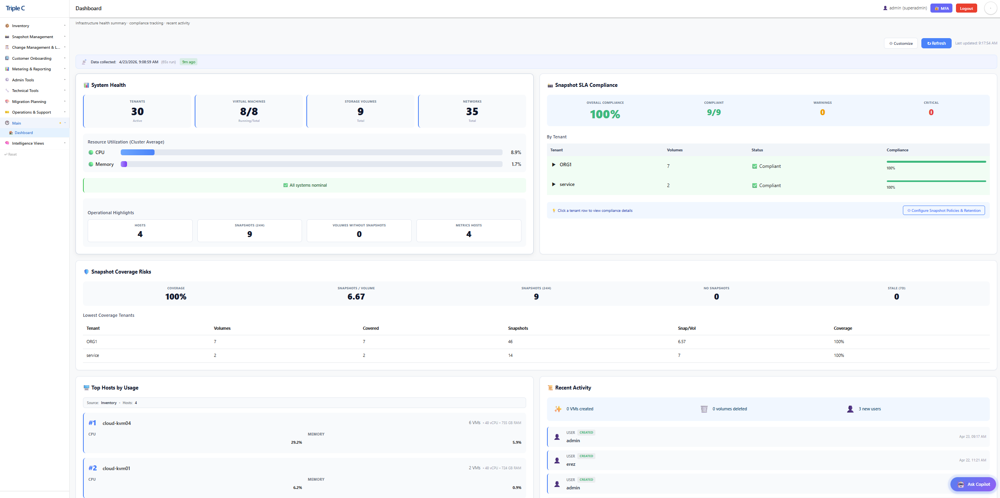
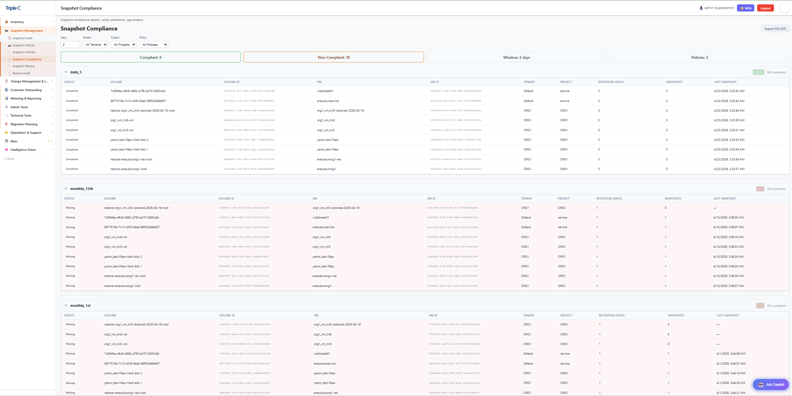
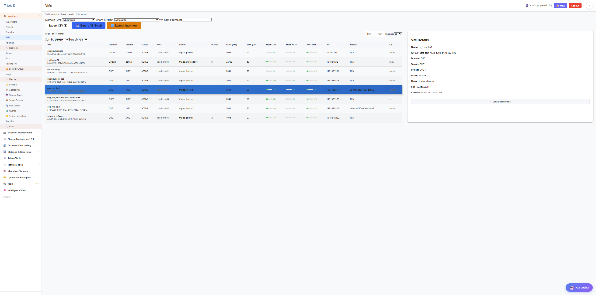
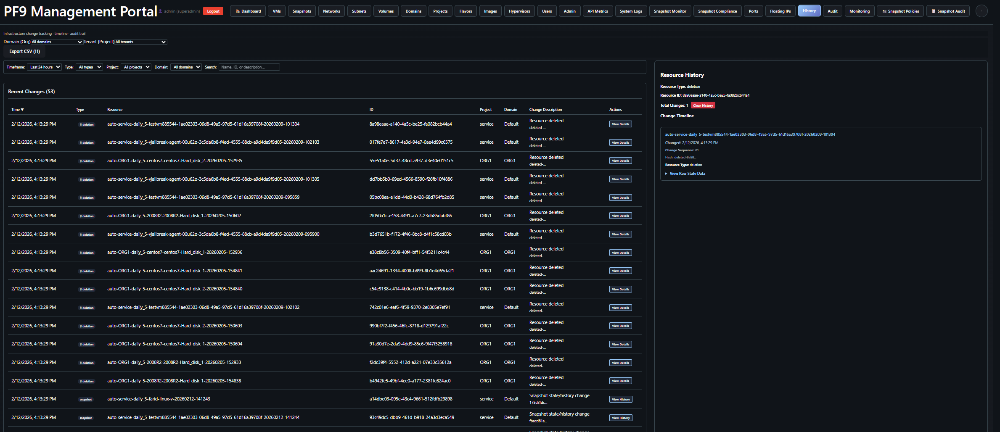
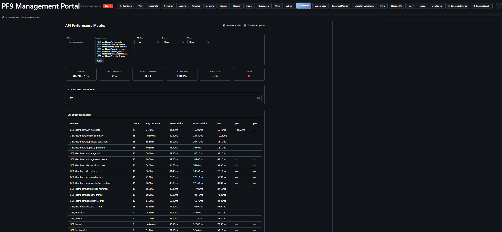
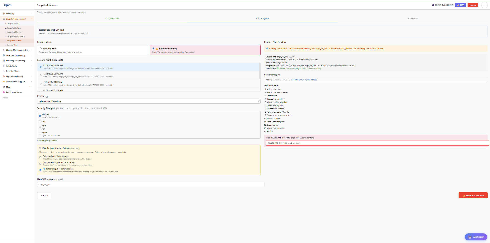
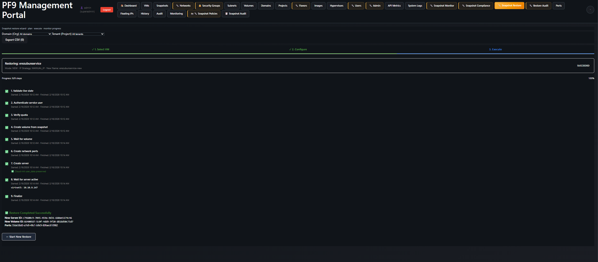
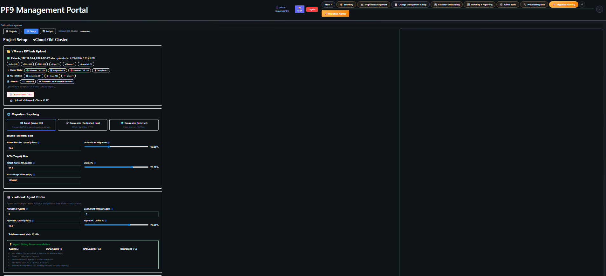
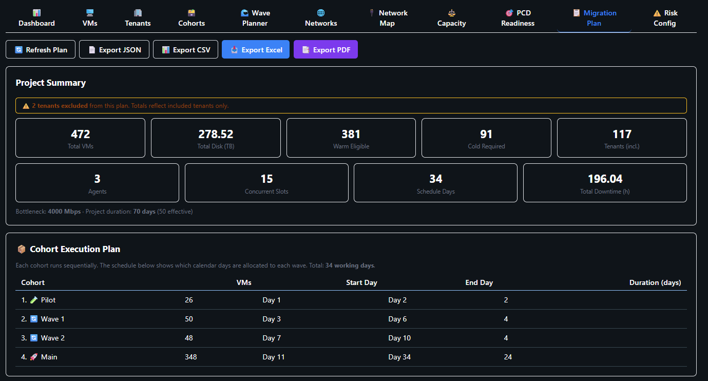

# Platform9 Management System

**Engineering Teams Add-On Platform: Operational Automation & Day-to-Day Management for Platform9**

[](LICENSE)
[](CHANGELOG.md)
[](#-deployment-flexibility--you-decide-how-to-run-this)
[](https://www.buymeacoffee.com/erezrozenbaum)

pf9-mngt is an open-source operational add-on for Platform9 / OpenStack — it gives engineering and MSP teams automated snapshots, VM restore, full inventory persistence, and day-to-day monitoring in a single self-hosted stack.

---

## What pf9-mngt Is

- A **self-hosted operational layer** that continuously persists all Platform9 / OpenStack metadata into your own PostgreSQL database — independently of platform availability
- A **snapshot automation engine** built from scratch (no native scheduler exists in Platform9 or OpenStack): quota-aware, multi-tenant, policy-driven, with SLA compliance reporting
- A **VM restore system** with side-by-side and replace modes — full flavor, network, IP, credential, and volume automation (no native equivalent exists in OpenStack)
- A **migration planning workbench** from RVTools ingestion through cohort design, wave planning, and PCD auto-provisioning
- An **engineering dashboard** with 30+ management tabs, RBAC, full audit trail, metering/chargeback, notifications, runbooks, a support ticket system, and an AI Ops Copilot

---

## What pf9-mngt Is Not

- **Not a replacement for the official Platform9 UI** — it is a complementary operational layer that adds engineering workflows the native UI does not provide
- **Not an official Platform9 product** — it is an independent open-source project, not endorsed by or affiliated with Platform9 Systems, Inc.
- **Not a cloud control plane** — it does not replace Keystone, Nova, Cinder, or Neutron; it orchestrates them via their APIs
- **Not intended for end users** — it is an engineering and MSP operations console for the team managing the platform

---

## 🚀 System Architecture

**14-container microservices platform:**

| Service | Stack | Port | Purpose |
|---------|-------|------|---------|
| **nginx (TLS proxy)** | nginx:1.27-alpine | 80/443 | HTTPS termination, HTTP→HTTPS redirect, reverse proxy to API and UI |
| **Frontend UI** | React 19.2+ / TypeScript / Vite | 5173 | 30+ management tabs + admin panel |
| **Backend API** | FastAPI / Gunicorn / Python | 8000 | 155+ REST endpoints, RBAC middleware, 4 workers + --max-requests 1000 |
| **Redis** | redis:7-alpine | internal | OpenStack inventory/quota cache (60–300 s TTL, allkeys-lru, 128 MiB cap) |
| **LDAP Server** | OpenLDAP | internal | Enterprise authentication directory (not exposed to host) |
| **LDAP Admin** | phpLDAPadmin | 8081 *(dev profile)* | Web-based LDAP management (`--profile dev`) |
| **Monitoring Service** | FastAPI / Python | 8001 | Real-time metrics via Prometheus |
| **Database** | PostgreSQL 16 | internal | 65+ tables, audit, metering, migration planner (not exposed to host) |
| **Database Admin** | pgAdmin4 | 8080 *(dev profile)* | Web-based PostgreSQL management (`--profile dev`) |
| **Snapshot Worker** | Python | — | Automated snapshot management |
| **Notification Worker** | Python / SMTP | — | Email alerts for drift, snapshots, compliance |
| **Backup Worker** | Python / PostgreSQL | — | Scheduled DB + LDAP backups to NFS, restore *(backup profile)* |
| **Scheduler Worker** | Python | — | Host metrics collection + RVTools inventory (runs inside Docker) |
| **Metering Worker** | Python / PostgreSQL | — | Resource metering every 15 minutes |
| **Search Worker** | Python / PostgreSQL | — | Incremental full-text indexing for Ops Assistant |

```text
Platform9 / OpenStack APIs
           │
     ┌─────┴─────┐
     │  pf9-api  │  FastAPI / Gunicorn (4 workers)
     └─────┬─────┘
           │
  ┌────────┼────────┬────────┐
  │        │        │        │
Redis     LDAP   pf9_db   nginx
(cache)  (auth)(PostgreSQL)(TLS)
           │
  ┌────────┼──────────────────────────────┐
  │        │         │         │          │
Snapshot Backup  Metering   Search  Notifications  Scheduler
Worker   Worker   Worker    Worker    Worker         Worker
           │
     ┌─────┴─────┐
     │  pf9-ui   │  React / Vite (served via nginx)
     └───────────┘
```

> `pf9_scheduler_worker` (Docker container) runs `host_metrics_collector.py` (every 60 s) and `pf9_rvtools.py` (configurable interval or daily schedule) for infrastructure discovery and metrics collection. No Windows Task Scheduler dependency.

---

## 📊 Feature Status

| Feature | Status |
|---------|--------|
| Inventory Engine (RVTools-style, 29 resource types) | ✅ Production |
| Snapshot Automation | ✅ Production |
| VM Restore (side-by-side + replace modes) | ✅ Production |
| Reports (20 types + CSV export) | ✅ Production |
| Customer Provisioning & Domain Management | ✅ Production |
| Metering & Chargeback | ✅ Production |
| Notifications (SMTP + Slack + Teams) | ✅ Production |
| Drift Detection | ✅ Production |
| Ops Assistant — Full-Text Search & Smart Queries | ✅ Production |
| Runbooks (24 built-in, dept visibility, approval workflows) | ✅ Production |
| External Integrations Framework (billing gate, CRM, webhooks) | ✅ Production |
| Dependency Graph: Health Scores, Blast Radius, Delete Impact | ✅ Production |
| Backup & Restore (DB) with Integrity Validation | ✅ Production |
| Inventory Versioning & Diff | ✅ Production |
| AI Ops Copilot | 🔶 Beta |
| Migration Planner (end-to-end) | ✅ Production |
| Kubernetes Deployment | ⬜ Planned |
| Tenant Self-Service Portal | ⬜ Planned |

---

## 🧭 Why This Exists — An Engineering Evaluation Story

The conversation around VMware alternatives is real and growing. For MSPs and enterprise teams evaluating their options, Platform9 on OpenStack is genuinely worth looking at. Solid technology, strong business model, and a credible path for organizations managing private and hybrid cloud at scale.

We are currently in the evaluation phase — testing Platform9 as a potential direction for our infrastructure. During that process, like any serious evaluation, you go beyond the demo and start stress-testing real operational workflows. That is where engineering gaps become visible — not because the platform is lacking, but because MSP and enterprise operations have very specific day-to-day requirements that take time for any platform to fully mature into.

Rather than pause the evaluation, we chose to solve the gaps ourselves and reach a better, more informed decision point. The result is pf9-mngt. Building it has given us far deeper insight into the platform than any standard assessment would have. Whatever direction we ultimately choose, this process has been worth it.

This entire project was built using AI as a genuine engineering partner — what some call vibe coding, but applied to a real production problem with real architectural decisions. One person, clear intent, and the right AI workflow can ship something with genuine depth. That is worth demonstrating.

---

### 🔐 Engineering Gap 1 — Metadata Ownership & Operational Resilience

OpenStack identifies everything by UUID. Resource names, relationships, network topology, and tenant context all live in the metadata layer on the management cluster. When you run Platform9 in SaaS mode, that metadata lives on their platform — not yours.

From an engineering perspective this creates a real operational resilience challenge. Without that metadata layer your resources become very difficult to identify and manage independently at scale. For MSPs managing multiple tenants and hundreds of resources, this is a genuine business continuity risk.

**The engineering answer:** pf9-mngt continuously pulls and persists all infrastructure metadata into a local PostgreSQL database that you own and control — independently of the platform. Resource names, relationships, tenant context, change history, and full inventory are always available locally, regardless of platform availability. This is exactly what RVTools does for VMware environments. We built the equivalent for Platform9 and OpenStack.

---

### ⚡ Engineering Gap 2 — VM Restore

In VMware, restoring a VM is a right-click. In OpenStack, there is no equivalent native workflow. To recover a VM from a snapshot you must manually reconstruct everything — remember the original flavor, network topology, IP configuration, re-attach the snapshot volume, and preserve user credentials. All of this under SLA pressure, without making a mistake.

For an MSP, that manual process is not sustainable at scale. It is exactly the kind of procedure that goes wrong at the worst possible moment.

**The engineering answer:** pf9-mngt automates the entire restore procedure. The restore engine handles flavor, network topology, IP addresses, user credentials, and volume attachment automatically. Two restore modes are supported:

- **Side-by-side restore** — a new VM with a new name and new IP spins up alongside the original, completely non-destructively. Validate before cutover. Nothing is touched until you are ready.
- **Replace restore** — full automated recovery with the original configuration restored. Superadmin-only for safety.

Every restore operation is fully audited — who triggered it, what was restored, what mode, duration, and outcome. For MSP accountability and compliance this is not optional.

---

### 🔄 Engineering Gap 3 — Snapshot Automation & Compliance

There is no native automated snapshot scheduler in Platform9 or OpenStack. No configurable per-volume policies. No retention management. No SLA compliance tracking. For an MSP, snapshot automation is table stakes — you cannot deliver a managed service without it.

**The engineering answer:** pf9-mngt includes a complete snapshot automation engine built from scratch. Configurable policies per volume — daily, monthly, custom retention — with automatic cleanup and full SLA compliance reporting aggregated by tenant and domain. v1.26.0 adds **quota-aware batching** with Cinder quota pre-checks, tenant-grouped batching with configurable rate limits, live progress tracking, and the `snapshot_quota_forecast` proactive runbook.

---

### 📦 Engineering Gap 4 — VMware Migration Assessment & Capacity Planning

Migrating hundreds of VMs from VMware to PCD is not just "move the disks." You need full source inventory analysis, OS compatibility classification, warm-vs-cold mode determination, per-VM time estimation, cohort planning, and target capacity validation — before a single VM moves. No native tooling ties RVTools data to PCD readiness in one end-to-end workflow.

**The engineering answer:** pf9-mngt includes a full **Migration Planner** — a multi-stage workflow that takes you from raw RVTools data all the way to an approved, wave-sequenced migration plan ready for execution.

**📥 Source Inventory & Assessment**
- RVTools XLSX ingestion — parses vInfo, vPartition, vDisk, vNetwork sheets into a structured per-VM inventory
- Per-VM risk scoring (GREEN / YELLOW / RED) with configurable weighted rules (OS, disk size, NIC count, snapshots)
- Warm-eligible vs cold-required classification — based on risk score and operator overrides
- OS family and version detection; actual used-disk data from vPartition (not provisioned size)
- Per-VM time estimation — warm phase-1 copy, incremental sync, cutover window, and cold total downtime
- Excel + PDF export — Project Summary, Per-Tenant Assessment, Daily Schedule, All VMs

**🗺️ Target Mapping & Capacity Planning**
- Per-tenant scoping — mark tenants in or out of plan with bulk-select toolbar and exclusion reasons
- Source → PCD target mapping — map each tenant to a target PCD domain and project; auto-seeded with confirmed-flag review workflow
- Source → PCD network mapping — auto-seeded from VM inventory; VLAN ID, confirmed status, Find & Replace, Confirm All
- VM dependency annotation — mark app-stack ordering constraints (web → DB) with circular-dependency validation
- Per-tenant readiness checks — 5 auto-derived: target mapped, network mapped, quota sufficient, no critical gaps, VMs classified
- Overcommit profile modeling — Aggressive / Balanced / Conservative presets with configurable ratios
- Quota requirements engine — recommended per-tenant vCPU, RAM, and storage on the PCD side
- **Performance-based node sizing** — uses actual `cpu_usage_percent` / `memory_usage_percent` from RVTools data (not vCPU allocation ÷ overcommit) for accurate physical node demand; falls back to allocation or quota if performance data is unavailable
- Auto-detect PCD node profile from live hypervisor inventory with one click
- PCD readiness gap analysis — missing flavors, networks, images, unmapped tenants — with severity scoring and downloadable action report (Excel + PDF)

**🗃️ Cohort Planning**
- **Migration Cohorts** — split large projects into ordered workstreams, each with its own schedule, owner, and dependency gate
- **Tenant ease scoring** — composite 0–100 score per tenant based on VM count, disk size, risk score, OS support rate, network complexity, and cross-tenant dependencies; configurable dimension weights
- **Auto-assign strategies** — six algorithms: easiest-first, riskiest-last, pilot + bulk, balanced load, OS-first, by-priority; with guardrails (max VMs, max disk, max avg risk per cohort)
- **What-if estimator** — two side-by-side models per cohort (bandwidth/transfer model + VM-slots scheduler model); live recalculation as you adjust agent slots or bandwidth; project deadline banner turns red if either model exceeds the target duration
- Expandable cohort cards — avg ease, risk distribution, OS mix, readiness counts, and cross-cohort dependency warnings
- Gantt-style date bars and dependency lock indicators

**🌊 Wave Planning**
- Cohort-scoped auto-builder — builds independent wave sets per cohort in execution order; five strategies: bandwidth-paced, risk-tiered, even-spread, dependency-ordered, pilot-first
- Pilot wave support — auto-creates a low-risk pilot wave per cohort to validate toolchain before committing the bulk
- Full wave lifecycle — planned → confirmed → in-progress → complete, with timestamps and transition guards
- Per-wave pre-flight checklists — network mapped, target project set, VMs assessed, no critical gaps, agent reachable, snapshot baseline
- Wave Planner UI — VM migration funnel, per-cohort wave cards, VM assignment tables, preflight status panel, dry-run preview before committing

**⚙️ PCD Data Enrichment (Network Map, Flavor Staging, Image Checklist)**
- Source → PCD network mapping with VLAN IDs, confirmed status, Find & Replace, Confirm All; subnet details panel per row (CIDR, gateway, DNS, DHCP pool)
- **Excel template export/import** — download a pre-filled XLSX for bulk subnet entry; import back to update all rows at once; formula detection catches VLOOKUP external-reference issues with a clear fix instruction; diagnostic response pinpoints any row-matching failures
- **Confirm Subnets** one-click bulk action marks all rows with CIDR as subnet-confirmed; inline CIDR display in the Subnet Details column; import auto-confirms on CIDR presence
- Flavor Staging — de-duplicated per (vCPU, RAM) shape; match against live PCD Nova API; confirmed rows show "✓ exists" vs "✓ new" status pill; Find & Replace, Confirm All
- Image Requirements checklist — one row per OS family; confirm after uploading to PCD Glance; Match PCD auto-links to existing Glance images; status pill differentiates existing vs new images
- PCD Readiness Score — live readiness counter per resource type; gaps auto-resolve when mappings/staging/image requirements are confirmed; network gaps resolve when all confirmed mappings cover the gap list

**⚙️ PCD Auto-Provisioning (Prepare PCD)**
- **Readiness gate** — pre-flight check (`GET /prep-readiness`) verifies all four data enrichment items are confirmed (subnets, flavors, images, users) before allowing task generation
- **Ordered task plan generation** (`POST /prepare`) — builds 667+ provisioning tasks in strict dependency order: create domains → create projects → set quotas → create networks → create subnets → create flavors → create users → assign roles
- **Per-task execution** (`POST /prep-tasks/{id}/execute`) — each task executes against the live PCD Keystone / Neutron / Nova API; writes back PCD UUIDs to source tables (`target_network_id`, `pcd_flavor_id`, `pcd_user_id`, `temp_password`)
- **Run All** (`POST /prepare/run`) — executes all pending/failed tasks in order; stops on first new failure to prevent cascade
- **Per-task rollback** (`POST /prep-tasks/{id}/rollback`) — deletes the PCD resource and resets the task; domain rollback is safety-checked (refuses if domain still contains projects)
- **⚙️ Prepare PCD UI tab** — readiness grid (4 cards), Generate Plan + Run All buttons, task table with status badges, inline error expansion, auto-refresh every 3 s

**📊 Migration Summary & Tech Fix Time Estimation**
- **Fix time model** — per-VM post-migration effort score: Windows OS, extra volumes, extra NICs, cold migration, risk tier, snapshots, cross-tenant dependencies, unknown OS; multiplied by OS-family fix rate (Windows 50%, Linux 20%, Other 40%) to produce expected intervention time in minutes
- **`migration_fix_settings`** — per-project weight sliders and OS fix rates, auto-created with defaults; all 10 factors are tunable per project without code changes
- **Per-VM fix override** — operators can lock any individual VM to a specific fix time (bypassing the model); inline ⏱ Fix Time Override card in the expanded VM row with number input, Save, and Clear
- **Migration Summary tab** — executive KPI strip (Migration Days, In-Use Data TB with provisioned subtitle, Estimated Data-Copy Time, Estimated Fix Time, Total Downtime); **per-day schedule table** with cohort, VMs, storage (GB), wall-clock time, agent hours, cold/warm split, and risk breakdown per day; over-capacity days highlighted in red with ⚠️; OS-family breakdown table; per-cohort breakdown; methodology accordion; settings editor
- **Throughput cap engine** — daily schedule uses a shared-pipe GB/day ceiling (`effective_gbph × working_hours`) instead of per-slot hour packing; `wall_clock_hours` is correctly derived from `day_transfer_gb / effective_gbph`; `over_capacity` flag emitted when a day's payload exceeds the ceiling
- **Tenant filter dropdowns** — Scope, Ease, Cohort, and Network Type filters in the Tenants tab with a Clear Filters button

---

### 🐳 Deployment Flexibility — You Decide How to Run This

pf9-mngt is currently developed on Windows using Docker containers. That is the development environment — but the architecture is deliberately not prescriptive about how you run it in production.

Every service is containerized. That means **you decide**:

| Option | When to use |
|--------|-------------|
| 🐳 **Docker Compose** | Simple, fast, perfectly viable for many teams |
| ☸️ **Kubernetes** | Production-grade HA and horizontal scaling — containers are ready, effort is minimal |
| 🔧 **Your own orchestration** | Adapt to whatever infrastructure decisions you have already made |

> **Note:** Kubernetes deployment is a design target — the architecture is planned but not yet tested in production. See [docs/KUBERNETES_MIGRATION_GUIDE.md](docs/KUBERNETES_MIGRATION_GUIDE.md) for the design plan.  
> See [docs/LINUX_DEPLOYMENT_GUIDE.md](docs/LINUX_DEPLOYMENT_GUIDE.md) for running on Linux.

---

## 📸 Screenshots

### Landing Dashboard


### Snapshot Compliance Report


### VM Inventory


### History & Monitoring


### API Performance


### Snapshot Restore Process


### Snapshot Restore Audit


### Migration Planner — Project Setup & Cohort Configuration


### Migration Planner — Wave Plan Creation


---

## 🎬 Video Walkthrough

A 15-minute explainer video walking through the UI and key features:

[](https://www.youtube.com/watch?v=68-LQ9ugU_E)

▶️ [**PF9 Management System — Full UI Walkthrough (15 min)**](https://www.youtube.com/watch?v=68-LQ9ugU_E)

---

## 🌟 Key Features

### 🔐 Enterprise Authentication & Authorization
- **LDAP Integration**: Production-ready OpenLDAP authentication — also compatible with Active Directory
- **Role-Based Access Control**: 5-tier permission system (Viewer, Operator, Admin, Superadmin, Technical)
- **MFA Support**: TOTP-based two-factor authentication (Google Authenticator compatible) with backup recovery codes
- **JWT Token Management**: Secure 480-minute sessions with Bearer token authentication
- **RBAC Middleware**: Automatic permission enforcement on all resource endpoints
- **Audit Logging**: Complete authentication event tracking — login, logout, failed attempts, user management
- **System Audit**: 90-day retention with filtering by user, action, date range, and IP address

### 📊 RVTools-Style Unified Inventory
- **29 Resource Types**: Domains, Projects, Users, VMs, Volumes, Snapshots, Networks, Subnets, Ports, Floating IPs, Routers, Security Groups, Hypervisors, Flavors, Images, Roles, Role Assignments, Groups, Snapshot Policies, and operational event types
- **Human-Friendly Names**: UUID-to-name resolution across all resource types
- **Local Persistent Store**: All metadata stored in your own PostgreSQL — independent of platform availability
- **Excel/CSV Export**: Customer-data-safe with masking options and delta reporting
- **Multi-Tenant Support**: Full domain and project-level filtering and management
- **Comprehensive Audit System**: Change tracking, deletion history, compliance reporting, resource timeline

<details>
<summary><strong>User Management Details</strong></summary>

- **Multi-Domain User Collection**: 100+ users across 28 OpenStack domains
- **Role Assignment Tracking**: Monitors role assignments across the infrastructure
- **Activity Monitoring**: User last-seen timestamps and account status
- **Role Inference System**: Intelligent role assignment when API access is limited
- **Domain-Scoped Authentication**: Complete user enumeration across tenants
- **LDAP Password Reset** *(v1.40)*: Superadmin can reset any LDAP user's password directly from the Users table — 🔑 button opens an inline form with SSHA-hashed password write, minimum-length validation, and full audit logging

</details>

### 🔄 Automated Snapshot Management
- **Built From Scratch**: No native scheduler exists in Platform9 or OpenStack — we built one
- **Metadata-Driven Policies**: Volume-level configuration via OpenStack metadata
- **Multi-Policy Support**: daily_5, monthly_1st, monthly_15th with independent retention per volume
- **Cross-Tenant Snapshots**: Dedicated service user architecture for correct tenant context
- **SLA Compliance Reporting**: Configurable thresholds with detailed tenant/domain aggregation
- **Policy Assignment Rules**: JSON-driven automatic policy assignment based on volume properties

<details>
<summary><strong>Snapshot System Components</strong></summary>

- **Automated Creation** (`snapshots/p9_auto_snapshots.py`): Policy-driven volume snapshots with retention management, dual-session architecture (admin for listing, service user for creating)
- **Service User Management** (`snapshots/snapshot_service_user.py`): Automatic admin role assignment per tenant project, Fernet-encrypted or plaintext password support
- **Policy Assignment** (`snapshots/p9_snapshot_policy_assign.py`): Opt-out rule engine, volume property matching, bulk metadata assignment
- **Compliance Reporting** (`snapshots/p9_snapshot_compliance_report.py`): Real-time SLA analysis, tenant/domain aggregation

</details>

### ⚡ Automated VM Restore *(No native equivalent exists in OpenStack)*
- **Full Restore Automation**: Flavor, network, IPs, user credentials, volume attachment — all handled
- **Side-by-Side Restore**: New VM with new name and IP alongside the original — non-destructive
- **Replace Restore**: Full recovery with original configuration — Superadmin-only with typed confirmation
- **IP Strategies**: NEW_IPS (DHCP), TRY_SAME_IPS (best-effort), SAME_IPS_OR_FAIL (strict)
- **3-Screen UI Wizard**: Guided restore flow with real-time progress tracking
- **Dry-Run Mode**: Validate the full restore plan before executing against OpenStack
- **Safety First**: Disabled by default, concurrent restore prevention, quota double-check, rollback on failure
- **Full Restore Audit**: Every operation logged — who, what mode, duration, outcome

### 👁️ Real-Time Monitoring
- **Host Metrics**: Live CPU, memory, storage from PF9 compute nodes via Prometheus node_exporter (port 9388)
- **VM Metrics**: Individual VM resource tracking via libvirt_exporter (port 9177)
- **Automated Collection**: Background collection every 30 minutes
- **Persistent Cache**: Metrics survive service restarts
- **Integrated Dashboard**: Real-time monitoring tab with auto-refresh

### 🔔 Smart Notifications
- **Event-Driven Alerts**: Snapshot failures, compliance violations, drift events, health score drops
- **Per-User Preferences**: Subscribe to specific event types with severity filtering (info/warning/critical)
- **Daily Digest**: Configurable daily summary aggregating all events from past 24 hours
- **SMTP Flexibility**: Authenticated and unauthenticated relay support, optional TLS
- **HTML Templates**: Professional Jinja2 email templates for each event type
- **Notification History**: Full delivery log with status tracking and retry information

### 💰 Metering & Chargeback
- **Per-VM Resource Tracking**: vCPU, RAM, disk allocation + actual usage, network I/O
- **Snapshot & Restore Metering**: Count, size, compliance, operation tracking
- **API Usage Metering**: Endpoint-level call counts, error rates, latency percentiles (avg/p95/p99)
- **Efficiency Scoring**: Per-VM classification (excellent/good/fair/poor/idle)
- **Multi-Category Pricing**: Compute, storage, snapshot, restore, volume, network — hourly + monthly rates
- **Chargeback Export**: Per-tenant cost breakdown with one-click CSV export
- **8 Sub-Tab UI**: Overview, Resources, Snapshots, Restores, API Usage, Efficiency, Pricing, Export

### 🏢 Customer Provisioning & Domain Management *(v1.16 → v1.34.2)*
- **5-Step Provisioning Wizard**: Domain → Project → User/Role → Quotas → Networks/Security Group
- **Multi-Network Support** *(v1.34.2)*: Add any combination of 3 network kinds per provisioning run:
  - 🔌 **Physical Managed** — provider/external VLAN network (`<domain>_tenant_extnet_vlan_<id>`)
  - 🔗 **Physical L2 (Beta)** — provider L2 network, no subnet (`<domain>_tenant_L2net_vlan_<id>`)
  - ☁️ **Virtual** — standard tenant network (`<domain>_tenant_virtnet[_N]`)
- **Dynamic Keystone Roles**: Fetches roles from PF9 Keystone, filters internal system roles
- **Tabbed Quota Editor**: Compute, Block Storage, Network tabs with "Set Unlimited" toggles
- **Network Auto-Discovery**: Physical networks from Neutron with VLAN/flat/VXLAN support
- **Customer Welcome Email**: HTML template listing all provisioned networks (kind, VLAN, subnet, gateway) per network card
- **Domain Management**: Full lifecycle — enable/disable, typed confirmation delete, resource inspection
- **Resource Deletion**: 8 DELETE endpoints for individual resources across all types
- **Central Activity Log**: Full audit trail for all provisioning and domain operations
- **DB Persistence**: `networks_config` + `networks_created` JSONB columns in `provisioning_jobs` store full input and output network details

### 📋 Reports & Resource Management *(v1.17 → v1.63)*
- **20 Report Types**: VM Report, Tenant Quota Usage, Domain Overview, Snapshot Compliance, Flavor Usage, Metering Summary, Resource Inventory, User/Role Audit, Idle Resources, Security Group Audit, Capacity Planning, Backup Status, Activity Log, Network Topology, Cost Allocation, Drift Summary, **Image Usage by Tenant** *(v1.40)*, **Flavor Usage by Tenant Detail** *(v1.40)*
- **BFV-aware reporting** *(v1.40)*: Image and Flavor by Tenant reports resolve instances booted from volume via Cinder `volume_image_metadata` — full VM counts including BFV workloads
- **CSV Export**: All reports support one-click CSV download
- **RVTools Exports Browser** *(v1.63)*: "📁 RVTools Exports" sub-tab inside Reports — file list (filename, size, date) with one-click authenticated download + run history table showing the last 100 `inventory_runs` entries (started, finished, duration, status badge)
- **Resource Provisioning Tool**: Full CRUD for Users, Flavors, Networks, Routers, Floating IPs, Volumes, Security Groups across tenants
- **Quota Management**: View and live-edit compute, network, and storage quotas per tenant
- **Safety Protections**: Last-user guard, in-use flavor check, attached-volume block, default SG protection
- **Three-Tier RBAC**: Viewer (read), Operator (read+write), Admin (read+write+delete)

### 🔍 Ops Assistant — Search & Similarity *(v1.20)*
- **Full-Text Search**: PostgreSQL tsvector + websearch across all 29 resource types, events, and audit logs
- **Trigram Similarity**: "Show Similar" per result — finds related resources, errors, or configurations via pg_trgm
- **Intent Detection**: Natural-language queries like *"quota for projectX"* or *"capacity"* auto-suggest the matching report endpoint
- **Smart Query Templates (v3)**: 26 question templates turn the search bar into an Ops Assistant — ask *"how many VMs are powered off?"*, *"quota for service"*, or *"show platform overview"* and get live answer cards inline
- **Scope Filters**: Domain and Tenant dropdowns filter smart query results to a specific project or domain — 20 of 26 query templates are scope-aware
- **Discoverability UI**: 🤖 button opens a categorised help panel with clickable example chips across 6 categories (Infrastructure, Projects & Quotas, Storage, Networking, Security & Access, Operations) — template chips auto-fill with the scoped tenant, instant chips run immediately. "New Question" button resets the search.
- **Quota & Usage Metering**: Background collector computes per-project resource consumption (VMs, vCPUs, RAM, volumes, storage, snapshots, floating IPs, networks, ports, security groups) from live inventory tables with flavor-based vCPU/RAM resolution
- **29 Indexed Document Types**: VMs, volumes, snapshots, hypervisors, networks, subnets, floating IPs, ports, security groups, domains, projects, users, flavors, images, routers, roles, role assignments, groups, snapshot policies, activity log, auth audit, drift events, snapshot runs/records, restore jobs, backups, notifications, provisioning, deletions
- **Incremental Indexing**: Background worker with per-doc-type watermarks — only re-indexes changed rows
- **Stale Cleanup**: Automatically removes search documents for deleted infrastructure resources
- **Paginated Results**: Relevance-ranked results with highlighted keyword snippets and metadata pill cards
- **Indexer Dashboard**: Real-time stats on document counts, last run time, and per-type health

### 📋 Policy-as-Code Runbooks *(v1.21 → v1.61)*
- **Runbook Catalogue**: Browse 25 built-in operational runbooks with schema-driven parameter forms:
  - **VM**: Stuck VM Remediation, VM Health Quick Fix, Snapshot Before Escalation, Password Reset + Console Access, **VM Rightsizing** *(v1.55)* — identifies over-provisioned VMs and suggests/executes flavor downsizing with pre-snapshot safety, **DR Drill** *(v1.56)* — clone DR-tagged VMs into isolated network, verify boot, auto-teardown, **Hypervisor Maintenance Evacuate** *(v1.57, Phase C2)* — drain a hypervisor before maintenance: live-migrate all VMs (graph-depth ordered), cold-migrate fallback, disable host after drain
  - **Security**: Security Group Audit, Security & Compliance Audit, User Last Login Report, Snapshot Quota Forecast, **Security Group Hardening** *(v1.57, Phase C)* — replaces 0.0.0.0/0 rules with graph-derived CIDRs, **Network Isolation Audit** *(v1.57)* — scans shared networks, cross-tenant routers, CIDR overlaps, and unexpected FIPs, **Image Lifecycle Audit** *(v1.57)* — scores images by age + EOL OS + FIP exposure
  - **Quota**: Quota Threshold Check, Upgrade Opportunity Detector, **Quota Adjustment** *(v1.53)* — sets Nova/Neutron/Cinder quota with billing gate + dry-run diff
  - **General**: Orphan Resource Cleanup, Diagnostics Bundle, Monthly Executive Snapshot, Cost Leakage Report, **Org Usage Report** *(v1.53)* — full usage + cost report with email-ready HTML body, **Capacity Forecast** *(v1.55)* — linear regression on cluster vCPU/RAM history, projects days to 80% capacity, **Cluster Capacity Planner** *(v1.61)* — HA-aware cluster capacity analysis: reserves N+1/N+2 host headroom, 70% safe-operating threshold, forecasts days to capacity, recommends minimum host spec for 6-month runway, per-flavor VM slot table
  - **Provisioning**: **Tenant Offboarding** *(v1.56)* — 10-step customer exit: FIP release → VM stop → port cleanup → Keystone disable → metadata tagging → CRM notification → final report email
- **Department Visibility** *(v1.52)*: Admins control which departments see each runbook via a live checkbox matrix in the UI; non-admin users receive only the runbooks their department is allowed to trigger
- **External Integrations** *(v1.52)*: Connect billing gates, CRM systems, or generic webhooks. `auth_credential` Fernet-encrypted at rest. Action runbooks call `_call_billing_gate()` for pre-authorization before applying changes — silently skips if no integration is configured
- **Result Export**: Every runbook result can be exported as CSV, JSON, or printed to PDF directly from the detail panel
- **ILS Pricing from Metering**: Cost-related runbooks pull real pricing from the `metering_pricing` table — per-flavor, per-resource, with automatic currency detection (ILS/USD)
- **Operator-Facing Trigger**: Tier 1 operators can browse and trigger runbooks with dry-run support — no admin access needed
- **Flexible Approval Workflows**: Configurable `trigger_role → approver_role` mapping per runbook with three modes: auto-approve, single approval, multi-approval
- **Admin Governance**: Execution History, Approvals queue, and Approval Policies managed via 3 dedicated sub-tabs in the Admin panel
- **Full Audit Trail**: Every execution records trigger user, approver, timestamps, parameters, results, items found/actioned
- **Pluggable Engine Architecture**: `@register_engine` decorator pattern — add new runbooks with zero framework changes

### 🕸️ Cloud Dependency Graph *(v1.47 → v1.51)*
- **BFS Graph Engine**: `GET /api/graph` — given any resource (VM, volume, network, tenant, snapshot, SG, FIP, subnet, port, host, image, domain), returns the full node+edge dependency graph up to 3 hops; 150-node cap with `truncated` flag
- **12 Node Types, 15 Edge Types**: All relationships derived from the existing DB schema with no schema changes required
- **Health Score Engine** *(v1.51)*: Every node shows a coloured 0–100 score circle; VM/volume/host each have tailored deduction rules for error states, missing snapshots, drift, and resource pressure; capacity pressure tinting on host nodes
- **Blast Radius Mode** *(v1.51)*: Click 💥 to highlight all resources impacted if the selected node fails; animated edges + node dimming; summary banner showing affected VMs, tenants, FIPs, and volumes
- **Delete Impact Mode** *(v1.51)*: Click 🗑 to preview cascade deletions, stranded resources, and OpenStack blockers before any destructive action
- **Orphan Detection** *(v1.51)*: Surfaces orphaned volumes (unattached), floating IPs (no port), security groups (unused), and dangling snapshots; visible in Tenant Health Panel
- **Tenant Health Panel** *(v1.51)*: Environment health score, critical/degraded VM counts, orphan count, expandable top-issues list shown above the canvas in Topology mode
- **VMware Migration Graph** *(v1.48)*: RVTools-side dependency graph with VM, disk, and portgroup/VLAN nodes; migration status rings (🟢 complete / 🟡 in progress / 🔴 failed); view from any Migration Planner tenant row or cohort expansion
- **ReactFlow UI** (`DependencyGraph.tsx`): Dagre hierarchical layout, 12 color-coded node types, depth pills (1/2/3), type filter checkboxes, **🔍 Explore from here** re-rooting with ← Back breadcrumb; **🔗 Open in tab**, **📸 Create Snapshot**, and **🚀 View in Migration Planner** quick actions on any node
- **Auto-Ticket Integration** *(v1.59)*: Graph node health score < 40 triggers `auto_incident` ticket; `POST /api/graph/request-delete` creates an `auto_change_request` before any destructive delete

### 🤖 Ops Copilot — AI Infrastructure Assistant *(v1.24)*
- **Three-Tier Architecture**: Built-in intent engine (zero setup) → Ollama (local LLM) → OpenAI/Anthropic (external LLM)
- **40+ Built-in Intents**: Inventory counts, VM power states, capacity metrics, error VMs, down hosts, networking (networks, subnets, routers, floating IPs), snapshot/drift/compliance summaries, user lists, role assignments, activity logs, runbook status, and full infrastructure overview — all powered by live SQL queries
- **Tenant / Project / Host Scoping**: Add "on tenant X", "for project X", or "on host Y" to any question for filtered results. Synonym expansion ensures natural phrasing always matches.
- **LLM Integration**: Free-form questions answered via Ollama (local, no data leaves your network) or OpenAI/Anthropic (with automatic sensitive data redaction)
- **Labeled FAB + Welcome Screen**: Prominent pill-shaped "🤖 Ask Copilot" button with pulse animation on first visit, welcome screen with examples, and a dedicated help view with 8 categorized question groups and usage tips
- **Admin Settings Panel**: Switch backends, configure URLs/keys/models, edit system prompts, test connectivity — all from the UI, no `.env` edits needed
- **Feedback & History**: Per-answer thumbs up/down, conversation history persisted per user with automatic trimming
- **Automatic Fallback**: If the LLM backend fails, seamlessly falls back to the built-in intent engine

### 🎫 Support Ticket System *(v1.58 → v1.60)*
- **Full Ticket Lifecycle**: Ticket refs (TKT-YYYY-NNNNN); 5 types (incident, service_request, change_request, auto_incident, auto_change_request); full status/priority/type model; approval gate; SLA deadlines; OpenStack resource linkage
- **35+ API Endpoints** at `/api/tickets`: create, list, get, update, assign, escalate, approve/reject, resolve/reopen/close, comment thread, SLA policies, email templates, analytics, bulk actions
- **SLA Daemon**: Background asyncio task (15-min interval) — breach detection, Slack/Teams notification, auto-escalate on breach, activity comment logged
- **Auto-Ticket Triggers** *(v1.59)*: Critical/warning drift events → `auto_incident`; health score < 40 → `auto_incident`; graph delete intent → `auto_change_request` with `auto_blocked` gate; runbook failure → `auto_incident` linked to execution; migration wave complete → `service_request`
- **Ticket Analytics** *(v1.60)*: Resolution time by dept, SLA breach rate, top openers, daily volume trend; **LandingDashboard KPI tile** (Open / SLA Breached / Resolved Today / Opened Today)
- **Bulk Actions** *(v1.60)*: `close_stale`, `reassign`, `export_csv` via checkbox multi-select toolbar
- **Integration**: Trigger runbooks from a ticket and attach results; `email-customer` action via named HTML templates; inline ticket creation from Metering and Runbooks rows; team-member assignment at creation
- **5 DB Tables**: `support_tickets`, `ticket_comments`, `ticket_sla_policies`, `ticket_email_templates`, `ticket_sequence`; 17 seeded SLA policies, 6 HTML email templates
- **Navigation**: New "Operations & Support" group (🎫) with Tickets and My Queue items

### 📈 30+ Tab Management Dashboard
A single engineering console covering every operational surface:

> Servers · Volumes · Snapshots · Networks · Security Groups · Subnets · Ports · Floating IPs · Domains · Projects · Flavors · Images · Hypervisors · Users · Roles · Snapshot Policies · History · Audit · Monitoring · Restore · Restore Audit · Notifications · Metering · Customer Provisioning · Domain Management · Activity Log · Reports · Resource Management · **Ops Search** · **Runbooks** · **Ops Copilot** · **Tickets** · **Dependency Graph**

<details>
<summary><strong>Landing Dashboard Widgets</strong></summary>

- **Health Summary Card**: System-wide metrics (VMs, volumes, networks, resource utilization)
- **Snapshot SLA Compliance**: Tenant-level compliance tracking with warning/critical alerting
- **Top Host Utilization**: Real-time CPU/memory usage across compute nodes
- **Recent Activity Widget**: Last 24 hours of infrastructure changes
- **Coverage Risk Analysis**: Volumes without snapshot protection
- **Capacity Pressure Indicators**: Storage and compute capacity warnings
- **VM Hotspots**: Top resource consumers (CPU/memory/storage)
- **Tenant Risk Scores**: Multi-factor risk assessments per tenant
- **Compliance Drift Tracking**: Policy adherence trending
- **Capacity Trends**: 7-day resource utilization forecasting
- **Trendlines**: Infrastructure growth patterns and velocity metrics

</details>

<details>
<summary><strong>History Tab Features</strong></summary>

- Filter by resource type (server, volume, snapshot, deletion, etc.), project, domain, and free-text search
- Sortable column headers with ascending/descending indicators
- Deletion record viewing — shows deletion timeline, original resource type, reason, and last-known state
- Most frequently changed resources section with direct history navigation
- Configurable timeframe (1 hour to 1 week)

</details>

- **Dark/Light Mode**: Full theme support with persistent preferences
- **Role-Based UI**: Tabs and actions shown based on user permission level
- **Write-Capable Indicators**: 🔧 icon marks tabs that can create, modify, or delete resources
- **Auto-Refresh**: 30-second refresh on dashboard, efficient pagination across all endpoints

### API Observability
- **Public Metrics**: `GET /metrics`
- **Authenticated Metrics (UI)**: `GET /api/metrics` — Admin/Superadmin only
- **Authenticated Logs (UI)**: `GET /api/logs` — with `limit`, `level`, `source`, `log_file` params
- **Swagger Docs**: `GET /docs` — interactive API documentation

---

## 🚀 Quick Start

### Prerequisites
- **Docker & Docker Compose** (for complete platform)
- **Python 3.11+** with packages: `requests`, `openpyxl`, `psycopg2-binary`, `aiohttp`, `aiofiles`
- **Valid Platform9 credentials** (service account recommended) — *not required in Demo Mode*
- **Network access** to Platform9 cluster and compute nodes — *not required in Demo Mode*

### 1. Complete Automated Setup (Recommended)
```powershell
# Clone repository
git clone https://github.com/erezrozenbaum/pf9-mngt.git
cd pf9-mngt

# Configure environment (CRITICAL: No quotes around values)
cp .env.template .env
# Edit .env with your Platform9 credentials

# One-command complete deployment
.\deployment.ps1

# What deployment.ps1 does:
# ✓ Checks/installs Docker Desktop
# ✓ Creates and validates .env configuration
# ✓ Creates required directories (logs, secrets, cache)
# ✓ Installs Python dependencies
# ✓ Builds and starts all Docker containers
# ✓ Initializes PostgreSQL database schema
# ✓ Configures LDAP directory structure
# ✓ Creates automated scheduled tasks
# ✓ Runs comprehensive health checks

# Alternative quick startup (assumes Docker installed)
.\startup.ps1

# Access services after deployment:
# UI:            http://localhost:5173
# API:           http://localhost:8000
# API Docs:      http://localhost:8000/docs
# Monitoring:    http://localhost:8001
# Database:      http://localhost:8080
```

### 1b. Demo Mode (No Platform9 Required)

Want to try the portal without a Platform9 environment? Demo mode populates the
database with realistic sample data (3 tenants, 35 VMs, 50+ volumes, snapshots,
drift events, compliance reports, etc.) and generates a static metrics cache.

```powershell
git clone https://github.com/erezrozenbaum/pf9-mngt.git
cd pf9-mngt

# The deployment wizard will ask "Production or Demo?" — choose 2 for Demo
.\deployment.ps1

# Or enable demo mode manually on an existing install:
#   1. Set DEMO_MODE=true in .env
#   2. python seed_demo_data.py          # populates DB + generates metrics cache
#   3. docker-compose restart pf9_api    # API picks up DEMO_MODE env var
```

> In demo mode the UI shows an amber **DEMO** banner, the background metrics
> collector is skipped, and Platform9 credentials are not required.

### 2. Environment Configuration
```bash
# Platform9 Authentication
PF9_USERNAME=your-service-account@company.com
PF9_PASSWORD=your-secure-password
PF9_AUTH_URL=https://your-cluster.platform9.com/keystone/v3
PF9_USER_DOMAIN=Default
PF9_PROJECT_NAME=service
PF9_PROJECT_DOMAIN=Default
PF9_REGION_NAME=region-one

# Database
POSTGRES_USER=pf9
POSTGRES_PASSWORD=generate-secure-password-here
POSTGRES_DB=pf9_mgmt

# Monitoring
PF9_HOSTS=<HOST_IP_1>,<HOST_IP_2>,<HOST_IP_3>
METRICS_CACHE_TTL=60
```

### 3. Manual Docker Setup
```bash
docker-compose up -d
docker-compose ps
docker-compose logs pf9_api
```

### 4. Standalone Script Usage (No Docker Required)
```bash
# Inventory export
python pf9_rvtools.py

# Snapshot automation
python snapshots/p9_auto_snapshots.py --policy daily_5 --dry-run
python snapshots/p9_auto_snapshots.py --policy daily_5

# Compliance reporting
python snapshots/p9_snapshot_compliance_report.py --input latest_export.xlsx --output compliance.xlsx

# Policy assignment
python snapshots/p9_snapshot_policy_assign.py --config snapshots/snapshot_policy_rules.json --dry-run
```

---

## 🔧 Configuration

### Snapshot Policies
```bash
# Daily snapshots with 5-day retention
openstack volume set --property auto_snapshot=true \
                    --property snapshot_policies=daily_5 \
                    --property retention_daily_5=5 \
                    <volume-id>

# Multiple policies on one volume
openstack volume set --property auto_snapshot=true \
                    --property snapshot_policies=daily_5,monthly_1st \
                    --property retention_daily_5=5 \
                    --property retention_monthly_1st=12 \
                    <volume-id>
```

### Scheduler Worker (v1.62.0+)
```powershell
# Check scheduler status
docker logs pf9_scheduler_worker --tail 30

# Trigger metrics collection manually
docker exec pf9_scheduler_worker python host_metrics_collector.py --once

# Trigger RVTools collection manually
docker exec pf9_scheduler_worker python pf9_rvtools.py
```
> Metrics collection and RVTools inventory now run inside the `pf9_scheduler_worker` container automatically.
> No Windows Task Scheduler setup is required.

---

## 🛠️ Administration

### Database
```bash
# Connect
psql -h localhost -U pf9 -d pf9_mgmt

# Manual backup
docker exec pf9_db pg_dump -U pf9 pf9_mgmt > backup.sql

# Restore
docker exec -i pf9_db psql -U pf9 pf9_mgmt < backup.sql
```

> For scheduled backups, use the 💾 Backup tab in the UI — the backup_worker runs pg_dump on a configurable schedule and writes compressed `.sql.gz` files.

### Service Management
```bash
docker-compose restart pf9_api
docker-compose up -d --scale pf9_api=2
docker stats
```

---

## 📁 Project Structure

```
pf9-mngt/
├── api/                          # FastAPI backend (155+ endpoints)
├── pf9-ui/                       # React 19 + TypeScript frontend
├── monitoring/                   # Prometheus metrics service
├── snapshots/                    # Snapshot automation engine
│   ├── p9_auto_snapshots.py      # Cross-tenant snapshot automation
│   ├── snapshot_service_user.py  # Service user management
│   ├── p9_snapshot_compliance_report.py
│   ├── p9_snapshot_policy_assign.py
│   └── snapshot_policy_rules.json
├── db/                           # PostgreSQL schema + migrations
├── backup_worker/                # Scheduled backup service
├── metering_worker/              # Resource metering service
├── search_worker/                # Full-text search indexer (Ops Assistant)
├── notifications/                # Email notification service
├── ldap/                         # OpenLDAP configuration
├── docs/                         # Full documentation suite
├── pf9_rvtools.py                # RVTools-style inventory export
├── host_metrics_collector.py     # Prometheus metrics collection
├── seed_demo_data.py             # Demo mode: populate DB + metrics cache
├── p9_common.py                  # Shared utilities
├── docker-compose.yml            # Full stack orchestration
├── deployment.ps1                # One-command deployment
├── startup.ps1                   # Quick start script
└── .env.template                 # Environment configuration template
```

---

## 📚 Documentation

| Document | Purpose |
|----------|---------|
| [Deployment Guide](docs/DEPLOYMENT_GUIDE.md) | Step-by-step deployment instructions |
| [Admin Guide](docs/ADMIN_GUIDE.md) | Day-to-day administration reference |
| [Architecture](docs/ARCHITECTURE.md) | System design, trust boundaries, data model, auth flow |
| [API Reference](docs/API_REFERENCE.md) | Complete API endpoint documentation |
| [Security Guide](docs/SECURITY.md) | Security model, authentication, encryption |
| [Security Checklist](docs/SECURITY_CHECKLIST.md) | Pre-production security audit checklist |
| [Restore Guide](docs/RESTORE_GUIDE.md) | Snapshot restore feature documentation |
| [Snapshot Automation](docs/SNAPSHOT_AUTOMATION.md) | Snapshot system design and configuration |
| [Snapshot Service User](docs/SNAPSHOT_SERVICE_USER.md) | Service user setup and troubleshooting |
| [VM Provisioning Setup](docs/DEPLOYMENT_GUIDE.md) | Includes `provisionsrv` service user setup (Runbook 2) |
| [Quick Reference](docs/QUICK_REFERENCE.md) | Common commands and URLs cheat sheet |
| [Kubernetes Migration](docs/KUBERNETES_MIGRATION_GUIDE.md) | K8s migration planning guide |
| [Linux Deployment](docs/LINUX_DEPLOYMENT_GUIDE.md) | Running pf9-mngt on Linux instead of Windows |
| [Migration Planner Guide](docs/MIGRATION_PLANNER_GUIDE.md) | Comprehensive operator guide for all Migration Planner phases |
| [Support Ticket System Guide](docs/TICKET_GUIDE.md) | Full reference for the ticket lifecycle, API, SLA, email templates, and auto-tickets |
| [Contributing](CONTRIBUTING.md) | Contribution guidelines |

---

## �️ Project Status

**Current version:** [v1.65.2](CHANGELOG.md) — March 15, 2026

**Development phase:** Production-hardened and ready for deployment. CI pipeline active, CORS restricted in production mode, database performance indexes applied automatically on startup.

**Platform:** Docker Compose with nginx TLS termination. All core containers (14) have restart policies and resource limits; a 15th `pf9_scheduler_worker` container handles automated collection, and `pf9_backup_worker` is added when `COMPOSE_PROFILES=backup` is set. Redis cache, rate limiting, and structured logging active.

**Maturity:** 14 of 16 tracked features are production-grade. AI Copilot is in beta. Kubernetes deployment is a planned future option.

---

## �🆘 Troubleshooting

**"Failed to fetch" in UI**
- Check API: `docker-compose logs pf9_api`
- Verify credentials in `.env`
- Test: `curl http://localhost:8000/health`

**Empty monitoring data**
- Check scheduler: `docker logs pf9_scheduler_worker --tail 20`
- Run once manually: `docker exec pf9_scheduler_worker python host_metrics_collector.py --once`
- Verify node_exporter on PF9 hosts (port 9388)

**Database connection errors**
- Check: `docker-compose logs db`
- Reset: `docker-compose down -v && docker-compose up -d`

**Authentication errors**
- Verify `.env` credentials and Platform9 URL
- Test: `curl -k https://your-cluster.com/keystone/v3`

**Monitoring not working after manual startup**
- Run: `.\fix_monitoring.ps1`

**Data synchronization issues**
- Force sync: `docker exec pf9_scheduler_worker python pf9_rvtools.py`
- Or run directly: `python pf9_rvtools.py`
- Check database via pgAdmin or CLI

---

## 🚨 Important Notes

**Environment file format — CRITICAL:**
```bash
# ✅ CORRECT
PF9_USERNAME=user@company.com

# ❌ WRONG
PF9_USERNAME="user@company.com"
```

**Security checklist for first-time setup:**
1. **NEVER commit `.env`** to version control
2. **Rotate credentials** if accidentally exposed
3. **Use service accounts**, not personal credentials
4. **Test with `--dry-run`** before production use

---

## ❓ FAQ

<details>
<summary><strong>General</strong></summary>

**Q: Does this replace the Platform9 UI?**
A: No. It is a complementary engineering console that adds operational capabilities not present in the native Platform9 UI — automated snapshot scheduling, SLA compliance, restore workflows, chargeback, and more.

**Q: Is this an official Platform9 product?**
A: No. This is an independent project built to work with Platform9 OpenStack APIs. It is not endorsed by or affiliated with Platform9 Systems, Inc.

**Q: Can I run this on Kubernetes?**
A: Yes. Every service is containerized. See [docs/KUBERNETES_MIGRATION_GUIDE.md](docs/KUBERNETES_MIGRATION_GUIDE.md).

**Q: What are the minimum hardware requirements?**
A: A Docker host with at least 4 GB RAM, 2 CPU cores, and network access to your Platform9 region endpoints.

**Q: Can I try this without a Platform9 environment?**
A: Yes! Set `DEMO_MODE=true` in your `.env` (or choose **Demo** during `deployment.ps1`) and run `python seed_demo_data.py`. The database will be populated with realistic sample data and a static metrics cache so every dashboard, report, and workflow is fully functional without a live cluster.

</details>

<details>
<summary><strong>Authentication & RBAC</strong></summary>

**Q: How does authentication work?**
A: Users authenticate against an LDAP directory (bundled OpenLDAP or your corporate LDAP/AD). JWT tokens are issued on login and validated on every API call. Optional TOTP-based MFA is supported.

**Q: What can each role do?**
A: `viewer` — read-only. `operator` — read + limited write. `admin` — full admin except user management. `superadmin` — full access including destructive operations. `technical` — read + write, no delete.

**Q: Can I use Active Directory instead of OpenLDAP?**
A: Yes. Set `LDAP_URL`, `LDAP_BASE_DN`, `LDAP_BIND_DN`, and `LDAP_BIND_PASSWORD` to point at your AD server.

**Q: How do I create the first admin user?**
A: The deployment script seeds a default admin via `admin_user.ldif`. After first login, use the Users tab to promote additional LDAP users. See [docs/ADMIN_GUIDE.md](docs/ADMIN_GUIDE.md).

</details>

<details>
<summary><strong>Snapshots & Restore</strong></summary>

**Q: How does automated snapshot scheduling work?**
A: The snapshot scheduler evaluates policy rules, matches volumes by tenant/naming pattern/metadata, and creates snapshots via the Cinder API using a dedicated service user.

**Q: What is the Snapshot Service User?**
A: A dedicated Platform9 user automatically granted admin roles in each tenant project for cross-tenant snapshot creation. See [docs/SNAPSHOT_SERVICE_USER.md](docs/SNAPSHOT_SERVICE_USER.md).

**Q: What is the VM Provisioning Service User (`provisionsrv`)?**
A: A native Keystone service account (NOT in LDAP — invisible to tenant UIs) used by Runbook 2 (VM Provisioning) to create volumes and VMs with a properly project-scoped token. Without it, Nova/Cinder/Neutron resources would be created in the `service` project instead of the target tenant. Configure via `PROVISION_SERVICE_USER_EMAIL` and `PROVISION_USER_PASSWORD_ENCRYPTED`. Run `docker exec pf9_api python3 /app/setup_provision_user.py` once after initial deployment.

**Q: Is restore destructive?**
A: No. Side-by-side restore creates a new VM and a new volume. The original is untouched. Replace mode (superadmin-only) does delete the original and requires typed confirmation.

**Q: What is dry-run mode?**
A: When `RESTORE_DRY_RUN=true` (the default), the restore planner validates the full plan but does not execute it. Set to `false` to enable actual execution.

**Q: Can I cancel a restore in progress?**
A: Yes. Use the Cancel button or call `POST /api/restore/{job_id}/cancel`. The executor stops at the next step boundary and cleans up partial resources.

</details>

<details>
<summary><strong>Monitoring & UI</strong></summary>

**Q: What does the Monitoring tab show?**
A: Real-time host-level metrics (CPU, memory, disk) collected from Platform9 hypervisors via Prometheus node_exporter.

**Q: What do the 🔧 tab icons mean?**
A: Write-capable tabs — they can create, modify, or delete resources. Read-only tabs use default styling.

**Q: Does the UI support dark mode?**
A: Yes. Click the theme toggle (top-right moon/sun icon). Your preference is saved in local storage.

**Q: Where are the logs?**
A: Application logs are in `logs/` and available via the System Logs tab (admin-only). Container logs via `docker logs <container>`.

**Q: How do I access the API documentation?**
A: Swagger docs at `http://<host>:8000/docs`, ReDoc at `http://<host>:8000/redoc`.

</details>

---

## 🎯 Recent Updates

### v1.65.2 — Snapshot Restore Bug Fix & Code Cleanup
- ✅ **"Sync & Snapshot Now" fixed** — the button in the Snapshot Restore wizard now correctly triggers the snapshot pipeline; the `/api` prefix was missing from the two `run-now` fetch calls, causing nginx to return a 405 instead of reaching the API
- ✅ **Dead code removed** — three unauthenticated probe endpoints removed from the API; a duplicate block of 5 route handlers removed; the last `print()` replaced with structured logging; unused `db_conn` parameter plumbing removed from snapshot and restore route setup
- ✅ **Redundant commits cleaned up** — 6 leftover `conn.commit()` calls removed from `integration_routes.py` and `runbook_routes.py` (the connection-pool context manager commits automatically)

### v1.65.1 — Production & Dev Stack Fixes
- ✅ **Production Docker build unblocked** — `startup_prod.ps1` now completes successfully; the UI image builds without `tsc` strict-mode errors
- ✅ **Login from external IP fixed** — `config.ts` defaults changed to `""` (empty string); all API calls now use relative paths through nginx, eliminating CORS errors regardless of the client's IP or hostname
- ✅ **nginx routing complete** — production config rewritten to cover all 50+ FastAPI routes: monitoring service upstream, `/restore/`, `/static/`, every resource path, and `^~ /metrics/` prefix to correctly route monitoring requests before the regex block
- ✅ **TrustedHostMiddleware 400 fixed** — nginx now rewrites `Host: localhost` before proxying, so FastAPI accepts requests from any external IP
- ✅ **Admin Tools tabs fixed** — Departments, LDAP Users, and Visibility pages now load correctly; departments response was being stored as an object instead of an array
- ✅ **Dev stack fully functional** — Vite proxy rewritten to forward all API and monitoring paths; `localhost:5173` now works identically to the production nginx proxy
- ✅ **Prod/dev image conflict resolved** — prod UI image tagged as `pf9-mngt-pf9_ui-prod`; switching between stacks no longer overwrites each other's built image

### v1.65.0 — CI Pipeline, CORS Hardening, DB Performance Indexes
- ✅ **GitHub Actions CI** — `.github/workflows/ci.yml` runs on every push and PR: Python syntax check across all `.py` files, `flake8` critical-error scan, and `docker compose config` validation for both dev and prod overlays
- ✅ **CORS production restriction** — when `APP_ENV=production`, dev-only origins (`localhost:5173`, `:3000`, `:8000`) are removed from `ALLOWED_ORIGINS`; only the nginx TLS proxy origins are accepted
- ✅ **Database performance indexes** — `db/migrate_indexes.sql` adds 8 `CREATE INDEX IF NOT EXISTS` statements on `inventory_runs`, `activity_log`, `snapshots`, `migration_vms`, `tickets`, and `runbook_executions`; applied automatically on API startup

### v1.64.0 — Production Hardening Sprint
- ✅ **Docker Secrets** — all sensitive credentials (DB password, LDAP bind password, SMTP password, JWT secret) migrated from environment variables to Docker Secrets; `docker-compose.prod.yml` wires them via `secrets:` blocks
- ✅ **LDAP FD leak fix** — `get_all_users()`, `create_user()`, `delete_user()`, `change_password()` in `auth.py` now close LDAP connections in `finally` blocks — eliminates file-descriptor exhaustion under error conditions
- ✅ **Log rotation** — `logging.handlers.RotatingFileHandler` added to API, scheduler, backup, and metering workers; log files cap at 10 MB × 5 backups
- ✅ **nginx production config** — `nginx/nginx.prod.conf` routes UI traffic to `pf9_ui:80` (Dockerfile.prod nginx) instead of the Vite dev port `:5173`; `docker-compose.prod.yml` mounts it automatically
- ✅ **Port hardening** — `docker-compose.prod.yml` suppresses host-exposed ports for `pf9_api`, `pf9_ui`, and `pf9_monitoring`; all traffic flows exclusively through the TLS nginx reverse-proxy
- ✅ **CORS fix** — `https://localhost` added to `ALLOWED_ORIGINS` in both `api/main.py` and `monitoring/main.py`; fixes CORS preflight failures when accessing the stack via browser on the same host
- ✅ **Source file cleanup** — domain-specific email placeholders removed from `api/vm_provisioning_service_user.py`, `api/setup_provision_user.py`, and `p9_common.py`; replaced with generic `yourdomain.com` form
- ✅ **`startup_prod.ps1`** — new production startup script: verifies Docker Secrets, runs pre-flight checks, starts the prod-profile stack, and confirms port isolation

### v1.63.0 — RVTools Export Browser + Migration Planner PDF Fixes
- ✅ **RVTools Exports Browser** — "📁 RVTools Exports" sub-tab inside Reports: file list (filename, size, date) with one-click authenticated download + run history table showing the last 100 `inventory_runs` entries (started, finished, duration, status badge)
- ✅ **`GET /api/reports/rvtools/files`** — lists all `reports/*.xlsx` exports with metadata; **`GET /api/reports/rvtools/files/{filename}`** — authenticated binary download; **`GET /api/reports/rvtools/runs`** — returns last 100 rows from `inventory_runs`
- ✅ **Scheduler per-run log files** — `_run_rvtools_sync()` captures stdout/stderr to `logs/rvtools_<timestamp>.log` per run
- ✅ **Migration Planner PDF export fixes** — Fix/Downtime columns now show correct values; Power State column added to All VMs sheet; table overflow prevented; `NameError` for `get_risk_color` resolved; KPI bar totals accurate
- ✅ **`.gitignore` hardening** — `reports/*.xlsx`, `reports/*.csv`, `reports/*.json` protected from accidental commit

### v1.62.2 — Cross-Tenant Snapshot Visibility + Snapshot Tab Fix
- ✅ **Cross-tenant snapshot fix** — `scheduler_worker` and `snapshot_worker` containers rebuilt with `session.is_admin = True`; all Cinder listing calls now correctly use `all_tenants=1`; volumes and snapshots from all tenants visible in Snapshot, Compliance, and Restore tabs
- 🐛 **Snapshot tab 500 fix** — `project_id` filter ambiguity in snapshots query resolved by qualifying as `s.project_id` / `s.domain_name`

### v1.62.1 — Orphan Cleanup + Project Deletion Cascade
- ✅ **Orphan cleanup volume delete fix** — volume delete no longer returns HTTP 400; URL rebuilt using the volume's own `tenant_id`; delete-volume in Resources tab similarly fixed
- ✅ **External network orphan detection** — networks whose Keystone project was deleted are now surfaced as orphans with reason `"deleted project (external)"`
- ✅ **Project deletion cascade cleanup** — `cleanup_project_resources()` called before Keystone project removal; cascade-deletes servers, volumes, FIPs, ports, and networks to prevent orphaned OS resources
- ✅ **Platform9 DU admin fallback** — `_try_os_admin_token()` reads `PF9_OS_ADMIN_*` env vars as privileged fallback on provisioner Keystone 404

### v1.62.0 — Scheduler Worker + Delete Impact Analysis + Backup UI
- ✅ **Scheduler Worker container** (`pf9_scheduler_worker`) — replaces Windows Task Scheduler; `host_metrics_collector.py` and `pf9_rvtools.py` run inside the container on configurable schedules; no Windows Task Scheduler configuration required after deployment
- ✅ **Delete Impact Analysis** — Delete confirmation for Networks, FIPs, Volumes, and Security Groups pre-fetches the dependency graph and shows 🚫 Blockers, 🗑 Cascade deletes, ⚠ Stranded resources; requires typing the resource name to unlock the delete button
- ✅ **"🔗 Deps" button** — inline dependency panel (graph depth 2) on Networks, FIPs, Volumes, and Security Groups rows for topology inspection without deletion intent
- ✅ **Networks orphan detection** — "Networks" added as selectable type in Orphan Resource Cleanup runbook (no subnets, no non-DHCP ports, non-shared, non-external, older than `age_threshold_days`)
- ✅ **Backup NFS consolidation** — `docker-compose.nfs.yml` removed; backup + NFS now a single `COMPOSE_PROFILES=backup` profile; split poll loops (30 s for manual jobs, 3600 s for schedule checks)
- ✅ **Backup Status UI redesign** — two per-target panels (Database + LDAP) each showing schedule badge, description, stored count + size, last backup time/filename/duration
- ✅ **Networks search filters** — substring search added in Inventory → Networks and Provisioning → Resources → Networks

### v1.61.0 — Phase D: Cluster Capacity Planner + Visibility Fixes
- ✅ **New runbook `cluster_capacity_planner`** (Runbook #25) — HA-aware cluster capacity analysis: reserves N+1 or N+2 host capacity, applies a 70% safe-operating threshold, forecasts when a new host must be added at current growth rate, recommends minimum host spec for a 6-month runway, and produces a per-flavor VM slot table
- ✅ **`vm_provisioning` + `bulk_onboarding` in visibility matrix** — both wizard runbooks are now registered in the `runbooks` table (`enabled=false`) so they appear in the Admin Runbook Visibility panel
- ✅ **Visibility rows seeded**: `vm_provisioning` → Tier2, Tier3, Engineering, Management; `bulk_onboarding` → Engineering, Management

### v1.60.0 — Phase T4: Analytics, Bulk Actions & Polish
- ✅ **Ticket analytics**: `GET /api/tickets/analytics?days=30` — admin-only; returns `resolution_by_dept`, `sla_by_dept`, `top_openers`, and daily `volume_trend`
- ✅ **Stats enhanced**: `/api/tickets/stats` adds `resolved_today` and `opened_today`; stats bar hides priority breakdown when a status filter is active (no stale counts)
- ✅ **Bulk actions**: `POST /api/tickets/bulk-action` — `close_stale`, `reassign`, `export_csv`; TicketsTab gains checkbox multi-select + bulk toolbar
- ✅ **Team-member picker**: `GET /api/tickets/team-members/{dept_id}` — optional "Assign to user" dropdown in Create Ticket modal populates with active dept members; `TicketCreate` accepts `assigned_to`, status set to `assigned` at creation if specified
- ✅ **Opener confirmation email**: `ticket_created` template sent silently to opener's email (from `users.name` lookup) when SMTP is enabled
- ✅ **Fixed dept dropdown**: `GET /api/navigation/departments` now returns `{departments: [...]}` — fixes empty teams in Create Ticket modal and dept filter
- ✅ **LandingDashboard widget**: ticket KPI tile (Open / SLA Breached / Resolved Today / Opened Today) with nav link
- ✅ **MeteringTab & RunbooksTab hooks**: 📋 and 📎 inline ticket-creation modals per resource/execution row
- ✅ **Analytics Admin tab**: volume trend chart, resolution time table, SLA breach rate, top openers
- ✅ **Email template variable reference guide**: collapsible panel in template editor

### v1.59.0 — Phase T3: Auto-Ticket Triggers
- ✅ **Drift → auto-incident**: critical/warning drift events in `db_writer.py` open `auto_incident` tickets; idempotent dedup on `(auto_source, auto_source_id)` prevents duplicates
- ✅ **Health score drop → auto-incident**: graph nodes with `health_score < 40` trigger auto-incident tickets via `_build_graph()` → `_trigger_health_auto_tickets()`
- ✅ **Delete gate → change request**: `POST /api/graph/request-delete` creates an `auto_change_request` ticket with `auto_blocked=true` before any destructive graph delete
- ✅ **Runbook failure → auto-incident**: `_execute_runbook()` except block opens an incident ticket linked to the failed `execution_id`
- ✅ **Migration wave complete → service request**: `advance_wave_status()` opens a service-request ticket when a wave is marked complete
- ✅ **`_auto_ticket()` helper**: importable pure-DB function in `ticket_routes.py`; `AutoTicketCreate` model accepts either `to_dept_id` or `to_dept_name`
- ✅ **UI buttons**: 🎫 Create Incident Ticket (Drift Detection side-panel), 🚨 Report Incident (Tenant Health panel, score < 60), 🎫 Request Delete Approval (Graph delete-impact panel)
- 🐛 Fixed `AutoTicketCreate` Pydantic validator — changed to `@root_validator(skip_on_failure=True)` to avoid 422 errors when only `to_dept_name` is provided
- 🐛 Fixed nav department visibility rows for Operations & Support group

### v1.58.0 — Phase T1 + T2: Support Ticket System
- ✅ **Support Ticket lifecycle**: `support_tickets` table with ticket refs (TKT-YYYY-NNNNN), full status/priority/type model, approval gate, SLA deadlines, OpenStack resource linkage, Slack thread tracking, and escalation chain
- ✅ **35+ API endpoints** at `/api/tickets`: create, list, get, update, assign, escalate, approve/reject, resolve/reopen/close, comments, SLA policies, email templates, auto-ticket creation
- ✅ **SLA daemon** — asyncio background task (15-min interval): breach detection, Slack/Teams notification, auto-escalate, activity comment
- ✅ **Runbook integration**: `trigger-runbook` and `runbook-result` endpoints delegate to the runbook engine with service-token auth; `email-customer` sends named HTML templates via SMTP
- ✅ **TicketsTab.tsx** — filterable list, create modal, detail view, comment thread, one-click actions (Assign/Escalate/Approve/Reject/Resolve/Reopen/Close), T2 buttons (📧 Email Customer, ▶ Run Runbook), SLA breach/warning indicators, admin panel (SLA policy table + email template editor)
- ✅ **Navigation**: new "Operations & Support" group (🎫) with Tickets and My Queue items
- ✅ **5 DB tables**: `support_tickets`, `ticket_comments`, `ticket_sla_policies`, `ticket_email_templates`, `ticket_sequence` with 17 seeded SLA policies and 6 email templates

### v1.57.0 — Phase C: Security Audit Runbooks + Phase C2: Hypervisor Evacuate
- ✅ **Runbook 21: `security_group_hardening`** — scans all security groups for ingress rules open to `0.0.0.0/0`/`::/0` on sensitive ports; dry-run derives replacement CIDRs from graph adjacency data; execute mode deletes violating rules and creates tighter replacements
- ✅ **Runbook 22: `network_isolation_audit`** — read-only scan for shared networks, cross-tenant routers, overlapping CIDRs, and FIPs assigned to non-compute device owners; severity-rated findings (critical/warning/info)
- ✅ **Runbook 23: `image_lifecycle_audit`** — scores Glance private images by age, EOL OS detection (CentOS 6/7, Ubuntu 14/16, Windows 2008/2012, RHEL 6, Debian 8), FIP exposure, and orphan status; risk score 0–100 mapped to low/medium/high/critical
- ✅ **Runbook 24: `hypervisor_maintenance_evacuate`** — drains all VMs from a target hypervisor before maintenance; graph-depth ordered live-migrate with cold-migrate fallback; optionally disables `nova-compute` after a clean drain; supports `live_first`, `cold_only`, `live_only` strategies
- ✅ **`GET /api/runbooks/lookup/hypervisors`** — new lookup endpoint exposing compute hypervisors (hostname, state, status, vCPU usage, running VM count) for trigger-modal dropdowns

### v1.56.0 — Phase B3: Action Runbooks — DR Drill + Tenant Offboarding
- ✅ **Runbook 19: `disaster_recovery_drill`** — clones VMs tagged `dr_candidate` into an ephemeral isolated Neutron network, verifies each VM boots within `boot_timeout_minutes`, then auto-tears down all drill resources regardless of outcome; billing gate quota pre-check before any resource creation
- ✅ **Runbook 20: `tenant_offboarding`** — 10-step customer exit workflow: FIP release → VM stop → port cleanup → Keystone disable → metadata tagging → CRM notification via billing gate → final usage report email; requires `confirm_project_name` exact match to prevent accidental offboarding; risk level critical with full dry-run preview

### v1.55.0 — Phase B2: Action Runbooks — VM Rightsizing + Capacity Forecast
- ✅ **Runbook 17: `vm_rightsizing`** — analyses `metering_resources` CPU/RAM usage (default 14 days), selects the cheapest Nova flavor satisfying headroom requirements; execute mode pre-snapshots, stops, resizes, confirms, and restarts VMs; dry-run returns per-VM candidate list with savings estimate
- ✅ **Runbook 18: `capacity_forecast`** — reads `hypervisors_history` weekly, performs numpy-free linear regression, projects days until configurable capacity threshold (default 80 %) is reached for vCPU and RAM separately; alert list populated when breach is within `warn_days_threshold`
- ✅ **`vms_multi` multi-select lookup** — `RunbooksTab` now renders `x-lookup: vms_multi` schema fields as a `<select multiple>` control for scoping runbook runs to specific VMs
- ✅ **Bug fix: `ram_usage_mb` rightsizing** — engine was using allocated RAM as peak RAM, making downsizing impossible; fixed to use `MAX(ram_usage_percent) × ram_allocated_mb / 100`

### v1.53.0 — Phase B1: Action Runbooks — Quota Adjustment + Org Usage Report
- ✅ **Runbook 15: `quota_adjustment`** — operators set Nova/Neutron/Cinder quota for a project; dry-run returns before/after diff; billing gate integration blocks execution when `require_billing_approval=true` and a gate integration is configured; full before/after audit log entry
- ✅ **Runbook 16: `org_usage_report`** — read-only usage + cost report for a project covering Nova, Neutron, and Cinder quota/usage plus per-server breakdown; pre-rendered `result.html_body` suitable for direct customer email; cost driven by `metering_pricing` table
- ✅ **Bug fix: runbook role detection** — `trigger_runbook` was always applying the `operator` approval policy because `hasattr(user, "role")` returns False for dicts; fixed with dict-safe lookup

### v1.52.0 — Phase A: Runbook Department Visibility + External Integrations Framework
- ✅ **Department-scoped runbook filtering** — non-admin users see only the runbooks their department is permitted to view; admin/superadmin bypass the filter and always see all 14 runbooks
- ✅ **`runbook_dept_visibility` table** — join table `(runbook_name, dept_id)` controlling per-department access; absence of rows means globally visible
- ✅ **All 14 runbooks pre-seeded** with sensible department mappings (Engineering, Tier 1–3 Support, Sales, Management)
- ✅ **Admin visibility grid in RunbooksTab** — collapsible checkbox matrix (runbooks × departments) with per-row save; unchecking all boxes = visible to all
- ✅ **`external_integrations` table** — stores billing gate, CRM, and webhook integrations; `auth_credential` Fernet-encrypted at rest
- ✅ **`/api/integrations` CRUD + test API** — create, update, delete (superadmin); list, get (admin+); test fires real HTTP request and persists `last_test_status`
- ✅ **`_call_billing_gate()` helper** in runbook engine — shared pre-authorization utility for upcoming action runbooks; gracefully skips if no billing integration configured
- ✅ **Admin integrations panel in RunbooksTab** — table with 🧪 Test button per row, superadmin-only create/edit modal
- ✅ **`db/migrate_runbooks_dept_visibility.sql`** — idempotent migration for existing installs

### v1.51.0 — Graph: Health Scores, Orphan Detection, Blast Radius & Delete Safety
- ✅ **Health Score engine** — every node shows a coloured score circle (0–100); VM/volume/host each have tailored deduction rules for error states, missing snapshots, drift, and resource pressure
- ✅ **3-state snapshot coverage** — `snapshot_protected` ✅ / `snapshot_stale` ⚠️ / `snapshot_missing` ❌ replaces the old binary `no_snapshot` badge
- ✅ **Orphan detection** — graph summary surfaces orphaned volumes (status=available, unattached), floating IPs (no port), security groups (not in use), and dangling snapshots
- ✅ **Capacity pressure tinting** — host nodes are tinted green/amber/red based on CPU and RAM utilisation
- ✅ **Tenant Health Panel** — shown above the canvas in Topology mode; environment health score, critical/degraded VM counts, orphan count, expandable top-issues list
- ✅ **Blast Radius mode** — click 💥 to highlight all resources that would be impacted if the selected node fails; animated edges + node dimming; summary banner (VMs, tenants, FIPs, volumes)
- ✅ **Delete Impact mode** — click 🗑 to preview cascade deletions, stranded resources, and OpenStack blockers before deleting any resource; network/volume/tenant/VM/SG cascade rules
- ✅ **Sidebar enhancements** — health score badge, snapshot status, capacity ring, and quick-action buttons (📸 Create Snapshot / 🔍 View Drift / 📋 View Logs) auto-suggested when score < 60

### v1.50.0 — Security Hardening & Code Quality (Phase J)
- ✅ **Timing-safe admin password check** — `hmac.compare_digest()` replaces `==` on the local admin fallback path
- ✅ **LDAP connection leak closed** — `get_user_info()` now calls `unbind_s()` in a `finally` block on every path
- ✅ **Command injection patched** — `get_log_range()` validates `start_time` with a `YYYY-MM-DD` regex and wraps it with `shlex.quote()` before interpolating into SSH command
- ✅ **`_db()` / `_release()` helpers removed** — VM provisioning thread now manages the connection lifecycle inline via `getconn()` / `putconn()` in a `try/finally`, consistent with the rest of the codebase
- ✅ **`print()` eliminated** — remaining bare `print()` calls in `auth.py` and `log_collector.py` replaced with structured logger calls

### v1.48.0 — Cloud Dependency Graph: VMware-Side Migration Graph (Phase 4)
- ✅ **`GET /api/migration/projects/{id}/graph`** — new VMware-side dependency graph built from RVTools import data; returns the same `{ nodes, edges, root, truncated }` format as `/api/graph` so `DependencyGraph` renders it unchanged
- ✅ **Node types**: `tenant` (Org-vDC root), `vm`, `network` (portgroup/VLAN), `disk` (virtual disk), cross-tenant `tenant` nodes
- ✅ **VM nodes** show multi-line detail: IP · migration status / vCPU · RAM / CPU% · MEM% usage (from RVTools vInfo + perf data)
- ✅ **Disk nodes** show: allocated GB · actual used GB (%) / thin|thick · datastore name
- ✅ **Migration status rings** on VM nodes: 🟢 complete / 🟡 in progress / 🔴 failed; legend auto-adapts labels for VMware context
- ✅ **`graphUrl` prop** on `DependencyGraph` — all PCD-specific controls (depth pills, "Explore from here", action buttons) suppressed when set
- ✅ **🕸️ View Graph** button on every tenant row and inside cohort expansions in the Migration Planner Source Analysis tab
- ✅ **🕸️ View Dependencies** button added to Projects tab rows (PCD tenant graph)

### v1.47.0 — Cloud Dependency Graph: Backend API + UI + Node Actions (Phases 1–3)
- ✅ **`GET /api/graph`** — new BFS dependency graph endpoint: given any resource (`vm`, `volume`, `network`, `tenant`, `snapshot`, `security_group`, `floating_ip`, `subnet`, `port`, `host`, `image`, `domain`), returns the full node+edge graph up to the requested depth (1–3 hops)
- ✅ **12 node types, 15 edge types** — all relationships derived from the existing DB schema; no new columns required
- ✅ **VM→SecurityGroup edge** — reads `ports.raw_json->'security_groups'` JSONB array (no join table)
- ✅ **Badges on every node** — `no_snapshot`, `drift`, `error_state`, `power_off`, `restore_source` flags for at-a-glance risk assessment
- ✅ **150-node cap** with `truncated` flag to prevent hairball graphs on large tenants
- ✅ **RBAC** `resources:read` — Viewer and above
- ✅ **Full-screen graph drawer** (`DependencyGraph.tsx`) — ReactFlow + dagre hierarchical layout; 12 color-coded node types; depth pills (1/2/3); type filter checkboxes; dark sidebar
- ✅ **🔍 Explore from here** — re-root the graph at any clicked node; **← Back** history breadcrumb; mobile fallback table
- ✅ **🕸️ View Dependencies** button on Servers, Volumes, Snapshots, Networks, and Projects tab rows
- ✅ **Node action buttons** — click any node to get: **"🔗 Open in tab"** (switch to resource's native tab + pre-select it), **"📸 Create Snapshot"** (volumes), **"🚀 View in Migration Planner"** (VMs + tenants)

### v1.46.0 — Migration Planner Phase 4D: vJailbreak CRD Push + Tenant User Overhaul
- ✅ **vJailbreak CRD Push tab** — new 🚀 sub-tab in the Migration Planner pushes `OpenstackCreds`, `VMwareCreds`, and `NetworkMappings` CRDs directly to a vJailbreak Kubernetes cluster via its `/apis/vjailbreak.k8s.pf9.io/v1alpha1/` API; supports dry-run preview, idempotent apply (skip-if-exists), and per-resource task log
- ✅ **Connection settings** — per-project `vjb_api_url`, `vjb_namespace`, and `vjb_bearer_token` stored on `migration_projects`; token is masked in API responses
- ✅ **Tenant Users tab overhauled** — filter bar (type/status/role/search), 🔁 Find & Replace panel for bulk field edits, bulk-select toolbar (confirm / set-role / delete), 🌱 Seed Tenant Owners button, ✓ Confirm All button
- ✅ **`migration_vjailbreak_push_tasks` table** — tracks every CRD push attempt (resource type, name, status, error, actor, timestamp)
- ✅ **`POST /tenant-users/seed-tenant-owners`** — bulk-creates one `admin@<slug>` owner account per tenant with a random 20-char password; idempotent (skips existing)
- ✅ **`POST /tenant-users/bulk-replace`** — regex-based find-and-replace across a chosen user field for all users in a project (preview + apply)
- ✅ **`POST /tenant-users/bulk-action`** — confirm / set-role / delete for a set of user IDs in one call

### v1.44.2 — VM Provisioning: Windows Glance image properties auto-patched on execution
- ✅ **Windows Glance properties auto-set** — execution thread now patches the image with `os_type=windows`, `hw_disk_bus=scsi`, `hw_scsi_model=virtio-scsi`, `hw_firmware_type=bios` before creating the boot volume, fixing boot failures caused by missing hardware metadata

### v1.39.0 — VM Provisioning (Runbook 2): Tenant-Scoped Auth + Windows Cloud-Init + Admin History + Rich Email
- ✅ **`provisionsrv` service account** — dedicated Keystone user (not in LDAP) authenticates with a real project-scoped token for each execution batch, ensuring Nova/Cinder/Neutron resources land in the correct tenant project
- ✅ **Windows cloud-init fixed** — `net user Administrator /active:yes` (no `/add`) + `adminPass` injected into Nova body for cloudbase-init `SetUserPasswordPlugin`; custom user path uses `/add` + Administrators group
- ✅ **Dry-run Windows warnings** — preflight now emits `windows_cloudinit` and `windows_glance_property` warnings for Windows VMs
- ✅ **Cloud-init preview fixed** — `VmProvisioningTab` now renders `#ps1_sysnative` preview for Windows and `#cloud-config` for Linux correctly in the step-3 credentials panel
- ✅ **Admin Tools → VM Provisioning tab** — new "🖥️ VM Provisioning" sub-tab in Admin Tools shows all batch history with status badges, expandable per-VM table (name, status, IP, image, flavor, OS, GB, error), and a dark-terminal activity timeline
- ✅ **Rich completion email** — body now includes image name, flavor, OS type, volume GB, error column per VM, plus a full execution timeline section rendered from `activity_log`

### v1.38.2 — Onboarding Fixes: Networks, Emails, UX
- ✅ **`is_external` default False** — tenant networks are no longer created as admin-visible external/shared networks; fixed in code, migration SQL, and Excel template
- ✅ **Welcome email notifications** — `POST /api/onboarding/batches/{id}/send-notifications` sends per-user HTML emails with credentials (temp password highlighted), network details, and a login tip; admin summary email groups users by domain → project with full credentials table
- ✅ **Resend button** — after first send, a 🔁 Resend button re-enables the notification flow
- ✅ **Select None fixed** — notifications panel now correctly deselects all users when Select None is clicked
- ✅ **Approval comment textarea** — text is now visible (background was near-black `--bg-tertiary`; fixed to `--bg-secondary`)
- ✅ **CORS / 500 on send-notifications** — incorrect table name (`onboarding_domains` → `onboarding_customers`) caused a 500 which appeared as a CORS failure

### v1.38.1 — Onboarding Bug Fixes & Permissions
- ✅ **CORS / 500 fix** — `require_permission()` now returns a user dict; CORS headers emitted correctly on all onboarding endpoints
- ✅ **Operator permissions** — seeded `role_permissions` rows for `admin/operator/technical/viewer` on the `onboarding` resource; operators can now upload, dry-run, and execute
- ✅ **Excel template** — `physical_l2` networks no longer marked with required CIDR/gateway fields; `virtual` sample row added; per-kind field matrix in README sheet
- ✅ **Approve/Reject role gate** — only admin users see the Approve/Reject buttons; operators see a ⏳ waiting indicator with auto-polling
- ✅ **Table UI** — dark headers, correct text colour, all quota columns, human-readable `pcd_*` labels
- ✅ **Copilot FAB** — no longer overlaps page content (z-index 9000, bottom padding 96 px, resting opacity 0.82)

### v1.38.0 — Runbook 1: Bulk Customer Onboarding via Excel
- ✅ **`POST /api/onboarding/upload`** — upload a filled Excel workbook; structural validation with per-row error reporting across all four sheets (customers / projects / networks / users)
- ✅ **`POST /api/onboarding/batches/{id}/dry-run`** — hard gate before execution: checks live PCD for existing domains, projects, and networks; blocks Execute until zero conflicts
- ✅ **`POST /api/onboarding/batches/{id}/execute`** — creates domains → projects (with quotas) → networks + subnets → users + role assignments; continue-and-report per item; locked until `approved + dry_run_passed`
- ✅ **Approval workflow** — submitter → admin approve/reject with comment; fires `onboarding_approved` / `onboarding_rejected` notifications
- ✅ **5 new DB tables** — `onboarding_batches`, `onboarding_customers`, `onboarding_projects`, `onboarding_networks`, `onboarding_users`; auto-migrated on startup
- ✅ **UI: `BulkOnboardingTab`** — step-indicator workflow, drag-and-drop upload, dry-run conflict table, inline approval modal, live-polling execution view with per-item status
- ✅ **`GET /api/onboarding/template`** — download styled Excel template with 4 sheets and sample rows

### v1.37.0 — vJailbreak Credential Bundle & Tenant Handoff Sheet
- ✅ **`GET /export-vjailbreak-bundle`** — exports a JSON credential bundle for all in-scope tenants with PCD project IDs, service-account credentials, temporary user passwords, network UUIDs, and wave sequence
- ✅ **Cohort-scoped variant** — `GET /cohorts/{id}/export-vjailbreak-bundle` restricts the bundle to a single cohort
- ✅ **`GET /export-handoff-sheet.pdf`** — generates a CONFIDENTIAL A4 PDF handoff document: one section per tenant with domain/project identity, network mappings, and users/credentials; service accounts highlighted in blue
- ✅ **Partial-bundle warnings** — structured `warnings[]` in response if any tenants are missing service accounts or PCD project IDs
- ✅ **Notification events** — `vjailbreak_bundle_exported` and `handoff_sheet_exported` registered; audit activity logged on every export
- ✅ **UI: Export panel** — two-click export cards appear in *Prepare PCD* tab once all provisioning tasks complete

### v1.36.2 — Approval Workflow, Dry Run & Audit Log
- ✅ **2-step approval gate** — `POST /prepare` sets plan to `pending_approval`; `POST /prepare/run` is blocked with HTTP 403 until explicitly approved
- ✅ **`GET /prep-approval`** — returns approval status, requester, approver, timestamp, and full approval history
- ✅ **`POST /prep-approval`** *(migration:admin)* — approve or reject with a comment; fires `prep_approval_granted` / `prep_approval_rejected` notifications
- ✅ **Dry Run** — `POST /prepare/dry-run` simulates provisioning against live PCD without writing anything; returns per-type `would_create` / `would_skip` / `would_execute` breakdown
- ✅ **Audit Log** — `GET /prep-audit` returns approval history, activity log, and full execution history in one call
- ✅ **`migration_prep_approvals` table** — stores every approval/rejection decision with approver, decision, comment, and timestamp
- ✅ **UI: approval banner** — yellow (pending), green (approved), red (rejected), grey (no plan) — with inline Approve/Reject actions
- ✅ **UI: gated Run All** — disabled (🔒) until plan is approved; dry-run panel shows per-type breakdown table

### v1.36.1 — Provisioning Confirmation Modal, Execution Summary & Notifications
- ✅ **Run All confirmation modal** — shows exact resource counts per type before firing the API call
- ✅ **`GET /prep-summary`** — per-task-type breakdown: created / skipped / failed / pending + overall totals
- ✅ **Provisioning Summary panel** — auto-loads and displays full summary table once all tasks reach `done`
- ✅ **Notification on run completion** — fires `prep_tasks_completed` event (severity `critical` if any tasks failed)

### v1.36.0 — PCD Auto-Provisioning (Prepare PCD)
- ✅ **Readiness gate** — `GET /prep-readiness` verifies subnets, flavors, images, and users are all confirmed before allowing plan generation
- ✅ **Ordered task plan** — `POST /prepare` builds 667+ tasks in strict dependency order: domains → projects → quotas → networks → subnets → flavors → users → roles
- ✅ **Per-task execution** — each task executes against live PCD Keystone / Neutron / Nova and writes back PCD UUIDs to source tables
- ✅ **Run All** — executes all pending/failed tasks in order; stops on first new failure to prevent cascade
- ✅ **Per-task rollback** — deletes the PCD resource and resets the task; domain rollback is safety-checked
- ✅ **Prepare PCD UI tab** — readiness grid (4 cards), Generate Plan + Run All buttons, task table with status badges, auto-refresh every 3 s

### v1.35.7 — Network Map: Excel Template Export / Import
- ✅ **Download Template** — exports a styled XLSX with the full network map pre-filled (grey read-only columns + blue editable columns)
- ✅ **Import Template** — uploads filled template and bulk-updates all editable fields; formula detection catches external VLOOKUP references with a clear fix instruction
- ✅ **Confirm Subnets button** — bulk-sets `subnet_details_confirmed = true` for all rows that have a CIDR in one click
- ✅ **Import auto-confirm** — importing a template with CIDR values auto-confirms subnet details on the row
- ✅ **CIDR inline display** — confirmed rows show `✓ 10.0.0.0/24`; unconfirmed-with-CIDR show `⚠ 10.0.0.0/24`

### v1.35.0–v1.35.6 — Pre-Migration Data Enrichment
- ✅ **Network Subnet Details** — per-network subnet configuration (CIDR, gateway, DNS, DHCP pool, network kind) with inline editing panel and `Subnet Details: X/Y` readiness counter
- ✅ **Flavor Staging** — de-duplicated per (vCPU, RAM) shape; match against live PCD Nova API; confirmed rows show "✓ exists" vs "✓ new"; Find & Replace, Confirm All
- ✅ **Image Requirements** — one row per OS family; confirm after uploading to PCD Glance; Match PCD auto-links to existing Glance images
- ✅ **Per-Tenant User Definitions** — auto-seeded service accounts per tenant; owner records; confirmed-tenants counter
- ✅ **PCD Readiness Score** — live readiness counter per resource type; gaps auto-resolve when confirmed
- ✅ **`migrate_phase4_preparation.sql`** — idempotent migration for all data enrichment schema additions; auto-applied on startup

### v1.34.2 — Multi-Network Customer Provisioning
- ✅ **3 network kinds** — Physical Managed (external VLAN), Physical L2 (no subnet), Virtual; any combination per provisioning run
- ✅ **Naming conventions** — Auto-derived from `domain_name`: `extnet_vlan_<id>` / `L2net_vlan_<id>` / `virtnet[_N]`
- ✅ **VLAN ID naming bug fixed** — Full multi-digit VLAN captured via atomic `setForm` update
- ✅ **Welcome email updated** — Loops over all created networks; per-network card with kind, VLAN, subnet, DNS
- ✅ **DB schema** — `networks_config` + `networks_created` JSONB columns added to `provisioning_jobs`; migration: `db/migrate_provisioning_networks.sql` (auto-applied on startup)
- ✅ **Provisioning Tools → Networks** — Physical Managed + Physical L2 creation with provider type, physical network, VLAN ID fields

### v1.34.1 — Wave Planner Bug Fixes
- ✅ **Cohort-scoped iteration** — `auto_build_waves` now calls `build_wave_plan()` per cohort in `cohort_order` sequence; each cohort builds its own independent wave set
- ✅ **`cohort_order` column** — SQL query fixed from `"order"` to `cohort_order`
- ✅ **Wave naming** — Waves use cohort name as prefix; pilot wave `🧪 <Cohort>`, regular waves numbered from 1 per cohort
- ✅ **`risk_category` column** — Fixed all SQL queries referencing the wrong column name `risk_classification`
- ✅ **`vm_name` NOT NULL** — Wave VM INSERT now resolves vm_name from `vm_name_map` lookup before inserting
- ✅ **`RealDictCursor` scalar fetch** — Plain cursor used for scalar queries; no more `fetchone()[0]` TypeError on dicts
- ✅ **Pydantic v2 compatibility** — All `user.get()` calls replaced with `getattr(user, "username", "?")`
- ✅ **Double emoji badge** — Removed hardcoded `📦` prefix; cohort badge now uses `wave.cohort_name` directly

### v1.34.0 — Phase 3: Wave Planning (Complete)
- ✅ **Cohort-scoped wave building** — VMs assigned to waves per cohort independently, respecting cohort ordering
- ✅ **5 scheduling strategies** — bandwidth-paced, risk-tiered, even-spread, dependency-ordered, pilot-first
- ✅ **Wave lifecycle** — Full draft → confirmed → in-progress → complete state machine with timestamps
- ✅ **Pre-flight checklists** — Per-wave operator checklist items with completion tracking and sign-off
- ✅ **Wave Planner UI** — Per-cohort wave cards, VM assignment tables, preflight status panel, cohort summary badges
- ✅ **Daily capacity controls** — Configurable VMs/day per wave with pilot-wave support and bandwidth-aware scheduling
- ✅ **11 new API routes** — Full wave CRUD, preflight management, auto-build, strategy configuration

### v1.33.0 — Cohort Scheduling & What-If Modeling
- ✅ **Cohort-aligned scheduling** — Per-cohort start date, working hours, and capacity independent from project defaults
- ✅ **Two-model What-If** — Side-by-side comparison of bandwidth/schedule scenarios per cohort
- ✅ **Execution plan view** — Calendar-style wave schedule with per-day VM count and cumulative progress
- ✅ **Cohort dependency gates** — Block cohort start until predecessor cohort reaches defined completion threshold

### v1.32.0–v1.32.1 — Smart Cohort Planning
- ✅ **Auto-assign VMs to cohorts** — Intelligent assignment based on tenant priority, risk score, and VM size
- ✅ **Ease scores** — Per-VM migration ease scoring combining risk, disk size, OS family, and dependency count
- ✅ **Ramp profile mode** — Conservative/standard/aggressive ramp controls for wave capacity curve
- ✅ **Cohort health dashboard** — Per-cohort readiness summary with blocking issue count and completion estimate

### v1.31.0–v1.31.1 — Migration Cohorts & Network Mapping (Phase 2.10)
- ✅ **Migration Cohorts** — Split large projects into ordered workstreams with independent schedules, owners, and dependency gates
- ✅ **Source → PCD Network Mapping** — Auto-seeded from VM inventory with best-guess target name and amber ⚠️ confirmed-flag review pattern
- ✅ **VM Dependency Annotation** — Mark app-stack ordering constraints with circular-dependency validation
- ✅ **Per-VM Migration Status & Mode Override** — Operator-controlled status tracking and warm/cold force-override
- ✅ **Tenant Migration Priority** — Integer ordering for cohort auto-assign
- ✅ **Per-Tenant Readiness Checks** — 5 auto-derived checks: target mapped, network mapped, quota sufficient, no critical gaps, VMs classified
- ✅ **Target name pre-seeding fix** (v1.31.1) — Both `migration_network_mappings` and `migration_tenants` auto-seed target fields with `confirmed` flag; readiness checks return `pending` until reviewed

### v1.28.3 — Migration Plan Excel/PDF Export + Parser Fixes
- ✅ **Excel Export** — `Export Excel` button downloads a 4-sheet openpyxl workbook: Project Summary, Per-Tenant Assessment (colour-coded), Daily Schedule, All VMs with full timing columns
- ✅ **PDF Export** — `Export PDF` button downloads a landscape A4 PDF (reportlab) with all three sections and a page footer
- ✅ **vCPU usage % fixed** — RVTools vCPU sheet uses `overall` (MHz) + `cpus`; parser now computes `cpu_usage_percent = min(demand / (cpus × 2400 MHz) × 100, 100)`
- ✅ **vMemory usage % fixed** — RVTools vMemory sheet uses `consumed` + `size mib`; parser now computes correct memory %; all 448 VMs have valid values
- ✅ **Phase1 times fixed** — `estimate_vm_time()` was multiplying data by 3–8% instead of applying 45–65% bandwidth utilization; fixed to show realistic 3 min–1.5 h range
- ✅ **Clear RVTools fix** — `migration_networks` was missing from the reset loop; now included

### v1.28.2 — Migration Plan UI, VM Expand, Per-Tenant Schedule
- ✅ **Migration Plan tab** — Per-tenant assessment, phase-1/cutover/cold times, daily wave schedule, JSON + CSV export
- ✅ **Expandable VM rows** — Click any VM to see per-disk and per-NIC detail inline
- ✅ **Additional VM filters** — OS Family, Power State, Cluster dropdowns
- ✅ **Per-VM time engine** — `estimate_vm_time()` computes warm phase-1, incremental, cutover, and cold times from disk/in-use data and bottleneck bandwidth

### v1.30.1 — Performance-Based Node Sizing
- ✅ **Actual VM utilisation for sizing** — Node sizing now uses `cpu_usage_percent`/`memory_usage_percent` per VM (from RVtools data) instead of configured vCPU ÷ overcommit. For the PoC cluster: 125 vCPU actually running vs 1,371 allocated — result is +2 new nodes needed, not +9
- ✅ **Three-tier basis** — Prefers actual performance data (when ≥50% coverage), falls back to allocation ÷ overcommit, then tenant quota
- ✅ **Sizing basis badge** — Capacity tab shows green/amber pill identifying whether sizing was based on real utilisation or allocation estimate, with coverage %, actual vCPU/RAM, and allocated vCPU/RAM

### v1.30.0 — Pre-Phase 3 Polish (Phase 2.8)
- ✅ **Auto-Detect PCD node profile** — "🔍 Auto-Detect from PCD" button pre-fills node spec from dominant hypervisor type in inventory; no manual spec entry needed
- ✅ **Gap Analysis Action Report** — Excel (3 sheets: Executive Summary, Action Items, All Gaps) + PDF export from PCD Readiness tab
- ✅ **Plan export auth fix** — Excel/PDF plan export was failing without auth token; replaced `<a>` navigation with `downloadAuthBlob()` helper
- ✅ **Risk breakdown per VM** — Expanded VM detail row shows each risk rule that fired with its score contribution

### v1.29.7 — Node Sizing CPU+RAM Only (v1.29.1–v1.29.7)
- ✅ **Node sizing driven by CPU+RAM only** — Cinder storage is independent infrastructure; compute node count now driven by vCPU and RAM exclusively
- ✅ **Live PCD cluster panel** — Capacity tab shows real node count, vCPU/RAM totals and in-use from `hypervisors` table; "📥 Sync to Inventory" pre-fills all fields
- ✅ **PCD Readiness capacity section** — Shows node recommendation, existing vs additional needed, post-migration util, binding dimension
- ✅ **Numerous bug fixes** — Tenant checkbox, Capacity tab blank page, cold downtime, export excluded tenants, route ordering 422, overcommit object crash, and more

### v1.28.1 — Live Bandwidth Preview & Schedule-Aware Agent Sizing
- ✅ **Live bandwidth cards** — Update instantly on field change with `(live preview — save to persist)` indicator
- ✅ **Migration Schedule section** — Duration, working hours/day, working days/week, target VMs/day
- ✅ **Schedule-aware agent sizing** — Recommends agent count based on project timeline + throughput need
- ✅ **Cluster-based tenant detection** — New `cluster` method as fallback for non-vCD environments
- ✅ **Inline tenant editing** — Edit tenant name and OrgVDC inline; cascade to all VMs

### v1.28.0 — Migration Intelligence & Execution Cockpit (Phase 1)
- ✅ **Migration Planner tab** — 15 new DB tables, full lifecycle (draft → archived), RVTools XLSX import with 6-sheet parsing
- ✅ **Risk scoring engine** — Configurable 0–100 score (GREEN/YELLOW/RED) with weighted OS, disk, snapshot, NIC factors
- ✅ **Bandwidth model** — 4-constraint model (source NIC → link → agent → PCD storage) with latency penalties and bottleneck detection
- ✅ **3 topology types** — Local, Cross-site dedicated, Cross-site internet with custom NIC/speed sliders
- ✅ **vJailbreak agent sizing** — Recommendations for count, vCPU, RAM, and disk based on workload profile
- ✅ **Full RBAC** — `migration` resource: viewer=read, technical=read+write, admin=all

### v1.27.0 — Environment Data Reset (Admin)
- ✅ **Data Reset tab** — Superadmin-only panel to purge operational data without dropping tables; 7 selectable categories with row-count preview and typed `RESET` confirmation

### v1.26.0 — Snapshot Quota-Aware Batching & Forecast Runbook
- ✅ **Quota Pre-Check** — Cinder quota checked before snapshotting; volumes that would exceed GB/snapshot limits are flagged `quota_blocked` instead of failing with 413 errors
- ✅ **Tenant-Grouped Batching** — Volumes batched by tenant with configurable `--batch-size` (default 20) and `--batch-delay` (default 5s) to avoid API rate limiting at scale (500+ tenants)
- ✅ **Live Progress Tracking** — Real-time progress bar in Snapshot Monitor with batch indicators, estimated completion, and active polling (`GET /snapshot/runs/active/progress`)
- ✅ **Quota Blocked in Compliance** — Compliance report distinguishes `quota_blocked` volumes from `missing`, with distinct orange styling and summary count
- ✅ **14 Runbooks** — Added Snapshot Quota Forecast: proactive daily scan of all projects forecasting Cinder quota shortfalls before the next snapshot run
- ✅ **Run Completion Notifications** — Snapshot runs send notifications with full summary (created/deleted/skipped/quota-blocked/errors, batches, duration)

### v1.25.1 — ILS Currency, User Last Login Runbook, Export Buttons
- ✅ **13 Runbooks** — Added User Last Login Report: lists every user with last login time, session activity, IP, login count, inactive flags
- ✅ **Result Export** — CSV, JSON, and Print-to-PDF export buttons on every runbook execution result
- ✅ **ILS Currency** — Cost runbooks now pull real pricing from `metering_pricing` table (ILS) instead of hardcoded USD defaults
- ✅ **Approval Fixes** — Security Compliance Audit and Upgrade Opportunity Detector now require approval for operator/admin triggers

### v1.25.0 — 7 New Operational Runbooks
- ✅ **12 Runbooks** — VM Health Quick Fix, Snapshot Before Escalation, Upgrade Opportunity Detector, Monthly Executive Snapshot, Cost Leakage Report, Password Reset + Console, Security & Compliance Audit
- ✅ **Approval Policies** — Role-based approval for all 12 runbooks with security-sensitive engines requiring admin sign-off
- ✅ **Friendly Result Renderers** — Dedicated UI panels for each runbook with tables, KPI grids, and severity badges

### v1.17.1 — Reports & Resource Management Enhancements
- ✅ **16 Report Types** — Added VM Report with full VM details (flavor, host, IPs, volumes, power state)
- ✅ **Enhanced Domain Overview** — Full quota aggregation with utilization percentages
- ✅ **Flavor Name Resolution** — Flavor Usage report shows actual names, vCPUs, RAM, disk
- ✅ **Resource Notifications** — All resource CRUD operations fire notification events
- ✅ **Audit Log Tab** — Resource Management now includes filterable activity log (24h–90d)

### v1.17.0 — Reports & Resource Management
- ✅ **15 Report Types** — Tenant Quota, Domain Overview, Snapshot Compliance, Flavor Usage, Metering Summary, and more
- ✅ **Resource Provisioning Tool** — Full CRUD for Users, Flavors, Networks, Routers, Floating IPs, Volumes, Security Groups
- ✅ **Quota Management** — Live-edit compute/network/storage quotas per tenant
- ✅ **Safety Checks** — Last-user protection, in-use flavor protection, attached-volume guard

### v1.16.0 — Customer Provisioning & Domain Management
- ✅ **5-Step Provisioning Wizard** — Full OpenStack API integration
- ✅ **Domain Management Tab** — Enable/disable/delete with resource inspection panel
- ✅ **8 Resource Deletion Endpoints** — Servers, volumes, networks, routers, floating IPs, security groups, users, subnets
- ✅ **Full Dark Mode** — 25+ CSS variables, ~110 hardcoded colors replaced

> See [CHANGELOG.md](CHANGELOG.md) for full version history.

---

## 🤝 Contributing

Contributions are welcome — code, documentation, bug reports, feature suggestions, or feedback.

See [CONTRIBUTING.md](CONTRIBUTING.md) for guidelines on:
- How to report bugs
- How to suggest features
- How to submit pull requests
- Development setup and coding standards

---

## 💝 Support the Project

If pf9-mngt saves your team time, consider:

- ⭐ **Star the repository** — helps others discover the project
- 🐛 **Report bugs** — open an issue
- 💻 **Contribute code** — PRs are welcome
- 💬 **Share feedback** — what would you add?

### ☕ Buy Me a Coffee

If this project saves you time or makes your Platform9 operations easier, you can support its continued development:

<a href="https://buymeacoffee.com/erezrozenbaum" target="_blank"></a>

---

## 👤 About the Creator

**Erez Rozenbaum** — Cloud Engineering Manager & Original Developer

Built as part of a serious Platform9 evaluation to solve real operational gaps for MSP and enterprise teams. 130+ commits, 26 releases, 15 containerized services, 170+ API endpoints — built alongside regular responsibilities.

---

## 📄 License

MIT License — see [LICENSE](LICENSE) for details.

**Copyright © 2026 Erez Rozenbaum and Contributors**

---

**Project Status**: Production Ready | **Version**: 1.65.2 | **Last Updated**: March 15, 2026
