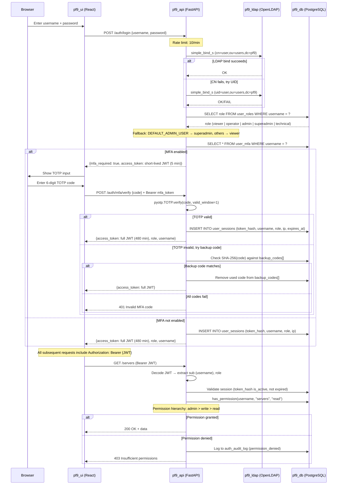
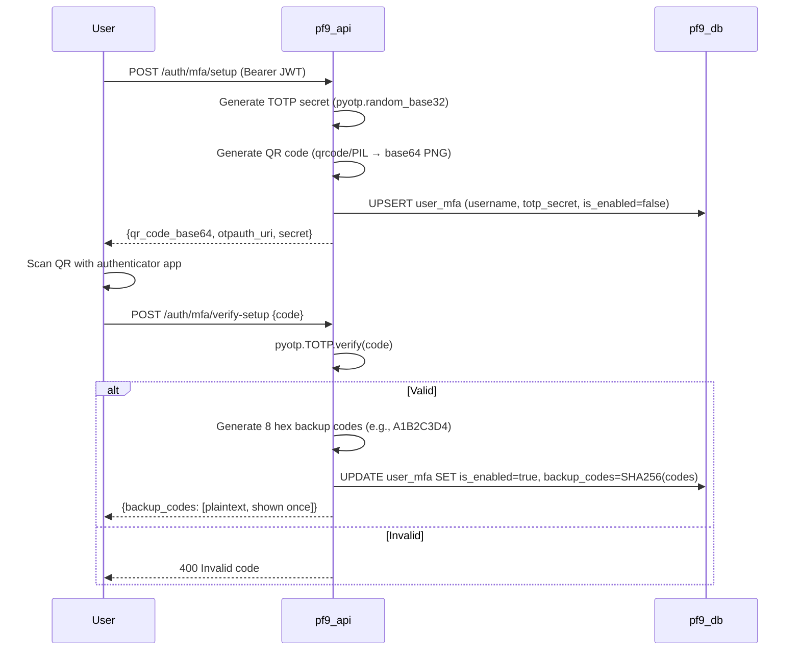
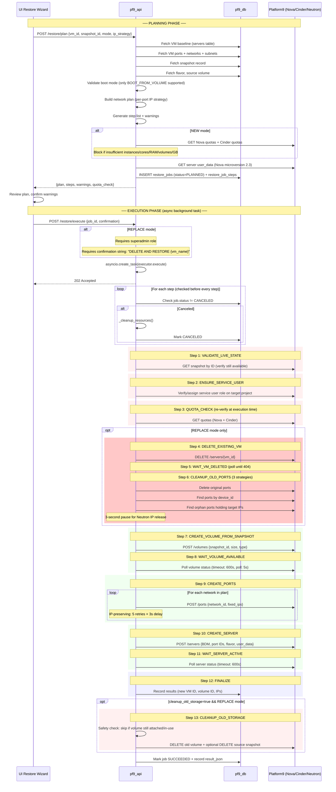
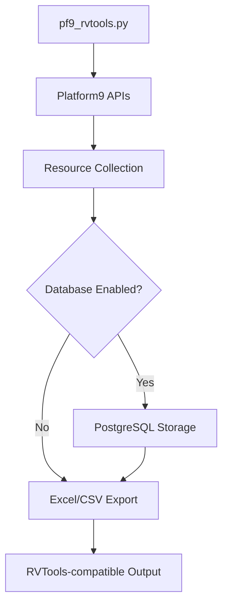
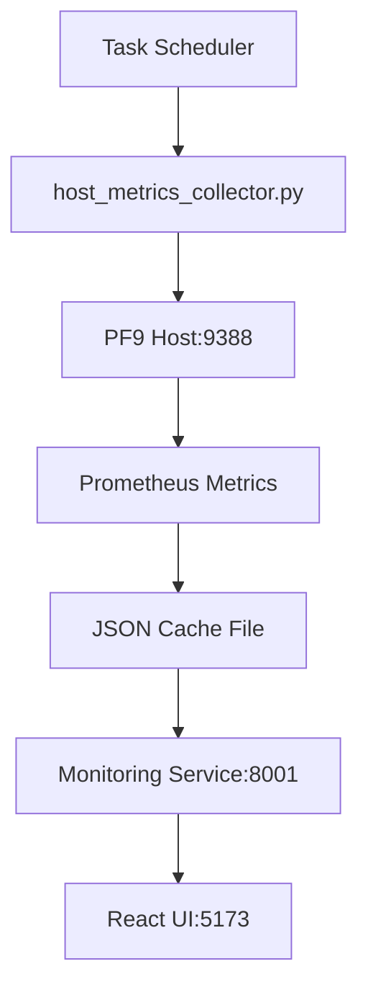
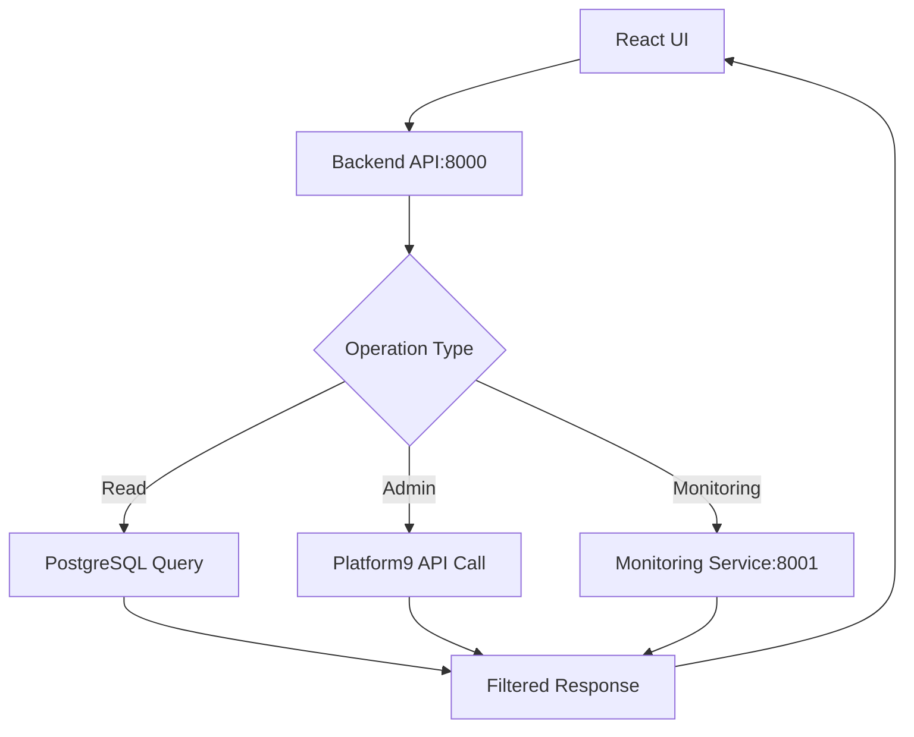
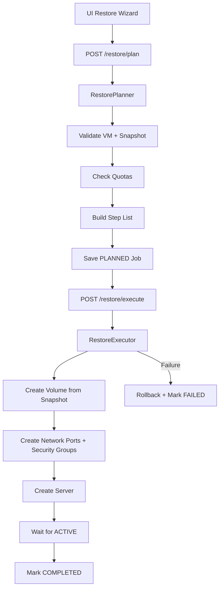
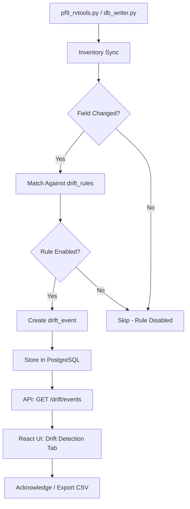
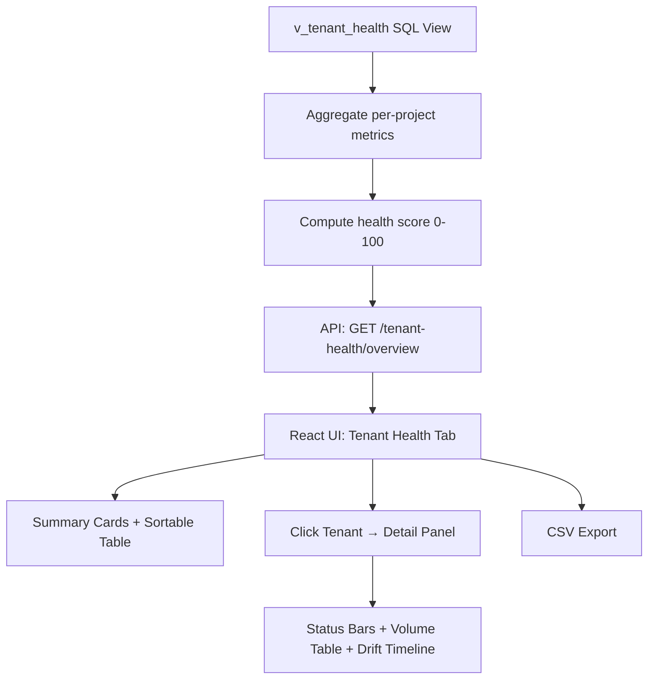
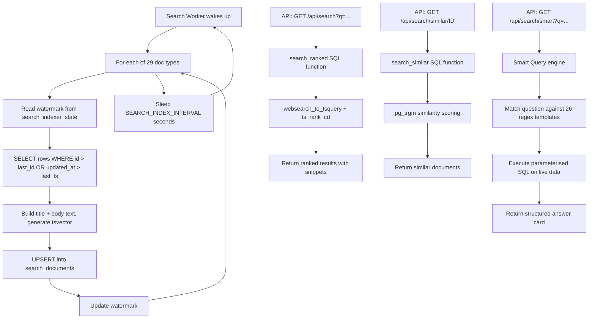

# Platform9 Management System — Architecture Guide

## System Overview

The Platform9 Management System is a **microservices-based enterprise platform** designed for comprehensive OpenStack infrastructure management. The architecture follows modern cloud-native principles with containerized services, API-driven design, and real-time monitoring capabilities.

This document covers:

1. [High-Level Architecture & Trust Boundaries](#-high-level-architecture)
2. [Service Map & Data Flows](#-services-data-flows--trust-boundaries)
3. [Authentication & Authorization Flow](#-authentication--authorization-flow)
4. [Data Model Overview](#-data-model-overview)
5. [Restore Flow & Safety Checks](#-restore-flow--safety-checks)
6. [Component Architecture](#-component-architecture) (all services)
7. [Deployment, Performance & Security](#-deployment-architecture)
8. [Architecture Decision Records](#-architecture-decision-records)

---

## 🏗️ High-Level Architecture

```
┌──────────────────────────────────────────────────────────────────────────────┐
│                      Platform9 Management System                            │
│                                                                              │
│  ┌────────────┐   ┌────────────┐   ┌────────────┐   ┌────────────────────┐  │
│  │  Frontend   │   │  Backend   │   │ Monitoring │   │     Database       │  │
│  │  React/TS   │──▶│  FastAPI   │──▶│  FastAPI   │   │   PostgreSQL 16   │  │
│  │  :5173      │   │  :8000     │──▶│  :8001     │   │   :5432           │  │
│  └────────────┘   └─────┬──────┘   └────────────┘   └────────────────────┘  │
│                         │                                     ▲              │
│            ┌────────────┼────────────────────┐                │              │
│            ▼            ▼                    ▼                │              │
│  ┌──────────────┐ ┌──────────────┐ ┌─────────────────┐       │              │
│  │  Snapshot     │ │ Notification │ │ Metering Worker │───────┘              │
│  │  Worker       │ │ Worker       │ │ (Python)        │                      │
│  │  (Python)     │ │ (Python/SMTP)│ └─────────────────┘                      │
│  └──────┬───────┘ └──────────────┘                                           │
│         │                                                                    │
│  ┌──────┴───────┐  ┌──────────────┐  ┌──────────────┐  ┌──────────────────┐ │
│  │ Backup Worker│  │ LDAP Server  │  │ LDAP Admin   │  │  DB Admin        │ │
│  │ (pg_dump)    │  │ OpenLDAP     │  │ phpLDAPadmin │  │  pgAdmin4        │ │
│  │              │  │ :389 / :636  │  │ :8081        │  │  :8080           │ │
│  └──────────────┘  └──────────────┘  └──────────────┘  └──────────────────┘ │
│                                                                              │
│  ┌──────────────────────────────────────────────────────────────────────────┐│
│  │  Host Scripts (Windows Task Scheduler)                                   ││
│  │  • host_metrics_collector.py  (every 30 min)                            ││
│  │  • pf9_rvtools.py            (daily at 02:00)                           ││
│  └──────────────────────────────────────────────────────────────────────────┘│
└───────────────────────────────────┬──────────────────────────────────────────┘
                                    │
                       ┌────────────▼────────────┐
                       │      Platform9          │
                       │   OpenStack APIs        │
                       │ Keystone · Nova ·       │
                       │ Neutron · Cinder ·      │
                       │ Glance                  │
                       │ + Prometheus            │
                       │ node_exporter (:9388)   │
                       └─────────────────────────┘
```

---

## 🔐 Services, Data Flows & Trust Boundaries

### What talks to Platform9 — and how

```
                       TRUST BOUNDARY
                   ════════════════════
                            │
 INTERNAL NETWORK           │            EXTERNAL (PF9 Cloud)
                            │
  ┌──────────┐              │
  │ Browser  │              │
  └────┬─────┘              │
       │ HTTPS              │
  ┌────▼─────┐              │
  │ pf9_ui   │              │
  │ :5173    │              │
  └────┬─────┘              │
       │ HTTP               │
  ┌────▼──────────┐  Keystone/Nova  ┌──────────────────┐
  │ pf9_api       │────────────────▶│  Platform9 APIs  │
  │ :8000         │  Neutron/Cinder │  (Keystone v3    │
  │               │◀────────────────│   Nova v2.1      │
  │ Pf9Client     │                 │   Neutron v2.0   │
  │ RestoreClient │                 │   Cinder v3)     │
  └──┬──┬──┬──────┘                 └──────────────────┘
     │  │  │                                 ▲
     │  │  │                                 │
     │  │  └──────────┐                      │
     │  │             ▼                      │
     │  │  ┌──────────────────┐              │
     │  │  │ snapshot_worker  │──────────────┘
     │  │  │ (Cinder/Nova)   │  Cross-tenant snapshots
     │  │  └──────────────────┘  via service user
     │  │
     │  └──────────┐
     │             ▼
     │  ┌──────────────────┐      ┌──────────────────┐
     │  │ pf9_monitoring   │◀─────│ host_metrics_    │
     │  │ :8001            │ cache│ collector.py     │
     │  └──────────────────┘      │ (scrapes :9388)  │
     │                            └───────┬──────────┘
     │                                    │ Prometheus
     │                                    ▼
     │                            ┌──────────────────┐
     │                            │ PF9 Compute Hosts│
     │                            │ node_exporter    │
     │                            │ :9388            │
     │                            └──────────────────┘
     ▼
  ┌──────────────┐    ┌──────────────┐
  │ pf9_db       │    │ pf9_ldap     │
  │ PostgreSQL   │    │ OpenLDAP     │
  │ :5432        │    │ :389 / :636  │
  └──────────────┘    └──────────────┘
```

### Service Communication Matrix

| Source | Destination | Protocol | Purpose | Credentials held? |
|---|---|---|---|---|
| **Browser** | pf9_ui (:5173) | HTTP | Serve React SPA | — |
| **pf9_ui** | pf9_api (:8000) | HTTP + JWT Bearer | All data & admin ops | JWT only |
| **pf9_api** | pf9_db (:5432) | TCP/PostgreSQL | Read/write all tables | `POSTGRES_USER/PASSWORD` |
| **pf9_api** | pf9_ldap (:389) | LDAP bind | Authentication | `LDAP_BIND_DN/PASSWORD` |
| **pf9_api** | Platform9 Keystone/Nova/Neutron/Cinder | HTTPS | Proxy operations + provisioning | `PF9_USERNAME/PASSWORD` |
| **pf9_api** | pf9_monitoring (:8001) | HTTP | Fetch cached metrics | — |
| **snapshot_worker** | Platform9 Cinder/Nova/Keystone | HTTPS | Cross-tenant snapshot CRUD | `PF9_USERNAME` + `SNAPSHOT_SERVICE_USER` |
| **snapshot_worker** | pf9_db | TCP/PostgreSQL | Store snapshot/compliance records | `POSTGRES_USER/PASSWORD` |
| **metering_worker** | pf9_api (:8000) + pf9_monitoring (:8001) | HTTP | Collect metrics | — |
| **metering_worker** | pf9_db | TCP/PostgreSQL | Store metering data | `POSTGRES_USER/PASSWORD` |
| **notification_worker** | pf9_db | TCP/PostgreSQL | Read events, log delivery | `POSTGRES_USER/PASSWORD` |
| **notification_worker** | SMTP server | SMTP/TLS | Send emails | `SMTP_USER/PASSWORD` (optional) |
| **backup_worker** | pf9_db | TCP/PostgreSQL | pg_dump/pg_restore | `POSTGRES_USER/PASSWORD` |
| **search_worker** | pf9_db | TCP/PostgreSQL | Index documents for full-text search | `POSTGRES_USER/PASSWORD` |
| **host_metrics_collector** | PF9 hosts (:9388) | HTTP | Scrape Prometheus node_exporter | — |

### Key Security Boundary

> **The API container (`pf9_api`) is the sole gateway** between the management system and Platform9/OpenStack APIs. All PF9 credentials are confined to the API container and the snapshot_worker container. No other service holds Platform9 credentials; the UI, workers, and admin tools communicate only through the API or directly with the local PostgreSQL/LDAP services.

## 🎯 Core Design Principles

### 1. **Microservices Architecture**
- **Loosely coupled services** with well-defined responsibilities
- **Independent deployability** and scaling
- **Technology diversity** (React, FastAPI, PostgreSQL)
- **Container-native design** with Docker Compose orchestration

### 2. **API-First Design**
- **RESTful APIs** with OpenAPI documentation
- **Standardized error handling** and response formats
- **Versioned endpoints** for backward compatibility
- **Real-time data access** with caching strategies

### 3. **Hybrid Deployment Model**
- **Container services** for web components (UI, API, Database)
- **Host-based scripts** for infrastructure access and monitoring
- **Flexible deployment** supporting standalone or full-stack modes

### 4. **Data-Driven Operations**
- **PostgreSQL persistence** with comprehensive relational schema
- **JSON metadata storage** for flexible resource attributes
- **Historical tracking** with audit trails and change detection
- **Cache-based performance** for real-time monitoring

---

## 🔑 Authentication & Authorization Flow

### Full Flow: LDAP Bind → JWT → MFA Challenge → RBAC



### RBAC Enforcement — Two Layers

| Layer | Where | What it does |
|---|---|---|
| **1. Global RBAC Middleware** | Runs on every HTTP request | Extracts JWT → maps URL path to resource name (36-entry lookup) → checks `GET` → `read`, all others → `write` → queries `role_permissions` table |
| **2. Endpoint-Level Dependency** | Per-route `Depends(require_permission(...))` | Double-checks sensitive endpoints requiring elevated actions (e.g., `restore/execute` requires `admin` action, not just `write`) |

**Bypass paths**: `/auth/*`, `/settings/*`, `/static/*`, `/health`, `/metrics`, `/openapi.json`, `/docs`, `/redoc`, `OPTIONS`

### RBAC Permission Matrix (5 Roles)

| Role | Read | Write | Admin | Delete | Notes |
|---|---|---|---|---|---|
| **viewer** | ✅ All resources | ❌ | ❌ | ❌ | Read-only access to all tabs |
| **operator** | ✅ All resources | ✅ Networks, flavors, snapshots, runbooks | ❌ | ❌ | Limited write operations |
| **admin** | ✅ All resources | ✅ All resources | ✅ Most resources | ✅ Resources | Cannot manage users/RBAC |
| **superadmin** | ✅ All resources | ✅ All resources | ✅ Everything | ✅ Everything | Full access including RBAC rules, destructive restore |
| **technical** | ✅ All resources | ✅ Resources, provisioning | ❌ | ❌ | Read + write but no delete permissions |

### MFA Enrollment Flow



---

## 📊 Data Model Overview

### Current State vs. History — The Core Pattern

Every infrastructure resource follows a **dual-table pattern**:

```
┌──────────────────────┐         ┌──────────────────────────┐
│  volumes (current)   │         │ volumes_history          │
├──────────────────────┤         ├──────────────────────────┤
│ id          TEXT PK  │    1──▶N│ id           BIGSERIAL   │
│ name        TEXT     │         │ volume_id    TEXT         │
│ project_id  TEXT FK  │         │ recorded_at  TIMESTAMPTZ │
│ size_gb     INT      │         │ change_hash  TEXT        │
│ status      TEXT     │         │ raw_json     JSONB       │
│ raw_json    JSONB    │         │ run_id       BIGINT FK   │
│ last_seen_at TSTAMPZ │         └──────────────────────────┘
└──────────────────────┘
       │
       └─── If resource disappears between inventory runs:
            ────▶ deletions_history row created
```

**How deduplication works**: Each collection run computes a `change_hash` (content hash) for every resource. A new history row is only inserted if the hash differs from the most recent record for that resource. This prevents unbounded growth while preserving every meaningful state change.

**Retention strategy**: History deduplication via `change_hash` keeps only meaningful state changes. Metering data has configurable retention (default 90 days) with automatic pruning. Notification logs, audit logs, and backup history are retained indefinitely.

### Entity Relationship Diagram

```
┌──────────┐    1   N  ┌──────────┐    1   N  ┌──────────┐
│ domains  │──────────▶│ projects │──────────▶│ servers  │
│          │           │          │           │          │
│          │──────────▶│          │──────────▶│ volumes  │
│          │ 1   N     │          │ 1   N     │          │
└──────────┘           └──────────┘           └──────────┘
     │                      │                      │
     │ 1   N                │ 1   N                │ 1   N
     ▼                      ▼                      ▼
┌──────────┐          ┌──────────┐          ┌──────────────┐
│  users   │          │ networks │          │  snapshots   │
│          │          │          │          │ (volume_id)  │
└──────────┘          └────┬─────┘          └──────────────┘
     │                     │ 1  N
     │                     ▼
     │               ┌──────────┐          ┌──────────────┐
     │               │ subnets  │          │   routers    │
     │               └──────────┘          └──────────────┘
     │                                           │
     │                     ┌──────────┐          │
     │                     │  ports   │──────────┘
     │                     │(network) │    floating_ips
     │                     └──────────┘    (port_id, router_id)
     │
     │               ┌───────────────┐    ┌───────────────────┐
     │               │security_groups│───▶│security_group_rules│
     │               │ (project_id)  │ 1 N│ (CASCADE delete)  │
     │               └───────────────┘    └───────────────────┘
     │
     └──────────▶ role_assignments (role_id, user_id, project_id|domain_id)
                  roles (id, name, domain_id)
                  groups (id, name, domain_id)
```

### Table Catalog (48+ tables)

#### Core Infrastructure (14 tables)

| Table | PK | Key FKs | JSONB | Purpose |
|---|---|---|---|---|
| `domains` | `id` | — | `raw_json` | Keystone domains |
| `projects` | `id` | `domain_id → domains` | `raw_json` | Keystone projects/tenants |
| `servers` | `id` | `project_id → projects` | `raw_json` | Nova VMs |
| `volumes` | `id` | `project_id → projects` | `raw_json` | Cinder volumes |
| `snapshots` | `id` | `volume_id → volumes` | `raw_json` | Cinder volume snapshots |
| `networks` | `id` | `project_id → projects` | `raw_json` | Neutron networks |
| `subnets` | `id` | `network_id → networks` | `raw_json` | Neutron subnets |
| `ports` | `id` | `network_id → networks`, `project_id → projects` | `raw_json`, `ip_addresses` | Neutron ports |
| `routers` | `id` | `project_id → projects` | `raw_json` | Neutron routers |
| `floating_ips` | `id` | `port_id → ports`, `project_id → projects`, `router_id → routers` | `raw_json` | Neutron floating IPs |
| `security_groups` | `id` | `project_id → projects` | `raw_json` | Neutron SGs |
| `security_group_rules` | `id` | `security_group_id → security_groups ON DELETE CASCADE` | — | Neutron SG rules |
| `hypervisors` | `id` | — | `raw_json` | Nova hypervisors |
| `flavors` | `id` | — | `raw_json` | Nova flavors |
| `images` | `id` | — | `raw_json` | Glance images |

#### Identity & Access (6 tables)

| Table | Purpose |
|---|---|
| `users` | Keystone users (FKs to domains, projects) |
| `roles` | Keystone roles |
| `role_assignments` | Many-to-many user↔role↔project/domain scope (UNIQUE constraint) |
| `groups` | Keystone groups |
| `user_access_logs` | User access tracking for analytics (IP, action, success) |
| `volume_types` | Cinder volume types |

#### History & Audit (17 tables)

| Table | Purpose |
|---|---|
| `*_history` (15 tables) | Per-resource change tracking: `domains`, `projects`, `servers`, `volumes`, `snapshots`, `networks`, `subnets`, `ports`, `routers`, `floating_ips`, `security_groups`, `security_group_rules`, `hypervisors`, `users`, `roles` — each with `change_hash` deduplication |
| `deletions_history` | Cross-type deletion tracking (resource_type, resource_id, reason, last snapshot) |
| `inventory_runs` | Per-collection-run metadata (status, source, host, duration) |

#### Auth & Session Management (6 tables)

| Table | Purpose |
|---|---|
| `user_sessions` | Active JWT sessions (SHA-256 token_hash, IP, user_agent, expiry) |
| `user_roles` | Management system RBAC roles (separate from Keystone roles) |
| `role_permissions` | RBAC permission matrix (role × resource × action, UNIQUE constraint) |
| `auth_audit_log` | Login/logout/permission events (IP, user_agent, success, details) |
| `user_mfa` | TOTP enrollment (secret, enabled, SHA-256 hashed backup codes) |
| `departments` | Organizational groups for navigation visibility (7 seeded) |

#### Snapshot Management (8 tables)

| Table | Purpose |
|---|---|
| `snapshot_policy_sets` | Global + tenant-specific policy definitions (policies JSONB, retention_map) |
| `snapshot_assignments` | Volume → policy mapping (UNIQUE on volume_id, tracks assignment source) |
| `snapshot_exclusions` | Excluded volumes with optional expiry for temporary exclusions |
| `snapshot_runs` | Per-run execution tracking (counts: created, deleted, failed, skipped) |
| `snapshot_records` | Individual snapshot events per volume per run (full lifecycle) |
| `snapshot_on_demand_runs` | API-to-scheduler signaling (pending → running → completed/failed) |
| `compliance_reports` | Generated compliance summaries (SLA days, compliant/noncompliant) |
| `compliance_details` | Per-volume compliance records (last snapshot date, days since) |

#### Restore (2 tables)

| Table | Purpose |
|---|---|
| `restore_jobs` | Full restore state machine (PLANNED→PENDING→RUNNING→SUCCEEDED/FAILED/CANCELED). `plan_json` + `result_json` JSONB. **Concurrent restore prevention**: `UNIQUE(vm_id) WHERE status IN ('PENDING','RUNNING')` |
| `restore_job_steps` | Per-step tracking within a job (FK CASCADE). Statuses: PENDING→RUNNING→SUCCEEDED/FAILED/SKIPPED |

#### Notifications (4 tables)

| Table | Purpose |
|---|---|
| `notification_channels` | SMTP configuration (type, name, enabled, config JSONB) |
| `notification_preferences` | Per-user per-event-type subscriptions (severity_min, delivery_mode) |
| `notification_log` | Sent email log with dedup_key and delivery_status |
| `notification_digests` | Daily digest batching state per user |

#### Metering (7 tables)

| Table | Purpose |
|---|---|
| `metering_config` | Worker configuration (collection interval, retention days) |
| `metering_resources` | Per-VM resource metering (vCPU, RAM, disk — deduplicated to latest per VM) |
| `metering_snapshots` | Snapshot count, size, compliance per collection cycle |
| `metering_restores` | Restore operation tracking (status, duration, mode, data transferred) |
| `metering_api_usage` | Endpoint-level call counts, error rates, latency percentiles |
| `metering_efficiency` | Per-VM efficiency scores with classification (excellent/good/fair/poor/idle) |
| `metering_quotas` | Per-tenant quota usage tracking |

#### Navigation, Branding & Provisioning

| Table | Purpose |
|---|---|
| `nav_groups` | Top-level navigation groups (7 groups) |
| `nav_items` | Individual tabs within groups (resource_key for RBAC matching) |
| `department_nav_groups` | Many-to-many: department ↔ nav group visibility |
| `department_nav_items` | Fine-grained department ↔ nav item visibility |
| `user_nav_overrides` | Per-user grant/deny overrides on nav items |
| `app_settings` | Key-value branding/config (company_name, logo, colors, login hero) |
| `user_preferences` | Per-user preferences (tab ordering, etc.) |
| `provisioning_jobs` | Customer provisioning pipeline (domain → project → user → quotas → network) |
| `provisioning_steps` | Per-step tracking within provisioning (FK CASCADE) |
| `activity_log` | Central audit trail for provisioning/domain operations |
| `backup_config` | Single-row backup configuration (schedule, retention) |
| `backup_history` | Backup job log (target, file path, size, duration) |

#### Drift Detection (2 tables)

| Table | Purpose |
|---|---|
| `drift_rules` | 24 built-in rules across 8 resource types (resource_type, field_name, severity, enabled) |
| `drift_events` | Detected changes (old_value → new_value, field_changed, acknowledgment tracking) |

#### Search (2 tables)

| Table | Purpose |
|---|---|
| `search_documents` | Full-text search index — tsvector column with GIN index + pg_trgm indexes on title/body. 9 indexes total. |
| `search_indexer_state` | Per-doc-type watermarks (last_id, last_updated_at, run_count, duration_ms) for incremental indexing |

#### Runbooks (4 tables)

| Table | Purpose |
|---|---|
| `runbooks` | Runbook definitions (name, display_name, category, risk_level, supports_dry_run, parameters_schema JSONB) |
| `runbook_approval_policies` | Per-runbook trigger→approver role mappings (approval_mode, escalation_timeout, daily rate limit). UNIQUE(runbook_name, trigger_role) |
| `runbook_executions` | Full execution audit trail (status lifecycle, dry_run flag, parameters/result JSONB, triggered_by, approved_by, items_found/actioned) |
| `runbook_approvals` | Individual approval records for multi-approval workflows (FK CASCADE to executions) |

### Key Database Views

| View | Purpose |
|---|---|
| `v_volumes_full` | Volumes enriched with tenant, domain, server attachment info |
| `v_security_groups_full` | SGs with attached VM count, network count, ingress/egress rule counts |
| `v_tenant_health` | Per-project health scores (0–100) from server/volume/network/snapshot/drift stats |
| `v_comprehensive_changes` | 16-way UNION of all history tables for unified audit view |
| `v_recent_changes` | Active resources + deletions for recent activity |
| `v_most_changed_resources` | Aggregated change counts for hotspot detection |
| `v_user_activity_summary` | User activity dashboard (role counts, project access, 7/30-day activity) |

---

## 🔄 Restore Flow & Safety Checks

### Architecture: Planner / Executor Pattern

The restore system uses a **two-phase pattern** that separates planning from execution, enabling dry-run validation, quota pre-checks, and user review before any infrastructure changes are made.

### Restore Sequence Diagram



### Safety Mechanisms

| Safety Feature | Implementation |
|---|---|
| **Feature flag** | `RESTORE_ENABLED` env var (default: `false`). All endpoints return 503 when disabled. |
| **Dry-run mode** | `RESTORE_DRY_RUN` env var (default: `false`). All OpenStack mutations return mock IDs — plan is validated without side effects. |
| **Concurrent restore prevention** | PostgreSQL UNIQUE partial index: `UNIQUE(vm_id) WHERE status IN ('PENDING','RUNNING')`. Only one active restore per VM enforced at DB level. |
| **Stale job recovery** | On API startup, all `PENDING`/`RUNNING` jobs are marked `INTERRUPTED` with reason "API restarted while job was in progress". |
| **Per-step heartbeat** | `last_heartbeat` column updated before each step for staleness detection. |
| **Cancellation** | Executor checks `job.status == 'CANCELED'` before each step. Triggers `_cleanup_resources()` on cancellation. |
| **REPLACE mode guard** | Requires superadmin role + exact confirmation string: `"DELETE AND RESTORE {vm_name}"`. |
| **Rollback on failure** | Best-effort cleanup: delete created server → delete created ports → volume preserved by default (configurable via `RESTORE_CLEANUP_VOLUMES`). |
| **Retry support** | `POST /restore/jobs/{job_id}/retry` creates a new job starting from the failed step, reusing resources created by successful steps. Supports `ip_strategy_override` to downgrade. |
| **Manual cleanup** | `POST /restore/jobs/{job_id}/cleanup` extracts created resources from step results and deletes them. Volume deletion requires explicit `delete_volume=true`. |
| **Quota double-check** | Quotas verified both at planning time and again at execution time (Step 3). |
| **Boot mode validation** | Only `BOOT_FROM_VOLUME` VMs supported — boot-from-image returns 400 immediately. |

### Restore Modes & IP Strategies

| Mode | Behavior | Required Role | Confirmation |
|---|---|---|---|
| **NEW** | Creates a new VM alongside the existing one (`{name}-restored-{timestamp}`) | admin | None |
| **REPLACE** | Deletes existing VM, recreates from snapshot | superadmin | `"DELETE AND RESTORE {vm_name}"` |

| IP Strategy | Behavior |
|---|---|
| **NEW_IPS** | Auto-assign fresh IPs via DHCP (default) |
| **TRY_SAME_IPS** | Best-effort IP preservation; falls back to new IPs if original is taken |
| **SAME_IPS_OR_FAIL** | Strict IP preservation; entire restore fails if any original IP unavailable |
| **MANUAL_IP** | Caller specifies `{network_id: "desired_ip"}` map |

---

## 🔧 Component Architecture

### Frontend UI Service
**Technology**: React 19.2 + TypeScript + Vite
**Port**: 5173
**Responsibilities**:
- Modern responsive web interface
- Real-time data visualization
- Administrative operations UI
- Theme support (light/dark mode)

```typescript
// Component Structure
src/
├── App.tsx              # Main application component
├── config.ts            # Centralised API_BASE + MONITORING_BASE config
├── components/
│   └── ThemeToggle.tsx  # Theme switching component
├── hooks/
│   └── useTheme.tsx     # Theme management hook
└── assets/             # Static assets
```

**Key Features**:
- **Type-safe development** with TypeScript
- **Hot module replacement** via Vite
- **Auto-refresh capabilities** for real-time data
- **Advanced filtering and pagination**
- **White-label branding** — Login page customizable via Admin Panel (colors, logo, hero content)
- **Drag-and-drop tab reordering** — Per-user tab order with localStorage + backend persistence
- **Comprehensive dark mode** — Full theme support across all components with CSS variable system
- **Administrative operation forms**

### Backend API Service
**Technology**: FastAPI + Gunicorn + Python 3.11+
**Port**: 8000
**Workers**: 4 uvicorn workers via Gunicorn (configurable)
**Responsibilities**:
- RESTful API endpoints (112+ routes across infrastructure, analytics, tenant health, notifications, restore, and metering)
- Database operations via connection pool (psycopg2 ThreadedConnectionPool)
- Platform9 integration proxy
- Administrative operations
- User management and role tracking
- Historical analysis and audit trails
- Real-time dashboard analytics with 14 endpoints

```python
# API Structure
api/
├── main.py              # FastAPI application and routes (66+ infrastructure endpoints)
├── db_pool.py           # Centralized ThreadedConnectionPool (shared across all modules)
├── dashboards.py        # Analytics dashboard routes (14 endpoints)
├── notification_routes.py # Email notification management (7 endpoints)
├── restore_management.py # Snapshot restore planner + executor (8 endpoints)
├── metering_routes.py    # Operational metering endpoints (14 endpoints + 6 CSV exports)
├── navigation_routes.py  # Department & navigation visibility management (15+ endpoints)
├── performance_metrics.py # Thread-safe request tracking with locking
├── pf9_control.py       # Platform9 API integration
├── requirements.txt     # Python dependencies (incl. gunicorn)
└── Dockerfile          # Container configuration (gunicorn CMD)
```

**API Endpoints** (140+ total across modules):

**Dashboard Analytics Endpoints** (api/dashboards.py - 14 endpoints):
```python
GET  /dashboard/health-summary              # System health metrics
GET  /dashboard/snapshot-sla-compliance      # Tenant compliance tracking
GET  /dashboard/top-hosts-utilization       # Top resource consumers
GET  /dashboard/recent-changes              # 24-hour activity timeline
GET  /dashboard/coverage-risks              # Unprotected volume analysis
GET  /dashboard/capacity-pressure           # Resource quota warnings
GET  /dashboard/vm-hotspots                 # Top resource consumers by metric
GET  /dashboard/tenant-risk-scores          # Multi-factor risk assessment
GET  /dashboard/compliance-drift            # 7-day policy drift trends
GET  /dashboard/capacity-trends             # Capacity forecasting
GET  /dashboard/trendlines                  # 30-day growth patterns
GET  /dashboard/change-compliance           # Post-change verification
GET  /dashboard/tenant-risk-heatmap         # Multi-dimensional risk matrix
GET  /dashboard/tenant-summary              # Quick tenant overview
```

**Infrastructure Management Endpoints** (api/main.py - 66+ endpoints):
```python
# Core Resource Management (19+ types)
GET  /domains                    # List domains
GET  /tenants                    # List projects/tenants  
GET  /servers                    # List VMs with disk size, host utilization
GET  /volumes                    # List volumes with metadata
GET  /snapshots                  # List snapshots
GET  /networks                   # List networks
GET  /subnets                    # List subnets
GET  /ports                      # List ports
GET  /floatingips                # List floating IPs
GET  /security-groups            # List security groups (with counts)
GET  /security-groups/{id}       # Security group detail (rules, VMs, networks)
GET  /security-group-rules       # List security group rules
GET  /flavors                    # List compute flavors
GET  /images                     # List images
GET  /hypervisors                # List hypervisors

# User & Identity Management
GET  /users                      # List users across domains
GET  /users/{user_id}            # User details with roles
GET  /roles                      # List roles
GET  /role-assignments           # Role assignment tracking
GET  /user-activity-summary      # Activity analytics

# Administrative Operations  
POST /admin/flavors              # Create compute flavors
DEL  /admin/flavors/{id}         # Delete flavors
POST /admin/networks             # Create networks
DEL  /admin/networks/{id}        # Delete networks
POST /admin/security-groups      # Create security groups
DEL  /admin/security-groups/{id} # Delete security groups
POST /admin/security-group-rules # Create security group rules
DEL  /admin/security-group-rules/{id}  # Delete rules
POST /admin/user-access-log      # Log user access
```
# Historical & Audit Analysis
GET  /history/recent-changes     # Recent infrastructure changes
GET  /history/most-changed       # Most frequently changed resources
GET  /history/by-timeframe       # Changes by time period
GET  /history/resource/{type}/{id} # Resource-specific history (incl. deletion)
GET  /history/compare/{type}/{id}  # Compare two history snapshots
GET  /history/details/{type}/{id}  # Detailed change info with sequencing
GET  /audit/compliance-report    # Compliance analysis
GET  /audit/change-patterns      # Change pattern analysis

# Snapshot Restore (api/restore_management.py - 8 endpoints, feature-flagged)
GET  /restore/config                   # Feature configuration status
GET  /restore/snapshots                # Available snapshots for restore
GET  /restore/vm/{vm_id}/restore-points # VM-specific restore points
POST /restore/plan                     # Create restore plan
POST /restore/execute                  # Execute restore plan
GET  /restore/jobs                     # List restore jobs
GET  /restore/jobs/{job_id}            # Job details + step progress
POST /restore/cancel/{job_id}          # Cancel running restore

# Drift Detection (api/main.py - 7 endpoints)
GET  /drift/summary                    # Aggregate drift overview
GET  /drift/events                     # List drift events (filtered/paginated)
GET  /drift/events/{id}                # Single drift event detail
PUT  /drift/events/{id}/acknowledge    # Acknowledge single event
PUT  /drift/events/bulk-acknowledge    # Bulk acknowledge events
GET  /drift/rules                      # List 24 built-in rules
PUT  /drift/rules/{rule_id}            # Enable/disable a rule

# Tenant Health (api/main.py - 5 endpoints)
GET  /tenant-health/overview              # All tenants with health scores + compute stats
GET  /tenant-health/heatmap               # Per-tenant utilization heatmap data
GET  /tenant-health/{project_id}          # Full detail for one tenant (vCPUs, RAM, power state)
GET  /tenant-health/trends/{project_id}   # Daily drift/snapshot trend counts
GET  /tenant-health/quota/{project_id}    # Live OpenStack quota vs usage

# Notifications (api/notification_routes.py - 7 endpoints)
GET  /notifications/smtp-status            # SMTP connection status
GET  /notifications/preferences            # User notification preferences
PUT  /notifications/preferences            # Create/update notification preference
DELETE /notifications/preferences/{id}     # Delete a notification preference
GET  /notifications/history                # Notification delivery history
POST /notifications/test-email             # Send test email
GET  /notifications/admin/stats            # Admin notification statistics

# Metering (api/metering_routes.py - 20 endpoints + 6 CSV exports)
GET  /api/metering/config                  # Metering configuration
PUT  /api/metering/config                  # Update metering config (superadmin)
GET  /api/metering/filters                 # Filter dropdown data (projects, domains, flavors)
GET  /api/metering/overview                # High-level metering dashboard
GET  /api/metering/resources               # Per-VM resource metering (DISTINCT per VM)
GET  /api/metering/snapshots               # Snapshot metering records
GET  /api/metering/restores                # Restore operation metering
GET  /api/metering/api-usage               # API usage metering
GET  /api/metering/efficiency              # VM efficiency scores (DISTINCT per VM)
GET  /api/metering/pricing                 # Unified multi-category pricing list
POST /api/metering/pricing                 # Create pricing entry
PUT  /api/metering/pricing/{id}            # Update pricing entry
DELETE /api/metering/pricing/{id}          # Delete pricing entry
POST /api/metering/pricing/sync-flavors    # Auto-import flavors from system
GET  /api/metering/flavor-pricing          # Legacy: flavor pricing (compat)
GET  /api/metering/export/resources        # CSV export: resources
GET  /api/metering/export/snapshots        # CSV export: snapshots
GET  /api/metering/export/restores         # CSV export: restores
GET  /api/metering/export/api-usage        # CSV export: API usage
GET  /api/metering/export/efficiency       # CSV export: efficiency
GET  /api/metering/export/chargeback       # CSV export: chargeback report (multi-category)

# System Health & Testing
GET  /health                     # Service health check
GET  /simple-test                # Basic functionality test
```

### Metering Worker
**Technology**: Python 3.11 + psycopg2 + requests + schedule
**Container**: pf9_metering_worker (background, no port)
**Responsibilities**:
- Periodic collection of resource, snapshot, restore, and API usage metrics
- Efficiency scoring per VM (CPU, RAM, disk utilization classification)
- Configurable collection interval (default 15 minutes)
- Automatic data retention pruning

```python
# Metering Worker Structure
metering_worker/
├── main.py              # Long-running collector with 5 collection tasks
├── requirements.txt     # Dependencies (psycopg2-binary, requests, schedule)
└── Dockerfile          # Python 3.11-slim container
```

**Collection Pipeline**:
```
┌──────────────────────────────────────────────────────────────────────┐
│                    Metering Worker Architecture                      │
├──────────────────────────────────────────────────────────────────────┤
│                                                                      │
│  Data Sources                                                        │
│    ├─ Monitoring Service (:8001)  → VM resource allocation + usage   │
│    ├─ PostgreSQL (metering_*)     → Snapshots, restores from DB      │
│    ├─ API Service (:8000)         → API usage metrics (/metrics)     │
│    └─ Computed                    → Efficiency scores per VM         │
│                     │                                                │
│                     ▼                                                │
│  Metering Worker (Every N minutes, configurable)                     │
│    ├─ collect_resources()     → metering_resources table             │
│    ├─ collect_snapshots()     → metering_snapshots table             │
│    ├─ collect_restores()      → metering_restores table              │
│    ├─ collect_api_usage()     → metering_api_usage table             │
│    ├─ collect_efficiency()    → metering_efficiency table            │
│    └─ prune_old_data()        → Retention cleanup (default 90 days)  │
│                     │                                                │
│                     ▼                                                │
│  API (20 endpoints + 6 CSV exports)                                  │
│    └─ metering_routes.py → Overview, Resources, Snapshots,           │
│       Restores, API Usage, Efficiency, Pricing, Chargeback Export    │
│                     │                                                │
│                     ▼                                                │
│  React UI - Metering Tab (8 sub-tabs, admin-only)                    │
│    └─ Overview │ Resources │ Snapshots │ Restores │ API Usage │      │
│       Efficiency │ Pricing │ Export                                  │
│                                                                      │
└──────────────────────────────────────────────────────────────────────┘
```

### Search Worker
**Technology**: Python + psycopg2 + PostgreSQL tsvector/pg_trgm
**Port**: None (background worker, no HTTP server)  
**Responsibilities**:
- Incremental indexing of 29 document types into `search_documents` table
- Per-doc-type watermark tracking for efficient delta processing
- Full-text search vector generation using `to_tsvector('english', ...)`
- Trigram index maintenance for similarity queries
- Graceful shutdown via SIGTERM/SIGINT signal handling

```
┌──────────────────────────────────────────────────────────────────────┐
│  Search Worker (pf9_search_worker)                          │
│                                                              │
│  main loop (every SEARCH_INDEX_INTERVAL seconds)             │
│    ├─ For each of 29 doc types:                               │
│    │   ├─ Read watermark from search_indexer_state              │
│    │   ├─ SELECT new/updated rows since watermark               │
│    │   ├─ UPSERT into search_documents (ON CONFLICT UPDATE)     │
│    │   └─ Update watermark                                     │
│    ├─ Stale cleanup: DELETE search docs for resources that      │
│    │   no longer exist in source tables (19 infra types)        │
│    └─ Sleep until next interval                               │
│                                                              │
│  Environment: DB_HOST, DB_PORT, DB_NAME, DB_USER, DB_PASS,   │
│               SEARCH_INDEX_INTERVAL (default 300s)            │
└──────────────────────────────────────────────────────────────────────┘
```

### Monitoring Service
**Technology**: FastAPI + Prometheus Client + JSON Cache
**Port**: 8001  
**Responsibilities**:
- Real-time metrics collection and caching
- Host-based data aggregation via Prometheus node_exporter
- Auto-setup detection and management
- UI integration with monitoring dashboard

```python
# Monitoring Structure
monitoring/
├── main.py              # FastAPI monitoring service
├── prometheus_client.py # Prometheus integration
├── models.py           # Data models for metrics
├── requirements.txt    # Dependencies
├── entrypoint.sh       # Container startup script
├── Dockerfile          # Container configuration
└── cache/
    └── metrics_cache.json # Persistent cache storage
```

**Hybrid Collection Model** (Host Scripts → Container Service):
```
┌──────────────────────────────────────────────────────────────────────┐
│                    Monitoring Architecture                           │
├──────────────────────────────────────────────────────────────────────┤
│                                                                      │
│  PF9 Compute Hosts                                                   │
│    ├─ node_exporter:9388    ✅ Working (CPU, Memory, Disk)         │
│    └─ libvirt_exporter:9177 ❌ Blocked (VM metrics - requires PF9)  │
│                     │                                                │
│                     ▼                                                │
│  Host Collector (Windows Task Scheduler - Every 30 min)             │
│    └─ host_metrics_collector.py                                     │
│         ├─ Scrapes node_exporter   ✅                               │
│         ├─ Attempts libvirt_exporter ❌                             │
│         ├─ Resolves hostnames via PF9_HOST_MAP ✅                   │
│         └─ Writes to monitoring/cache/metrics_cache.json ✅          │
│                     │                                                │
│                     ▼                                                │
│  Persistent Cache (Directory Mount: ./monitoring/cache:/tmp/cache)   │
│    └─ /tmp/cache/metrics_cache.json                                 │
│         ├─ Survives container restarts ✅                           │
│         └─ Shared with monitoring container ✅                      │
│                     │                                                │
│                     ▼                                                │
│  Monitoring API (Docker Container - Port 8001)                      │
│    └─ monitoring/main.py (FastAPI)                                  │
│         ├─ Loads cache file ✅                                      │
│         ├─ Serves metrics via REST API ✅                           │
│         └─ Auto-setup detection ✅                                  │
│                     │                                                │
│                     ▼                                                │
│  React UI - Monitoring Tab                                          │
│    └─ Real-time dashboard with auto-refresh ✅                      │
│                                                                      │
└──────────────────────────────────────────────────────────────────────┘
```

**Current Status**:
- ✅ **Host-Level Metrics**: CPU, memory, storage from node_exporter working perfectly
- ❌ **VM-Level Metrics**: Individual VM tracking blocked - libvirt_exporter cannot connect to libvirtd
- ✅ **Cache Persistence**: Metrics survive container restarts
- ✅ **Automated Collection**: Windows Task Scheduler running every 30 minutes
- ✅ **UI Integration**: Monitoring tab displaying host metrics with auto-refresh

**Known Limitation - VM Metrics**:
```python
# From host_metrics_collector.py
async def collect_vm_metrics(self, session, host):
    """Collect VM metrics from libvirt exporter on a single host"""
    try:
        async with session.get(f"http://{host}:9177/metrics", timeout=10) as response:
            # Currently returns connection error:
            # libvirt_up=0 (cannot connect to libvirtd daemon)
```

**Issue**: Libvirt exporter requires access to libvirtd Unix socket (`/var/run/libvirt/libvirt-sock`)  
**Cause**: Permission/configuration issue on PF9 compute nodes  
**Impact**: Cannot track per-VM CPU, memory, disk usage  
**Workaround**: Host-level aggregated metrics still provide operational value  
**Status**: Awaiting Platform9 engineering support to configure libvirtd access  
**Tracking**: See comments in [host_metrics_collector.py](../host_metrics_collector.py)

**Monitoring Endpoints**:
- `GET /` - Service status and version
- `GET /health` - Health check endpoint  
- `GET /auto-setup` - Auto-setup detection and instructions
- `GET /metrics/vms` - VM metrics (limited - returns empty until libvirt access resolved)
- `GET /metrics/hosts` - Host resource metrics ✅ **Working**
- `GET /metrics/summary` - Overall infrastructure summary from cache
- `GET /alerts` - System alerts and notifications

### Database Service
**Technology**: PostgreSQL 16
**Port**: 5432
**Responsibilities**:
- Persistent data storage
- Relational data integrity
- Historical tracking
- Performance optimization

#### Database Schema (90+ Tables with History Tracking)

**Core Infrastructure Tables**:
```sql
-- Identity & Organization (3 tables)
domains, projects, users

-- Compute Resources (4 tables)
servers, hypervisors, flavors, images

-- Storage Resources (3 tables)  
volumes, snapshots, volume_types

-- Network Resources (7 tables)
networks, subnets, ports, routers, floating_ips, 
security_groups, security_group_rules

-- Audit & History (2+ tables)
deletions_history, inventory_runs
-- Plus individual *_history tables for each resource type

-- Drift Detection (2 tables)
drift_rules, drift_events

-- Advanced Views
v_comprehensive_changes, v_volumes_full, v_security_groups_full,
v_tenant_health  -- per-project health score aggregation

-- Notifications (4 tables)
notification_channels, notification_preferences,
notification_log, notification_digests

-- Metering (7 tables)
metering_config, metering_resources, metering_snapshots,
metering_restores, metering_api_usage, metering_quotas,
metering_efficiency
```

**Enhanced Schema Features**:
- **Comprehensive Foreign Keys**: Full referential integrity across all relationships
- **JSONB Metadata Storage**: Flexible attribute storage with GIN indexing
- **Historical Tracking**: Complete audit trail with change hash detection
- **Drift Detection**: Real-time field-level change monitoring with 24 built-in rules across 8 resource types
- **Composite Indexes**: Multi-column indexes for efficient filtering and sorting
- **Timestamp Precision**: Accurate change attribution with millisecond precision
- **Deletion Tracking**: Comprehensive deletion history across all resource types

### Host-Based Scripts
**Technology**: Python 3.11+
**Deployment**: Windows host with Task Scheduler
**Responsibilities**:
- Infrastructure discovery and inventory
- Real-time metrics collection  
- Snapshot automation and policy management
- Compliance reporting

#### Core Scripts Architecture

**1. Infrastructure Discovery** ([pf9_rvtools.py](../pf9_rvtools.py))
```python
# Main discovery workflow
def main():
    # 1. Authenticate with Platform9
    session = get_session_best_scope()
    
    # 2. Collect all resource types (19+)
    domains = list_domains_all(session)
    projects = list_projects_all(session)  
    servers = nova_servers_all(session)
    # ... additional resources
    
    # 3. Database operations (optional)
    if ENABLE_DB:
        upsert_domains(conn, domains)
        upsert_servers(conn, servers)
        # ... store all resources
        
    # 4. Excel/CSV export
    export_workbook(domains, projects, servers, ...)
```

**2. Real-Time Monitoring** ([host_metrics_collector.py](../host_metrics_collector.py))
```python
# Metrics collection workflow
class HostMetricsCollector:
    async def collect_all_metrics(self):
        # 1. Collect host metrics (node_exporter:9388) ✅
        host_metrics = await self.collect_host_metrics()
        
        # 2. Collect VM metrics (libvirt_exporter:9177) ❌
        vm_metrics = await self.collect_vm_metrics()
        
        # 3. Cache results persistently
        self.save_to_cache(host_metrics, vm_metrics)
```

**3. Snapshot Management** ([p9_auto_snapshots.py](../snapshots/p9_auto_snapshots.py))
```python
# Policy-driven snapshot workflow with cross-tenant service user
def main():
    # 1. Admin session: list all volumes (all_tenants=1)
    volumes = get_volumes_with_policies()
    
    # 2. Group volumes by tenant project
    for project_id, project_volumes in group_by_project(volumes):
        # 3. Ensure service user has admin role
        ensure_service_user(admin_session, keystone_url, project_id)
        
        # 4. Authenticate as service user scoped to tenant project
        service_session = get_service_user_session(project_id, ...)
        
        # 5. Create snapshots in correct tenant (using service user session)
        for volume in project_volumes:
            process_volume(admin_session, service_session, volume, policy)
                
    # 6. Cleanup old snapshots per retention
    cleanup_expired_snapshots()
```

**4. Snapshot Service User** ([snapshot_service_user.py](../snapshots/snapshot_service_user.py))
```python
# Cross-tenant role management and authentication
# - Finds service user in Keystone by email
# - Assigns admin role on each tenant project (cached per-run)
# - Password: plaintext or Fernet-encrypted from .env
# - Graceful fallback to admin session if unavailable
```

## 🔄 Data Flow Architecture

### 1. Infrastructure Discovery Flow


### 2. Real-Time Monitoring Flow


### 3. Web Interface Flow


### 4. Snapshot Restore Flow


### 5. Drift Detection Flow


### 6. Tenant Health Flow


### 7. Search Indexing Flow


## 🚀 Deployment Architecture

### Docker Compose Stack
```yaml
# Service Dependencies (12 containers)
┌─────────────┐    ┌─────────────┐    ┌─────────────┐
│   pf9_ui    │───▶│   pf9_api   │───▶│   pf9_db    │
│  (React)    │    │  (FastAPI)  │    │(PostgreSQL)│
└─────────────┘    └─────────────┘    └─────────────┘
       │                   │                   │
       └─────────┬─────────┴─────────┬─────────┘
                 ▼                   ▼
        ┌─────────────┐    ┌─────────────┐
        │pf9_monitoring│    │ pf9_pgadmin │
        │  (FastAPI)  │    │ (Database)  │
        └─────────────┘    └─────────────┘
                 │
        ┌─────────────────────┐    ┌─────────────────────┐
        │pf9_notification_    │    │pf9_snapshot_worker  │
        │worker (Python/SMTP) │    │   (Python)          │
        └─────────────────────┘    └─────────────────────┘
        ┌─────────────────────┐    ┌─────────────────────┐
        │pf9_backup_worker    │    │pf9_search_worker   │
        │  (Python/pg_dump)   │    │  (Python/psycopg2)  │
        └─────────────────────┘    └─────────────────────┘
```

### Host Integration Points
```
┌─────────────────────────────────────────┐
│              Windows Host               │
│  ┌─────────────────────────────────────┐│
│  │        Task Scheduler               ││
│  │  • host_metrics_collector.py       ││
│  │    (Every 30 minutes)              ││
│  │  • pf9_rvtools.py                  ││
│  │    (On demand / scheduled)         ││
│  └─────────────────────────────────────┘│
│  ┌─────────────────────────────────────┐│
│  │        Docker Containers           ││
│  │  • UI, API, Monitoring, Database   ││
│  └─────────────────────────────────────┘│
└─────────────────────────────────────────┘
```

## 📊 Performance Architecture

### Caching Strategy
**1. Database Connection Pooling**:
- `ThreadedConnectionPool` (psycopg2) with min=2, max=10 connections per worker
- Context manager pattern (`with get_connection() as conn:`) for auto-commit/rollback/return
- 4 Gunicorn workers × 10 max connections = 40 max DB connections (within PostgreSQL default of 100)
- Configurable via `DB_POOL_MIN_CONN` and `DB_POOL_MAX_CONN` environment variables

**2. Database Query Optimization**:
- Composite indexes on frequently filtered columns
- JSONB GIN indexes for metadata queries

**2. Monitoring Cache**:
- File-based JSON cache for metrics data
- 60-second TTL with configurable refresh
- Persistent storage across container restarts

**3. API Response Caching**:
- Paginated responses with efficient offset/limit
- Filtered queries with optimized WHERE clauses
- Real-time data with minimal latency

### Scalability Considerations
**Horizontal Scaling**:
- API service: 4 Gunicorn workers per container, multiple containers behind load balancer
- Database: Read replicas for query scaling
- Monitoring: Distributed collection with aggregation

**Resource Optimization**:
- Container resource limits and requests
- Database connection pooling (ThreadedConnectionPool, 10 connections/worker)
- Thread-safe performance metrics with lock-protected snapshots
- Efficient query patterns with proper indexing

## 🔒 Security Architecture

### Authentication & Authorization

**LDAP + JWT Authentication**:
- LDAP directory service for user management (OpenLDAP)
- JWT-based authentication with configurable token expiry
- Role-based access control (RBAC) with superadmin, admin, operator, viewer, technical roles
- 3-layer authorization: Authentication (LDAP) → Authorization (RBAC) → Visibility (departments + navigation)
- `user_roles`, `role_permissions`, `departments`, `nav_groups`, `nav_items` database tables for authorization

**Multi-Factor Authentication (MFA)**:
- TOTP-based two-factor authentication (Google Authenticator compatible)
- Two-step JWT challenge flow: login → `mfa_token` (5 min TTL) → TOTP verify → full JWT
- QR code enrollment with manual key fallback
- 8 one-time SHA-256 hashed backup recovery codes
- `user_mfa` database table (username, totp_secret, is_enabled, backup_codes)
- Self-service setup/disable via MFASettings modal, admin user list view
- Dependencies: `pyotp` (TOTP), `qrcode[pil]` (QR generation)

**Snapshot Service User**:
- Dedicated service account (configured via `SNAPSHOT_SERVICE_USER_EMAIL`) for cross-tenant operations
- Admin role automatically assigned per-project via Keystone API
- Password stored encrypted (Fernet) or as plaintext in `.env`
- See [Snapshot Service User Guide](SNAPSHOT_SERVICE_USER.md)

**Production Requirements**:
- Restricted CORS policy (configure `CORS_ORIGINS` in `.env`)
- HTTPS/TLS encryption via reverse proxy
- Secure `.env` file permissions
- Regular credential rotation

### Network Security
**Current Topology**:
```
Internet → [No TLS] → Services
              ↓
        [HTTP Only]
              ↓
    Platform9 Cluster
```

**Recommended Topology**:
```
Internet → [Reverse Proxy + TLS] → [Internal Network] → Services
                     ↓
              [Certificate Management]
                     ↓
             [Encrypted Communication] 
                     ↓
            Platform9 Cluster (HTTPS)
```

## 🔧 Configuration Management

### Environment Configuration
**Required Environment Variables**:
```bash
# Platform9 Authentication
PF9_USERNAME=service-account@company.com
PF9_PASSWORD=secure-password
PF9_AUTH_URL=https://cluster.platform9.com/keystone/v3
PF9_USER_DOMAIN=Default
PF9_PROJECT_NAME=service
PF9_PROJECT_DOMAIN=Default
PF9_REGION_NAME=region-one

# Database Configuration
POSTGRES_USER=pf9
POSTGRES_PASSWORD=secure-db-password
POSTGRES_DB=pf9_mgmt

# Service Configuration
PF9_DB_HOST=db
PF9_ENABLE_DB=1
PF9_OUTPUT_DIR=/reports

# Monitoring Configuration
# PF9_HOST_MAP=10.0.1.10:host-01,10.0.1.11:host-02

# Snapshot Service User (Cross-Tenant Snapshots)
SNAPSHOT_SERVICE_USER_EMAIL=<your-snapshot-user@your-domain.com>
SNAPSHOT_SERVICE_USER_PASSWORD=<password>          # Option A: plaintext
# OR
SNAPSHOT_PASSWORD_KEY=<Fernet-key>                 # Option B: encrypted
SNAPSHOT_USER_PASSWORD_ENCRYPTED=<encrypted-pwd>
```

### Service Configuration Files
- **[docker-compose.yml](../docker-compose.yml)**: Service orchestration
- **[.env.template](../.env.template)**: Environment variable template
- **[startup.ps1](../startup.ps1)**: Automated deployment script
- **[snapshot_policy_rules.json](../snapshot_policy_rules.json)**: Policy assignment rules

## 🔍 Monitoring & Observability

### Application Metrics
**Health Endpoints**:
- `GET /health` - Service health status
- `GET /simple-test` - Basic functionality verification
- `docker-compose ps` - Container status

**Performance Monitoring**:
- Response time tracking via API logs
- Database query performance monitoring
- Resource utilization via Docker stats
- Cache hit/miss ratios

### Infrastructure Metrics
**Host-Level Monitoring**:
- CPU, Memory, Storage utilization
- Network interface statistics
- System load and process counts
- Disk I/O performance

**Application-Level Monitoring**:
- API request/response times
- Database connection pool status
- Cache performance metrics
- Error rates and patterns

### Log Aggregation
**Current Logging**:
```bash
# Container logs
docker-compose logs pf9_api
docker-compose logs pf9_monitoring
docker-compose logs pf9_ui

# Script execution logs  
python pf9_rvtools.py > rvtools.log 2>&1
python host_metrics_collector.py > metrics.log 2>&1
```

**Recommended Centralized Logging**:
- Structured JSON logging
- Log aggregation with ELK stack or similar
- Audit trail for administrative operations
- Error tracking and alerting

## 🚧 Known Limitations & Future Enhancements

### Current Limitations
1. **VM-Level Monitoring**: Requires Platform9 engineering support for libvirt access
2. **Security**: Development-mode configuration not production-ready
3. **Authentication**: No user authentication or authorization
4. **High Availability**: Single-instance services without failover
5. ~~**Backup Strategy**: Manual database backup procedures~~ → Automated via `backup_worker` container (v1.13)

### Planned Enhancements
1. **Security Hardening**: Authentication, HTTPS, secure defaults
2. **High Availability**: Load balancers, service redundancy
3. **Advanced Monitoring**: Alerting, dashboards, trend analysis
4. **API Versioning**: Backward-compatible API evolution
5. **Multi-Tenancy**: Tenant isolation and access controls

## 📚 Architecture Decision Records

### ADR-001: Microservices vs Monolith
**Decision**: Microservices architecture
**Rationale**: 
- Independent scaling of UI, API, and monitoring components
- Technology diversity (React, FastAPI, Python scripts)
- Container-native deployment
- Clear separation of concerns

### ADR-002: Database Choice
**Decision**: PostgreSQL over NoSQL
**Rationale**:
- Relational data with foreign key relationships
- ACID compliance for data integrity
- Strong JSON support via JSONB
- Mature ecosystem and tooling

### ADR-003: Hybrid Host-Container Model
**Decision**: Critical scripts run on host, services in containers
**Rationale**:
- Host scripts need direct network access to PF9 infrastructure
- Containers provide isolation for web services
- Easier credential management for OpenStack APIs
- Windows Task Scheduler integration for automation

### ADR-004: Cache-Based Monitoring
**Decision**: File-based JSON cache over database storage
**Rationale**:
- Persistent across container restarts
- Simple implementation without database overhead
- Fast read access for real-time UI updates
- Easy debugging and monitoring

### ADR-005: Planner/Executor Restore Pattern
**Decision**: Two-phase restore with separate planning and execution stages
**Rationale**:
- Planning can run without any side effects (safe preview)
- Quota validation before any resources are created
- Users can review the full plan, including warnings, before committing
- Failed jobs can be retried from the failed step without re-creating successful resources
- Async execution with per-step heartbeat and cancellation support
- Rollback is scoped and deterministic

### ADR-006: Dual-Table History Pattern
**Decision**: Separate `*_history` tables per resource type with `change_hash` deduplication
**Rationale**:
- Keeps the current-state table fast and small for real-time queries
- Only meaningful state changes are stored (hash-based deduplication)
- Allows unlimited retention without impacting read performance
- Supports compliance auditing and forensic analysis of any resource over time
- `deletions_history` provides a cross-type view of resource removal events

This architecture provides a solid foundation for enterprise OpenStack management while maintaining flexibility for future enhancements and production hardening.