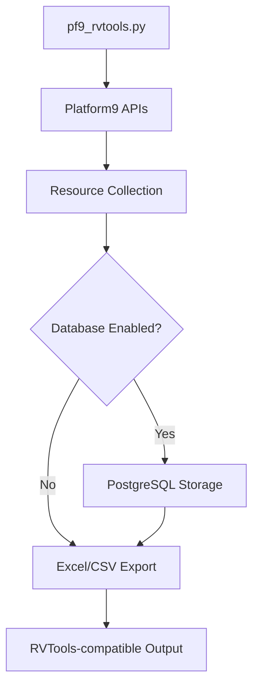
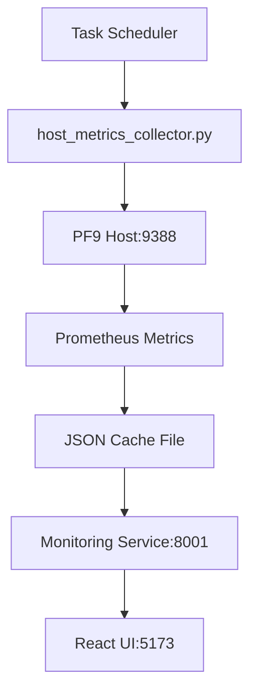
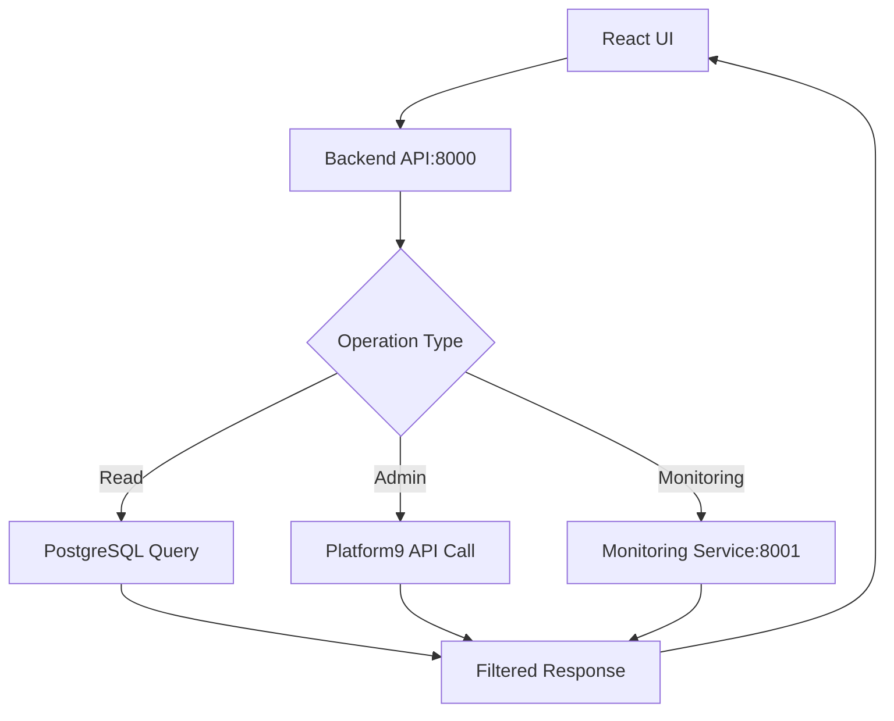
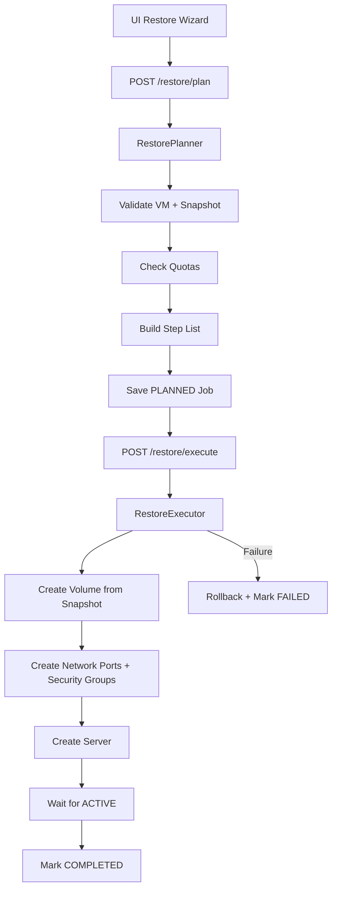
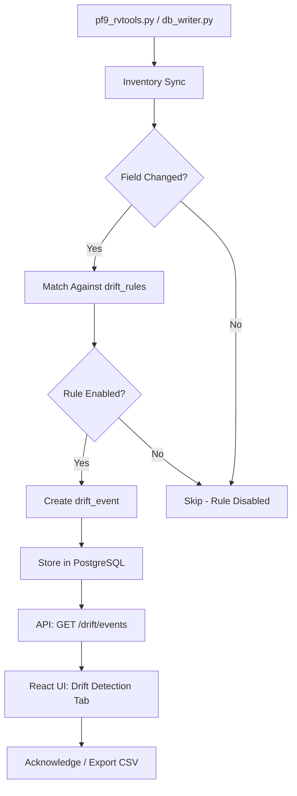
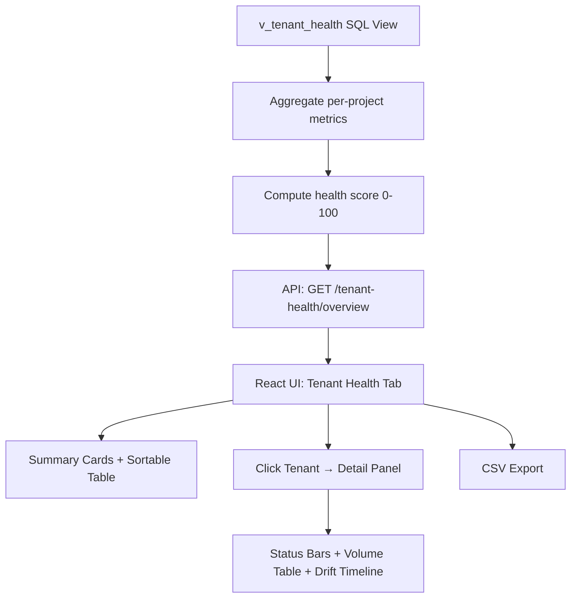

# Platform9 Management System - Architecture Guide

## System Overview

The Platform9 Management System is a **microservices-based enterprise platform** designed for comprehensive OpenStack infrastructure management. The architecture follows modern cloud-native principles with containerized services, API-driven design, and real-time monitoring capabilities.

## 🏗️ High-Level Architecture

```
┌─────────────────────────────────────────────────────────────────────────────┐
│                    Platform9 Management System                             │
├──────────────┬──────────────┬──────────────┬──────────────┬─────────────────┤
│  Frontend UI │  Backend API │  Monitoring  │   Database   │  Host Scripts   │
│  React/TS    │   FastAPI    │   FastAPI    │ PostgreSQL16 │    Python       │
│  Port: 5173  │  Port: 8000  │  Port: 8001  │ Port: 5432   │   Scheduled     │
└──────────────┴──────────────┴──────────────┴──────────────┴─────────────────┘
                                    │
                       ┌─────────────────────────┐
                       │      Platform9          │
                       │   OpenStack APIs        │
                       │ (Keystone, Nova,        │
                       │ Neutron, Cinder,        │
                       │ Glance) + Prometheus    │
                       │ node_exporter (9388)    │
                       └─────────────────────────┘
```

## 🎯 Core Design Principles

### 1. **Microservices Architecture**
- **Loosely coupled services** with well-defined responsibilities
- **Independent deployability** and scaling
- **Technology diversity** (React, FastAPI, PostgreSQL)
- **Container-native design** with Docker Compose orchestration

### 2. **API-First Design**
- **RESTful APIs** with OpenAPI documentation
- **Standardized error handling** and response formats
- **Versioned endpoints** for backward compatibility
- **Real-time data access** with caching strategies

### 3. **Hybrid Deployment Model**
- **Container services** for web components (UI, API, Database)
- **Host-based scripts** for infrastructure access and monitoring
- **Flexible deployment** supporting standalone or full-stack modes

### 4. **Data-Driven Operations**
- **PostgreSQL persistence** with comprehensive relational schema
- **JSON metadata storage** for flexible resource attributes
- **Historical tracking** with audit trails and change detection
- **Cache-based performance** for real-time monitoring

## 🔧 Component Architecture

### Frontend UI Service
**Technology**: React 19.2 + TypeScript + Vite
**Port**: 5173
**Responsibilities**:
- Modern responsive web interface
- Real-time data visualization
- Administrative operations UI
- Theme support (light/dark mode)

```typescript
// Component Structure
src/
├── App.tsx              # Main application component
├── config.ts            # Centralised API_BASE + MONITORING_BASE config
├── components/
│   └── ThemeToggle.tsx  # Theme switching component
├── hooks/
│   └── useTheme.tsx     # Theme management hook
└── assets/             # Static assets
```

**Key Features**:
- **Type-safe development** with TypeScript
- **Hot module replacement** via Vite
- **Auto-refresh capabilities** for real-time data
- **Advanced filtering and pagination**
- **White-label branding** — Login page customizable via Admin Panel (colors, logo, hero content)
- **Drag-and-drop tab reordering** — Per-user tab order with localStorage + backend persistence
- **Comprehensive dark mode** — Full theme support across all components with CSS variable system
- **Administrative operation forms**

### Backend API Service
**Technology**: FastAPI + Python 3.11+
**Port**: 8000
**Responsibilities**:
- RESTful API endpoints (91+ routes across infrastructure, analytics, tenant health, and restore)
- Database operations and queries
- Platform9 integration proxy
- Administrative operations
- User management and role tracking
- Historical analysis and audit trails
- Real-time dashboard analytics with 14 endpoints

```python
# API Structure
api/
├── main.py              # FastAPI application and routes (66+ infrastructure endpoints)
├── dashboards.py        # Analytics dashboard routes (14 endpoints)
├── restore_management.py # Snapshot restore planner + executor (8 endpoints)
├── pf9_control.py       # Platform9 API integration
├── requirements.txt     # Python dependencies
└── Dockerfile          # Container configuration
```

**API Endpoints** (83+ total across two modules):

**Dashboard Analytics Endpoints** (api/dashboards.py - 14 endpoints):
```python
GET  /dashboard/health-summary              # System health metrics
GET  /dashboard/snapshot-sla-compliance      # Tenant compliance tracking
GET  /dashboard/top-hosts-utilization       # Top resource consumers
GET  /dashboard/recent-changes              # 24-hour activity timeline
GET  /dashboard/coverage-risks              # Unprotected volume analysis
GET  /dashboard/capacity-pressure           # Resource quota warnings
GET  /dashboard/vm-hotspots                 # Top resource consumers by metric
GET  /dashboard/tenant-risk-scores          # Multi-factor risk assessment
GET  /dashboard/compliance-drift            # 7-day policy drift trends
GET  /dashboard/capacity-trends             # Capacity forecasting
GET  /dashboard/trendlines                  # 30-day growth patterns
GET  /dashboard/change-compliance           # Post-change verification
GET  /dashboard/tenant-risk-heatmap         # Multi-dimensional risk matrix
GET  /dashboard/tenant-summary              # Quick tenant overview
```

**Infrastructure Management Endpoints** (api/main.py - 66+ endpoints):
```python
# Core Resource Management (19+ types)
GET  /domains                    # List domains
GET  /tenants                    # List projects/tenants  
GET  /servers                    # List VMs with disk size, host utilization
GET  /volumes                    # List volumes with metadata
GET  /snapshots                  # List snapshots
GET  /networks                   # List networks
GET  /subnets                    # List subnets
GET  /ports                      # List ports
GET  /floatingips                # List floating IPs
GET  /security-groups            # List security groups (with counts)
GET  /security-groups/{id}       # Security group detail (rules, VMs, networks)
GET  /security-group-rules       # List security group rules
GET  /flavors                    # List compute flavors
GET  /images                     # List images
GET  /hypervisors                # List hypervisors

# User & Identity Management
GET  /users                      # List users across domains
GET  /users/{user_id}            # User details with roles
GET  /roles                      # List roles
GET  /role-assignments           # Role assignment tracking
GET  /user-activity-summary      # Activity analytics

# Administrative Operations  
POST /admin/flavors              # Create compute flavors
DEL  /admin/flavors/{id}         # Delete flavors
POST /admin/networks             # Create networks
DEL  /admin/networks/{id}        # Delete networks
POST /admin/security-groups      # Create security groups
DEL  /admin/security-groups/{id} # Delete security groups
POST /admin/security-group-rules # Create security group rules
DEL  /admin/security-group-rules/{id}  # Delete rules
POST /admin/user-access-log      # Log user access
```
# Historical & Audit Analysis
GET  /history/recent-changes     # Recent infrastructure changes
GET  /history/most-changed       # Most frequently changed resources
GET  /history/by-timeframe       # Changes by time period
GET  /history/resource/{type}/{id} # Resource-specific history (incl. deletion)
GET  /history/compare/{type}/{id}  # Compare two history snapshots
GET  /history/details/{type}/{id}  # Detailed change info with sequencing
GET  /audit/compliance-report    # Compliance analysis
GET  /audit/change-patterns      # Change pattern analysis

# Snapshot Restore (api/restore_management.py - 8 endpoints, feature-flagged)
GET  /restore/config                   # Feature configuration status
GET  /restore/snapshots                # Available snapshots for restore
GET  /restore/vm/{vm_id}/restore-points # VM-specific restore points
POST /restore/plan                     # Create restore plan
POST /restore/execute                  # Execute restore plan
GET  /restore/jobs                     # List restore jobs
GET  /restore/jobs/{job_id}            # Job details + step progress
POST /restore/cancel/{job_id}          # Cancel running restore

# Drift Detection (api/main.py - 7 endpoints)
GET  /drift/summary                    # Aggregate drift overview
GET  /drift/events                     # List drift events (filtered/paginated)
GET  /drift/events/{id}                # Single drift event detail
PUT  /drift/events/{id}/acknowledge    # Acknowledge single event
PUT  /drift/events/bulk-acknowledge    # Bulk acknowledge events
GET  /drift/rules                      # List 24 built-in rules
PUT  /drift/rules/{rule_id}            # Enable/disable a rule

# Tenant Health (api/main.py - 5 endpoints)
GET  /tenant-health/overview              # All tenants with health scores + compute stats
GET  /tenant-health/heatmap               # Per-tenant utilization heatmap data
GET  /tenant-health/{project_id}          # Full detail for one tenant (vCPUs, RAM, power state)
GET  /tenant-health/trends/{project_id}   # Daily drift/snapshot trend counts
GET  /tenant-health/quota/{project_id}    # Live OpenStack quota vs usage

# System Health & Testing
GET  /health                     # Service health check
GET  /simple-test                # Basic functionality test
```

### Monitoring Service
**Technology**: FastAPI + Prometheus Client + JSON Cache
**Port**: 8001  
**Responsibilities**:
- Real-time metrics collection and caching
- Host-based data aggregation via Prometheus node_exporter
- Auto-setup detection and management
- UI integration with monitoring dashboard

```python
# Monitoring Structure
monitoring/
├── main.py              # FastAPI monitoring service
├── prometheus_client.py # Prometheus integration
├── models.py           # Data models for metrics
├── requirements.txt    # Dependencies
├── entrypoint.sh       # Container startup script
├── Dockerfile          # Container configuration
└── cache/
    └── metrics_cache.json # Persistent cache storage
```

**Hybrid Collection Model** (Host Scripts → Container Service):
```
┌──────────────────────────────────────────────────────────────────────┐
│                    Monitoring Architecture                           │
├──────────────────────────────────────────────────────────────────────┤
│                                                                      │
│  PF9 Compute Hosts                                                   │
│    ├─ node_exporter:9388    ✅ Working (CPU, Memory, Disk)         │
│    └─ libvirt_exporter:9177 ❌ Blocked (VM metrics - requires PF9)  │
│                     │                                                │
│                     ▼                                                │
│  Host Collector (Windows Task Scheduler - Every 30 min)             │
│    └─ host_metrics_collector.py                                     │
│         ├─ Scrapes node_exporter   ✅                               │
│         ├─ Attempts libvirt_exporter ❌                             │
│         ├─ Resolves hostnames via PF9_HOST_MAP ✅                   │
│         └─ Writes to monitoring/cache/metrics_cache.json ✅          │
│                     │                                                │
│                     ▼                                                │
│  Persistent Cache (Directory Mount: ./monitoring/cache:/tmp/cache)   │
│    └─ /tmp/cache/metrics_cache.json                                 │
│         ├─ Survives container restarts ✅                           │
│         └─ Shared with monitoring container ✅                      │
│                     │                                                │
│                     ▼                                                │
│  Monitoring API (Docker Container - Port 8001)                      │
│    └─ monitoring/main.py (FastAPI)                                  │
│         ├─ Loads cache file ✅                                      │
│         ├─ Serves metrics via REST API ✅                           │
│         └─ Auto-setup detection ✅                                  │
│                     │                                                │
│                     ▼                                                │
│  React UI - Monitoring Tab                                          │
│    └─ Real-time dashboard with auto-refresh ✅                      │
│                                                                      │
└──────────────────────────────────────────────────────────────────────┘
```

**Current Status**:
- ✅ **Host-Level Metrics**: CPU, memory, storage from node_exporter working perfectly
- ❌ **VM-Level Metrics**: Individual VM tracking blocked - libvirt_exporter cannot connect to libvirtd
- ✅ **Cache Persistence**: Metrics survive container restarts
- ✅ **Automated Collection**: Windows Task Scheduler running every 30 minutes
- ✅ **UI Integration**: Monitoring tab displaying host metrics with auto-refresh

**Known Limitation - VM Metrics**:
```python
# From host_metrics_collector.py
async def collect_vm_metrics(self, session, host):
    """Collect VM metrics from libvirt exporter on a single host"""
    try:
        async with session.get(f"http://{host}:9177/metrics", timeout=10) as response:
            # Currently returns connection error:
            # libvirt_up=0 (cannot connect to libvirtd daemon)
```

**Issue**: Libvirt exporter requires access to libvirtd Unix socket (`/var/run/libvirt/libvirt-sock`)  
**Cause**: Permission/configuration issue on PF9 compute nodes  
**Impact**: Cannot track per-VM CPU, memory, disk usage  
**Workaround**: Host-level aggregated metrics still provide operational value  
**Status**: Awaiting Platform9 engineering support to configure libvirtd access  
**Tracking**: See comments in [host_metrics_collector.py](../host_metrics_collector.py)

**Monitoring Endpoints**:
- `GET /` - Service status and version
- `GET /health` - Health check endpoint  
- `GET /auto-setup` - Auto-setup detection and instructions
- `GET /metrics/vms` - VM metrics (limited - returns empty until libvirt access resolved)
- `GET /metrics/hosts` - Host resource metrics ✅ **Working**
- `GET /metrics/summary` - Overall infrastructure summary from cache
- `GET /alerts` - System alerts and notifications

### Database Service
**Technology**: PostgreSQL 16
**Port**: 5432
**Responsibilities**:
- Persistent data storage
- Relational data integrity
- Historical tracking
- Performance optimization

#### Database Schema (19+ Tables with History Tracking)

**Core Infrastructure Tables**:
```sql
-- Identity & Organization (3 tables)
domains, projects, users

-- Compute Resources (4 tables)
servers, hypervisors, flavors, images

-- Storage Resources (3 tables)  
volumes, snapshots, volume_types

-- Network Resources (7 tables)
networks, subnets, ports, routers, floating_ips, 
security_groups, security_group_rules

-- Audit & History (2+ tables)
deletions_history, inventory_runs
-- Plus individual *_history tables for each resource type

-- Drift Detection (2 tables)
drift_rules, drift_events

-- Advanced Views
v_comprehensive_changes, v_volumes_full, v_security_groups_full,
v_tenant_health  -- per-project health score aggregation
```

**Enhanced Schema Features**:
- **Comprehensive Foreign Keys**: Full referential integrity across all relationships
- **JSONB Metadata Storage**: Flexible attribute storage with GIN indexing
- **Historical Tracking**: Complete audit trail with change hash detection
- **Drift Detection**: Real-time field-level change monitoring with 24 built-in rules across 8 resource types
- **Composite Indexes**: Multi-column indexes for efficient filtering and sorting
- **Timestamp Precision**: Accurate change attribution with millisecond precision
- **Deletion Tracking**: Comprehensive deletion history across all resource types

### Host-Based Scripts
**Technology**: Python 3.11+
**Deployment**: Windows host with Task Scheduler
**Responsibilities**:
- Infrastructure discovery and inventory
- Real-time metrics collection  
- Snapshot automation and policy management
- Compliance reporting

#### Core Scripts Architecture

**1. Infrastructure Discovery** ([pf9_rvtools.py](../pf9_rvtools.py))
```python
# Main discovery workflow
def main():
    # 1. Authenticate with Platform9
    session = get_session_best_scope()
    
    # 2. Collect all resource types (19+)
    domains = list_domains_all(session)
    projects = list_projects_all(session)  
    servers = nova_servers_all(session)
    # ... additional resources
    
    # 3. Database operations (optional)
    if ENABLE_DB:
        upsert_domains(conn, domains)
        upsert_servers(conn, servers)
        # ... store all resources
        
    # 4. Excel/CSV export
    export_workbook(domains, projects, servers, ...)
```

**2. Real-Time Monitoring** ([host_metrics_collector.py](../host_metrics_collector.py))
```python
# Metrics collection workflow
class HostMetricsCollector:
    async def collect_all_metrics(self):
        # 1. Collect host metrics (node_exporter:9388) ✅
        host_metrics = await self.collect_host_metrics()
        
        # 2. Collect VM metrics (libvirt_exporter:9177) ❌
        vm_metrics = await self.collect_vm_metrics()
        
        # 3. Cache results persistently
        self.save_to_cache(host_metrics, vm_metrics)
```

**3. Snapshot Management** ([p9_auto_snapshots.py](../snapshots/p9_auto_snapshots.py))
```python
# Policy-driven snapshot workflow with cross-tenant service user
def main():
    # 1. Admin session: list all volumes (all_tenants=1)
    volumes = get_volumes_with_policies()
    
    # 2. Group volumes by tenant project
    for project_id, project_volumes in group_by_project(volumes):
        # 3. Ensure service user has admin role
        ensure_service_user(admin_session, keystone_url, project_id)
        
        # 4. Authenticate as service user scoped to tenant project
        service_session = get_service_user_session(project_id, ...)
        
        # 5. Create snapshots in correct tenant (using service user session)
        for volume in project_volumes:
            process_volume(admin_session, service_session, volume, policy)
                
    # 6. Cleanup old snapshots per retention
    cleanup_expired_snapshots()
```

**4. Snapshot Service User** ([snapshot_service_user.py](../snapshots/snapshot_service_user.py))
```python
# Cross-tenant role management and authentication
# - Finds service user in Keystone by email
# - Assigns admin role on each tenant project (cached per-run)
# - Password: plaintext or Fernet-encrypted from .env
# - Graceful fallback to admin session if unavailable
```

## 🔄 Data Flow Architecture

### 1. Infrastructure Discovery Flow


### 2. Real-Time Monitoring Flow


### 3. Web Interface Flow


### 4. Snapshot Restore Flow


### 5. Drift Detection Flow


### 6. Tenant Health Flow


## 🚀 Deployment Architecture

### Docker Compose Stack
```yaml
# Service Dependencies
┌─────────────┐    ┌─────────────┐    ┌─────────────┐
│   pf9_ui    │───▶│   pf9_api   │───▶│   pf9_db    │
│  (React)    │    │  (FastAPI)  │    │(PostgreSQL)│
└─────────────┘    └─────────────┘    └─────────────┘
       │                   │                   │
       └─────────┬─────────┴─────────┬─────────┘
                 ▼                   ▼
        ┌─────────────┐    ┌─────────────┐
        │pf9_monitoring│    │ pf9_pgadmin │
        │  (FastAPI)  │    │ (Database)  │
        └─────────────┘    └─────────────┘
```

### Host Integration Points
```
┌─────────────────────────────────────────┐
│              Windows Host               │
│  ┌─────────────────────────────────────┐│
│  │        Task Scheduler               ││
│  │  • host_metrics_collector.py       ││
│  │    (Every 30 minutes)              ││
│  │  • pf9_rvtools.py                  ││
│  │    (On demand / scheduled)         ││
│  └─────────────────────────────────────┘│
│  ┌─────────────────────────────────────┐│
│  │        Docker Containers           ││
│  │  • UI, API, Monitoring, Database   ││
│  └─────────────────────────────────────┘│
└─────────────────────────────────────────┘
```

## 📊 Performance Architecture

### Caching Strategy
**1. Database Query Optimization**:
- Composite indexes on frequently filtered columns
- JSONB GIN indexes for metadata queries
- Connection pooling for concurrent requests

**2. Monitoring Cache**:
- File-based JSON cache for metrics data
- 60-second TTL with configurable refresh
- Persistent storage across container restarts

**3. API Response Caching**:
- Paginated responses with efficient offset/limit
- Filtered queries with optimized WHERE clauses
- Real-time data with minimal latency

### Scalability Considerations
**Horizontal Scaling**:
- API service: Multiple container instances behind load balancer
- Database: Read replicas for query scaling
- Monitoring: Distributed collection with aggregation

**Resource Optimization**:
- Container resource limits and requests
- Database connection pooling
- Efficient query patterns with proper indexing

## 🔒 Security Architecture

### Authentication & Authorization

**LDAP + JWT Authentication**:
- LDAP directory service for user management (OpenLDAP)
- JWT-based authentication with configurable token expiry
- Role-based access control (RBAC) with superadmin, admin, viewer roles
- `user_roles` and `role_permissions` database tables for authorization

**Snapshot Service User**:
- Dedicated service account (configured via `SNAPSHOT_SERVICE_USER_EMAIL`) for cross-tenant operations
- Admin role automatically assigned per-project via Keystone API
- Password stored encrypted (Fernet) or as plaintext in `.env`
- See [Snapshot Service User Guide](SNAPSHOT_SERVICE_USER.md)

**Production Requirements**:
- Restricted CORS policy (configure `CORS_ORIGINS` in `.env`)
- HTTPS/TLS encryption via reverse proxy
- Secure `.env` file permissions
- Regular credential rotation

### Network Security
**Current Topology**:
```
Internet → [No TLS] → Services
              ↓
        [HTTP Only]
              ↓
    Platform9 Cluster
```

**Recommended Topology**:
```
Internet → [Reverse Proxy + TLS] → [Internal Network] → Services
                     ↓
              [Certificate Management]
                     ↓
             [Encrypted Communication] 
                     ↓
            Platform9 Cluster (HTTPS)
```

## 🔧 Configuration Management

### Environment Configuration
**Required Environment Variables**:
```bash
# Platform9 Authentication
PF9_USERNAME=service-account@company.com
PF9_PASSWORD=secure-password
PF9_AUTH_URL=https://cluster.platform9.com/keystone/v3
PF9_USER_DOMAIN=Default
PF9_PROJECT_NAME=service
PF9_PROJECT_DOMAIN=Default
PF9_REGION_NAME=region-one

# Database Configuration
POSTGRES_USER=pf9
POSTGRES_PASSWORD=secure-db-password
POSTGRES_DB=pf9_mgmt

# Service Configuration
PF9_DB_HOST=db
PF9_ENABLE_DB=1
PF9_OUTPUT_DIR=/reports

# Monitoring Configuration
# PF9_HOST_MAP=10.0.1.10:host-01,10.0.1.11:host-02

# Snapshot Service User (Cross-Tenant Snapshots)
SNAPSHOT_SERVICE_USER_EMAIL=<your-snapshot-user@your-domain.com>
SNAPSHOT_SERVICE_USER_PASSWORD=<password>          # Option A: plaintext
# OR
SNAPSHOT_PASSWORD_KEY=<Fernet-key>                 # Option B: encrypted
SNAPSHOT_USER_PASSWORD_ENCRYPTED=<encrypted-pwd>
```

### Service Configuration Files
- **[docker-compose.yml](../docker-compose.yml)**: Service orchestration
- **[.env.template](../.env.template)**: Environment variable template
- **[startup.ps1](../startup.ps1)**: Automated deployment script
- **[snapshot_policy_rules.json](../snapshot_policy_rules.json)**: Policy assignment rules

## 🔍 Monitoring & Observability

### Application Metrics
**Health Endpoints**:
- `GET /health` - Service health status
- `GET /simple-test` - Basic functionality verification
- `docker-compose ps` - Container status

**Performance Monitoring**:
- Response time tracking via API logs
- Database query performance monitoring
- Resource utilization via Docker stats
- Cache hit/miss ratios

### Infrastructure Metrics
**Host-Level Monitoring**:
- CPU, Memory, Storage utilization
- Network interface statistics
- System load and process counts
- Disk I/O performance

**Application-Level Monitoring**:
- API request/response times
- Database connection pool status
- Cache performance metrics
- Error rates and patterns

### Log Aggregation
**Current Logging**:
```bash
# Container logs
docker-compose logs pf9_api
docker-compose logs pf9_monitoring
docker-compose logs pf9_ui

# Script execution logs  
python pf9_rvtools.py > rvtools.log 2>&1
python host_metrics_collector.py > metrics.log 2>&1
```

**Recommended Centralized Logging**:
- Structured JSON logging
- Log aggregation with ELK stack or similar
- Audit trail for administrative operations
- Error tracking and alerting

## 🚧 Known Limitations & Future Enhancements

### Current Limitations
1. **VM-Level Monitoring**: Requires Platform9 engineering support for libvirt access
2. **Security**: Development-mode configuration not production-ready
3. **Authentication**: No user authentication or authorization
4. **High Availability**: Single-instance services without failover
5. **Backup Strategy**: Manual database backup procedures

### Planned Enhancements
1. **Security Hardening**: Authentication, HTTPS, secure defaults
2. **High Availability**: Load balancers, service redundancy
3. **Advanced Monitoring**: Alerting, dashboards, trend analysis
4. **API Versioning**: Backward-compatible API evolution
5. **Multi-Tenancy**: Tenant isolation and access controls

## 📚 Architecture Decision Records

### ADR-001: Microservices vs Monolith
**Decision**: Microservices architecture
**Rationale**: 
- Independent scaling of UI, API, and monitoring components
- Technology diversity (React, FastAPI, Python scripts)
- Container-native deployment
- Clear separation of concerns

### ADR-002: Database Choice
**Decision**: PostgreSQL over NoSQL
**Rationale**:
- Relational data with foreign key relationships
- ACID compliance for data integrity
- Strong JSON support via JSONB
- Mature ecosystem and tooling

### ADR-003: Hybrid Host-Container Model
**Decision**: Critical scripts run on host, services in containers
**Rationale**:
- Host scripts need direct network access to PF9 infrastructure
- Containers provide isolation for web services
- Easier credential management for OpenStack APIs
- Windows Task Scheduler integration for automation

### ADR-004: Cache-Based Monitoring
**Decision**: File-based JSON cache over database storage
**Rationale**:
- Persistent across container restarts
- Simple implementation without database overhead
- Fast read access for real-time UI updates
- Easy debugging and monitoring

This architecture provides a solid foundation for enterprise OpenStack management while maintaining flexibility for future enhancements and production hardening.