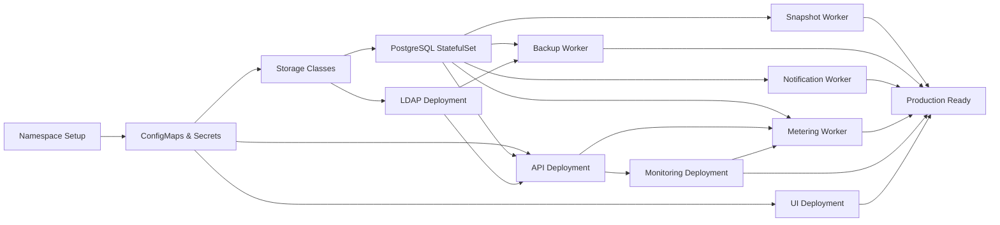

# Platform9 Management System - Kubernetes Migration Guide

**Version**: 2.0  
**Date**: February 2026  
**Status**: Migration Planning Guide (Not yet implemented)  
**Scope**: Complete migration from Docker Compose to Kubernetes with Helm charts  
**Priority**: Reliability, High Availability, Production-Ready  

---

## Table of Contents

1. [Overview](#overview)
2. [Architecture Comparison](#architecture-comparison)
3. [Pre-Migration Analysis](#pre-migration-analysis)
4. [Kubernetes Architecture Design](#kubernetes-architecture-design)
5. [Component Migration Strategy](#component-migration-strategy)
6. [Helm Chart Structure](#helm-chart-structure)
7. [Configuration Management](#configuration-management)
8. [Persistence & Storage](#persistence--storage)
9. [Security Implementation](#security-implementation)
10. [High Availability & Scaling](#high-availability--scaling)
11. [Monitoring & Observability](#monitoring--observability)
12. [Migration Roadmap](#migration-roadmap)
13. [Operational Runbook](#operational-runbook)
14. [Troubleshooting](#troubleshooting)

---

## Overview

### Current State (Docker Compose)

The Platform9 Management System currently runs on **Docker Compose** with:
- **11 containerized services**:
  - **Core**: UI (React), API (FastAPI), Monitoring (FastAPI), PostgreSQL, OpenLDAP
  - **Workers**: Snapshot Worker, Backup Worker, Metering Worker, Notification Worker
  - **Admin tools**: pgAdmin, phpLDAPadmin
- **Host-based Python scripts** for metrics collection and infrastructure automation
- **Single-node deployment** model with volume-based persistence
- **Environment file-based configuration** (.env)
- **Windows-centric automation** (Task Scheduler for host scripts)

### Target State (Kubernetes)

**Kubernetes deployment** provides:
- ✅ **High Availability** with multi-replica services
- ✅ **Automatic scaling** based on demand
- ✅ **Self-healing** capabilities
- ✅ **Rolling updates** with zero downtime
- ✅ **Platform-agnostic** deployment (AWS EKS, Azure AKS, self-hosted)
- ✅ **Advanced networking** with service mesh capabilities
- ✅ **Production-grade monitoring** with Prometheus/Grafana native integration

### Key Design Decisions for Kubernetes

| Aspect | Decision | Rationale |
|--------|----------|-----------|
| **Orchestration** | Kubernetes 1.27+ | Industry standard, excellent operator ecosystem |
| **Package Management** | Helm 3.x | Templating, easy installation, dependency management |
| **Storage** | Persistent Volumes (PV/PVC) | Cloud-agnostic, supports all major providers |
| **Configuration** | ConfigMaps + Secrets | Kubernetes-native, versioned, rotatable |
| **Networking** | ClusterIP + Ingress | Internal service discovery, external HTTP(S) routing |
| **Monitoring** | Prometheus + Kube-state-metrics | Kubernetes-aware metrics, industry standard |
| **Registry** | Private registry (ACR/ECR/Harbor) | Security, performance, offline capability |

---

## Architecture Comparison

### Current Docker Compose Architecture

```
┌──────────────────────────────────────────────────────────────┐
│           Docker Compose (Single Host)                       │
├──────────────────────────────────────────────────────────────┤
│                                                              │
│  ┌── Core Services ───────────────────────────────────────┐ │
│  │  ┌────────────┐  ┌────────────┐  ┌─────────────────┐  │ │
│  │  │  React UI  │  │  FastAPI   │  │   Monitoring    │  │ │
│  │  │ Port:5173  │  │  API       │  │   Service       │  │ │
│  │  │            │  │ Port:8000  │  │   Port:8001     │  │ │
│  │  └────────────┘  └────────────┘  └─────────────────┘  │ │
│  └────────────────────────────────────────────────────────┘ │
│                                                              │
│  ┌── Worker Services (long-lived, no ports) ──────────────┐ │
│  │  ┌────────────────┐  ┌──────────────┐                  │ │
│  │  │ Snapshot Worker │  │ Backup Worker│                  │ │
│  │  │ (scheduler,     │  │ (pg_dump,    │                  │ │
│  │  │  compliance,    │  │  LDAP backup,│                  │ │
│  │  │  service user)  │  │  retention)  │                  │ │
│  │  └────────────────┘  └──────────────┘                  │ │
│  │  ┌────────────────┐  ┌──────────────────────────┐      │ │
│  │  │Metering Worker │  │ Notification Worker      │      │ │
│  │  │ (resource,API, │  │ (SMTP email, drift,      │      │ │
│  │  │  efficiency)   │  │  digest, compliance)     │      │ │
│  │  └────────────────┘  └──────────────────────────┘      │ │
│  └────────────────────────────────────────────────────────┘ │
│                                                              │
│  ┌── Data & Identity ────────────────────────────────────┐  │
│  │  ┌──────────────────────────┐  ┌───────────────────┐  │  │
│  │  │    PostgreSQL (5432)     │  │  OpenLDAP (389)   │  │  │
│  │  │    pgAdmin   (8080)      │  │  phpLDAPadmin     │  │  │
│  │  │                          │  │  (8081)           │  │  │
│  │  └──────────────────────────┘  └───────────────────┘  │  │
│  └────────────────────────────────────────────────────────┘  │
│                                                              │
│  ┌── Host Scripts (Windows Task Scheduler) ──────────────┐  │
│  │  - host_metrics_collector.py (every 30 min)            │  │
│  │  - pf9_rvtools.py (daily inventory sync)               │  │
│  └────────────────────────────────────────────────────────┘  │
│                                                              │
└──────────────────────────────────────────────────────────────┘
```

### Target Kubernetes Architecture

```
┌────────────────────────────────────────────────────────────────────┐
│                  Kubernetes Cluster (Multi-Node)                   │
├────────────────────────────────────────────────────────────────────┤
│                                                                    │
│  ┌─ Ingress Controller ─────────────────────────────────────────┐ │
│  │  - HTTPS termination                                         │ │
│  │  - Routing (<your-domain> → UI Service)                    │ │
│  │  - API routing (<your-domain>/api → API Service)           │ │
│  └──────────────────────────────────────────────────────────────┘ │
│                                                                    │
│  ┌─ pf9 Namespace ──────────────────────────────────────────────┐ │
│  │                                                              │ │
│  │  Stateless Services (3+ replicas each):                     │ │
│  │  ┌──────────────┐  ┌──────────────┐  ┌─────────────────┐   │ │
│  │  │ React UI Pod │  │ FastAPI Pod  │  │ Monitoring Pod  │   │ │
│  │  │  (× 3-5)     │  │  (× 3-5)     │  │  (× 2-3)        │   │ │
│  │  └──────────────┘  └──────────────┘  └─────────────────┘   │ │
│  │                                                              │ │
│  │  Worker Deployments (1 replica each):                       │ │
│  │  ┌────────────────┐  ┌────────────────┐                     │ │
│  │  │ Snapshot Worker │  │ Backup Worker  │                     │ │
│  │  │ (scheduler,     │  │ (pg_dump, LDAP │                     │ │
│  │  │  compliance)    │  │  backup)       │                     │ │
│  │  └────────────────┘  └────────────────┘                     │ │
│  │  ┌────────────────┐  ┌────────────────────┐                 │ │
│  │  │Metering Worker │  │Notification Worker │                 │ │
│  │  │ (resource,API, │  │ (SMTP, drift,      │                 │ │
│  │  │  efficiency)   │  │  digest, alerts)   │                 │ │
│  │  └────────────────┘  └────────────────────┘                 │ │
│  │                                                              │ │
│  │  StatefulSet:                                               │ │
│  │  ┌────────────────────────────────────────────────────────┐ │ │
│  │  │  PostgreSQL StatefulSet (1 primary, 2 replicas HA)    │ │ │
│  │  │  - Persistent Volume Claims for data storage          │ │ │
│  │  │  - Init containers for schema migration               │ │ │
│  │  └────────────────────────────────────────────────────────┘ │ │
│  │                                                              │ │
│  │  OpenLDAP Deployment (1-3 replicas):                        │ │
│  │  ┌────────────────────────────────────────────────────────┐ │ │
│  │  │  OpenLDAP Pod(s) - ConfigMap for schema                │ │ │
│  │  │  Persistent Volume for directory data                  │ │ │
│  │  └────────────────────────────────────────────────────────┘ │ │
│  │                                                              │ │
│  │  Services (Internal):                                       │ │
│  │  ├─ pf9-ui (ClusterIP)                                     │ │
│  │  ├─ pf9-api (ClusterIP)                                    │ │
│  │  ├─ pf9-monitoring (ClusterIP)                             │ │
│  │  ├─ postgres (ClusterIP, headless for StatefulSet)        │ │
│  │  ├─ ldap (ClusterIP)                                       │ │
│  │  └─ redis (ClusterIP, for metrics cache)                   │ │
│  │                                                              │ │
│  │  ConfigMaps:                                                │ │
│  │  ├─ api-config (Environment variables)                     │ │
│  │  ├─ ldap-config (LDAP schema & config)                     │ │
│  │  ├─ postgres-init (Database initialization scripts)        │ │
│  │  ├─ snapshot-config (Scheduler & policy settings)          │ │
│  │  ├─ metering-config (Collection intervals, retention)      │ │
│  │  ├─ notification-config (Poll interval, digest settings)   │ │
│  │  └─ backup-config (Poll interval, retention)               │ │
│  │                                                              │ │
│  │  Secrets:                                                   │ │
│  │  ├─ db-credentials (POSTGRES_USER, POSTGRES_PASSWORD)     │ │
│  │  ├─ jwt-secrets (JWT_SECRET_KEY)                           │ │
│  │  ├─ ldap-secrets (LDAP admin password)                    │ │
│  │  ├─ api-secrets (PF9 credentials, monitoring tokens)       │ │
│  │  ├─ smtp-secrets (SMTP credentials)                        │ │
│  │  └─ snapshot-secrets (Fernet key, service user password)   │ │
│  │                                                              │ │
│  │  Jobs & CronJobs:                                           │ │
│  │  ├─ db-migration (One-time, runs on upgrade)              │ │
│  │  └─ metrics-collection-job (CronJob: every 5 mins)         │ │
│  │                                                              │ │
│  │  RBAC:                                                      │ │
│  │  ├─ ServiceAccount: pf9-app                                │ │
│  │  ├─ Role: pod-reader (for init containers)                │ │
│  │  └─ RoleBinding: pf9-app-reader                            │ │
│  │                                                              │ │
│  │  Network Policies:                                          │ │
│  │  ├─ Deny all ingress (default)                             │ │
│  │  ├─ Allow UI ← Ingress                                     │ │
│  │  ├─ Allow API ← Ingress + UI + metering                    │ │
│  │  ├─ Allow DB ← API + workers + migration jobs              │ │
│  │  ├─ Allow LDAP ← API + backup-worker                       │ │
│  │  └─ Allow Monitoring ← API + metering                      │ │
│  │                                                              │ │
│  │  Pod Disruption Budgets:                                    │ │
│  │  ├─ API pods (min 2 available)                             │ │
│  │  └─ Database (min 1 primary)                               │ │
│  │                                                              │ │
│  └──────────────────────────────────────────────────────────────┘ │
│                                                                    │
│  ┌─ Monitoring & Logging ────────────────────────────────────────┐ │
│  │  - Prometheus (scraping metrics from pf9 services)           │ │
│  │  - Kube-state-metrics (Kubernetes cluster state)             │ │
│  │  - ELK Stack / Loki (centralized logging)                    │ │
│  │  - Custom dashboards for Platform9 metrics                   │ │
│  └──────────────────────────────────────────────────────────────┘ │
│                                                                    │
└────────────────────────────────────────────────────────────────────┘
```

---

## Pre-Migration Analysis

### Components to Migrate

#### 1. **Frontend (React UI) - STRAIGHTFORWARD**

**Current**: Docker container, npm build + vite serve  
**Target**: Kubernetes Deployment + Service

**Considerations**:
- ✅ Stateless application (can scale horizontally)
- ✅ No volume requirements
- ✅ Simple health checks
- ⚠️ Build optimization needed (Dockerfile improvements)

**Changes Needed**: None to application code

---

#### 2. **Backend API (FastAPI) - STRAIGHTFORWARD**

**Current**: Docker container with uvicorn  
**Target**: Kubernetes Deployment with auto-scaling

**Considerations**:
- ✅ Stateless (all state in DB)
- ✅ Database connection pooling required
- ✅ Rate limiting compatible
- ⚠️ Multiple replicas need connection pool tuning

**Changes Needed**: Minor configuration for connection pool sizes

**Code Review Findings**:
```python
# Current: api/main.py uses psycopg2 direct connections
# Observation: Connection pooling not explicitly configured
# Recommendation: Use asyncpg with proper pool management
# Why: Better performance, connection reuse, timeout handling
```

**Kubernetes Readiness**: 95% - Just needs proper liveness/readiness probes

---

#### 3. **Monitoring Service - STRAIGHTFORWARD**

**Current**: FastAPI service + Prometheus metrics  
**Target**: Kubernetes Deployment with metrics collection

**Considerations**:
- ✅ Stateless (metrics cached locally)
- ⚠️ Metrics cache file needs external storage
- ✅ Scrape target auto-discovery

**Changes Needed**: Migrate metrics cache from local filesystem to distributed cache (Redis) or Kubernetes volume

**Code Review Findings**:
```python
# Current: monitoring/main.py uses local JSON file cache
# monitoring/main.py:
# self.hosts = os.getenv("PF9_HOSTS", "localhost").split(",")
# Observation: Hardcoded host list, single cache file
# Recommendation: Use ConfigMap for host list + Redis for distributed cache
```

**Kubernetes Readiness**: 80% - Cache strategy needs redesign

---

#### 4. **PostgreSQL Database - CRITICAL**

**Current**: Docker container + named volumes  
**Target**: Kubernetes StatefulSet + Persistent Volumes

**Key Challenges**:
- ⚠️ **Statefulness**: Requires persistent storage across pod restarts
- ⚠️ **Data consistency**: Multi-node clusters need proper PVC handling
- ⚠️ **Backup/Restore**: Automated backup strategy required
- ⚠️ **High Availability**: Streaming replication for failover

**Schema Analysis**:
```sql
-- Database includes:
-- - 19+ tables with full referential integrity
-- - JSONB fields with GIN indexing
-- - Audit tables with historical tracking
-- - No explicit partitioning (OK for current scale)
-- Total estimated size: 50-500 GB depending on retention
```

**Migration Strategy**:
1. Use PostgreSQL StatefulSet with 3 replicas
2. Primary handles writes, replicas for read scaling
3. Streaming replication for failover
4. Automated backup to S3/Cloud Storage (CronJob)
5. PVC size starting at 500GB, can expand

**Database Changes Required**: None to schema, just configuration updates for:
- Connection string changes (DNS: `postgres.pf9.svc.cluster.local`)
- Replica user configuration
- Backup script configuration

**Kubernetes Readiness**: 60% - Needs StatefulSet design + backup strategy

---

#### 5. **OpenLDAP - MODERATE COMPLEXITY**

**Current**: Docker container, in-memory configuration  
**Target**: Kubernetes Deployment with persistent storage

**Key Challenges**:
- ⚠️ **Statefulness**: LDAP directory data needs persistence
- ⚠️ **Replication**: Multi-replica LDAP requires special handling
- ⚠️ **Schema management**: Configuration as code

**Strategy**:
1. Single LDAP pod (simpler, sufficient for most deployments)
2. Persistent Volume for LDAP database
3. ConfigMap for schema and initial data
4. Optional: Multi-master replication for enterprise needs

**Kubernetes Readiness**: 75% - Storage + config needs planning

---

#### 6. **Host Scripts - MAJOR REDESIGN**

**Current**: Windows Task Scheduler → Python scripts on host  
**Target**: Kubernetes CronJobs + DaemonSets

**Critical Challenge**: ⚠️ **Platform Dependency** - Windows-specific automation

**Current Scripts to Migrate**:
- `host_metrics_collector.py` - Collects Prometheus metrics from PF9 hosts
- `snapshots/p9_auto_snapshots.py` - Manages VM snapshots
- `snapshots/p9_snapshot_policy_assign.py` - Assigns snapshot policies
- `cleanup_snapshots.py` - Cleanup automation

**Migration Strategy**:

```
┌─────────────────────────────────────────────────────────────────┐
│  Host-Based Work → Kubernetes CronJobs / DaemonSets            │
├─────────────────────────────────────────────────────────────────┤
│                                                                 │
│  Option A: CronJobs (Periodic Tasks)                          │
│  ├─ metrics-collection-job (every 5 minutes)                  │
│  │  └─ Runs pod that calls PF9 APIs                           │
│  │     (no host filesystem access needed)                     │
│  │                                                             │
│  ├─ snapshot-policy-job (daily)                               │
│  │  └─ Runs pod that calls PF9 APIs                           │
│  │                                                             │
│  └─ cleanup-job (weekly)                                      │
│     └─ Runs pod that calls PF9 APIs                           │
│                                                                 │
│  Option B: Init Containers (One-time Tasks)                   │
│  └─ Database schema initialization                            │
│                                                                 │
│  Option C: Sidecar Containers (Continuous Tasks)              │
│  └─ Health monitoring (if needed)                             │
│                                                                 │
│  Why CronJobs?                                                 │
│  ✓ No Windows dependency                                       │
│  ✓ Kubernetes-native scheduling                               │
│  ✓ Automatic retry & failure handling                         │
│  ✓ Declarative configuration                                  │
│  ✓ Cross-platform (Linux, macOS, Windows)                    │
│                                                                 │
└─────────────────────────────────────────────────────────────────┘
```

**Code Changes Needed**:

```python
# Current approach (host_metrics_collector.py):
# - Reads from local host IP addresses
# - Writes to local metrics_cache.json
# - Runs every 5 minutes via Windows Task Scheduler

# Kubernetes approach:
# - Read from API (PF9 credentials from Secrets)
# - Write metrics to API or external cache (Redis)
# - CronJob spec handles scheduling
# - ConfigMap for PF9 host list

# Example refactor needed in host_metrics_collector.py:
# Instead of: hosts = ["<HOST_IP_1>", "<HOST_IP_2>", ...]
# Use: from kubernetes import config, client
#      hosts = get_pf9_hosts_from_configmap()
```

**Kubernetes Readiness**: 40% - Needs significant refactoring

---

#### 7. **Snapshot Worker - STRAIGHTFORWARD**

**Current**: Long-running Docker container (`snapshots/Dockerfile`) with internal scheduler  
**Target**: Kubernetes Deployment (1 replica)

The snapshot worker is already a fully containerized service with its own Dockerfile, internal schedule loop (`snapshot_scheduler.py`), and all configuration via environment variables. It does **not** need CronJob conversion — it runs continuously and manages its own timing via `schedule` library.

**Key Features**:
- Policy assignment (configurable interval)
- Auto snapshot creation with retention management
- Compliance reporting (daily)
- On-demand snapshot pipeline (triggered via DB)
- Service user authentication (Fernet-encrypted cross-tenant auth)
- RVTools inventory sync integration

**Kubernetes Readiness**: 90% - Already containerized. Just needs K8s Deployment manifest + Secrets for Fernet key and service user credentials.

---

#### 8. **Backup Worker - STRAIGHTFORWARD**

**Current**: Long-running Docker container (`backup_worker/Dockerfile`, base: `postgres:16`)  
**Target**: Kubernetes Deployment (1 replica)

Handles PostgreSQL `pg_dump`/`pg_restore` and LDAP `ldapsearch`/`ldapadd` backups. Polls `backup_config` table for schedule, writes compressed files to NFS mount, enforces retention.

**Key Considerations**:
- ⚠️ **Storage**: Needs PVC or NFS mount for backup files (currently `./backups:/backups`)
- ⚠️ **LDAP access**: Requires network policy allowing traffic to LDAP pod
- ✅ All config via environment variables

**Kubernetes Readiness**: 85% - Needs PVC for backup storage and network policy for LDAP access.

---

#### 9. **Metering Worker - STRAIGHTFORWARD**

**Current**: Long-running Docker container (`metering_worker/Dockerfile`)  
**Target**: Kubernetes Deployment (1 replica)

Periodically collects operational metrics from monitoring and API services, persists to `metering_*` tables. Managed internally via `schedule` + `metering_config` DB table.

**Key Considerations**:
- Depends on monitoring and API services being accessible
- ⚠️ **Network**: Needs network policy allowing egress to `pf9-api` and `pf9-monitoring`
- ✅ No volumes needed, all config via environment variables

**Kubernetes Readiness**: 95% - Minimal changes needed.

---

#### 10. **Notification Worker - STRAIGHTFORWARD**

**Current**: Long-running Docker container (`notifications/Dockerfile`)  
**Target**: Kubernetes Deployment (1 replica)

Polls database for new events (drift, snapshot failures, compliance violations, health drops), dispatches email notifications. Supports immediate and daily digest modes. Uses Jinja2 HTML templates.

**Key Considerations**:
- ⚠️ **SMTP egress**: Needs NetworkPolicy allowing outbound SMTP (port 587)
- ⚠️ **Secrets**: SMTP credentials (host, username, password)
- ✅ Templates bundled in container image

**Kubernetes Readiness**: 90% - Needs SMTP Secret and egress network policy.

---

#### 11. **Admin Tools (pgAdmin, phpLDAPadmin) - OPTIONAL**

**Current**: Docker containers for database and LDAP web administration  
**Target**: Optional Kubernetes Deployments (not required for production)

These are development/admin tools. In production Kubernetes environments, teams typically use:
- `kubectl port-forward` for ad-hoc database access
- Managed database admin tools (e.g., pgAdmin as a separate deployment behind auth proxy)
- `kubectl exec` for LDAP queries

**Kubernetes Readiness**: N/A - Optional, deploy only if needed for your workflow.

---

### Migration Dependency Chain



**Phase Breakdown**:
1. **Phase 1 (Week 1)**: Infrastructure & Storage
2. **Phase 2 (Week 2)**: Database & LDAP
3. **Phase 3 (Week 3)**: Stateless Services (UI, API)
4. **Phase 4 (Week 4)**: Monitoring & CronJobs
5. **Phase 5 (Week 5)**: Testing & Optimization

---

## Kubernetes Architecture Design

### Cluster Requirements

#### Minimum Production Setup

| Component | Spec | Rationale |
|-----------|------|-----------|
| **Master Nodes** | 1 (can be shared) | etcd, API server, scheduler |
| **Worker Nodes** | 3+ | High availability, pod distribution |
| **Node Resources** | 4+ CPU, 16+ GB RAM | Comfortable for PF9 workload |
| **Total Cluster** | 8-12 CPU, 32-48 GB RAM | 3 API pods + DB replicas + monitoring |
| **Storage** | 500 GB+ SSD | Database storage, backups |

#### Recommended AWS EKS Setup

```yaml
# Example (not a real k8s manifest, just reference)
EKS Cluster:
  Name: pf9-management
  Kubernetes Version: 1.27+
  
  Node Groups:
    - Core Services:
        Instance Type: t3.large (2 CPU, 8 GB)
        Desired: 3
        Auto-scaling: 3-5
        Usage: API, UI, Monitoring
    
    - Database:
        Instance Type: m5.xlarge (4 CPU, 16 GB)
        Desired: 1
        Auto-scaling: 1-3 (for HA)
        Usage: PostgreSQL StatefulSet
        Storage: io1 1000 IOPS, 500GB

  Network:
    VPC: 10.0.0.0/16
    Subnets: 3 (Multi-AZ)
    Security Group: Allow 443 (HTTPS), 6443 (API)
```

#### Recommended Azure AKS Setup

```yaml
# Example reference
AKS Cluster:
  Name: pf9-management
  Kubernetes Version: 1.27+
  
  Node Pools:
    - System Pool:
        VM Size: Standard_B4ms (4 vCPU, 16 GB)
        Node Count: 3
        OS: Linux
    
    - Database Pool:
        VM Size: Standard_D4s_v3 (4 vCPU, 16 GB)
        Node Count: 1
        OS: Linux
        Storage: Premium SSD 500GB

  Network:
    Virtual Network: 10.0.0.0/16
    Subnets: 3
    Network Policy: Azure
    Load Balancer: Standard
```

### Namespace & RBAC Strategy

```yaml
# Namespace structure
pf9                    # Main application namespace
├── ConfigMaps         # Configuration data
├── Secrets            # Credentials
├── Deployments        # API, UI, Monitoring
├── StatefulSets       # PostgreSQL, LDAP
├── CronJobs           # Scheduled tasks
├── Jobs               # One-time tasks
├── Services           # Internal networking
├── PersistentVolumes  # Storage
├── NetworkPolicies    # Network security
├── ServiceAccounts    # Pod identity
└── Roles/RoleBindings # RBAC

kube-system           # Kubernetes system components
└── (ingress-nginx, kube-proxy, etc.)

kube-monitoring       # Optional: Prometheus, Grafana
```

### Service Discovery & Networking

**Internal Service Discovery**:
```
UI ← → API Service (pf9-api.pf9.svc.cluster.local:8000)
API ← → Database Service (postgres.pf9.svc.cluster.local:5432)
API ← → LDAP Service (ldap.pf9.svc.cluster.local:389)
Monitoring ← → API Service (pf9-api.pf9.svc.cluster.local:8000)
```

**External Access (Ingress)**:
```
User → HTTPS (443) → Ingress Controller → UI Service (5173)
User → HTTPS (443) → Ingress Controller → API Service (8000) [/api path]
User → HTTPS (443) → Ingress Controller → Monitoring Service (8001) [/metrics path]
```

---

## Component Migration Strategy

### 1. Frontend (React UI) - Migration

#### Current State
```
Dockerfile:
  FROM node:20
  WORKDIR /app
  COPY pf9-ui/ .
  RUN npm install && npm run build
  EXPOSE 5173
  CMD ["npm", "run", "dev"]
```

#### Kubernetes Manifest Strategy

**Two-Stage Build** (Recommended for production):

```yaml
# Stage 1: Build
FROM node:20-alpine AS builder
WORKDIR /app
COPY pf9-ui/package*.json .
RUN npm ci
COPY pf9-ui/ .
RUN npm run build

# Stage 2: Runtime
FROM node:20-alpine
WORKDIR /app
COPY --from=builder /app/dist ./dist
COPY --from=builder /app/package*.json .
RUN npm ci --production
EXPOSE 5173
CMD ["npm", "run", "dev"]
```

**Deployment Configuration**:

```yaml
# Key parameters for Kubernetes
apiVersion: apps/v1
kind: Deployment
metadata:
  name: pf9-ui
  namespace: pf9
spec:
  replicas: 3  # Scale for availability
  selector:
    matchLabels:
      app: pf9-ui
  template:
    metadata:
      labels:
        app: pf9-ui
    spec:
      containers:
      - name: pf9-ui
        image: <your-registry>/pf9-ui:latest
        ports:
        - containerPort: 5173
        
        # Probes for reliability
        livenessProbe:
          httpGet:
            path: /
            port: 5173
          initialDelaySeconds: 10
          periodSeconds: 10
        
        readinessProbe:
          httpGet:
            path: /
            port: 5173
          initialDelaySeconds: 5
          periodSeconds: 5
        
        # Resource requests (for scheduling)
        resources:
          requests:
            cpu: 100m
            memory: 256Mi
          limits:
            cpu: 500m
            memory: 512Mi
        
        # Environment (from ConfigMap)
        envFrom:
        - configMapRef:
            name: ui-config
        
        # Security context
        securityContext:
          readOnlyRootFilesystem: true
          runAsNonRoot: true
          runAsUser: 1000
          capabilities:
            drop:
            - ALL
---
apiVersion: v1
kind: Service
metadata:
  name: pf9-ui
  namespace: pf9
spec:
  selector:
    app: pf9-ui
  ports:
  - port: 5173
    targetPort: 5173
  type: ClusterIP
```

**Code Changes**: None required

---

### 2. Backend API (FastAPI) - Migration

#### Current State
```python
# api/main.py uses psycopg2 with:
# - Direct database connections
# - Environment-based configuration
# - HTTP basic auth + JWT
# - LDAP integration
```

#### Kubernetes Manifest Strategy

```yaml
apiVersion: apps/v1
kind: Deployment
metadata:
  name: pf9-api
  namespace: pf9
spec:
  replicas: 3
  strategy:
    type: RollingUpdate
    rollingUpdate:
      maxSurge: 1
      maxUnavailable: 0  # Zero downtime updates
  selector:
    matchLabels:
      app: pf9-api
  template:
    metadata:
      labels:
        app: pf9-api
    spec:
      serviceAccountName: pf9-app
      securityContext:
        runAsNonRoot: true
        runAsUser: 1000
        fsGroup: 1000
      
      initContainers:
      # Run database migrations before starting
      - name: db-migrate
        image: <your-registry>/pf9-api:latest
        command: ["python", "db_migration.py"]
        envFrom:
        - configMapRef:
            name: api-config
        - secretRef:
            name: db-credentials
      
      containers:
      - name: pf9-api
        image: <your-registry>/pf9-api:latest
        imagePullPolicy: IfNotPresent
        ports:
        - containerPort: 8000
          name: http
        
        # Health checks
        livenessProbe:
          httpGet:
            path: /health
            port: 8000
          initialDelaySeconds: 15
          periodSeconds: 20
        
        readinessProbe:
          httpGet:
            path: /health/ready
            port: 8000
          initialDelaySeconds: 10
          periodSeconds: 5
        
        # Resource management
        resources:
          requests:
            cpu: 250m
            memory: 512Mi
          limits:
            cpu: 1000m
            memory: 1Gi
        
        # Configuration from ConfigMaps & Secrets
        envFrom:
        - configMapRef:
            name: api-config
        - secretRef:
            name: db-credentials
        - secretRef:
            name: jwt-secrets
        - secretRef:
            name: api-secrets
        
        env:
        # Kubernetes-specific service discovery
        - name: PF9_DB_HOST
          value: postgres.pf9.svc.cluster.local
        - name: LDAP_SERVER
          value: ldap.pf9.svc.cluster.local
        
        # Volume mounts (if needed for config files)
        volumeMounts:
        - name: config
          mountPath: /app/config
          readOnly: true
        
        # Security context
        securityContext:
          readOnlyRootFilesystem: false
          allowPrivilegeEscalation: false
          capabilities:
            drop:
            - ALL
      
      volumes:
      - name: config
        configMap:
          name: api-config-files

---
apiVersion: v1
kind: Service
metadata:
  name: pf9-api
  namespace: pf9
spec:
  selector:
    app: pf9-api
  ports:
  - port: 8000
    targetPort: 8000
    name: http
  type: ClusterIP
```

#### Code Changes Required

**1. Database Connection Pooling** (api/main.py):

```python
# CURRENT (not optimized for Kubernetes):
# Direct psycopg2 connections - limited pooling

# RECOMMENDED for Kubernetes:
# Use asyncpg or pgbouncer

# Option A: asyncpg (in-process connection pool)
import asyncpg

async def init_db_pool():
    return await asyncpg.create_pool(
        host=os.getenv('PF9_DB_HOST'),
        port=int(os.getenv('PF9_DB_PORT', 5432)),
        database=os.getenv('PF9_DB_NAME'),
        user=os.getenv('PF9_DB_USER'),
        password=os.getenv('PF9_DB_PASSWORD'),
        min_size=10,
        max_size=50,
        max_queries=50000,
        max_cached_statement_lifetime=300,
        max_cacheable_statement_size=1024*15,
    )

@app.on_event("startup")
async def startup():
    app.state.db_pool = await init_db_pool()

@app.on_event("shutdown")
async def shutdown():
    await app.state.db_pool.close()

# Option B: pgbouncer (external connection pool)
# - Deploy pgbouncer sidecar container
# - Handles connection reuse across pods
```

**2. Configuration Management** (api/main.py):

```python
# CURRENT:
# from dotenv import load_dotenv
# load_dotenv('.env')
# PF9_USERNAME = os.getenv('PF9_USERNAME')

# KUBERNETES:
# All environment variables provided by Secrets/ConfigMaps
# No .env file needed
# Code remains the same - Kubernetes injection handles it
```

**3. Health Checks** (NEW - add to api/main.py):

```python
# Add endpoints for Kubernetes health checks
@app.get("/health")
async def health():
    """Liveness probe - basic health"""
    return {"status": "alive"}

@app.get("/health/ready")
async def readiness():
    """Readiness probe - check dependencies"""
    try:
        # Check database
        async with app.state.db_pool.acquire() as conn:
            await conn.fetchval('SELECT 1')
        
        # Check LDAP connectivity (optional)
        # ... 
        
        return {"status": "ready"}
    except Exception as e:
        return JSONResponse(
            status_code=503,
            content={"status": "not ready", "error": str(e)}
        )
```

**Summary of Code Changes**:
- ✅ Add health check endpoints
- ✅ Optimize database connection pooling
- ⚠️ No changes to business logic
- ⚠️ No changes to API contracts

---

### 3. Monitoring Service - Migration

#### Current State

```python
# monitoring/main.py
# - Collects metrics from PF9 hosts via HTTP
# - Caches in local JSON file
# - Exposes Prometheus metrics endpoint
```

#### Challenge: Metrics Cache

**Current (Docker Compose)**:
```yaml
pf9_monitoring:
  volumes:
    - "./metrics_cache.json:/tmp/metrics_cache.json:ro"
```

**Kubernetes Problem**: 
- Pods are ephemeral
- Local files don't persist
- Multiple replicas need shared cache

**Solution Options**:

```
┌─────────────────────────────────────────────────────────┐
│  Caching Strategies for Kubernetes                     │
├─────────────────────────────────────────────────────────┤
│                                                         │
│  Option A: Redis (Recommended)                         │
│  ├─ External Redis pod (1 replica, Deployment)        │
│  ├─ All monitoring pods share cache                    │
│  ├─ Automatic TTL expiration                           │
│  ├─ High performance, low latency                      │
│  └─ Monitoring service refactor: ~100 lines           │
│                                                         │
│  Option B: Shared PVC Volume                           │
│  ├─ ReadWriteMany PVC (requires NFS/Azure Files)      │
│  ├─ All pods can read/write                            │
│  ├─ Slower than Redis                                  │
│  ├─ File locking issues possible                       │
│  └─ Monitoring service refactor: ~50 lines            │
│                                                         │
│  Option C: In-Memory Cache (Single Pod)                │
│  ├─ Only 1 monitoring pod (no scaling)                 │
│  ├─ Simple, no external dependencies                   │
│  ├─ Not HA, single point of failure                    │
│  └─ Not recommended for production                    │
│                                                         │
│  Option D: No Cache - Direct Query                     │
│  ├─ Query PF9 APIs on every request                    │
│  ├─ No cache consistency issues                        │
│  ├─ Higher API load                                    │
│  ├─ Slower response times                              │
│  └─ Simple implementation, trade-off: performance     │
│                                                         │
└─────────────────────────────────────────────────────────┘
```

**RECOMMENDATION**: Use Redis

#### Kubernetes Manifest (Redis + Monitoring)

```yaml
# Redis Deployment (Monitoring cache backend)
apiVersion: apps/v1
kind: Deployment
metadata:
  name: redis-cache
  namespace: pf9
spec:
  replicas: 1  # Single instance OK for cache
  selector:
    matchLabels:
      app: redis-cache
  template:
    metadata:
      labels:
        app: redis-cache
    spec:
      containers:
      - name: redis
        image: redis:7-alpine
        ports:
        - containerPort: 6379
        
        # Configuration
        args:
        - "--maxmemory=1gb"
        - "--maxmemory-policy=allkeys-lru"
        - "--save=60 1000"  # Save after 1000 changes in 60s
        - "--appendonly=yes"
        
        livenessProbe:
          exec:
            command:
            - redis-cli
            - ping
          initialDelaySeconds: 5
          periodSeconds: 10
        
        resources:
          requests:
            cpu: 100m
            memory: 256Mi
          limits:
            cpu: 500m
            memory: 1Gi
        
        volumeMounts:
        - name: redis-data
          mountPath: /data
      
      volumes:
      - name: redis-data
        persistentVolumeClaim:
          claimName: redis-cache-pvc

---
apiVersion: v1
kind: Service
metadata:
  name: redis-cache
  namespace: pf9
spec:
  selector:
    app: redis-cache
  ports:
  - port: 6379
    targetPort: 6379
  type: ClusterIP

---
apiVersion: v1
kind: PersistentVolumeClaim
metadata:
  name: redis-cache-pvc
  namespace: pf9
spec:
  accessModes:
  - ReadWriteOnce
  resources:
    requests:
      storage: 5Gi
  storageClassName: standard

---
# Monitoring Service Deployment
apiVersion: apps/v1
kind: Deployment
metadata:
  name: pf9-monitoring
  namespace: pf9
spec:
  replicas: 2  # Can scale with Redis backing
  selector:
    matchLabels:
      app: pf9-monitoring
  template:
    metadata:
      labels:
        app: pf9-monitoring
    spec:
      containers:
      - name: pf9-monitoring
        image: <your-registry>/pf9-monitoring:latest
        ports:
        - containerPort: 8001
        
        livenessProbe:
          httpGet:
            path: /health
            port: 8001
          initialDelaySeconds: 10
          periodSeconds: 15
        
        readinessProbe:
          httpGet:
            path: /health/ready
            port: 8001
          initialDelaySeconds: 5
          periodSeconds: 5
        
        resources:
          requests:
            cpu: 100m
            memory: 256Mi
          limits:
            cpu: 500m
            memory: 512Mi
        
        envFrom:
        - configMapRef:
            name: monitoring-config
        - secretRef:
            name: api-secrets
        
        env:
        - name: REDIS_HOST
          value: redis-cache.pf9.svc.cluster.local
        - name: REDIS_PORT
          value: "6379"

---
apiVersion: v1
kind: Service
metadata:
  name: pf9-monitoring
  namespace: pf9
spec:
  selector:
    app: pf9-monitoring
  ports:
  - port: 8001
    targetPort: 8001
  type: ClusterIP
```

#### Code Changes Required (monitoring/main.py)

```python
# CURRENT (local JSON cache):
import json

def write_cache():
    with open('metrics_cache.json', 'w') as f:
        json.dump(self.cache, f)

def read_cache():
    with open('metrics_cache.json', 'r') as f:
        return json.load(f)

# KUBERNETES (Redis-backed):
import redis
import json

class MonitoringService:
    def __init__(self):
        redis_host = os.getenv('REDIS_HOST', 'redis-cache')
        redis_port = int(os.getenv('REDIS_PORT', 6379))
        self.redis_client = redis.Redis(
            host=redis_host,
            port=redis_port,
            decode_responses=True,
            socket_connect_timeout=5
        )
    
    def write_cache(self, key, value, ttl=300):
        """Write to Redis with TTL"""
        self.redis_client.setex(
            key,
            ttl,
            json.dumps(value)
        )
    
    def read_cache(self, key):
        """Read from Redis"""
        data = self.redis_client.get(key)
        if data:
            return json.loads(data)
        return None
```

**Summary of Code Changes**:
- ✅ Replace file I/O with Redis client
- ✅ Add Redis connection pooling
- ✅ Implement TTL-based cache expiration
- ⚠️ No business logic changes
- Estimated effort: **2-3 hours**

---

### 4. PostgreSQL Database - Migration

#### Current State (Docker Compose)

```yaml
db:
  image: postgres:16
  environment:
    POSTGRES_USER: ${POSTGRES_USER}
    POSTGRES_PASSWORD: ${POSTGRES_PASSWORD}
    POSTGRES_DB: ${POSTGRES_DB}
  volumes:
    - pgdata:/var/lib/postgresql/data
    - ./db/init.sql:/docker-entrypoint-initdb.d/init.sql:ro
  ports:
    - "5432:5432"
```

#### Kubernetes StatefulSet Strategy

**Why StatefulSet?**
- Persistent, unique identity for each pod
- Ordered deployment/scaling
- Stable DNS names
- Persistent volumes per replica

```yaml
apiVersion: v1
kind: PersistentVolumeClaim
metadata:
  name: postgres-pvc
  namespace: pf9
spec:
  accessModes:
  - ReadWriteOnce
  resources:
    requests:
      storage: 500Gi
  storageClassName: fast-ssd

---
apiVersion: apps/v1
kind: StatefulSet
metadata:
  name: postgres
  namespace: pf9
spec:
  serviceName: postgres  # Headless service for DNS
  replicas: 1  # Can be increased to 3 for HA
  selector:
    matchLabels:
      app: postgres
  template:
    metadata:
      labels:
        app: postgres
    spec:
      securityContext:
        fsGroup: 999  # PostgreSQL user
      
      initContainers:
      # Initialize permissions
      - name: init-chmod
        image: busybox
        command:
        - sh
        - -c
        - chmod 700 /var/lib/postgresql/data || true
        volumeMounts:
        - name: postgres-data
          mountPath: /var/lib/postgresql/data
      
      containers:
      - name: postgres
        image: postgres:16-alpine
        ports:
        - containerPort: 5432
          name: postgres
        
        # Environment
        env:
        - name: POSTGRES_USER
          valueFrom:
            secretKeyRef:
              name: db-credentials
              key: POSTGRES_USER
        - name: POSTGRES_PASSWORD
          valueFrom:
            secretKeyRef:
              name: db-credentials
              key: POSTGRES_PASSWORD
        - name: POSTGRES_DB
          valueFrom:
            configMapKeyRef:
              name: db-config
              key: POSTGRES_DB
        
        # Performance tuning
        - name: POSTGRES_INITDB_ARGS
          value: "-c max_connections=200 -c shared_buffers=256MB -c effective_cache_size=1GB"
        
        # Probes
        livenessProbe:
          exec:
            command:
            - /bin/sh
            - -c
            - pg_isready -U ${POSTGRES_USER}
          initialDelaySeconds: 30
          periodSeconds: 10
        
        readinessProbe:
          exec:
            command:
            - /bin/sh
            - -c
            - pg_isready -U ${POSTGRES_USER}
          initialDelaySeconds: 5
          periodSeconds: 5
        
        # Resources
        resources:
          requests:
            cpu: 500m
            memory: 512Mi
          limits:
            cpu: 2000m
            memory: 2Gi
        
        # Volumes
        volumeMounts:
        - name: postgres-data
          mountPath: /var/lib/postgresql/data
          subPath: data
        - name: init-scripts
          mountPath: /docker-entrypoint-initdb.d
          readOnly: true
        
        securityContext:
          runAsUser: 999
          runAsNonRoot: true
          allowPrivilegeEscalation: false
          capabilities:
            drop:
            - ALL
      
      volumes:
      - name: init-scripts
        configMap:
          name: db-init-scripts
      
      # Persistent volume claim template
      volumeClaimTemplates:
      - metadata:
          name: postgres-data
        spec:
          accessModes:
          - ReadWriteOnce
          resources:
            requests:
              storage: 500Gi
          storageClassName: fast-ssd

---
# Headless Service for StatefulSet DNS
apiVersion: v1
kind: Service
metadata:
  name: postgres
  namespace: pf9
spec:
  clusterIP: None  # Headless
  selector:
    app: postgres
  ports:
  - port: 5432
    targetPort: 5432
    name: postgres

---
# ClusterIP Service for applications
apiVersion: v1
kind: Service
metadata:
  name: postgres-service
  namespace: pf9
spec:
  selector:
    app: postgres
  ports:
  - port: 5432
    targetPort: 5432
  type: ClusterIP
```

#### High Availability Setup (3-Replica PostgreSQL)

For production reliability, deploy PostgreSQL with replication:

```yaml
# Extended StatefulSet configuration for HA
# replicas: 3
# PostgreSQL Primary uses streaming replication
# Replicas are read-only
# Backup to S3 via CronJob
# Automated failover via operator (optional)
```

**Code Changes**: None required for application code

---

### 5. OpenLDAP - Migration

#### Kubernetes Deployment

```yaml
apiVersion: apps/v1
kind: Deployment
metadata:
  name: openldap
  namespace: pf9
spec:
  replicas: 1  # Can increase for HA
  selector:
    matchLabels:
      app: openldap
  template:
    metadata:
      labels:
        app: openldap
    spec:
      containers:
      - name: openldap
        image: osixia/openldap:1.5.0
        ports:
        - containerPort: 389
          name: ldap
        
        env:
        - name: LDAP_ORGANISATION
          valueFrom:
            configMapKeyRef:
              name: ldap-config
              key: LDAP_ORGANISATION
        - name: LDAP_DOMAIN
          valueFrom:
            configMapKeyRef:
              name: ldap-config
              key: LDAP_DOMAIN
        - name: LDAP_ADMIN_PASSWORD
          valueFrom:
            secretKeyRef:
              name: ldap-secrets
              key: LDAP_ADMIN_PASSWORD
        - name: LDAP_CONFIG_PASSWORD
          valueFrom:
            secretKeyRef:
              name: ldap-secrets
              key: LDAP_CONFIG_PASSWORD
        
        livenessProbe:
          exec:
            command:
            - ldapwhoami
            - -H
            - ldap://localhost
            - -D
            - "cn=admin,${LDAP_BASE_DN}"  # Derived from LDAP_DOMAIN env var
            - -w
            - "$(LDAP_ADMIN_PASSWORD)"
          initialDelaySeconds: 20
          periodSeconds: 20
        
        readinessProbe:
          exec:
            command:
            - ldapwhoami
            - -H
            - ldap://localhost
            - -D
            - "cn=admin,${LDAP_BASE_DN}"  # Derived from LDAP_DOMAIN env var
            - -w
            - "$(LDAP_ADMIN_PASSWORD)"
          initialDelaySeconds: 10
          periodSeconds: 10
        
        resources:
          requests:
            cpu: 100m
            memory: 128Mi
          limits:
            cpu: 500m
            memory: 256Mi
        
        volumeMounts:
        - name: ldap-data
          mountPath: /var/lib/ldap
        - name: ldap-config
          mountPath: /etc/ldap/slapd.d
        - name: ldap-init
          mountPath: /container/service/slapd/assets/config/bootstrap/ldif/custom
          readOnly: true
      
      volumes:
      - name: ldap-data
        persistentVolumeClaim:
          claimName: ldap-data-pvc
      - name: ldap-config
        persistentVolumeClaim:
          claimName: ldap-config-pvc
      - name: ldap-init
        configMap:
          name: ldap-init-ldif

---
apiVersion: v1
kind: Service
metadata:
  name: ldap
  namespace: pf9
spec:
  selector:
    app: openldap
  ports:
  - port: 389
    targetPort: 389
  type: ClusterIP
```

**Code Changes**: None required

---

### 6. Host Metrics Collection - CronJob Migration

#### Challenge: Refactoring Host-Based Work

The `host_metrics_collector.py` script currently runs on the Windows host via Task Scheduler, scraping Prometheus endpoints on PF9 hypervisors (port 9388 for node exporter, port 9177 for libvirt exporter) and writing results to a local `metrics_cache.json` file.

In Kubernetes, this becomes a CronJob that writes to Redis instead of a local file:

```yaml
apiVersion: batch/v1
kind: CronJob
metadata:
  name: metrics-collection-job
  namespace: pf9
spec:
  schedule: "*/5 * * * *"
  concurrencyPolicy: Forbid
  successfulJobsHistoryLimit: 3
  failedJobsHistoryLimit: 3
  jobTemplate:
    spec:
      template:
        spec:
          serviceAccountName: pf9-jobs
          restartPolicy: OnFailure
          containers:
          - name: metrics-collector
            image: {{ .Values.registry.name }}/pf9-tools:{{ .Values.images.tools }}
            command: ["python", "host_metrics_collector.py", "--once"]
            envFrom:
            - configMapRef:
                name: monitoring-config
            - secretRef:
                name: api-secrets
            env:
            - name: REDIS_HOST
              value: redis-cache.pf9.svc.cluster.local
            resources:
              requests:
                cpu: 100m
                memory: 256Mi
              limits:
                cpu: 500m
                memory: 512Mi
```

**Code Changes Needed** for `host_metrics_collector.py`:

```python
# Replace file-based cache with Redis
# BEFORE:
#   with open("metrics_cache.json", "w") as f:
#       json.dump(metrics, f)
# AFTER:
import redis
redis_client = redis.Redis(host=os.getenv('REDIS_HOST', 'redis-cache'))
redis_client.setex('pf9:metrics:latest', 300, json.dumps(metrics))
```

**Refactoring Summary**:
- ✅ Replace local file cache with Redis
- ✅ Get host list from environment (ConfigMap)
- ✅ Add proper logging for Kubernetes
- Estimated effort: **2-4 hours**

> **Note**: Snapshot management, backup, metering, and notifications are now fully containerized worker services (sections 7-10 below), not CronJobs. Only the host metrics collector needs CronJob conversion.

---

### 7. Snapshot Worker - Migration

#### Current State

The snapshot worker is a **fully containerized long-running service** with its own Dockerfile (`snapshots/Dockerfile`), internal scheduler (`snapshot_scheduler.py`), and database-driven configuration. It is **not** a script to convert to a CronJob — it is already a proper service.

**Capabilities**: Policy assignment, auto snapshot creation, compliance reporting, on-demand snapshots (triggered via DB), service user cross-tenant authentication (Fernet-encrypted), RVTools inventory sync.

#### Kubernetes Deployment

```yaml
apiVersion: apps/v1
kind: Deployment
metadata:
  name: snapshot-worker
  namespace: pf9
  labels:
    app: snapshot-worker
    tier: worker
spec:
  replicas: 1  # Single instance — manages its own scheduling
  strategy:
    type: Recreate  # Avoid dual-scheduling conflicts
  selector:
    matchLabels:
      app: snapshot-worker
  template:
    metadata:
      labels:
        app: snapshot-worker
        tier: worker
    spec:
      serviceAccountName: pf9-app
      containers:
      - name: snapshot-worker
        image: {{ .Values.registry.name }}/pf9-snapshot-worker:{{ .Values.images.snapshotWorker }}
        
        envFrom:
        - configMapRef:
            name: snapshot-config
        - secretRef:
            name: db-credentials
        - secretRef:
            name: api-secrets
        - secretRef:
            name: snapshot-secrets
        
        env:
        - name: PF9_DB_HOST
          value: postgres.pf9.svc.cluster.local
        - name: PF9_DB_PORT
          value: "5432"
        
        resources:
          requests:
            cpu: 200m
            memory: 512Mi
          limits:
            cpu: 1000m
            memory: 2Gi
        
        volumeMounts:
        - name: reports
          mountPath: /mnt/reports
        - name: logs
          mountPath: /app/logs
      
      volumes:
      - name: reports
        persistentVolumeClaim:
          claimName: reports-pvc
      - name: logs
        persistentVolumeClaim:
          claimName: app-logs-pvc
```

**ConfigMap** (`snapshot-config`):

```yaml
apiVersion: v1
kind: ConfigMap
metadata:
  name: snapshot-config
  namespace: pf9
data:
  SNAPSHOT_SCHEDULER_ENABLED: "true"
  POLICY_ASSIGN_INTERVAL_MINUTES: "60"
  AUTO_SNAPSHOT_INTERVAL_MINUTES: "60"
  AUTO_SNAPSHOT_MAX_SIZE_GB: "260"
  AUTO_SNAPSHOT_MAX_NEW: "200"
  AUTO_SNAPSHOT_DRY_RUN: "false"
  RVTOOLS_INTEGRATION_ENABLED: "true"
  COMPLIANCE_REPORT_ENABLED: "true"
  COMPLIANCE_REPORT_INTERVAL_MINUTES: "1440"
  COMPLIANCE_REPORT_SLA_DAYS: "2"
  POLICY_ASSIGN_MERGE_EXISTING: "true"
  POLICY_ASSIGN_DRY_RUN: "false"
  POLICY_ASSIGN_SYNC_POLICY_SETS: "true"
  POLICY_ASSIGN_CONFIG: "/app/snapshots/snapshot_policy_rules.json"
  RESTORE_ENABLED: "true"
  RESTORE_DRY_RUN: "false"
  RESTORE_CLEANUP_VOLUMES: "true"
```

**Secret** (`snapshot-secrets`):

```yaml
apiVersion: v1
kind: Secret
metadata:
  name: snapshot-secrets
  namespace: pf9
type: Opaque
stringData:
  SNAPSHOT_PASSWORD_KEY: <your-fernet-key>           # From .env SNAPSHOT_PASSWORD_KEY
  SNAPSHOT_USER_PASSWORD_ENCRYPTED: <your-encrypted>   # From .env
  SNAPSHOT_SERVICE_USER_EMAIL: <your-service-email>     # From .env SNAPSHOT_SERVICE_USER_EMAIL
  SNAPSHOT_SERVICE_USER_PASSWORD: <your-service-pass>   # From .env SNAPSHOT_SERVICE_USER_PASSWORD
```

**Code Changes**: None required — the snapshot worker is already fully containerized.

---

### 8. Backup Worker - Migration

#### Current State

The backup worker runs as a long-lived container based on `postgres:16` (for `pg_dump`/`pg_restore` CLI tools) with Python installed on top. It polls `backup_config` for schedules, executes DB and LDAP backups, writes compressed files to an NFS mount, and enforces retention.

#### Kubernetes Deployment

```yaml
apiVersion: apps/v1
kind: Deployment
metadata:
  name: backup-worker
  namespace: pf9
  labels:
    app: backup-worker
    tier: worker
spec:
  replicas: 1
  strategy:
    type: Recreate
  selector:
    matchLabels:
      app: backup-worker
  template:
    metadata:
      labels:
        app: backup-worker
        tier: worker
    spec:
      serviceAccountName: pf9-app
      containers:
      - name: backup-worker
        image: {{ .Values.registry.name }}/pf9-backup-worker:{{ .Values.images.backupWorker }}
        
        envFrom:
        - configMapRef:
            name: backup-config
        - secretRef:
            name: db-credentials
        - secretRef:
            name: ldap-secrets
        
        env:
        - name: DB_HOST
          value: postgres.pf9.svc.cluster.local
        - name: LDAP_HOST
          value: ldap.pf9.svc.cluster.local
        - name: NFS_BACKUP_PATH
          value: /backups
        
        resources:
          requests:
            cpu: 200m
            memory: 512Mi
          limits:
            cpu: 1000m
            memory: 2Gi
        
        volumeMounts:
        - name: backups
          mountPath: /backups
      
      volumes:
      - name: backups
        persistentVolumeClaim:
          claimName: backups-pvc
```

**ConfigMap** (`backup-config`):

```yaml
apiVersion: v1
kind: ConfigMap
metadata:
  name: backup-config
  namespace: pf9
data:
  BACKUP_ENABLED: "true"
  POLL_INTERVAL: "3600"
  DB_PORT: "5432"
  DB_NAME: pf9_mgmt
  LDAP_PORT: "389"
  LDAP_BASE_DN: dc=pf9mgmt,dc=local
```

**PVC** for backup storage:

```yaml
apiVersion: v1
kind: PersistentVolumeClaim
metadata:
  name: backups-pvc
  namespace: pf9
spec:
  accessModes:
  - ReadWriteOnce
  storageClassName: {{ .Values.persistence.storageClass }}
  resources:
    requests:
      storage: {{ .Values.persistence.backups.size | default "100Gi" }}
```

**Code Changes**: None required.

---

### 9. Metering Worker - Migration

#### Current State

The metering worker is a lightweight Python container that periodically collects operational metrics from the monitoring and API services, persists aggregated records to `metering_*` tables, and prunes old data based on retention configuration stored in `metering_config`.

#### Kubernetes Deployment

```yaml
apiVersion: apps/v1
kind: Deployment
metadata:
  name: metering-worker
  namespace: pf9
  labels:
    app: metering-worker
    tier: worker
spec:
  replicas: 1
  strategy:
    type: Recreate
  selector:
    matchLabels:
      app: metering-worker
  template:
    metadata:
      labels:
        app: metering-worker
        tier: worker
    spec:
      serviceAccountName: pf9-app
      containers:
      - name: metering-worker
        image: {{ .Values.registry.name }}/pf9-metering-worker:{{ .Values.images.meteringWorker }}
        
        envFrom:
        - configMapRef:
            name: metering-config
        - secretRef:
            name: db-credentials
        
        env:
        - name: DB_HOST
          value: postgres.pf9.svc.cluster.local
        - name: MONITORING_URL
          value: http://pf9-monitoring.pf9.svc.cluster.local:8001
        - name: API_URL
          value: http://pf9-api.pf9.svc.cluster.local:8000
        
        resources:
          requests:
            cpu: 100m
            memory: 256Mi
          limits:
            cpu: 500m
            memory: 512Mi
```

**ConfigMap** (`metering-config`):

```yaml
apiVersion: v1
kind: ConfigMap
metadata:
  name: metering-config
  namespace: pf9
data:
  METERING_POLL_INTERVAL: "60"
  DB_PORT: "5432"
  DB_NAME: pf9_mgmt
```

**Code Changes**: None required.

---

### 10. Notification Worker - Migration

#### Current State

The notification worker polls the database for new events (drift detections, snapshot failures, compliance violations, health-score drops) and dispatches email notifications based on per-user preferences. Supports immediate delivery and daily digest mode using Jinja2 HTML templates.

#### Kubernetes Deployment

```yaml
apiVersion: apps/v1
kind: Deployment
metadata:
  name: notification-worker
  namespace: pf9
  labels:
    app: notification-worker
    tier: worker
spec:
  replicas: 1
  strategy:
    type: Recreate
  selector:
    matchLabels:
      app: notification-worker
  template:
    metadata:
      labels:
        app: notification-worker
        tier: worker
    spec:
      serviceAccountName: pf9-app
      containers:
      - name: notification-worker
        image: {{ .Values.registry.name }}/pf9-notification-worker:{{ .Values.images.notificationWorker }}
        
        envFrom:
        - configMapRef:
            name: notification-config
        - secretRef:
            name: db-credentials
        - secretRef:
            name: smtp-secrets
        
        env:
        - name: PF9_DB_HOST
          value: postgres.pf9.svc.cluster.local
        - name: PF9_DB_PORT
          value: "5432"
        
        resources:
          requests:
            cpu: 100m
            memory: 256Mi
          limits:
            cpu: 500m
            memory: 512Mi
        
        volumeMounts:
        - name: logs
          mountPath: /app/logs
      
      volumes:
      - name: logs
        persistentVolumeClaim:
          claimName: app-logs-pvc
```

**ConfigMap** (`notification-config`):

```yaml
apiVersion: v1
kind: ConfigMap
metadata:
  name: notification-config
  namespace: pf9
data:
  PF9_DB_NAME: pf9_mgmt
  SMTP_ENABLED: "true"
  SMTP_PORT: "587"
  SMTP_USE_TLS: "true"
  SMTP_FROM_NAME: "Platform9 Management"
  NOTIFICATION_POLL_INTERVAL_SECONDS: "120"
  NOTIFICATION_DIGEST_ENABLED: "true"
  NOTIFICATION_DIGEST_HOUR_UTC: "8"
  NOTIFICATION_LOOKBACK_SECONDS: "300"
  HEALTH_ALERT_THRESHOLD: "50"
```

**Secret** (`smtp-secrets`):

```yaml
apiVersion: v1
kind: Secret
metadata:
  name: smtp-secrets
  namespace: pf9
type: Opaque
stringData:
  SMTP_HOST: <your-smtp-host>           # From .env SMTP_HOST
  SMTP_USERNAME: <your-smtp-user>       # From .env SMTP_USERNAME
  SMTP_PASSWORD: <your-smtp-password>   # From .env SMTP_PASSWORD
  SMTP_FROM_ADDRESS: <your-from-email>  # From .env SMTP_FROM_ADDRESS
```

**Code Changes**: None required.

---

## Helm Chart Structure

### Helm Directory Layout

```
pf9-helm/
├── Chart.yaml
├── values.yaml
├── values-dev.yaml
├── values-prod.yaml
├── requirements.yaml
├── charts/
│   └── (dependencies if any)
├── templates/
│   ├── _helpers.tpl
│   ├── namespace.yaml
│   ├── configmaps/
│   │   ├── api-config.yaml
│   │   ├── db-config.yaml
│   │   ├── ldap-config.yaml
│   │   ├── monitoring-config.yaml
│   │   ├── snapshot-config.yaml
│   │   ├── backup-config.yaml
│   │   ├── metering-config.yaml
│   │   ├── notification-config.yaml
│   │   └── cronjob-config.yaml
│   ├── secrets/
│   │   ├── db-credentials.yaml
│   │   ├── jwt-secrets.yaml
│   │   ├── ldap-secrets.yaml
│   │   ├── api-secrets.yaml
│   │   ├── snapshot-secrets.yaml
│   │   └── smtp-secrets.yaml
│   ├── storage/
│   │   ├── storageclass.yaml
│   │   ├── pvc-postgres.yaml
│   │   ├── pvc-ldap.yaml
│   │   ├── pvc-redis.yaml
│   │   ├── pvc-backups.yaml
│   │   ├── pvc-reports.yaml
│   │   └── pvc-app-logs.yaml
│   ├── deployments/
│   │   ├── ui.yaml
│   │   ├── api.yaml
│   │   ├── monitoring.yaml
│   │   ├── redis.yaml
│   │   ├── snapshot-worker.yaml
│   │   ├── backup-worker.yaml
│   │   ├── metering-worker.yaml
│   │   └── notification-worker.yaml
│   ├── statefulsets/
│   │   ├── postgres.yaml
│   │   └── ldap.yaml
│   ├── services/
│   │   ├── ui.yaml
│   │   ├── api.yaml
│   │   ├── monitoring.yaml
│   │   ├── postgres.yaml
│   │   ├── ldap.yaml
│   │   └── redis.yaml
│   ├── ingress/
│   │   ├── ingress.yaml
│   │   └── certificate.yaml (if using cert-manager)
│   ├── rbac/
│   │   ├── namespace.yaml
│   │   ├── serviceaccount.yaml
│   │   ├── role.yaml
│   │   └── rolebinding.yaml
│   ├── networkpolicies/
│   │   ├── default-deny.yaml
│   │   ├── allow-ingress.yaml
│   │   ├── allow-api.yaml
│   │   ├── allow-database.yaml
│   │   ├── allow-ldap.yaml
│   │   ├── allow-monitoring.yaml
│   │   └── allow-smtp-egress.yaml
│   ├── cronjobs/
│   │   └── metrics-collection.yaml
│   ├── jobs/
│   │   └── db-migration.yaml
│   ├── hpa/
│   │   ├── api-hpa.yaml
│   │   ├── ui-hpa.yaml
│   │   └── monitoring-hpa.yaml
│   ├── pdb/
│   │   ├── api-pdb.yaml
│   │   └── postgres-pdb.yaml
│   └── tests/
│       ├── test-connection.yaml
│       └── test-api.yaml
```

### Chart.yaml

```yaml
apiVersion: v2
name: pf9-management
description: Platform9 Management System - Complete Kubernetes Deployment
type: application
version: 1.0.0
appVersion: 2026.02
keywords:
  - platform9
  - infrastructure-management
  - openstack
maintainers:
  - name: Erez Rozenbaum
    email: <your-email>
dependencies: []  # Can add external charts (cert-manager, etc.)
```

### values.yaml (Default Values)

```yaml
# Default values for pf9-management Helm chart

namespace: pf9

# Container Registry
registry:
  name: <your-registry>.azurecr.io    # Replace with your container registry
  pullPolicy: IfNotPresent
  secret: regcred  # Docker registry credentials

# Global replicas
replicaCount:
  api: 3
  ui: 3
  monitoring: 2
  ldap: 1
  postgres: 1
  snapshotWorker: 1
  backupWorker: 1
  meteringWorker: 1
  notificationWorker: 1

# Image versions
images:
  api: pf9-api:latest
  ui: pf9-ui:latest
  monitoring: pf9-monitoring:latest
  redis: redis:7-alpine
  postgres: postgres:16-alpine
  openldap: osixia/openldap:1.5.0
  snapshotWorker: pf9-snapshot-worker:latest
  backupWorker: pf9-backup-worker:latest
  meteringWorker: pf9-metering-worker:latest
  notificationWorker: pf9-notification-worker:latest
  tools: pf9-tools:latest  # For CronJobs (metrics collection)

# Resource Requests & Limits
resources:
  api:
    requests:
      cpu: 250m
      memory: 512Mi
    limits:
      cpu: 1000m
      memory: 1Gi
  
  ui:
    requests:
      cpu: 100m
      memory: 256Mi
    limits:
      cpu: 500m
      memory: 512Mi
  
  monitoring:
    requests:
      cpu: 100m
      memory: 256Mi
    limits:
      cpu: 500m
      memory: 512Mi
  
  postgres:
    requests:
      cpu: 500m
      memory: 512Mi
    limits:
      cpu: 2000m
      memory: 2Gi
  
  ldap:
    requests:
      cpu: 100m
      memory: 128Mi
    limits:
      cpu: 500m
      memory: 256Mi
  
  redis:
    requests:
      cpu: 100m
      memory: 256Mi
    limits:
      cpu: 500m
      memory: 1Gi
  
  snapshotWorker:
    requests:
      cpu: 200m
      memory: 512Mi
    limits:
      cpu: 1000m
      memory: 2Gi
  
  backupWorker:
    requests:
      cpu: 200m
      memory: 512Mi
    limits:
      cpu: 1000m
      memory: 2Gi
  
  meteringWorker:
    requests:
      cpu: 100m
      memory: 256Mi
    limits:
      cpu: 500m
      memory: 512Mi
  
  notificationWorker:
    requests:
      cpu: 100m
      memory: 256Mi
    limits:
      cpu: 500m
      memory: 512Mi

# Persistence
persistence:
  enabled: true
  storageClass: fast-ssd  # Or "default", "standard", etc.
  
  postgres:
    size: 500Gi
    accessMode: ReadWriteOnce
  
  ldap:
    data:
      size: 10Gi
    config:
      size: 5Gi
  
  redis:
    size: 5Gi
  
  backups:
    size: 100Gi
  
  reports:
    size: 20Gi
  
  appLogs:
    size: 10Gi

# Ingress
ingress:
  enabled: true
  className: nginx  # Or traefik, gce, aws
  annotations:
    cert-manager.io/cluster-issuer: letsencrypt-prod
  hosts:
    - host: pf9-ui.<your-domain>        # Replace with your domain
      paths:
        - path: /
          pathType: Prefix
    - host: pf9-api.<your-domain>       # Replace with your domain
      paths:
        - path: /
          pathType: Prefix
    - host: pf9-monitoring.<your-domain> # Replace with your domain
      paths:
        - path: /
          pathType: Prefix
  tls:
    - secretName: pf9-tls
      hosts:
        - pf9-ui.<your-domain>
        - pf9-api.<your-domain>
        - pf9-monitoring.<your-domain>

# TLS Certificate
certificates:
  enabled: true
  issuer: letsencrypt-prod  # For cert-manager

# Autoscaling
autoscaling:
  enabled: true
  api:
    minReplicas: 3
    maxReplicas: 10
    targetCPUUtilizationPercentage: 70
  ui:
    minReplicas: 2
    maxReplicas: 5
    targetCPUUtilizationPercentage: 80
  monitoring:
    minReplicas: 2
    maxReplicas: 4
    targetCPUUtilizationPercentage: 75

# Pod Disruption Budgets
poddisruptionbudget:
  enabled: true
  api:
    minAvailable: 2
  postgres:
    minAvailable: 1

# Network Policies
networkPolicies:
  enabled: true
  restrictedMode: true  # Deny-all by default

# RBAC
rbac:
  enabled: true
  create: true

# Monitoring & Observability
monitoring:
  prometheus:
    enabled: true
    scrapeInterval: 30s
  
  grafana:
    enabled: false  # Set to true if deploying Grafana

# Backup Strategy
backup:
  enabled: true
  schedule: "0 2 * * *"  # Daily at 02:00
  retention: 30  # Days
  destination: "s3://pf9-backups/"  # S3 bucket

# Environment Overrides (can be set per deployment)
environment: production  # dev, staging, production
```

### Installation Commands

```bash
# Add Helm chart repository (if published)
helm repo add pf9 <your-helm-repo-url>
helm repo update

# Install with default values
helm install pf9 pf9/pf9-management -n pf9 --create-namespace

# Install with custom values file
helm install pf9 pf9/pf9-management -n pf9 -f values-prod.yaml

# Install with specific overrides
helm install pf9 pf9/pf9-management \
  -n pf9 \
  --set replicas.api=5 \
  --set ingress.hosts[0].host=<your-domain> \
  --set persistence.postgres.size=1Ti

# Upgrade deployment
helm upgrade pf9 pf9/pf9-management -f values-prod.yaml

# Rollback to previous version
helm rollback pf9

# Delete deployment
helm uninstall pf9
```

---

## Configuration Management

### Secret & ConfigMap Strategy

#### Secrets (Sensitive Data)

**Types**: Database credentials, JWT secrets, API tokens, LDAP passwords

```yaml
# 1. Database Credentials
apiVersion: v1
kind: Secret
metadata:
  name: db-credentials
  namespace: pf9
type: Opaque
stringData:
  POSTGRES_USER: <your-db-user>           # From .env POSTGRES_USER (default: pf9)
  POSTGRES_PASSWORD: <your-db-password>   # From .env POSTGRES_PASSWORD

---
# 2. JWT Secrets
apiVersion: v1
kind: Secret
metadata:
  name: jwt-secrets
  namespace: pf9
type: Opaque
stringData:
  JWT_SECRET_KEY: <random-256-bit-key>
  JWT_ALGORITHM: HS256

---
# 3. LDAP Secrets
apiVersion: v1
kind: Secret
metadata:
  name: ldap-secrets
  namespace: pf9
type: Opaque
stringData:
  LDAP_ADMIN_PASSWORD: <strong-password>
  LDAP_CONFIG_PASSWORD: <strong-password>

---
# 4. API Credentials (PF9, external services)
apiVersion: v1
kind: Secret
metadata:
  name: api-secrets
  namespace: pf9
type: Opaque
stringData:
  PF9_USERNAME: <your-pf9-user>       # From .env PF9_USERNAME
  PF9_PASSWORD: <your-pf9-password>   # From .env PF9_PASSWORD
  PF9_AUTH_URL: <your-pf9-auth-url>   # From .env PF9_AUTH_URL

---
# 5. Snapshot Service User Credentials
apiVersion: v1
kind: Secret
metadata:
  name: snapshot-secrets
  namespace: pf9
type: Opaque
stringData:
  SNAPSHOT_PASSWORD_KEY: <your-fernet-key>           # From .env SNAPSHOT_PASSWORD_KEY
  SNAPSHOT_USER_PASSWORD_ENCRYPTED: <your-encrypted>   # From .env
  SNAPSHOT_SERVICE_USER_EMAIL: <your-service-email>     # From .env SNAPSHOT_SERVICE_USER_EMAIL
  SNAPSHOT_SERVICE_USER_PASSWORD: <your-service-pass>   # From .env SNAPSHOT_SERVICE_USER_PASSWORD

---
# 6. SMTP Credentials (Notification Worker)
apiVersion: v1
kind: Secret
metadata:
  name: smtp-secrets
  namespace: pf9
type: Opaque
stringData:
  SMTP_HOST: <your-smtp-host>           # From .env SMTP_HOST
  SMTP_USERNAME: <your-smtp-user>       # From .env SMTP_USERNAME
  SMTP_PASSWORD: <your-smtp-password>   # From .env SMTP_PASSWORD
  SMTP_FROM_ADDRESS: <your-from-email>  # From .env SMTP_FROM_ADDRESS
```

**Best Practices**:
- Use Kubernetes Secrets (encrypted at rest with proper KMS)
- Never commit secrets to Git
- Use external secret managers:
  - **AWS**: AWS Secrets Manager + External Secrets Operator
  - **Azure**: Azure Key Vault + Azure Workload Identity
  - **HashiCorp**: Vault

#### ConfigMaps (Non-Sensitive Configuration)

```yaml
# API Configuration
apiVersion: v1
kind: ConfigMap
metadata:
  name: api-config
  namespace: pf9
data:
  PF9_DB_PORT: "5432"
  PF9_DB_NAME: platform9
  PF9_USER_DOMAIN: Default
  PF9_PROJECT_NAME: service
  PF9_PROJECT_DOMAIN: Default
  PF9_REGION_NAME: region-one
  JWT_ALGORITHM: HS256
  JWT_ACCESS_TOKEN_EXPIRE_MINUTES: "480"
  JWT_REFRESH_TOKEN_EXPIRE_DAYS: "30"
  ENABLE_AUTHENTICATION: "true"
  DEFAULT_ADMIN_USER: admin

---
# Database Configuration
apiVersion: v1
kind: ConfigMap
metadata:
  name: db-config
  namespace: pf9
data:
  POSTGRES_DB: platform9
  POSTGRES_INITDB_ARGS: "-c max_connections=200 -c shared_buffers=256MB -c effective_cache_size=1GB"

---
# LDAP Configuration
apiVersion: v1
kind: ConfigMap
metadata:
  name: ldap-config
  namespace: pf9
data:
  LDAP_ORGANISATION: <your-org-name>                   # From .env (default: Platform9 Management)
  LDAP_DOMAIN: <your-ldap-domain>                       # From .env (default: pf9mgmt.local)
  LDAP_BASE_DN: <your-base-dn>                          # From .env (default: dc=pf9mgmt,dc=local)
  LDAP_USER_DN: <your-user-dn>                          # From .env (default: ou=users,dc=pf9mgmt,dc=local)
  LDAP_GROUP_DN: <your-group-dn>                        # From .env (default: ou=groups,dc=pf9mgmt,dc=local)

---
# Monitoring Configuration
apiVersion: v1
kind: ConfigMap
metadata:
  name: monitoring-config
  namespace: pf9
data:
  PF9_HOSTS: "<your-host-ip-1>,<your-host-ip-2>"  # From .env PF9_HOSTS
  METRICS_CACHE_TTL: "60"

---
# CronJob Configuration
apiVersion: v1
kind: ConfigMap
metadata:
  name: cronjob-config
  namespace: pf9
data:
  PF9_HOSTS: "<your-host-ip-1>,<your-host-ip-2>"  # From .env PF9_HOSTS

---
# Snapshot Worker Configuration
apiVersion: v1
kind: ConfigMap
metadata:
  name: snapshot-config
  namespace: pf9
data:
  SNAPSHOT_SCHEDULER_ENABLED: "true"
  POLICY_ASSIGN_INTERVAL_MINUTES: "60"
  AUTO_SNAPSHOT_INTERVAL_MINUTES: "60"
  AUTO_SNAPSHOT_MAX_SIZE_GB: "260"
  COMPLIANCE_REPORT_ENABLED: "true"
  COMPLIANCE_REPORT_INTERVAL_MINUTES: "1440"
  COMPLIANCE_REPORT_SLA_DAYS: "2"
  RESTORE_ENABLED: "true"

---
# Backup Worker Configuration
apiVersion: v1
kind: ConfigMap
metadata:
  name: backup-config
  namespace: pf9
data:
  BACKUP_ENABLED: "true"
  POLL_INTERVAL: "3600"

---
# Metering Worker Configuration
apiVersion: v1
kind: ConfigMap
metadata:
  name: metering-config
  namespace: pf9
data:
  METERING_POLL_INTERVAL: "60"

---
# Notification Worker Configuration
apiVersion: v1
kind: ConfigMap
metadata:
  name: notification-config
  namespace: pf9
data:
  SMTP_ENABLED: "true"
  NOTIFICATION_POLL_INTERVAL_SECONDS: "120"
  NOTIFICATION_DIGEST_ENABLED: "true"
  NOTIFICATION_DIGEST_HOUR_UTC: "8"
  HEALTH_ALERT_THRESHOLD: "50"
```

### Secrets Management (Production)

#### Option 1: External Secrets Operator (Recommended)

```yaml
# AWS Secrets Manager Integration
apiVersion: external-secrets.io/v1beta1
kind: SecretStore
metadata:
  name: aws-secrets
  namespace: pf9
spec:
  provider:
    aws:
      service: SecretsManager
      region: us-east-1
      auth:
        jwt:
          serviceAccountRef:
            name: external-secrets-sa

---
apiVersion: external-secrets.io/v1beta1
kind: ExternalSecret
metadata:
  name: db-credentials
  namespace: pf9
spec:
  refreshInterval: 1h
  secretStoreRef:
    name: aws-secrets
    kind: SecretStore
  target:
    name: db-credentials
    creationPolicy: Owner
  data:
  - secretKey: POSTGRES_USER
    remoteRef:
      key: pf9/db/username
  - secretKey: POSTGRES_PASSWORD
    remoteRef:
      key: pf9/db/password
```

#### Option 2: Azure Key Vault Integration

```yaml
# Azure Key Vault Secret Provider Class
apiVersion: secrets-store.csi.x-k8s.io/v1
kind: SecretProviderClass
metadata:
  name: azure-keyvault-secrets
  namespace: pf9
spec:
  provider: azure
  parameters:
    usePodIdentity: "true"
    keyvaultName: pf9-vault
    objects: |
      array:
        - |
          objectName: db-username
          objectType: secret
        - |
          objectName: db-password
          objectType: secret
        - |
          objectName: jwt-secret
          objectType: secret

---
# Pod using Azure Key Vault
apiVersion: v1
kind: Pod
metadata:
  name: api-pod
  namespace: pf9
spec:
  serviceAccountName: pf9-app
  containers:
  - name: api
    image: <your-registry>/pf9-api:latest
    volumeMounts:
    - name: secrets-store
      mountPath: /mnt/secrets-store
      readOnly: true
  volumes:
  - name: secrets-store
    csi:
      driver: secrets-store.csi.k8s.io
      readOnly: true
      volumeAttributes:
        secretProviderClass: azure-keyvault-secrets
```

---

## Persistence & Storage

### Storage Class Selection

| Platform | Storage Class | Type | Use Case |
|----------|---------------|------|----------|
| **AWS EKS** | gp3 (default) | EBS | General purpose, cost-effective |
| **AWS EKS** | io1 | EBS | High performance, database |
| **Azure AKS** | default | Azure Disk | General purpose |
| **Azure AKS** | managed-premium | Azure Premium Disk | Database, HA |
| **Self-hosted** | local-path | hostPath | Development, testing |
| **Self-hosted** | nfs-client | NFS | Multi-pod access |

### PostgreSQL Persistence Configuration

```yaml
# AWS: High-performance storage for database
apiVersion: storage.k8s.io/v1
kind: StorageClass
metadata:
  name: fast-ssd-postgres
provisioner: ebs.csi.aws.com
parameters:
  type: io1
  iops: "1000"
  fstype: ext4
allowVolumeExpansion: true

---
# Azure: Premium managed disk
apiVersion: storage.k8s.io/v1
kind: StorageClass
metadata:
  name: fast-ssd-postgres
provisioner: disk.csi.azure.com
parameters:
  skuName: Premium_LRS
  fstype: ext4
allowVolumeExpansion: true

---
# Persistent Volume Claim for PostgreSQL
apiVersion: v1
kind: PersistentVolumeClaim
metadata:
  name: postgres-pvc
  namespace: pf9
spec:
  accessModes:
  - ReadWriteOnce
  resources:
    requests:
      storage: 500Gi
  storageClassName: fast-ssd-postgres
```

### Backup Strategy

```yaml
# PostgreSQL Backup CronJob (daily)
apiVersion: batch/v1
kind: CronJob
metadata:
  name: postgres-backup
  namespace: pf9
spec:
  schedule: "0 2 * * *"  # Daily at 02:00
  jobTemplate:
    spec:
      template:
        spec:
          serviceAccountName: pf9-jobs
          restartPolicy: Never
          containers:
          - name: backup
            image: <your-registry>/pf9-backup:latest
            command:
            - /bin/sh
            - -c
            - |
              #!/bin/bash
              set -e
              
              # Backup database
              pg_dump \
                -h postgres.pf9.svc.cluster.local \
                -U $POSTGRES_USER \
                -d $POSTGRES_DB \
                | gzip > /backup/pf9-backup-$(date +%Y%m%d-%H%M%S).sql.gz
              
              # Upload to S3
              aws s3 cp /backup/ s3://pf9-backups/ --recursive \
                --exclude "*" --include "pf9-backup-*.sql.gz"
              
              # Retention: keep last 30 days
              aws s3 rm s3://pf9-backups/ --recursive \
                --exclude "pf9-backup-*" \
                --before $(date -d '30 days ago' +%Y-%m-%d)
            
            env:
            - name: POSTGRES_USER
              valueFrom:
                secretKeyRef:
                  name: db-credentials
                  key: POSTGRES_USER
            - name: POSTGRES_PASSWORD
              valueFrom:
                secretKeyRef:
                  name: db-credentials
                  key: POSTGRES_PASSWORD
            - name: POSTGRES_DB
              valueFrom:
                configMapKeyRef:
                  name: db-config
                  key: POSTGRES_DB
            - name: AWS_ACCESS_KEY_ID
              valueFrom:
                secretKeyRef:
                  name: aws-backup-credentials
                  key: access-key
            - name: AWS_SECRET_ACCESS_KEY
              valueFrom:
                secretKeyRef:
                  name: aws-backup-credentials
                  key: secret-key
            
            resources:
              requests:
                cpu: 500m
                memory: 1Gi
              limits:
                cpu: 2000m
                memory: 4Gi
```

---

## Security Implementation

### Network Policies (Zero-Trust)

```yaml
# 1. Deny all ingress by default
apiVersion: networking.k8s.io/v1
kind: NetworkPolicy
metadata:
  name: default-deny-ingress
  namespace: pf9
spec:
  podSelector: {}
  policyTypes:
  - Ingress

---
# 2. Allow ingress traffic to UI
apiVersion: networking.k8s.io/v1
kind: NetworkPolicy
metadata:
  name: allow-ingress-to-ui
  namespace: pf9
spec:
  podSelector:
    matchLabels:
      app: pf9-ui
  policyTypes:
  - Ingress
  ingress:
  - from:
    - namespaceSelector:
        matchLabels:
          name: ingress-nginx
    ports:
    - protocol: TCP
      port: 5173

---
# 3. Allow API communication
apiVersion: networking.k8s.io/v1
kind: NetworkPolicy
metadata:
  name: allow-api
  namespace: pf9
spec:
  podSelector:
    matchLabels:
      app: pf9-api
  policyTypes:
  - Ingress
  ingress:
  # From ingress controller
  - from:
    - namespaceSelector:
        matchLabels:
          name: ingress-nginx
    ports:
    - protocol: TCP
      port: 8000
  
  # From UI pods
  - from:
    - podSelector:
        matchLabels:
          app: pf9-ui
    ports:
    - protocol: TCP
      port: 8000
  
  # From monitoring
  - from:
    - podSelector:
        matchLabels:
          app: pf9-monitoring
    ports:
    - protocol: TCP
      port: 8000

---
# 4. Allow database communication
apiVersion: networking.k8s.io/v1
kind: NetworkPolicy
metadata:
  name: allow-database
  namespace: pf9
spec:
  podSelector:
    matchLabels:
      app: postgres
  policyTypes:
  - Ingress
  ingress:
  # From API pods
  - from:
    - podSelector:
        matchLabels:
          app: pf9-api
    ports:
    - protocol: TCP
      port: 5432
  
  # From worker services
  - from:
    - podSelector:
        matchLabels:
          tier: worker
    ports:
    - protocol: TCP
      port: 5432
  
  # From migration jobs
  - from:
    - podSelector:
        matchLabels:
          job-type: db-migration
    ports:
    - protocol: TCP
      port: 5432

---
# 5. Allow LDAP communication
apiVersion: networking.k8s.io/v1
kind: NetworkPolicy
metadata:
  name: allow-ldap
  namespace: pf9
spec:
  podSelector:
    matchLabels:
      app: openldap
  policyTypes:
  - Ingress
  ingress:
  - from:
    - podSelector:
        matchLabels:
          app: pf9-api
    ports:
    - protocol: TCP
      port: 389
  - from:
    - podSelector:
        matchLabels:
          app: backup-worker
    ports:
    - protocol: TCP
      port: 389

---
# 6. Allow monitoring access from metering worker
apiVersion: networking.k8s.io/v1
kind: NetworkPolicy
metadata:
  name: allow-monitoring
  namespace: pf9
spec:
  podSelector:
    matchLabels:
      app: pf9-monitoring
  policyTypes:
  - Ingress
  ingress:
  - from:
    - podSelector:
        matchLabels:
          app: pf9-api
    ports:
    - protocol: TCP
      port: 8001
  - from:
    - podSelector:
        matchLabels:
          app: metering-worker
    ports:
    - protocol: TCP
      port: 8001

---
# 7. Allow SMTP egress for notification worker
apiVersion: networking.k8s.io/v1
kind: NetworkPolicy
metadata:
  name: allow-smtp-egress
  namespace: pf9
spec:
  podSelector:
    matchLabels:
      app: notification-worker
  policyTypes:
  - Egress
  egress:
  - to: []  # Allow external SMTP
    ports:
    - protocol: TCP
      port: 587
    - protocol: TCP
      port: 465
  - to:     # Allow DNS resolution
    ports:
    - protocol: UDP
      port: 53
    - protocol: TCP
      port: 53
```

### Pod Security Policy / Pod Security Standards

```yaml
# Kubernetes 1.25+: Pod Security Standards (PSS)
apiVersion: v1
kind: Namespace
metadata:
  name: pf9
  labels:
    pod-security.kubernetes.io/enforce: restricted
    pod-security.kubernetes.io/audit: restricted
    pod-security.kubernetes.io/warn: restricted
```

### RBAC (Role-Based Access Control)

```yaml
# ServiceAccount for application pods
apiVersion: v1
kind: ServiceAccount
metadata:
  name: pf9-app
  namespace: pf9

---
# ServiceAccount for jobs
apiVersion: v1
kind: ServiceAccount
metadata:
  name: pf9-jobs
  namespace: pf9

---
# Role for pod reader (init containers)
apiVersion: rbac.authorization.k8s.io/v1
kind: Role
metadata:
  name: pod-reader
  namespace: pf9
rules:
- apiGroups: [""]
  resources: ["pods"]
  verbs: ["get", "watch", "list"]

---
# RoleBinding
apiVersion: rbac.authorization.k8s.io/v1
kind: RoleBinding
metadata:
  name: pf9-app-reader
  namespace: pf9
roleRef:
  apiGroup: rbac.authorization.k8s.io
  kind: Role
  name: pod-reader
subjects:
- kind: ServiceAccount
  name: pf9-app
  namespace: pf9

---
apiVersion: rbac.authorization.k8s.io/v1
kind: RoleBinding
metadata:
  name: pf9-jobs-reader
  namespace: pf9
roleRef:
  apiGroup: rbac.authorization.k8s.io
  kind: Role
  name: pod-reader
subjects:
- kind: ServiceAccount
  name: pf9-jobs
  namespace: pf9
```

### Image Security

```yaml
# 1. Image Pull Secrets (private registry)
apiVersion: v1
kind: Secret
metadata:
  name: regcred
  namespace: pf9
type: kubernetes.io/dockercfg
data:
  .dockercfg: <base64-encoded-docker-config>

---
# Reference in Deployment
apiVersion: apps/v1
kind: Deployment
metadata:
  name: pf9-api
  namespace: pf9
spec:
  template:
    spec:
      imagePullSecrets:
      - name: regcred
      containers:
      - name: api
        image: <your-registry>/pf9-api:v1.0
        imagePullPolicy: IfNotPresent

---
# 2. Image scanning (with admission controller)
# Use tools like:
# - Aqua Security Trivy
# - Anchore Grype
# - Snyk
# Automatically scan images on push to registry
```

---

## High Availability & Scaling

### Horizontal Pod Autoscaling (HPA)

```yaml
# API HPA
apiVersion: autoscaling/v2
kind: HorizontalPodAutoscaler
metadata:
  name: pf9-api-hpa
  namespace: pf9
spec:
  scaleTargetRef:
    apiVersion: apps/v1
    kind: Deployment
    name: pf9-api
  minReplicas: 3
  maxReplicas: 10
  metrics:
  - type: Resource
    resource:
      name: cpu
      target:
        type: Utilization
        averageUtilization: 70
  - type: Resource
    resource:
      name: memory
      target:
        type: Utilization
        averageUtilization: 80
  behavior:
    scaleDown:
      stabilizationWindowSeconds: 300
      policies:
      - type: Percent
        value: 50
        periodSeconds: 60
    scaleUp:
      stabilizationWindowSeconds: 0
      policies:
      - type: Percent
        value: 100
        periodSeconds: 30
      - type: Pods
        value: 2
        periodSeconds: 60
      selectPolicy: Max

---
# UI HPA
apiVersion: autoscaling/v2
kind: HorizontalPodAutoscaler
metadata:
  name: pf9-ui-hpa
  namespace: pf9
spec:
  scaleTargetRef:
    apiVersion: apps/v1
    kind: Deployment
    name: pf9-ui
  minReplicas: 2
  maxReplicas: 5
  metrics:
  - type: Resource
    resource:
      name: cpu
      target:
        type: Utilization
        averageUtilization: 80

---
# Monitoring HPA
apiVersion: autoscaling/v2
kind: HorizontalPodAutoscaler
metadata:
  name: pf9-monitoring-hpa
  namespace: pf9
spec:
  scaleTargetRef:
    apiVersion: apps/v1
    kind: Deployment
    name: pf9-monitoring
  minReplicas: 2
  maxReplicas: 4
  metrics:
  - type: Resource
    resource:
      name: cpu
      target:
        type: Utilization
        averageUtilization: 75
```

### Pod Disruption Budgets (PDB)

```yaml
# API PDB (ensure 2 replicas always available)
apiVersion: policy/v1
kind: PodDisruptionBudget
metadata:
  name: pf9-api-pdb
  namespace: pf9
spec:
  minAvailable: 2
  selector:
    matchLabels:
      app: pf9-api

---
# PostgreSQL PDB
apiVersion: policy/v1
kind: PodDisruptionBudget
metadata:
  name: postgres-pdb
  namespace: pf9
spec:
  minAvailable: 1
  selector:
    matchLabels:
      app: postgres

---
# UI PDB
apiVersion: policy/v1
kind: PodDisruptionBudget
metadata:
  name: pf9-ui-pdb
  namespace: pf9
spec:
  minAvailable: 1
  selector:
    matchLabels:
      app: pf9-ui
```

### Cluster Autoscaling

#### AWS EKS

```bash
# Install AWS Auto Scaling Group
# See: https://docs.aws.amazon.com/eks/latest/userguide/autoscaling.html

# Create auto-scaling group with EKS Managed Nodes
# Or use Karpenter for advanced scaling

# Configuration:
# - Min nodes: 3
# - Max nodes: 10
# - Desired: 5
# - Scaling policies: CPU > 70%, Memory > 80%
```

#### Azure AKS

```bash
# Enable cluster autoscaler
az aks update \
  --resource-group myResourceGroup \
  --name myAKSCluster \
  --enable-cluster-autoscaling \
  --min-count 3 \
  --max-count 10
```

### Multi-AZ Deployment

```yaml
# Pod anti-affinity to spread replicas across nodes
apiVersion: apps/v1
kind: Deployment
metadata:
  name: pf9-api
  namespace: pf9
spec:
  replicas: 3
  template:
    spec:
      affinity:
        podAntiAffinity:
          preferredDuringSchedulingIgnoredDuringExecution:
          - weight: 100
            podAffinityTerm:
              labelSelector:
                matchExpressions:
                - key: app
                  operator: In
                  values:
                  - pf9-api
              topologyKey: kubernetes.io/hostname
          - weight: 80
            podAffinityTerm:
              labelSelector:
                matchExpressions:
                - key: app
                  operator: In
                  values:
                  - pf9-api
              topologyKey: topology.kubernetes.io/zone
      containers:
      - name: api
        image: <your-registry>/pf9-api:latest
```

---

## Monitoring & Observability

### Prometheus Integration

```yaml
# ServiceMonitor for Prometheus operator
apiVersion: monitoring.coreos.com/v1
kind: ServiceMonitor
metadata:
  name: pf9-metrics
  namespace: pf9
spec:
  selector:
    matchLabels:
      app: pf9-api
  endpoints:
  - port: http
    path: /metrics
    interval: 30s

---
# PrometheusRule for alerting
apiVersion: monitoring.coreos.com/v1
kind: PrometheusRule
metadata:
  name: pf9-alerts
  namespace: pf9
spec:
  groups:
  - name: pf9
    interval: 30s
    rules:
    - alert: HighAPIErrorRate
      expr: rate(pf9_api_errors_total[5m]) > 0.05
      for: 5m
      labels:
        severity: warning
      annotations:
        summary: "High API error rate detected"
        description: "API error rate is {{ $value }} errors/sec"
    
    - alert: DatabaseConnectionPoolExhausted
      expr: pf9_db_connection_pool_utilization > 0.9
      for: 5m
      labels:
        severity: critical
      annotations:
        summary: "Database connection pool nearly exhausted"
    
    - alert: PVCAlmostFull
      expr: kubelet_volume_stats_used_bytes / kubelet_volume_stats_capacity_bytes > 0.85
      for: 10m
      labels:
        severity: warning
      annotations:
        summary: "Persistent volume {{ $labels.persistentvolumeclaim }} is 85% full"
```

### Logging

```yaml
# Fluentd/Logstash DaemonSet for log collection
apiVersion: apps/v1
kind: DaemonSet
metadata:
  name: fluentd
  namespace: kube-logging
spec:
  template:
    spec:
      containers:
      - name: fluentd
        image: fluent/fluentd-kubernetes-daemonset:v1
        env:
        - name: FLUENT_ELASTICSEARCH_HOST
          value: elasticsearch.kube-logging
        - name: FLUENT_ELASTICSEARCH_PORT
          value: "9200"
        volumeMounts:
        - name: varlog
          mountPath: /var/log
        - name: varlibdockercontainers
          mountPath: /var/lib/docker/containers
          readOnly: true
      volumes:
      - name: varlog
        hostPath:
          path: /var/log
      - name: varlibdockercontainers
        hostPath:
          path: /var/lib/docker/containers
```

### Custom Metrics

```python
# Add to api/main.py for custom monitoring
from prometheus_client import Counter, Histogram, Gauge
import time

# Define custom metrics
request_count = Counter(
    'pf9_api_requests_total',
    'Total API requests',
    ['method', 'endpoint', 'status']
)

request_duration = Histogram(
    'pf9_api_request_duration_seconds',
    'API request duration',
    ['method', 'endpoint']
)

active_connections = Gauge(
    'pf9_db_connections_active',
    'Active database connections'
)

# Middleware to track metrics
@app.middleware("http")
async def track_metrics(request: Request, call_next):
    start = time.time()
    response = await call_next(request)
    duration = time.time() - start
    
    request_count.labels(
        method=request.method,
        endpoint=request.url.path,
        status=response.status_code
    ).inc()
    
    request_duration.labels(
        method=request.method,
        endpoint=request.url.path
    ).observe(duration)
    
    return response
```

---

## Migration Roadmap

### Phase 1: Infrastructure & Preparation (Week 1)

**Timeline**: 5 business days

**Deliverables**:
- [ ] Kubernetes cluster provisioned (AWS EKS, Azure AKS, or self-hosted)
- [ ] Helm chart repository created
- [ ] Storage classes configured
- [ ] Container registry configured
- [ ] Network policies skeleton created

**Tasks**:
1. Create Kubernetes cluster (1.27+)
2. Configure kubectl access
3. Set up private container registry
4. Create persistent storage backend
5. Install Ingress controller (nginx/traefik)
6. Test cluster connectivity

**Effort**: 2 engineers × 1 week

---

### Phase 2: Stateful Components (Database & LDAP) (Week 2)

**Timeline**: 5 business days

**Deliverables**:
- [ ] PostgreSQL StatefulSet deployed
- [ ] Database schema migrated
- [ ] LDAP deployment working
- [ ] Backup strategy implemented
- [ ] Persistence verified

**Tasks**:
1. Create PostgreSQL StatefulSet YAML
2. Migrate database schema (init.sql → ConfigMap)
3. Set up database backups (CronJob)
4. Deploy OpenLDAP
5. Test data persistence
6. Configure LDAP authentication

**Effort**: 2 engineers × 1 week

**Testing Checklist**:
- [ ] Database survives pod restart
- [ ] Replication working (if using HA)
- [ ] Backups completing successfully
- [ ] LDAP authentication functioning

---

### Phase 3: Stateless Services & Workers (Week 3)

**Timeline**: 5 business days

**Deliverables**:
- [ ] Backend API Deployment with HPA
- [ ] Frontend UI Deployment with replicas
- [ ] Snapshot Worker Deployment running
- [ ] Backup Worker Deployment running
- [ ] Metering Worker Deployment running
- [ ] Notification Worker Deployment running
- [ ] Services and ClusterIP configured
- [ ] Ingress routes configured
- [ ] Health checks verified

**Tasks**:
1. Build optimized Docker images (all 7 services)
2. Create API Deployment manifest
   - Add health check endpoints
   - Configure connection pooling
3. Create UI Deployment manifest
4. Deploy worker services (snapshot, backup, metering, notification)
   - Create ConfigMaps for each worker
   - Create Secrets (snapshot-secrets, smtp-secrets)
   - Configure PVCs (backups, reports, app-logs)
5. Configure autoscaling (HPA for API/UI/Monitoring)
6. Deploy Ingress with TLS
7. Configure DNS and certificates
8. Verify worker services connecting to DB, monitoring, and LDAP

**Code Changes**:
- [ ] api/main.py: Add `/health` and `/health/ready` endpoints
- [ ] api/main.py: Optimize database connection pooling
- [ ] monitoring/main.py: Integrate Redis caching

**Effort**: 2 engineers × 1 week

**Testing Checklist**:
- [ ] API health checks responding
- [ ] UI accessible via Ingress
- [ ] Horizontal scaling working
- [ ] Zero-downtime rolling updates
- [ ] Snapshot worker creating snapshots on schedule
- [ ] Backup worker executing DB + LDAP backups
- [ ] Metering worker collecting metrics
- [ ] Notification worker sending test emails

---

### Phase 4: Metrics CronJob, Monitoring & Observability (Week 4)

**Timeline**: 5 business days

**Deliverables**:
- [ ] Metrics collection CronJob working
- [ ] Redis deployed for shared metrics cache
- [ ] Prometheus integrated
- [ ] AlertManager rules deployed
- [ ] Grafana dashboard created

**Tasks**:
1. Create Redis deployment
2. Refactor host_metrics_collector.py for CronJob + Redis
   - [ ] host_metrics_collector.py → CronJob compatible with Redis output
3. Deploy metrics collection CronJob
4. Set up Prometheus scraping
5. Create custom metrics
6. Build Grafana dashboards
7. Test alerting

**Code Changes**:
- [ ] host_metrics_collector.py: Replace file cache with Redis (2-4 hours)

**Effort**: 2 engineers × 1 week

**Testing Checklist**:
- [ ] CronJob executing on schedule
- [ ] Metrics visible in Prometheus
- [ ] Grafana displaying data
- [ ] Alerts triggering correctly

---

### Phase 5: Testing, Optimization & Go-Live (Week 5)

**Timeline**: 5 business days

**Deliverables**:
- [ ] Load testing completed (10k requests/sec)
- [ ] Failover testing passed
- [ ] Backup/restore procedure verified
- [ ] Security audit completed
- [ ] Production deployment checklist signed off
- [ ] Runbooks created

**Tasks**:
1. Load testing
   - [ ] Verify HPA behavior
   - [ ] Test API under load
   - [ ] Verify database performance
2. Disaster recovery testing
   - [ ] Test pod failure recovery
   - [ ] Test node failure recovery
   - [ ] Test database restore
3. Security validation
   - [ ] Network policy testing
   - [ ] RBAC verification
   - [ ] Secret management validation
4. Performance optimization
   - [ ] Profile application
   - [ ] Tune resource requests/limits
   - [ ] Optimize database queries
5. Documentation
   - [ ] Create operational runbooks
   - [ ] Write troubleshooting guides
   - [ ] Update README with Kubernetes deployment
6. Training
   - [ ] Operations team training
   - [ ] Developer documentation
   - [ ] Kubectl commands reference

**Effort**: 2-3 engineers × 1 week

---

### Post-Migration (Ongoing)

**Continuous Improvement**:
- [ ] Monitor metrics for performance issues
- [ ] Optimize resource allocation based on actual usage
- [ ] Update Helm values based on learnings
- [ ] Implement advanced features:
  - [ ] Service mesh (Istio for advanced traffic management)
  - [ ] Multi-region deployment
  - [ ] Cost optimization (Spot instances)

---

## Operational Runbook

### Initial Deployment

```bash
# 1. Clone the repository
git clone https://github.com/erezrozenbaum/pf9-mngt.git
cd pf9-mngt

# 2. Create namespace
kubectl create namespace pf9

# 3. Create secrets (DO NOT commit these)
kubectl create secret generic db-credentials \
  --from-literal=POSTGRES_USER=$POSTGRES_USER \     # From your .env
  --from-literal=POSTGRES_PASSWORD=$POSTGRES_PASSWORD \  # From your .env
  -n pf9

kubectl create secret generic jwt-secrets \
  --from-literal=JWT_SECRET_KEY=$(openssl rand -base64 32) \
  -n pf9

# 4. Install Helm chart
helm repo add pf9 <your-helm-repo-url>
helm repo update
helm install pf9 pf9/pf9-management \
  -n pf9 \
  -f values-prod.yaml \
  --wait

# 5. Verify deployment
kubectl get pods -n pf9
kubectl get svc -n pf9
kubectl get pvc -n pf9

# 6. Check application health
kubectl logs -n pf9 deployment/pf9-api
kubectl logs -n pf9 deployment/pf9-ui
```

### Common Operations

#### Scale Services

```bash
# Scale API to 5 replicas
kubectl scale deployment pf9-api --replicas=5 -n pf9

# Check HPA status
kubectl get hpa -n pf9
```

#### View Logs

```bash
# View API logs
kubectl logs -f deployment/pf9-api -n pf9 -c pf9-api

# View previous logs (if pod crashed)
kubectl logs deployment/pf9-api -n pf9 --previous

# View logs from all pods
kubectl logs -l app=pf9-api -n pf9 --all-containers=true
```

#### Port Forwarding

```bash
# Forward API port for debugging
kubectl port-forward -n pf9 svc/pf9-api 8000:8000

# Forward database port
kubectl port-forward -n pf9 svc/postgres 5432:5432

# Forward Prometheus
kubectl port-forward -n kube-monitoring svc/prometheus 9090:9090
```

#### Database Operations

```bash
# Connect to database
kubectl exec -it postgres-0 -n pf9 -- psql -U $POSTGRES_USER -d $POSTGRES_DB

# Backup database
kubectl exec -it postgres-0 -n pf9 -- pg_dump -U $POSTGRES_USER $POSTGRES_DB > backup.sql

# Restore database
kubectl exec -i postgres-0 -n pf9 -- psql -U $POSTGRES_USER $POSTGRES_DB < backup.sql
```

#### Rolling Updates

```bash
# Update API to new version
kubectl set image deployment/pf9-api \
  pf9-api=<your-registry>/pf9-api:v1.1.0 \
  -n pf9

# Check rollout status
kubectl rollout status deployment/pf9-api -n pf9

# Rollback if needed
kubectl rollout undo deployment/pf9-api -n pf9
```

---

## Troubleshooting

### Pod Not Starting

```bash
# Check pod status
kubectl describe pod <pod-name> -n pf9

# Common issues:
# 1. Image pull errors
kubectl logs pod/<pod-name> -n pf9

# 2. Resource constraints
kubectl top node
kubectl top pod -n pf9

# 3. Volume mount issues
kubectl get pvc -n pf9

# 4. Configuration issues
kubectl get configmap -n pf9
kubectl get secret -n pf9
```

### Database Connectivity Issues

```bash
# Check database pod
kubectl get pod postgres-0 -n pf9

# Verify database is accepting connections
kubectl exec -it postgres-0 -n pf9 -- pg_isready

# Check network policies allowing traffic
kubectl get networkpolicy -n pf9

# Test connectivity from API pod
kubectl exec -it deployment/pf9-api -n pf9 -- \
  pg_isready -h postgres.pf9.svc.cluster.local -U $POSTGRES_USER
```

### High Memory Usage

```bash
# Identify problematic pods
kubectl top pods -n pf9 --sort-by=memory

# Increase resource limits
kubectl set resources deployment/pf9-api \
  -n pf9 \
  --limits=memory=2Gi \
  --requests=memory=1Gi

# Check for memory leaks
kubectl logs deployment/pf9-api -n pf9 | grep -i memory
```

### CronJob Not Executing

```bash
# Check CronJob status
kubectl get cronjob -n pf9

# View CronJob history
kubectl describe cronjob metrics-collection-job -n pf9

# Check for completed/failed jobs
kubectl get job -n pf9 -o wide

# View job logs
kubectl logs -l job-name=metrics-collection-job-xxx -n pf9
```

### Network Policy Blocking Traffic

```bash
# Test connectivity
kubectl exec -it deployment/pf9-api -n pf9 -- \
  curl -v http://pf9-monitoring.pf9.svc.cluster.local:8001/metrics

# If blocked, check network policies
kubectl get networkpolicy -n pf9
kubectl describe networkpolicy allow-api -n pf9

# Temporarily disable network policies for testing
kubectl delete networkpolicy --all -n pf9
```

---

## Post-Migration Considerations

### Kubernetes-Specific Features to Leverage

1. **Service Mesh (Istio)**
   - Advanced traffic management
   - Circuit breaking
   - Distributed tracing

2. **GitOps (ArgoCD/Flux)**
   - Declarative deployments
   - Automated synchronization
   - Multi-environment management

3. **Advanced Scheduling**
   - Pod affinity/anti-affinity
   - Node selectors
   - Taints and tolerations

4. **Cost Optimization**
   - Spot instances (AWS Fargate, Azure Spot VMs)
   - Resource rightsizing
   - Reserved instances planning

### Migration Success Metrics

| Metric | Target | Measurement |
|--------|--------|-------------|
| **Availability** | 99.99% | Uptime monitoring |
| **API Response Time** | <200ms (p95) | Prometheus metrics |
| **Database Performance** | <10ms queries (p95) | Query performance logs |
| **Deployment Time** | <5 minutes | Helm upgrade duration |
| **MTTR** (Mean Time To Recovery) | <5 minutes | Automatic pod restart |
| **Cost per Request** | 30% reduction | Cost analysis vs Docker Compose |
| **Scale-up Time** | <2 minutes | HPA response time |

---

## Appendix: Quick Reference

### Essential kubectl Commands

```bash
# Cluster info
kubectl cluster-info
kubectl get nodes
kubectl describe node <node-name>

# Namespace operations
kubectl get namespace
kubectl describe namespace pf9

# Deployments
kubectl get deployment -n pf9
kubectl describe deployment pf9-api -n pf9
kubectl edit deployment pf9-api -n pf9

# Pods
kubectl get pods -n pf9 -o wide
kubectl logs pod/<pod-name> -n pf9
kubectl exec -it pod/<pod-name> -n pf9 -- /bin/bash
kubectl delete pod <pod-name> -n pf9

# Services
kubectl get svc -n pf9
kubectl describe svc pf9-api -n pf9

# Persistent Volumes
kubectl get pvc -n pf9
kubectl describe pvc postgres-pvc -n pf9

# Helm
helm list -n pf9
helm status pf9 -n pf9
helm upgrade pf9 pf9/pf9-management -f values-prod.yaml
helm rollback pf9
```

### Environment-Specific Quick Starts

**AWS EKS**:
```bash
# Create cluster
eksctl create cluster --name pf9 --version 1.27 --nodegroup-name linux-nodes

# Configure kubectl
aws eks update-kubeconfig --name pf9 --region us-east-1
```

**Azure AKS**:
```bash
# Create cluster
az aks create --resource-group pf9-rg --name pf9-cluster --node-count 3

# Configure kubectl
az aks get-credentials --resource-group pf9-rg --name pf9-cluster
```

**Self-Hosted**:
```bash
# Using kubeadm
kubeadm init --pod-network-cidr=10.244.0.0/16

# Install CNI (Flannel)
kubectl apply -f https://raw.githubusercontent.com/coreos/flannel/master/Documentation/kube-flannel.yml
```

---

## Conclusion

This comprehensive migration guide provides a **production-ready roadmap** for transforming the Platform9 Management System from Docker Compose to Kubernetes. The plan prioritizes:

✅ **Reliability**: Multi-replica deployments, health checks, automatic recovery  
✅ **Scalability**: Horizontal Pod Autoscaling, load balancing  
✅ **Security**: Network policies, RBAC, secrets management  
✅ **Observability**: Prometheus, logging, alerting  
✅ **Operational Excellence**: Helm templating, GitOps readiness, automated backups  

**Estimated Total Effort**: 4-5 weeks for experienced Kubernetes team

**Risk Assessment**: LOW - Most services (8 of 11) are already fully containerized and require zero code changes. Only `host_metrics_collector.py` needs refactoring (~2-4 hours) to replace file-based cache with Redis.

**Success Factors**:
1. Kubernetes cluster provisioned correctly with proper resource allocation
2. Persistent storage backend configured and tested
3. Network policies implemented from start
4. Comprehensive monitoring from day one
5. Thorough testing before production cutover

**Next Steps**:
1. Present this guide to operations team
2. Provision test Kubernetes cluster
3. Build container images
4. Create Helm chart structure
5. Execute Phase 1 (Infrastructure & Preparation)

---

**Document Status**: Ready for Implementation  
**Last Updated**: February 2026  
**Approved By**: [Engineering Team]
